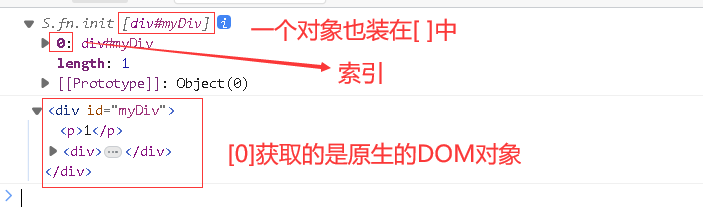
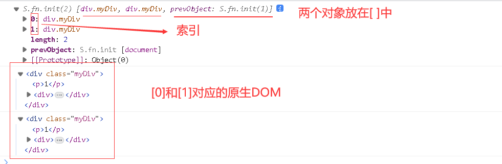

# $()获取对象

> \$()选中的对象是一个类似数组的对象，即选中的多个对象，是放在[ ]中的。即使是一个对象也是放在[ ]中，比如：
> [对象]
> [对象1,对象2,...]
>
> $()获取类似数组的对象，既然如此，就能用索引取出值，而<font color=red>取出的对象，不再是jQuery对象，而是原生的DOM对象</font>，比如：假设\$("#idA")是[A对象]
>
> 那么\$("#idA")即[A对象]是jQuery对象，而\$("#idA")[0]即A对象是原生的DOM对象，<font color=red>所以在jQuery对象中能使用的jQuery的方法，在DOM对象中就不能使用</font>。

## 一个对象时:

```html
<!DOCTYPE html>
<html lang="en">
<head>
    <meta charset="UTF-8">
    <title>Title</title>
</head>
<body>
<div id="myDiv">
    <p>1</p>
    <div>
        <span>hello</span>
        <h1>world</h1>
    </div>
</div>

</body>
<script src="js/jquery-3.6.1.min.js"></script>
<script>
    $(function () {
        var jqueryObj = $("#myDiv");
        var DOMobj = $("#myDiv")[0];
        console.log(jqueryObj);
        console.log(DOMobj);
    })
</script>
</html>
```

 

## 多个对象时：

```html
<!DOCTYPE html>
<html lang="en">
<head>
    <meta charset="UTF-8">
    <title>Title</title>
</head>
<body>
<div id="myDiv">
    <p>1</p>
    <div>
        <span>hello</span>
        <h1>world</h1>
    </div>
</div>

</body>
<script src="js/jquery-3.6.1.min.js"></script>
<script>
    $(function () {
        var jqueryObj = $("#myDiv");
        var DOMobj = $("#myDiv")[0];
        console.log(jqueryObj);
        console.log(DOMobj);
    })
</script>
</html>
```

 