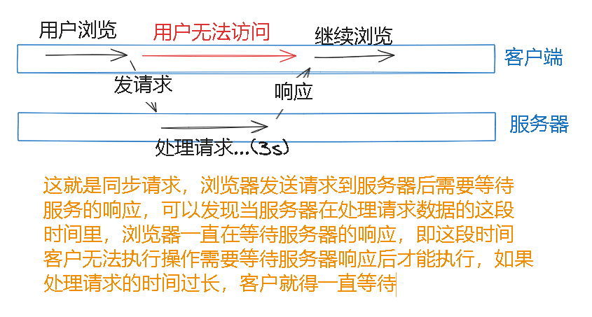
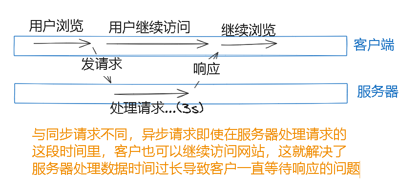
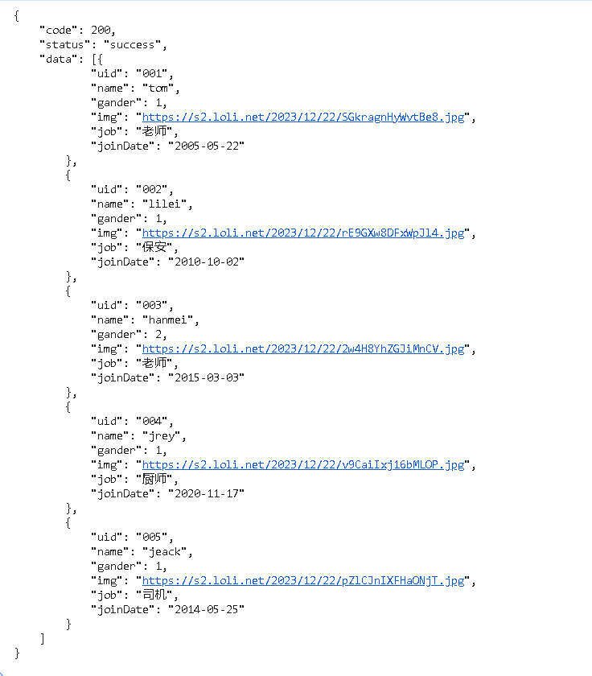
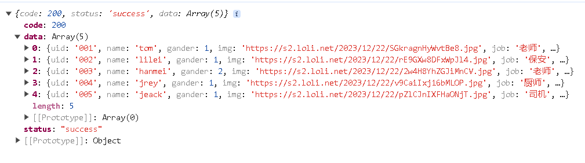

# ajax

> ajax可以实现前端与后端之间的异步请求和响应
>
> 这里说一下异步请求与同步请求的概念

> 同步请求：



> 异步请求：



> 原生ajax发送请求的方式：

```html
<!DOCTYPE html>
<html>
<head>
	<title></title>
</head>
<body>

<script>
// 定义一个XMLHttpRequest对象
var xhr = new XMLHttpRequest();
var url = "https://dffe815e-2bbf-4d1f-a6d7-370d4a47891d.mock.pstmn.io/user";
// 然后调用open()方法，传入请求方式，请求url和true,true代表异步，false代表同步
xhr.open("POST",url,true);
// 然后调用send()方法发送请求
xhr.send();
// onreadystatechange属性当readyState属性值发送改变时调用函数
xhr.onreadystatechange = () => {
    // 当readyState=4且status=200时代表请求成功
	if (xhr.readyState == 4 && xhr.status == 200) {
		console.log(xhr.responseText);
	}else{
		// 请求失败，执行
	}
}
</script>
</body>
</html>
```

| 属性       | 值                                                           |
| ---------- | ------------------------------------------------------------ |
| readyState | 保存 XMLHttpRequest 的状态。<br />0：请求未初始化 <br />1：服务器连接已建立 <br />2：请求已收到 <br />3：正在处理请求 <br />4：请求已完成且响应已就绪 |
| status     | 返回请求的状态号。  <br />200: "OK" <br />403: "Forbidden" <br />404: "Not Found" |

> 响应的数据




# axios

> axios对原生ajax进行了封装，简化了ajax的书写

> 引入axios

```html
<script src="https://cdn.jsdelivr.net/npm/axios/dist/axios.min.js"></script>
```


## 发送get请求

> axios()方法中需要传入一个对象，这个对象中定义属性method标识请求方法、url标识请求路径，如果请求成功那么会自动执行then()中的函数，如果请求失败会自动执行catch()中的函数，result是请求成功后响应的js对象，这个对象中的data属性就是响应给浏览器的数据

```js
axios({
    method: "GET",
    // 如果get请求携带参数，可以直接在url后面拼接
    url: "http://path/to/your/getUrl"
}).then((result) => {
    // 请求成功执行
    result.data
}).catch((error) => {
    // 请求失败执行
})
```


## 发送post请求

> post请求的参数需要定义在data属性中

```js
axios({
    method: "post",
    url: "http://path/to/your/postUrl",
    data: {
        // post请求的参数
    }
}).then((result) => {
    // 请求成功执行
    result.data
}).catch((error) => {
    // 请求失败执行
})
```


## 简写

> 发送GET请求：axios.get(url,config)，config可以省略
>
> 发送DELETE请求：axios.delete(url,config)，config可以省略
>
> 发送POST请求：axios.post(url,data,config)，data和config可以省略
>
> 发送PUT请求：axios.put(url,data,config)，data和config可以省略

```js
// GET请求简写
axios.get("http://path/to/your/getUrl").then((r) => {
    console.log(r.data);
}).catch((e) => {
	
})
```

```js
// POST请求简写
var url = "https://dffe815e-2bbf-4d1f-a6d7-370d4a47891d.mock.pstmn.io/user"
axios.post(
    url,
	{
		id: "001",
		name: "tom",
		age: 20
	}).then((r) => {
		console.log(r.data);
	}).catch((e) => {
		alert("请求失败")
	})
```


