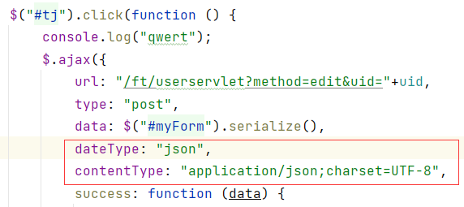
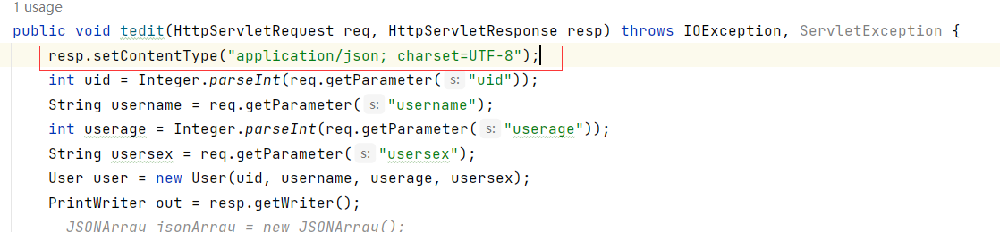

# ajax请求

 

```
contentType: "application/json;charset=UTF-8"
```

> 这是在 AJAX 请求中设置的内容类型，用于指定请求的数据格式。具体来说，它表示你将请求数据以 JSON 格式发送给服务器。

```
dataType: "json"
```

> 这是在 AJAX 请求中设置的期望响应数据的类型。它告诉 jQuery 在服务器响应到达时，预期返回的数据是 JSON 格式。


# servlet响应

 

```java
resp.setContentType("application/json; charset=UTF-8")
```

> 这是在服务器端设置的响应头，用于指示服务器将响应的数据格式设置为 JSON 格式，并指定字符编码为 UTF-8。


# 总结一下：

- `contentType` 用于设置请求数据的格式。
- `dataType` 用于设置预期从服务器接收的响应数据的格式。
- `resp.setContentType` 用于在服务器端设置响应的数据格式。


# servlet响应

> 在 Web 应用中，Servlet 是用来处理 HTTP 请求和生成 HTTP 响应的组件。HTTP 响应的内容是以字节流或字符流的形式传输给客户端的，因此在 HTTP 响应中，只能返回字符串（包括 JSON 字符串）或字节流。所以，Servlet 返回的数据形式必须是字符串或字节流。
>
> 未定义resp.setContentType时，响应的Content-Type会使用默认值，通常是"text/html"。因此，如果你的响应数据是JSON格式的，但是Content-Type被设置为"text/html"，浏览器可能无法正确解析JSON数据。它会尝试根据Content-Type来判断响应的数据类型。如果Content-Type是"text/html"，浏览器会按照HTML来解析数据，因此显示的就是一串问号"？？？？"。


# ajax接收响应

```javascript
success: function(response) {
        // 当请求成功后执行的函数，response是参数包含服务器返回的数据
    }
```

