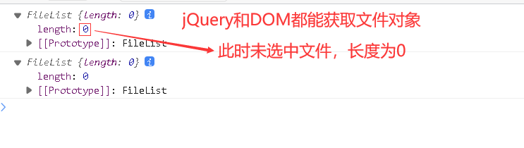
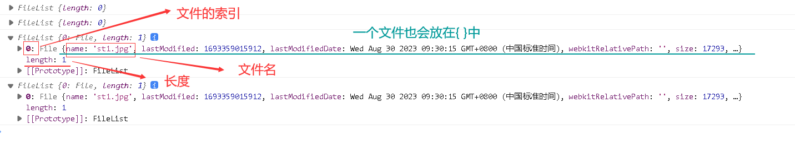

# 获取文件对象

>文件框：
>< input type="file" id="files" />
>
>用原生DOM来获取文件，使用files方法，而jQuery获取则使用prop调用原生的files方法，无论时使用DOM还是jQuery，获取的文件都是类似数组的文件对象，即多个文件装在{}中，即使是一个文件也是放在{}中，比如:
>
>{文件}
>
>{文件1,文件2,...}
>
>这样就能用索引获取文件。

```html
<!DOCTYPE html>
<html lang="en">
<head>
    <meta charset="UTF-8">
    <title>Title</title>
</head>
<body>
<div class="myDiv">
    <form action="">
        <input type="file" id="files">
    </form>
</div>


</body>
<script src="js/jquery-3.6.1.min.js"></script>
<script>
    $(function () {
        $("#files").click(function () {
            var files = $("#files").prop("files");
            var filesDOM = $("#files")[0].files;
            console.log(files);
            console.log(filesDOM);
        })
    })
</script>
</html>
```

## 未选择文件时

 

##  选择文件时

 

## 获取文件

 ```javascript
 var file = files[0];
 var fileDOM = filesDOM[0];
 console.log(file);
 console.log(fileDOM);
 ```

 

# 文件上传

> <font size=5>1、</font>
>
> 一般的文件上传需要在form中设置enctype="multipart/form-data"多媒体上传，但是使用ajax上传文件时甚至不需要form表单，只要获取到input中的字段以及文件即可。
>
> <font size=5>2、</font>
>
> 使用jQuery+ajax上传文件需要定义3个属性：
>
> <font color=red>cache缓存，设置为false</font>，告诉浏览器不要缓存上传的数据，确保上传的数据都是最新的而不是旧的数据
>
> <font color=red>processData处理数据，设置为false</font>，默认情况下jQuery会将数据处理成查询字符串，为false则不处理，因为上传的是文件，需要以2进制形式传输所以告诉jQuery不要将2进制文件处理成查询字符串
>
> <font color=red>contentType请求头，设置为false</font>，告诉jQuery不要设置默认的请求头，因为上传文件使用多媒体请求头，若使用默认请求头，则会覆盖多媒体请求头
>
> <font size=5>3、</font>
>
> 获取上传的文件时，不能使用serialize，因为serialize是将form中的字段序列化只能处理文本数据，无法处理文件数据，要上传文件需要使用FormData对象。

```html
<!DOCTYPE html>
<html lang="en">
<head>
    <meta charset="UTF-8">
    <title>Title</title>
</head>
<body>
<div class="myDiv">
    <form action="">
        <input type="file" id="files">
    </form>
    <button id="upload">上 传</button>
</div>


</body>
<script src="js/jquery-3.6.1.min.js"></script>
<script>
    $(function () {
        $("#upload").click(function () {
            // 获取文件input中的文件，此时获取的是文件列表
            var file = $("#files").prop("files");
            // 实例化fomrData对象
            var formData = new FormData();
            /** 
            append方法，将文件传入formData中,注意用索引取出文件
            如果有非文件字段，同样获取到这个字段的值并加到formData中
            即可
            */
            formData.append("file", file[0]);
            $.ajax({
                url: "urlpath",
                type: "post",
                // 将formData传入后端
                data: formData,
                cache: false,
                processData: false,
                contentType: false,
                success: function (data) {
                    // 执行...
                }
            })
        })
    })
</script>
</html>
```

