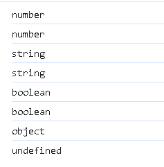

# js的数据类型

> js是弱类型的，在声明变量时不需要指定数据类型，但是js是由数据类型的，js的数据类型分为两类，**原始数据类型**(类似于java中的基本数据类型)和**引用数据类型**


# 原始数据类型

> 原始数据类型有5种：
>
> - number（整数，浮点数，NaN(not a number)）
> - string  字符串
> - boolean  布尔型
> - null  对象为空
> - undefined  当声明的变量未初始化时，改变量默认值为undefined


# typeof查看类型

> 在js种可以使用**typeof**运算符来查看数据类型

```js
console.log(typeof 3);
console.log(typeof 3.14);

console.log(typeof 'A');
console.log(typeof 'hello');

console.log(typeof true);
console.log(typeof false);

console.log(typeof null);

var a;
console.log(typeof a);
```



> 为什么typeof null返回的不是null而是object，这是因为在早期的的js种实现的一个bug被沿用至今