# 基于Vue的前端工程化

> Vue-cli是Vue官方提供的一个脚手架工具，用于快速生成一个Vue的项目模板
>
> Vue-cli的功能：
>
> - 统一的目录结构，只要是永Vue-cli创建的工程其目录结构都是一致的
> - 本地调试
> - 热部署
> - 单元测试
> - 集成打包上线
>
> Vue-cli需要依赖NodeJS环境，因此在安装Vue-cli之前需要先安装NodeJS


# 配置nodejs

> 设置nodejs的全局路径，以管理员身份运行cmd

```shell
# 路径是nodejs的实际安装路径
npm config set prefix "E:\Tools\node-v18.17.1-win-x64"
```

> 验证是否设置成功

```shell
npm config get prefix
```

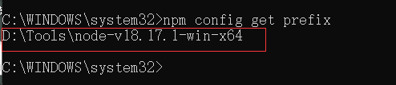

> 设置npm的淘宝镜像，加速资源下载

```shell
npm config set registry "https://registry.npm.taobao.org"
```


# Vue项目创建

> 创建Vue项目有两种方式

```shell
# 第一种是通过命令
vue create 项目名称
# 第二种，先调出图像化界面，然后再通过图形化界面创建
vue ui
```

> 以下演示通过图形化界面创建Vue项目

> 1、在项目目录中进入cmd

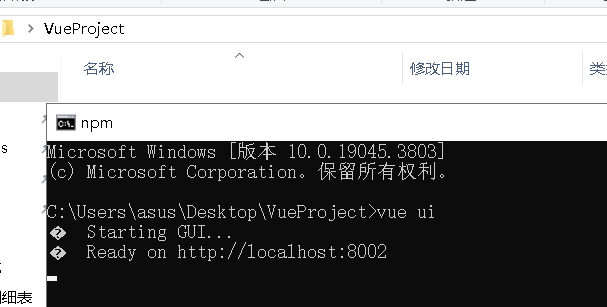

> 2、进入图形化界面，新建项目

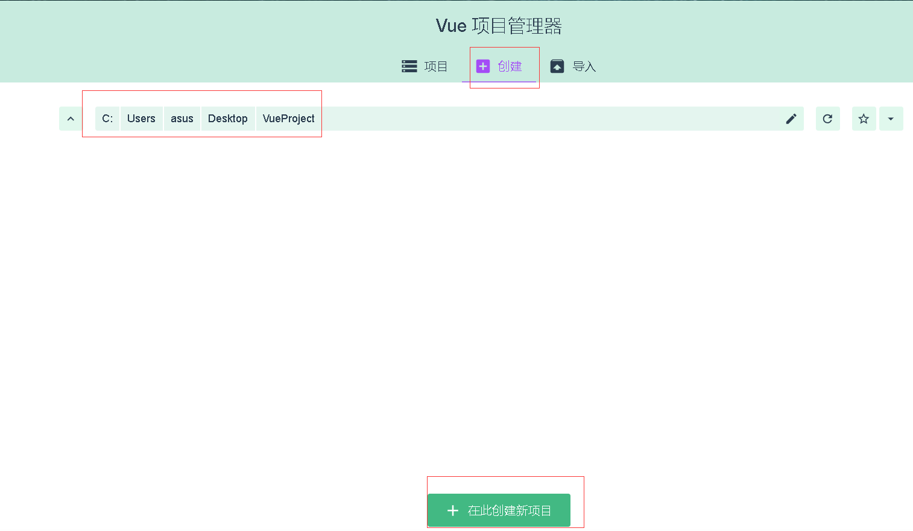

> 3、选择项目名称和包管理器

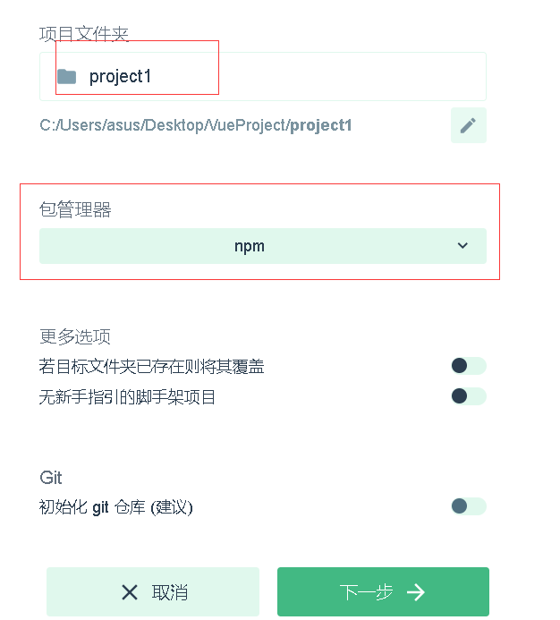

> 4、预设模板选择手动

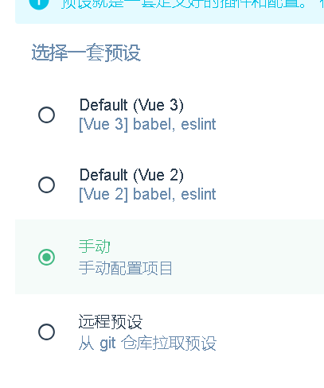

> 5、打开路由

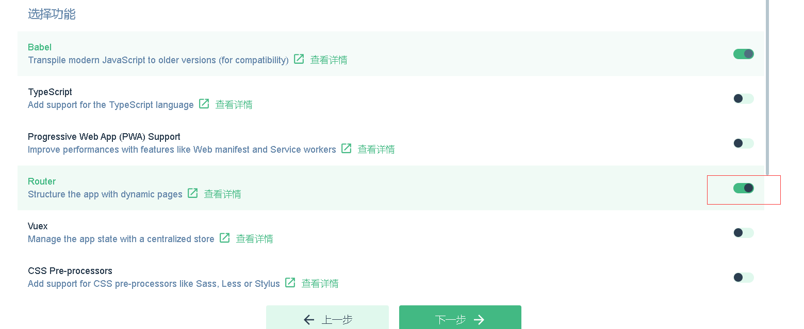

> 6、选择vue的版本和语法规范


> 7、出现下面这个页面说明项目创建成功

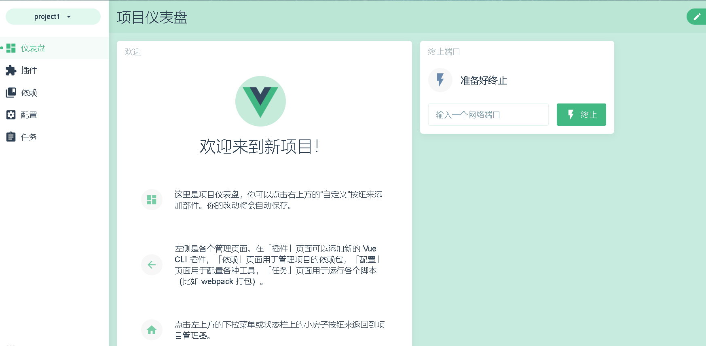


## Vue项目の目录结构

> 下面介绍Vue项目的主要的目录结构

|     目录      |                       描述                       |
| :-----------: | :----------------------------------------------: |
| node_modules  |                 整个项目的依赖包                 |
|    public     |                存放项目的静态文件                |
|      src      |                    存放项目的                    |
| package.json  | 模块基本信息，项目开发所需要的模块，<br>版本信息 |
| vue.config.js |    保存vue配置的文件，如：代理、端口的配置等     |

> src目录的目录结构：

|    目录    |                             描述                             |
| :--------: | :----------------------------------------------------------: |
|   assets   |                         存放静态资源                         |
| components |                     存放可重复使用的组件                     |
|   router   |                        路由配置的目录                        |
|   views    | 视图组件的目录，也就是页面，vue中的页面<br>是.vue结尾的组件，这个目录中存放这些文件 |
|  App.vue   |                       入口页面(根组件)                       |
|  main.js   |                          入口js文件                          |


## 访问项目

> 访问项目执行serve脚本

```shell
# 在项目目录中运行
npm run serve
```

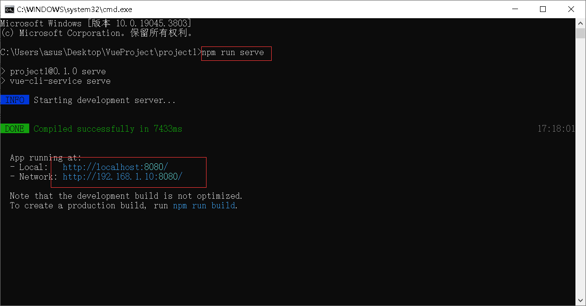

> 访问这个url，就会访问项目的根页面，也就是App.vue

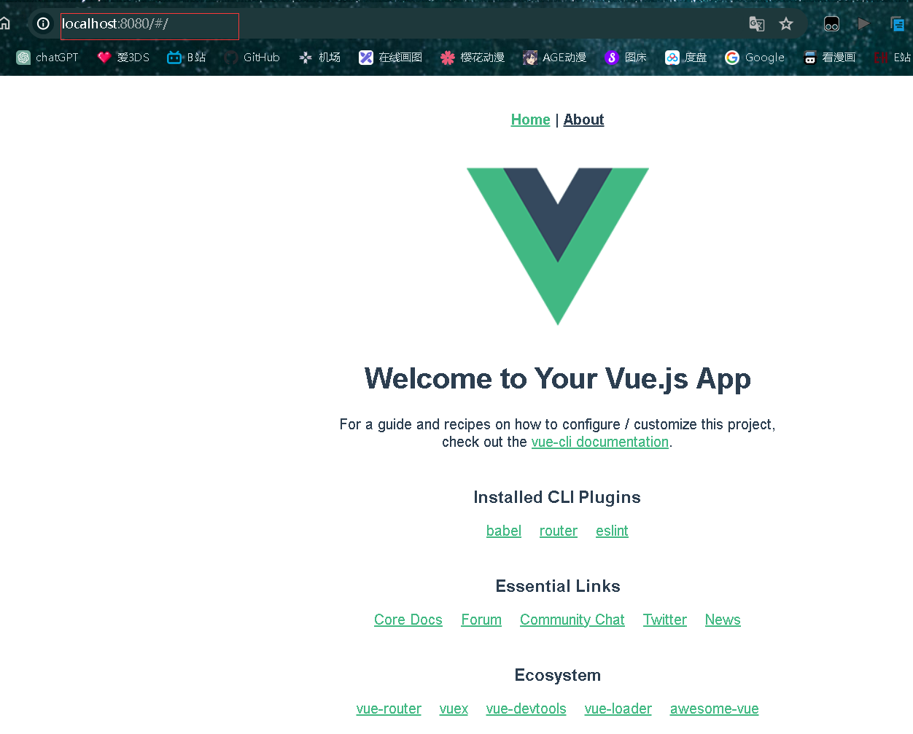


## 更改端口

> 在vue.config.js中添加devServer对象，在devserver对象中增加port属性，属性值就是端口号

```js
const { defineConfig } = require('@vue/cli-service')
module.exports = defineConfig({
  transpileDependencies: true,
  devServer: {
  	port: 7000
  }
})
```

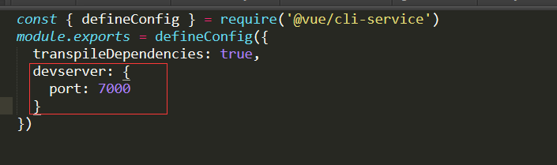

> 重启服务

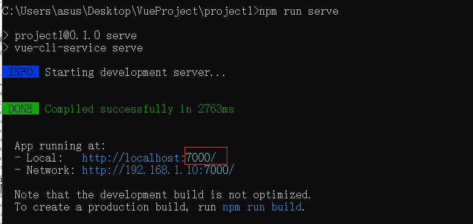

> 访问

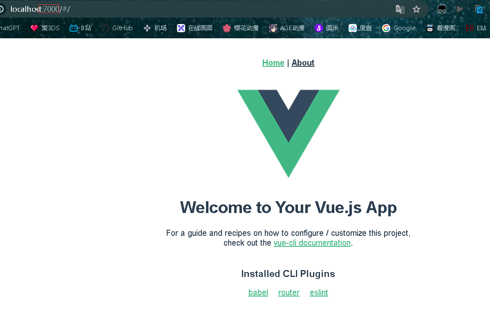


# cmd创建vue项目

> 最好以管理员身份打开cmd：
>
> w+r，输入cmd，然后ctrl+shift+回车：

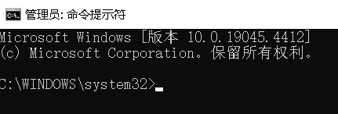

> 切换到目录所在盘，注意，管理员cmd中切换盘符需要加/d，否则切换失败：

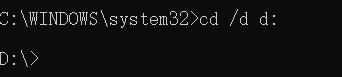

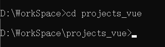

> 创建vue项目：

```shell
vue create 项目名
```

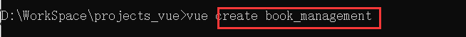

> 选择手动配置：

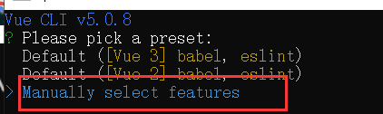

> 把路由Router和Vuex一起选上，选取是空格不是回车：

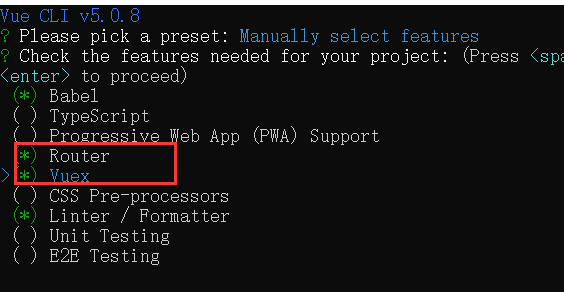

> 版本vue3：

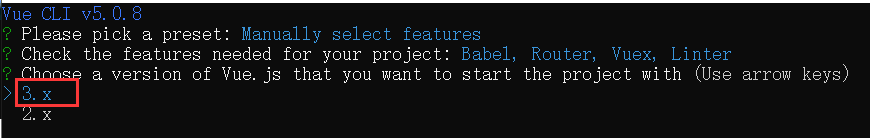

> 是否安装历史的路由，按需安装：

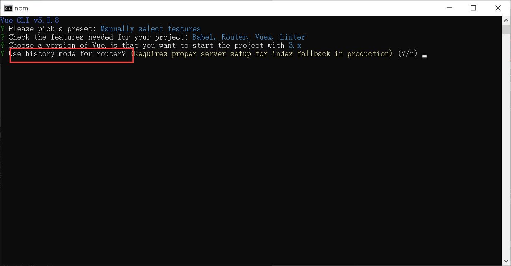

> 选择Eslint的语法版本
>
> - ESLint with error prevention only：仅错误预防
>
> - ESLint + Airbnb config：Airbnb配置
>
> - ESLint + Standard config：标准配置
>
> - ESLint + Prettier：附带Prettier
>
> 这里选仅错误预防：

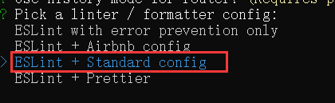

> Lint on save

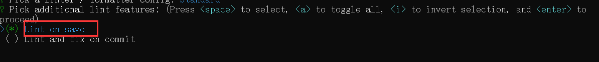

> 第一个选项是创建单独的配置文件，第二个选项是把这些配置文件都放到package.json中，推荐第一个：

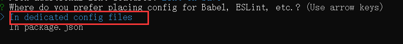

> 是否保存上述步骤，不保存：

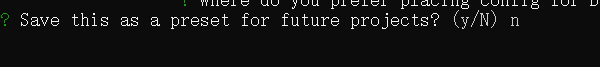

> 完成创建：

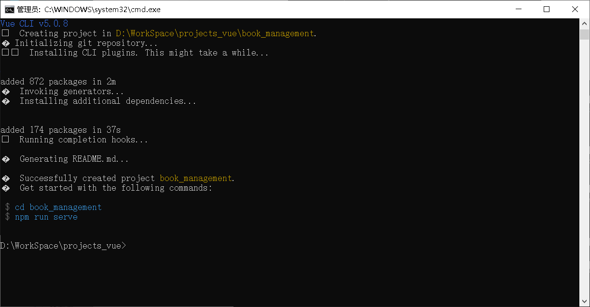