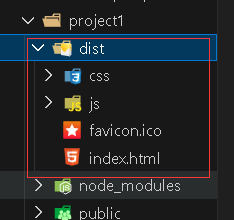

# 打包

```shell
npm run build
```

> 运行命令将前端项目打包，最终得到一个dist文件夹，将dist目录下的资源部署在服务器上即可完成部署

> dist目录以及目录下的资源：




# nginx目录

> nginx用来部署前端项目，其他比较重要的目录作用：

| 目录名 |             作用              |
| :----: | :---------------------------: |
|  conf  |    用于保存nginx的配置文件    |
|  html  |       存放静态资源文件        |
|  logs  | 存放nginx运行时产生的日志文件 |
|  temp  |      临时文件的存放目录       |
|  sbin  |     启动/关闭nginx的目录      |


# 部署

> 前端项目要部署到nginx中需要将打包好的dist下的资源放到nginx的html目录下，为了与其他项目区分同时避免文件之间冲突可以在html下为每个创建分区

