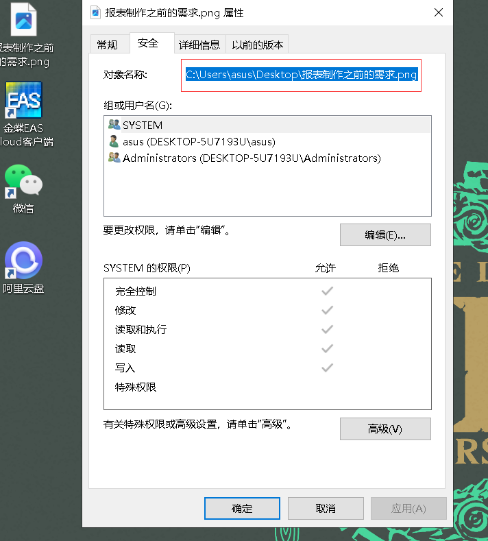
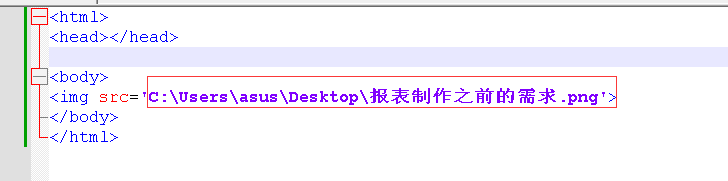
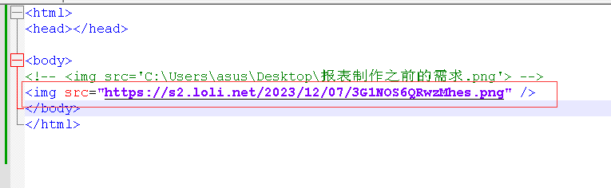
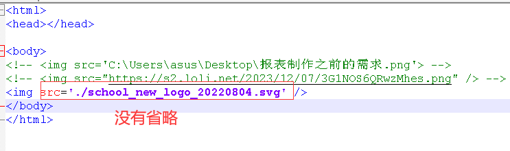
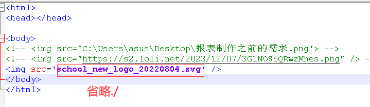
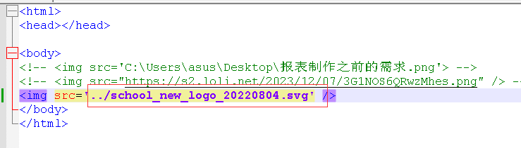

> 资源的路径可以有两种方式来表示
>
> 1. 绝对路径
>    1. 1.磁盘绝对路径
>    2. 1.网络绝对路径
> 2. 相对路径
>    - ./是当前路径
>    - ../是上级路径


# 绝对路径表示

> 磁盘绝对路径，即资源在电脑上的磁盘路径



```html

```




> 网络绝对路径，就是在网络上的资源的路径，引用的前提是网站上存在这个资源，同时能够上网并访问改网站




# 相对路径表示

> ./表示当前路径，可以省略






> 效果是一样的


> ../表示上级目录，当前文件在2目录下，文件的上级目录是htmlDemo，而资源在htmlDemo下，所以要用到../

> **由于./可以省略，所以../不能省略，如果../可以省略，那么编译器无法区省略的路径分究竟是当前路径还是上级路径**




