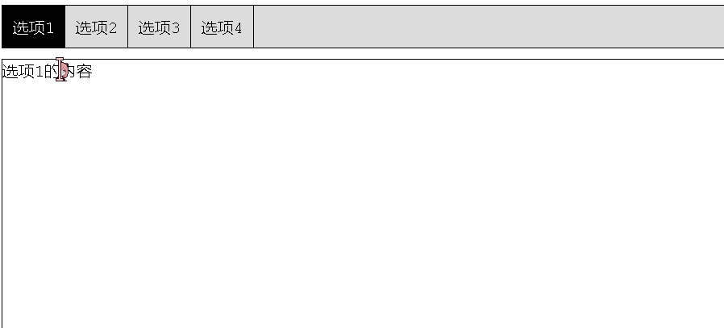
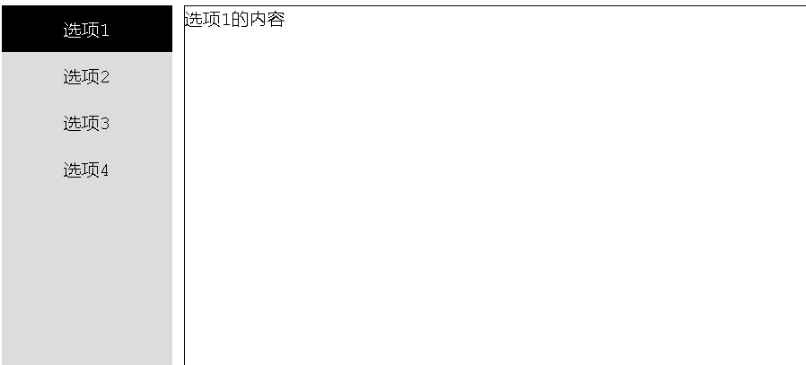
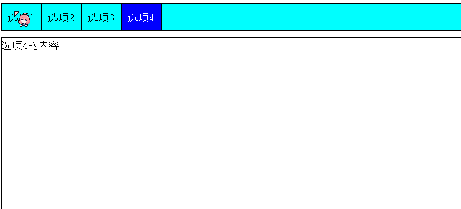
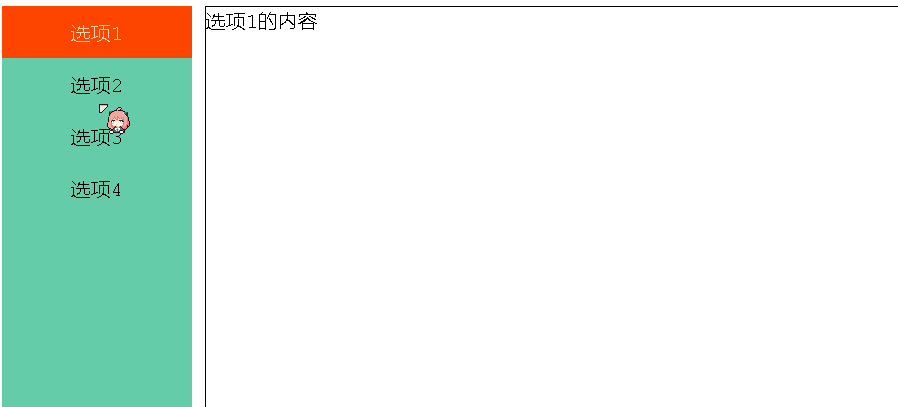

# js实现思路

>实现思路：首先要保证有多少选项，就要有多少对应显示的内容。
>
>选项要使用class，而不能使用id，因为要遍历所有的选项，如果选择使用id就不好遍历。
>
>为什么要遍历？因为要获取所有的选项，然后当点击其中一个选项时，先将所有的选项背景颜色和字体颜色改变成默认，然后再对选择的当前选项处理颜色。
>
>为每个选项标签添加同一个onclick()点击事件，需要将this传入到事件函数中。为什么？因为选项标签使用的是class，没法获取当前选择的标签，所以需要传入this来指代当前选择的dom对象。
>
>每个选项中需要设置属性，且属性值须是内容的id，为什么？因为点击选项需要对选项进行处理的同时，也要对对应的内容进行处理，而选项已经使用了class，且id不能与内容的id同名，所以只能使用属性来存储内容的id，this指代当前的选项，那么获取当前选项的属性值就获取到了内容的id，也就获取到了内容。
>
>首先将选项标签的第一个选项设置active样式，表示高亮，然后将内容隐藏，但是第一个内容要显示，js代码中当点击一个选项时，循环遍历选项后内容，将所以选项的高亮清除，将所有内容都隐藏，然后高亮当前选中的选项，并将当前选项对应的内容取消隐藏。


# js实现-横



```html
<!DOCTYPE html>
<html lang="en">
<head>
    <meta charset="UTF-8">
    <title>Title</title>
    <style>
        .clearfix::after {
            content: "";
            display: table;
            clear: both;
        }

        .clearfix {
            border: 1px solid black;
        }

        .clearfix p {
            float: left;
            margin: 0px;
            padding: 10px;
            border-right: 1px solid black;
        }

        .active {
            background-color: black;
            color: white;
        }

        .cont {
            margin-top: 10px;
            border: 1px solid black;
            height: 500px;
            display: none;
        }

    </style>
</head>
<body>
<div class="clearfix" style="background-color: gainsboro">
    <p class="active tab_btn" onclick="onTab(this)" cid="cont1">选项1</p>
    <p class="tab_btn" onclick="onTab(this)" cid="cont2">选项2</p>
    <p class="tab_btn" onclick="onTab(this)" cid="cont3">选项3</p>
    <p class="tab_btn" onclick="onTab(this)" cid="cont4">选项4</p>
</div>
<div>
    <div id="cont1" class="cont" style="display:block;">选项1的内容</div>
    <div id="cont2" class="cont">选项2的内容</div>
    <div id="cont3" class="cont">选项3的内容</div>
    <div id="cont4" class="cont">选项4的内容</div>
</div>
<script>
    function onTab(pThis) {
        // 获取所有的选项和内容数组
        var p_ele = document.getElementsByClassName("tab_btn");
        var cont_ele = document.getElementsByClassName("cont");
        // 遍历数组，将所有选项的高亮去除，将所有内容隐藏
        for (var i = 0; i < p_ele.length; i++) {
            p_ele[i].classList.remove("active");
            cont_ele[i].style.display = 'none';
        }
        // 将当前点击的选项高亮，将当前选项对应的内容显示
        pThis.classList.add("active");
     document.getElementById(pThis.getAttribute("cid")).style.display = "block";
    }
</script>
</body>
</html>
```


# js实现-竖



```html
<!DOCTYPE html>
<html lang="en">
<head>
    <meta charset="UTF-8">
    <title>Title</title>
    <style>
        .fleft {
            float: left;
        }

        .clearfix::after {
            content: "";
            clear: both;
            display: none;
        }

        .lbox {
            width: 10%;
            background-color: gainsboro;
            height: 400px;
        }

        .lbox p {
            margin: 0;
            text-align: center;
            padding: 10px 0;
        }

        .active {
            background-color: black;
            color: white;
        }

        .rbox {
            width: 88%;
            padding: 0 10px;
        }

        .cont {
            display: none;
            border: 1px solid black;
            height: 400px;
        }
    </style>
</head>
<body>
<div class="clearfix box">
    <div class="fleft lbox">
        <p class="active choice" onclick="onTab(this)" cid="cont1">选项1</p>
        <p class="choice" onclick="onTab(this)" cid="cont2">选项2</p>
        <p class="choice" onclick="onTab(this)" cid="cont3">选项3</p>
        <p class="choice" onclick="onTab(this)" cid="cont4">选项4</p>
    </div>
    <div class="fleft rbox">
        <div class="cont" style="display:block;" id="cont1">选项1的内容</div>
        <div class="cont" id="cont2">选项2的内容</div>
        <div class="cont" id="cont3">选项3的内容</div>
        <div class="cont" id="cont4">选项4的内容</div>
    </div>
</div>
<script>
    function onTab(pThis) {
        var p_ele = document.getElementsByClassName("choice");
        var cont_ele = document.getElementsByClassName("cont");
        for (var i = 0; i < p_ele.length; i++) {
            p_ele[i].classList.remove("active");
            cont_ele[i].style.display = "none";
        }
        pThis.classList.add("active");
        document.getElementById(pThis.getAttribute("cid")).style.display = "block";
    }
</script>
</body>
</html>
```

# jQuery实现-横



```html
<!DOCTYPE html>
<html>
	<head>
		<meta charset="utf-8" />
		<title></title>
	</head>
	<style>
		p{
			margin: 0;
			float:left;
			border-right: 1px solid black;
			padding:10px;
		}
		.clearfix::after{
			display: block;
			content: "";
			clear: both;
		}
		.topbox{
			background-color: aqua;
			border: 1px solid black;
		}
		.active{
			background-color: blue;
			color:white;
		}
		.cont{
			margin-top: 10px;
			display: none;
			border: 1px solid black;
			height: 400px;
		}
	</style>
	<body>
		<div class="clearfix topbox">
			<p class="active choice" cid='cont1'>选项1</p>
			<p class="choice" cid='cont2'>选项2</p>
			<p class="choice" cid='cont3'>选项3</p>
			<p class="choice" cid='cont4'>选项4</p>
		</div>
		<div>
			<div class="cont" id="cont1" style="display: block;">选项1的内容</div>
			<div class="cont" id="cont2">选项2的内容</div>
			<div class="cont" id="cont3">选项3的内容</div>
			<div class="cont" id="cont4">选项4的内容</div>
		</div>
		<script src="js/jquery-3.6.0.min.js"></script>
		<script>
			$(function(){
				$('.choice').click(function(){
					$('.choice').removeClass('active');
					$(this).addClass('active');
					// jQuery直接使用hide隐藏，show显示
                    $('.cont').hide();
					$('#'+$(this).attr('cid')).show();
				});
			})
		</script>
	</body>
</html>

```


# jQuery实现-竖



```html
<!DOCTYPE html>
<html>
	<head>
		<meta charset="utf-8">
		<title></title>
	</head>
	<style>
		.clearfix::after{
			clear: both;
			display: block;
			content: '';
		}
		.fleft{
			float: left;
		}
		.lbox{
			width: 10%;
			background-color: mediumaquamarine;
			height: 500px;
		}
		.rbox{
			width: 88%;
			margin-left: 10px;
			height: 500px;
			border: 1px solid black;
		}
		.choice{
			margin: 0px;
			padding: 10px;
			text-align: center;
		}
		.active{
			background-color: orangered;
			color: wheat;
		}
		.cont{
			display: none;
		}
	</style>
	<body>
		<div class="clearfix">
			<div class="fleft lbox">
				<p class="active choice" cid='cont1'>选项1</p>
				<p class="choice" cid='cont2'>选项2</p>
				<p class="choice" cid='cont3'>选项3</p>
				<p class="choice" cid='cont4'>选项4</p>
			</div>
			<div class="fleft rbox">
				<div class="cont" id="cont1" style="display: block;">选项1的内容</div>
				<div class="cont" id="cont2">选项2的内容</div>
				<div class="cont" id="cont3">选项3的内容</div>
				<div class="cont" id="cont4">选项4的内容</div>
			</div>
		</div>
		
	</body>
	<script src="js/jquery-3.6.0.min.js"></script>
	<script>
		$(function(){
			$('.choice').click(function(){
				$('.choice').removeClass('active');
				$(this).addClass('active');
				$('.cont').hide();
				$('#'+$(this).attr('cid')).show();
			});
		});
	</script>
</html>
```

