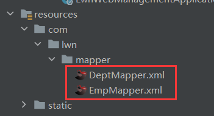
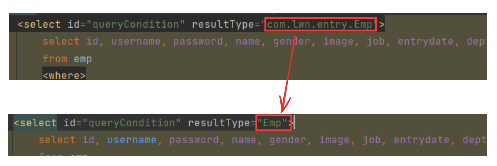

# 控制台输出SQL日志

```yaml
mybatis:
	configuration:
		log-impl: org.apache.ibatis.logging.stdout.StdOutImpl
```


# 开启驼峰命名映射

```yaml
mybatis:
	configuration:
		map-underscore-to-camel-case: true
```


# 查找XML映射文件

```yaml
mybatis:
  mapper-locations: classpath:mappers/*xml
```

> mapper-locations: classpath:mappers/*xml这个配置指定了MyBatis映射器文件(Mapper XML文件)的位置。
>
> mapper-locations告诉MyBatis框架去哪里查找Mapper XML文件。
>
> 在这个示例中，classpath:mappers/*xml表示在类路径(classpath)下的mappers目录中查找所有以.xml结尾的文件。



> 如果不显式声明mapper-locations，Spring Boot 会按照一组默认的位置自动查找Mapper XML文件：
>
> - classpath:/mapper/\*\*/*.xml
> - classpath:/mapper/*.xml
> - classpath:/mappers/\*\*/*.xml
> - classpath:/mappers/*.xml
>
> 如果Mapper XML文件不符合这些默认的位置和命名约定，或者指定了不同的文件夹结构或者命名规范，那么就需要显式地在配置文件中指定mapper-locations，告诉Spring Boot 在哪里查找Mapper XML文件。


# 配置类型别名

```yaml
mybatis:
  type-aliases-package: com.lwn.entry
```

> 这个配置指定了MyBatis类型别名的包名，MyBatis允许使用类型别名来简化XML配置文件中的代码。
>
> type-aliases-package告诉MyBatis框架去指定包下扫描所有的Java类，并为它们创建类型别名。
>
> 在这个例子中，com.lwn.entry包下的所有类都会被注册为类型别名，这样在Mapper XML文件中，resultType或者parameterType属性就可以直接使用类名来引用Java类型，而不需要使用完整的类路径。
>
> 就像这样：



> 注意，type-aliases-package只能接收一个包名，因此不能定义成这样：

```yaml
 type-aliases-package: 
    - com.lwn.entry
    - com.lang.integer
    - com.lang.string
```