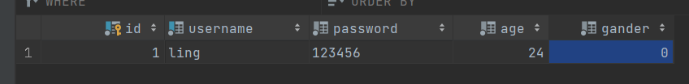
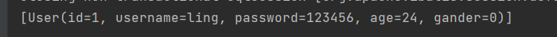
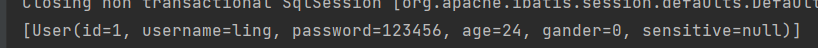
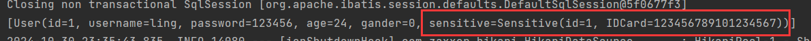

# 1 ResultMap

对应简单的实体，可以直接使用【resultType】属性来映射实体类，比如查询user表，将结果与【User】进行映射：

```java
// User实体类
@Data
public class User {
    private int id;
    private String username;
    private String password;
    private int age;
    private int gander;
}
```

数据表数据：



xml文件：

```xml
<mapper namespace="com.lingzed.mapper.UserMapper">
    <select id="select" resultType="com.lingzed.entity.User">
        select * from user
    </select>
</mapper>
```

结果集：



不难发现，这种查询结果满足字段与属性一一对应。

如果实体的属性稍微复杂一点，这种【resultType】还能满足吗？

比如这种情况：

每个用户对应自己的敏感数据，但是敏感数据不适合于user同表，于是将敏感数据单独分离出一张表，然后用一个实体来表示，在【User】用属性表示敏感实体：

```java
// 敏感数据实体
@Data
public class Sensitive {
    private int id;
    private String IDCard;
}
```

【User】中加入敏感数据类型的属性：

```java
@Data
public class User {
    private int id;
    private String username;
    private String password;
    private int age;
    private int gander;
    private Sensitive sensitive;
}
```

xml文件：

```xml
<select id="select" resultType="com.lingzed.entity.User">
        SELECT u.id, u.username, u.password, u.age, u.gander, s.id, s.ID_Card
        FROM user u
                 LEFT JOIN `sensitive` s ON u.id = s.user_id;
    </select>
```

使用连接查询，将【Sensitive】的两个属性查询出来，然后封装到【User】中，能成功吗？

结果：



从结果能看出，出了【sensitive】，其他属性都能封装进【User】中，可见对于复杂的属性，【resultType】就显得力不从心了。

对于复杂属性的情况，就需要我们手动编写属性与数据库字段的映射关系，才能完成复杂的属性映射。这需要使用到【\<resultMap>】：

格式如下：

```xml
<resultMap id="" type=""> 
	<id property="" column="" />
    <result property="" column="" />
    <result property="" column="" />
    <result property="" column="" />
    ......
</resultMap>
```

【\<resultMap>】用于设置属性与字段之间的映射关系，其中【id】是【\<resultMap>】的唯一标识，其他标签通过【id】来引用该【\<resultMap>】。

【type】则是指定映射到哪个实体类中，在这个案例中，我需要将user和sensitive的字段封装到【User】中，因此这里的【type】为【User】。

【\<resultMap>】的子标签：【\<id>】和【\<result>】的效果是一样的，用于建立属性和字段的映射关系，【property】用于指定属性，【column】用于指定字段，只不过id字段比较特殊，需要用【\<id>】来指定，其他字段用【\<result>】。

综上，需要将user和sensitive的字段封装到【User】中，那么xml为：

```xml
<resultMap id="UserResultMap" type="com.lingzed.entity.User">
    <id property="id" column="id" />
    <result property="username" column="username" />
    <result property="age" column="age" />
    <result property="gander" column="gander" />
    <result property="sensitive.id" column="s_id" />
    <result property="sensitive.IDCard" column="ID_Card" />
</resultMap>

<select id="select" resultMap="UserResultMap">
    SELECT u.id, u.username, u.password, u.age, u.gander, s.id s_id, s.ID_Card
    FROM user u
    LEFT JOIN `sensitive` s ON u.id = s.user_id;
</select>
```

重点在映射【Sensitive】上，【sensitive】是【User】的属性，同时它又是【Sensitive】类型，因此它内部也有自己的属性，我们真正需要映射的正是它内部的属性，所有用`.`来调用。

封装效果：

