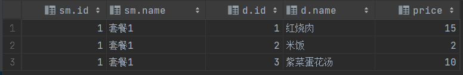
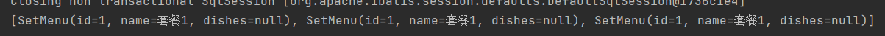
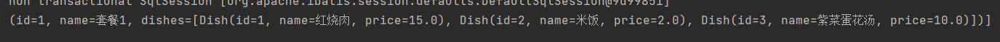

# 1 resultType的弊端

对应简单的实体，可以直接使用`resultType`属性来映射实体类，比如查询user表，将结果与`User`进行映射：

```java
// User实体类
@Data
public class User {
    private int id;
    private String username;
    private String password;
    private int age;
    private int gander;
}
```

数据表数据：


xml文件：

```xml
<mapper namespace="com.lingzed.mapper.UserMapper">
    <select id="select" resultType="com.lingzed.entity.User">
        select * from user
    </select>
</mapper>
```

结果集：


不难发现，这种查询结果满足字段与属性一一对应。

如果实体的属性稍微复杂一点，这种`resultType`还能满足吗？

比如这种情况：

每个用户对应自己的敏感数据，但是敏感数据不适合于user同表，于是将敏感数据单独分离出一张表，然后用一个实体来表示，在`User`用属性表示敏感实体：

```java
// 敏感数据实体
@Data
public class Sensitive {
    private int id;
    private String IDCard;
}
```

`User`中加入敏感数据类型的属性：

```java
@Data
public class User {
    private int id;
    private String username;
    private String password;
    private int age;
    private int gander;
    private Sensitive sensitive;
}
```

xml文件：

```xml
<select id="select" resultType="com.lingzed.entity.User">
        SELECT u.id, u.username, u.password, u.age, u.gander, s.id, s.ID_Card
        FROM user u
                 LEFT JOIN `sensitive` s ON u.id = s.user_id;
    </select>
```

使用连接查询，将`Sensitive`的两个属性查询出来，然后封装到`User`中，能成功吗？

结果：


从结果能看出，出了`sensitive`，其他属性都能封装进`User`中，可见对于复杂的属性，`resultType`就显得力不从心了。


# 2 \<resultMap>复杂映射

对于复杂属性的情况，就需要我们手动编写属性与数据库字段的映射关系，才能完成复杂的属性映射。这需要使用到`<resultMap>`：

格式如下：

```xml
<resultMap id="" type=""> 
	<id property="" column="" />
    <result property="" column="" />
    <result property="" column="" />
    <result property="" column="" />
    ......
</resultMap>
```

`<resultMap>`用于设置属性与字段之间的映射关系，其中`id`是`<resultMap>`的唯一标识，其他标签通过`id`来引用该`<resultMap>`。

`type`则是指定映射到哪个实体类中，在这个案例中，我需要将user和sensitive的字段封装到`User`中，因此这里的`type`为`User`。

`<resultMap>`的子标签：`<id>`和`<result>`的效果是一样的，用于建立属性和字段的映射关系，`property`用于指定属性，`column`用于指定字段，只不过id字段比较特殊，需要用`<id>`来指定，其他字段用`<result>`。

综上，需要将user和sensitive的字段封装到`User`中，那么xml为：

```xml
<resultMap id="UserResultMap" type="com.lingzed.entity.User">
    <id property="id" column="id" />
    <result property="username" column="username" />
    <result property="age" column="age" />
    <result property="gander" column="gander" />
    <result property="sensitive.id" column="s_id" />
    <result property="sensitive.IDCard" column="ID_Card" />
</resultMap>

<select id="select" resultMap="UserResultMap">
    SELECT u.id, u.username, u.password, u.age, u.gander, s.id s_id, s.ID_Card
    FROM user u
    LEFT JOIN `sensitive` s ON u.id = s.user_id;
</select>
```

重点在映射`Sensitive`上，`sensitive`是`User`的属性，同时它又是`Sensitive`类型，因此它内部也有自己的属性，我们真正需要映射的正是它内部的属性，所有用`.`来调用。

封装效果：


# 3 \<collection>一对多、多对对映射

上面的例子中，复杂属性是指向一个具体的对象，如果这个属性指向一个单列集合如何映射呢？比如这种情况：

套餐类：

```java
@Data
public class SetMenu {
    private int id;
    private String name;
    private List<Dish> dishes;
}
```

菜品类：

```java
@Data
public class Dish {
    private int id;
    private String name;
    private double price;
}
```

套餐和菜品是多对多的关系，因此一个套餐下可能有多个菜品，所以套餐的属性`dishes`为一个菜品的集合。数据如下：



如果直接简单映射，那么结果集就有3条数据，且`dishes`：



现在需要将菜品1、2、3封装为集合才能映射到`dishes`中。

这种情况也是属于复杂类型的映射，需要使用`<resultMap>`，不过映射为集合需要使用子标签`<collection>`，格式如下：

```xml
<collection property="" ofType="">
	<id property="" column=""/>
	<result property="" column=""/>
</collection>
```

其中`<collection>`的`property`用于指定复杂映射的属性，在这个案例中，复杂属性是`dishes`，因此指定为这个，`ofType`则是映射为哪个实体，即集合中的项，这里为菜品`Dish`，而下面的`<id>`、`<result>`和上面一样，都是指定属性与字段的映射关系，最终的xml为：

```xml
<resultMap id="SetMenuResultMap" type="com.lingzed.entity.SetMenu">
    <id property="id" column="id"/>
    <result property="name" column="name"/>
    <collection property="dishes" ofType="com.lingzed.entity.Dish">
        <id property="id" column="d_id" />
        <result property="name" column="d_name" />
        <result property="price" column="price" />
    </collection>
</resultMap>

<select id="select" resultMap="SetMenuResultMap">
    select sm.id, sm.name, d.id d_id, d.name d_name, d.price
    from dish d
    left join set_menu_dish smd on d.id = smd.dish_id
    left join set_menu sm on smd.set_menu_id = sm.id
</select>
```

结果：

