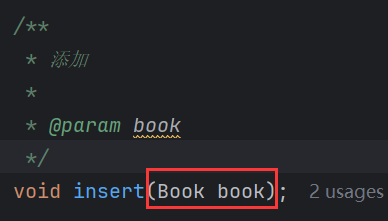
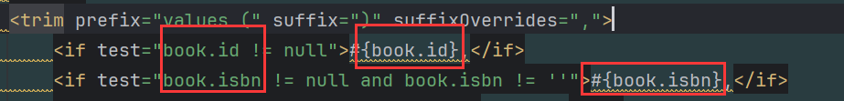
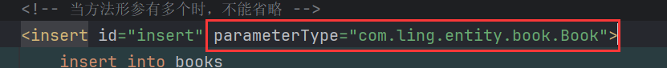
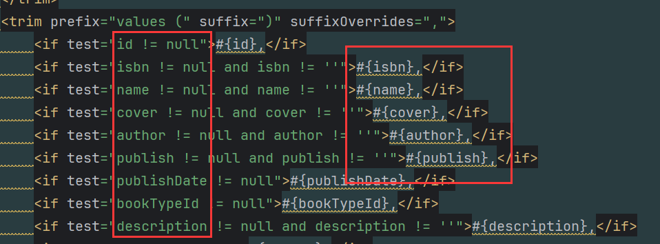

# 1 parameterType的作用

`parameterType` 指定了传入 SQL 语句的参数类型，它需要配置为传入参数的 Java 对象的完全限定类名（即包含包路径的类名）。

简单来说就是指定方法中的形参类型。

以插入的方法举例：

对实体表books进行新增操作，对应的实体类为【Book】，mapper中对应的方法，我们一般都是将【Book】作为参数传入，字段的值封装在【Book】的属性中：

而由于传递的是对象，不是具体的参数，因此在插入时，通过`对象.属性`的形式将属性值拿到：

如果我们使用`parameterType` 指定传入 SQL 语句的参数类型，那么mybatis会根据类型自动解析出对应的属性，这样我们能直接使用`属性`而无需`对象.属性`。

# 2 省略细节

`parameterType` 是否省略：

- 当方法形参只有一个时，可以省略，mybatis会自动推测实体类型。
- 当方法形参有多个时，想要直接使用`属性`，不能省略。
- 当方法形参是集合时，想要直接使用`属性`，不能省略，因为实体一般包含在集合中(泛型)，mybatis需要确定泛型的类型。
- 当方法形参有多个时，想要直接使用`属性`，不能省略。

# 3 本质

本质上`parameterType`的作用和`@Param`一样，都是告诉 MyBatis 如何将方法参数映射到 SQL 中的占位符`#{}`中。只是`parameterType`只能映射一种类型，即该属性在元素中只能定义一次。如果方法形参有多种，这时候映射推荐使用`@Param`。