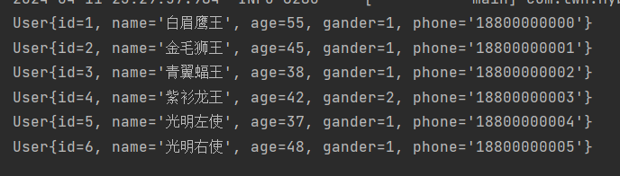

# JDBC

> JDBC是sun公司推出的用java程序操作数据库的API，java程序通过JDBC可以操作主流的关系型数据库如MySQL、Oracle、SQL server等。
>
> 不同关系型数据库的实现方法不同，JDBC是如何实现操作所有关系型数据库的呢？其实JDBC只是一个规范、一个接口，它并没有提供具体的实现，而这些实现是由各个数据库厂商来提供的，MySQL提供MySQL的JDBC实现、Oracle、SQL server同理。
>
> 我们使用java程序时，只需要使用面向接口编程，调用JDBC中的接口进行操作就行了，本质其实是通过调用JDBC的接口来操作厂商提供的数据库实现，进而操作数据库。这些厂商提供的数据库的实现有另一个名字——数据库驱动，比如上文入门程序中引入的MySQL的驱动依赖，就是MySQL的实现。


# 操作

> JDBC操作数据库分为5步：
>
> 1. 注册驱动
> 2. 获取连接对象
> 3. 获取执行SQL的对象Statement，执行SQL，返回结果
> 4. 封装结果数据
> 5. 释放资源

```java
@Test
public void testJdbc() throws Exception {
    //1. 注册驱动
    // 调用Class.forName()会加载类，类一旦加载会执行类的静态代码块
    // com.mysql.cj.jdbc.Driver的静态代码块中实例化了Driver对象
    // 并将Driver对象交给DriverManager的registerDriver方法进行注册
    Class.forName("com.mysql.cj.jdbc.Driver");

    //2. 获取连接对象
    String url = "jdbc:mysql://localhost:3306/mybatis1";
    String username = "root";
    String password = "1234";
    // 因为上面已经注册Driver了
    Connection connection = DriverManager.getConnection(url, username, password);

    //3. 获取执行SQL的对象Statement,执行SQL,返回结果
    String sql = "select * from user";
    Statement statement = connection.createStatement();
    // resultSet不是set集合，而是一个结果集对象
    ResultSet resultSet = statement.executeQuery(sql);

    //4. 封装结果数据
    List<User> userList = new ArrayList<>();
    while (resultSet.next()){
        int id = resultSet.getInt("id");
        String name = resultSet.getString("name");
        short age = resultSet.getShort("age");
        short gender = resultSet.getShort("gender");
        String phone = resultSet.getString("phone");

        User user = new User(id,name,age,gender,phone);
        userList.add(user);
    }

    //5. 释放资源
    statement.close();
    connection.close();
}
```

> 最终拿到了user表中的数据：




# 缺点

> 原始JDBC操作有以下缺点：
>
> - 注册驱动和创建数据库连接的部分，我们信息如驱动类、url、用户名和密码是很容易变动的，而这里我是写死的，写死的这种叫做硬编译，如果项目已经发布，我们改动了这些信息，就得重新打包发布，非常繁琐。
> -  解析结果集的部分，需要一个字段一个字段的解析，如果一张表的字段有30多条，那么我们就得解析30多个字段，代码冗余，且非常麻烦。
> - 我们在执行SQL之前要先获取connection对象，然后执行完SQL后又要马上关闭连接，这样频繁的获取关闭连接会造成资源浪费，性能降低。


# 对比Mybatis

> - Mybatis直接将数据库的连接信息写在application.properties文件中,如果要变动直接修改该文件,而不需要去操作java代码。
> - Mybatis将查询的结果集直接封装在了List集合中，而不需要我们手动一个一个的解析
> - 在application.properties配置连接信息时，我们指定的key值的前缀都是spring.datasource，一旦使用了该前缀，springboot底层会自动采用数据库连接池技术统一管理和分配连接，这些连接就是connection对象，有了连接池我们每次执行SQL时会从连接池中获取一个连接，执行完成后会将连接归还给连接池，做到连接的复用，避免了频繁的获取关闭连接造成的资源浪费，性能降低的问题。