# 需求说明

> 根据页面原型需求来实操Mybatis的基础操作，以下是员工管理模块的需求：
>
> 1、员工信息页面，要求员工信息分页展示，条件搜索，对应分页条件查询的select

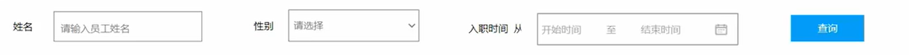

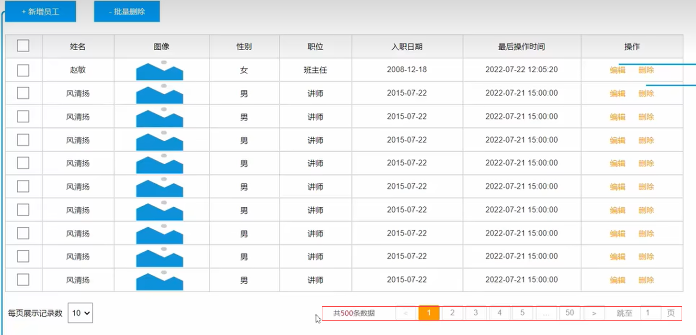

> 2、新增员工信息，对应inster、编辑员工信息首先要展示该员工的信息，然后再对其进行修改，对应select和update

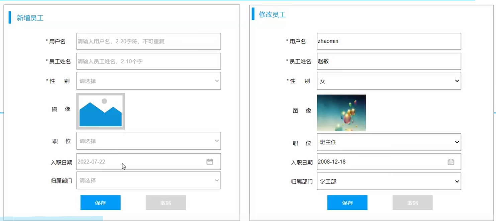

> 3、删除按钮删除对应的一条数据，而批量删除按钮删除复选框选中的数据，对应delete

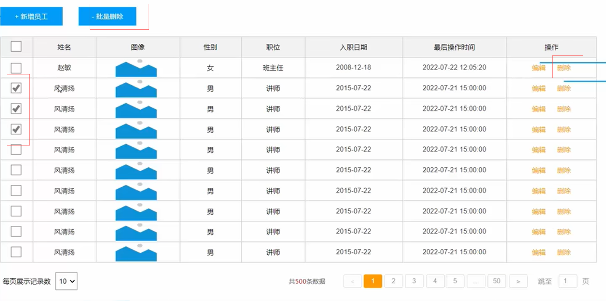

> 上面的需求就是对员工信息的增删改查，功能提取：
>
> - 查询
>   - 根据主键ID查询
>   - 条件查询
> - 新增
> - 更新
> - 删除
>   - 根据主键ID删除
>   - 根据主键ID批量删除
>
> 下面我们更加分析的功能需求使用Mybatis来操作数据库完成完成员工信息的增删改查。


# 环境准备

> 在操作之前，需要准备环境：
>
> 1. 准备emp表
> 2. 创建一个新的springboot工程， 选择引入对应的起步依赖(mybatis、 mysql驱动、lombok)
> 3. application.properties中引入数据库连接信息
> 4. 创建对应的实体类Emp (实体类属性采用驼峰命名)
> 5. 准备Mapper接口EmpMapper


## 建表

```sql
-- 部门管理
create table dept(
    id int unsigned primary key auto_increment comment '主键ID',
    name varchar(10) not null unique comment '部门名称',
    create_time datetime not null comment '创建时间',
    update_time datetime not null comment '修改时间'
) comment '部门表';

insert into dept (id, name, create_time, update_time) values(1,'学工部',now(),now()),(2,'教研部',now(),now()),(3,'咨询部',now(),now()), (4,'就业部',now(),now()),(5,'人事部',now(),now());


-- 员工管理
create table emp (
  id int unsigned primary key auto_increment comment 'ID',
  username varchar(20) not null unique comment '用户名',
  password varchar(32) default '123456' comment '密码',
  name varchar(10) not null comment '姓名',
  gender tinyint unsigned not null comment '性别, 说明: 1 男, 2 女',
  image varchar(300) comment '图像',
  job tinyint unsigned comment '职位, 说明: 1 班主任,2 讲师, 3 学工主管, 4 教研主管, 5 咨询师',
  entrydate date comment '入职时间',
  dept_id int unsigned comment '部门ID',
  create_time datetime not null comment '创建时间',
  update_time datetime not null comment '修改时间'
) comment '员工表';

INSERT INTO emp
	(id, username, password, name, gender, image, job, entrydate,dept_id, create_time, update_time) VALUES
	(1,'jinyong','123456','金庸',1,'1.jpg',4,'2000-01-01',2,now(),now()),
	(2,'zhangwuji','123456','张无忌',1,'2.jpg',2,'2015-01-01',2,now(),now()),
	(3,'yangxiao','123456','杨逍',1,'3.jpg',2,'2008-05-01',2,now(),now()),
	(4,'weiyixiao','123456','韦一笑',1,'4.jpg',2,'2007-01-01',2,now(),now()),
	(5,'changyuchun','123456','常遇春',1,'5.jpg',2,'2012-12-05',2,now(),now()),
	(6,'xiaozhao','123456','小昭',2,'6.jpg',3,'2013-09-05',1,now(),now()),
	(7,'jixiaofu','123456','纪晓芙',2,'7.jpg',1,'2005-08-01',1,now(),now()),
	(8,'zhouzhiruo','123456','周芷若',2,'8.jpg',1,'2014-11-09',1,now(),now()),
	(9,'dingminjun','123456','丁敏君',2,'9.jpg',1,'2011-03-11',1,now(),now()),
	(10,'zhaomin','123456','赵敏',2,'10.jpg',1,'2013-09-05',1,now(),now()),
	(11,'luzhangke','123456','鹿杖客',1,'11.jpg',5,'2007-02-01',3,now(),now()),
	(12,'hebiweng','123456','鹤笔翁',1,'12.jpg',5,'2008-08-18',3,now(),now()),
	(13,'fangdongbai','123456','方东白',1,'13.jpg',5,'2012-11-01',3,now(),now()),
	(14,'zhangsanfeng','123456','张三丰',1,'14.jpg',2,'2002-08-01',2,now(),now()),
	(15,'yulianzhou','123456','俞莲舟',1,'15.jpg',2,'2011-05-01',2,now(),now()),
	(16,'songyuanqiao','123456','宋远桥',1,'16.jpg',2,'2010-01-01',2,now(),now()),
	(17,'chenyouliang','123456','陈友谅',1,'17.jpg',NULL,'2015-03-21',NULL,now(),now());
```


## 导入项目

> 直接导入建好的项目(导入方法见第2章maven)：

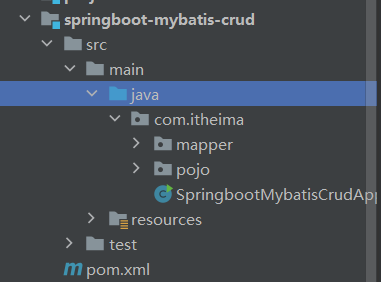

> 引入的依赖：

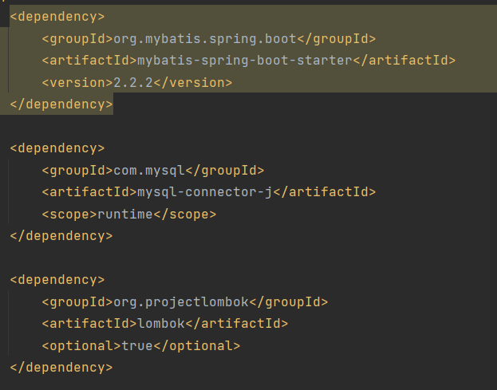

> 修改application.properties中的数据库连接信息为自己本地信息：

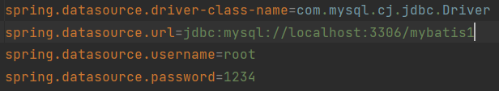

> 实体类Emp，使用lombok来简化实体类编写，属性与emp表一一对应：

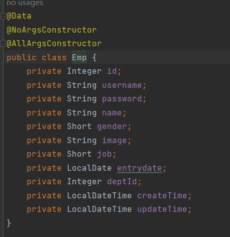

> EmpMapper接口：

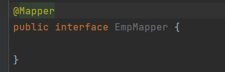

> 以上就是准备工作。


# 删除操作

```java
@Delete("delete from emp where id = #{id}")
```

> 当点击删除按钮后，前端会给后端发送请求，然后后端会删除这条数据。那么数据库在删除这条数据时，至少要告诉数据库这条数据的唯一标识，因此请求会携带该唯一标识即主键ID，所以这个功能就是条件删除，条件是ID。
>
> 在EmpMapper接口中定义删除方法：

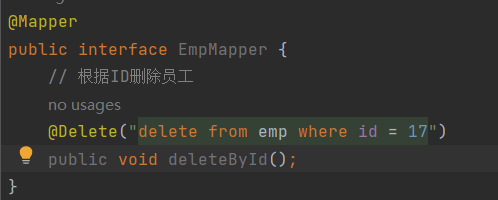

> 在@Delete注解中声明删除的SQL。
>
> 比如这里我们删除id为17的员工，但是这样写相当于是把SQL写死了，这个方法只能删除id=17的员工，这样是不合适的，我们得动态的删除员工。
>
> 这个删除的SQL要被执行就需要调用该方法，因此我们可以在调用该方法时传入要删除的员工ID，想办法将该员工ID放到条件id = 这里，为此我们可以使用Mybatis提供的占位符：#{}，#{参数名}就能将方法中的参数传递过来。

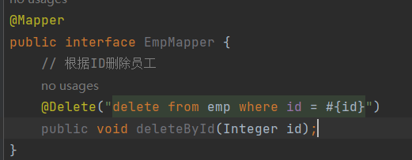

> 现在这个删除方法就能实现根据传递过来的ID动态删除对应的数据。
>
> 测试。传入17，删除对应的员工信息：

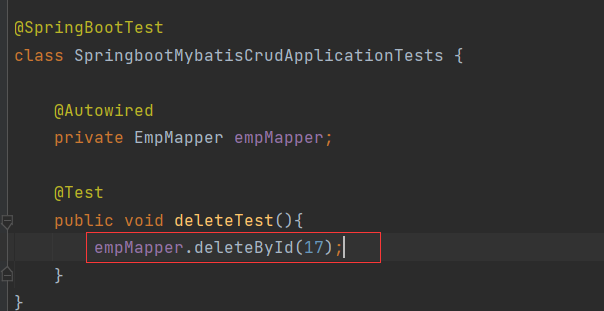

> 查询emp表，17员工被删除了：

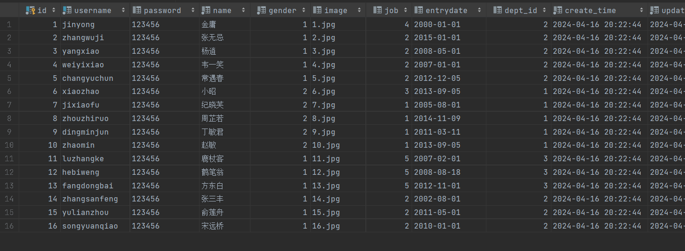

> 执行delete操作其实是有返回值的，不仅是delete，包括inster和update，它们的返回值是此次操作影响的数据条数，比如删除了2条数据，就会返回2，同理新增了5条数据就会返回5，修改了3条数据就会返回3，我们要拿到返回值，只需将方法的void改成int即可：

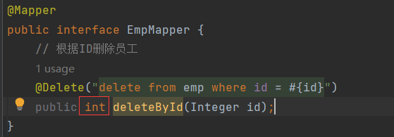

> 测试，拿到返回值：

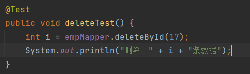

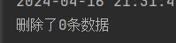

> 因为17已经被删除了，所以再次删除不会删除任何数据因此返回了0，删除16的数据：

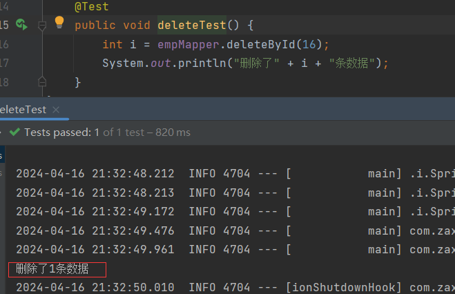


# 日志

> 我们成功的执行了删除的操作，但是我们并没有直观的看见Mybatis的底层操作时什么样的，其实我们可以通过日志来观看，Mybatis的日志默认是关闭的，我们需要在application.properties中配置信息来打开Mybatis的日志，并指定将日志输出到控制台：

```properties
# Mybatis的日志，并指定将日志输出到控制台
# StdOutImpl表示往控制台输出
mybatis.configuration.log-impl=org.apache.ibatis.logging.stdout.StdOutImpl
```

> 现在再来运行：

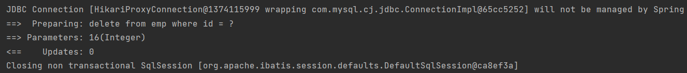

> 这里已经出现了执行日志了，最主要的是这个部分：


> 这里的在执行delete时，条件是？，这？表示参数占位符，他会将Parameters中的参数也就是16替换掉？，最终删除16这条数据，最后一个表示影响的数据条数为0条：

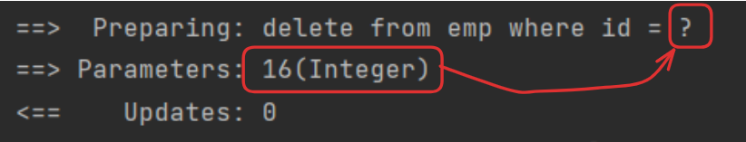

> 这样的SQL语句，叫做预编译SQL：

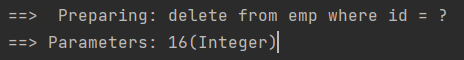


# 预编译SQ

> 我们在注释中使用的是#{}这种占位符，最终会被？所替代，这个？就是预编译SQL中的参数占位符，最终执行时，会将Preparing: delete from emp where id = ?以及Parameters: 16(Integer)都发送给数据库，数据库在执行该SQL时，会使用16来替换这个？。


## 预编译优点

> 为什么要采用预编译的方法，而不是将参数拼接在条件的后面？
>
> 1. 性能更高
> 2. 更安全(防止SQL注入)
>
> 1、性能高
>
> 先说一下SQL语句的执行流程：
>
> 在java中编写了一条SQL，SQL要执行需要连接上数据库，然后将SQL发送给MySQL，但是MySQL不会立即执行，而是先经过一系列过程，再执行。
>
> MySQL首先进行SQL语法检查，然后优化器对SQL语句进行优化，然后编译SQL语句，最终才执行SQL：

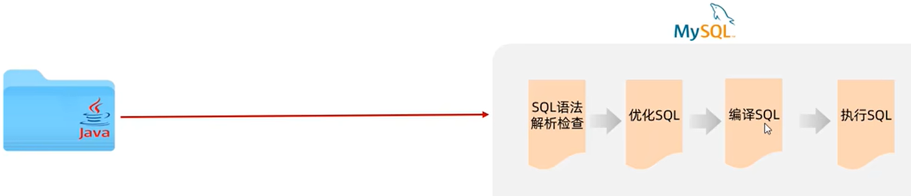

> 为了提高效率，数据库内部会将检查、优化、编译缓存起来：

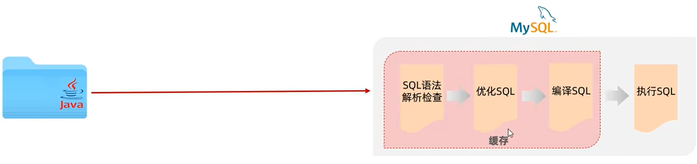

> 这个缓存就是一块内存区域，就是用来存储数据的，缓存以后，下次执行时就会先检查缓存看是否有该语句的编译结果，如果有就不用再执行检查、优化、编译而是直接从缓存中拿到编译后的SQL然后执行这个SQL，如果没有，那么要再次执行这3步操作然后缓存起来。
>
> 普通SQL进来，如：

```sql
delete from emp where id = 1
delete from emp where id = 2
delete from emp where id = 3
```

> 会先检查缓存内是否有'delete from emp where id = 1'这个的缓存，没有就执行3步操作，然后将其缓存起来，再执行SQL，接下来执行'delete from emp where id = 2'，再检查缓存，此时有缓存但是这里的id = 2与缓存中的id = 1不一致，所以又要重新执行一遍3步操作然后建立缓存，再执行SQL，执行id = 3的结果也是一样。所以执行这三条SQL我们需要编译3次，创建3个缓存，仅仅因为id不一致。
>
> 而预编译SQL：

```sql
delete from emp where id = ?
1
2
3
```

> 使用的是占位符，将'delete from emp where id = ?'和1发送给数据库，然后检查缓存，没有缓存执行3步操作，并存储缓存，然后执行为1的SQL，接着将'delete from emp where id = ?'和2发送给数据库，检查缓存，缓存中有且一致，因此直接执行为2的SQl，3同理，你会发现此时只创建了一次缓存，大大提高了执行效率。


### SQL注入

> SQL注入：通过操作输入的数据来修改事先定义好的SQL语句，以达到执行代码对服务器进行<font color='red'>攻击</font>的方法。
>
> 举个例子，运行一个java项目的jar包，jar包目录中cmd进入：

```powershell
java -jar jar包名
```

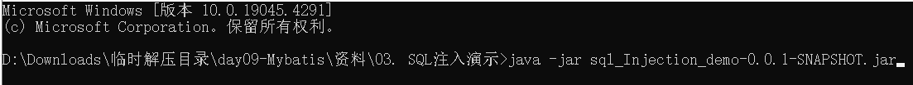

> 内嵌tomcat端口9090：

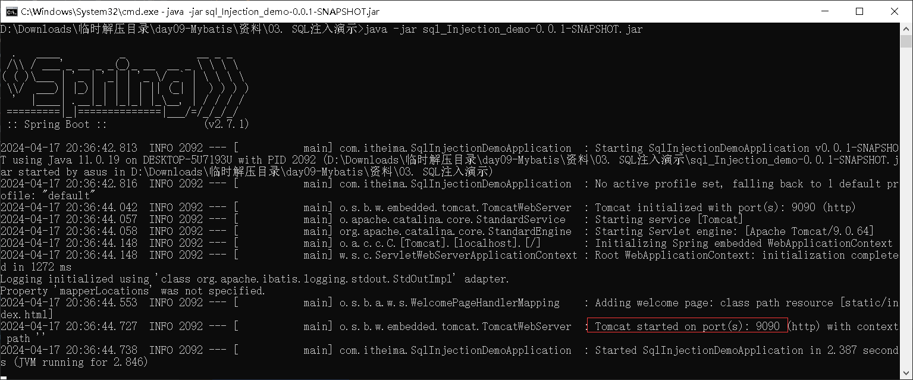

> 访问该端口：


> 登录，输入zhangwuji和123456，该用户在emp表中管理：

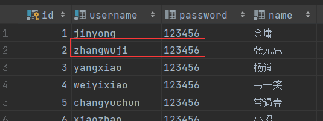

> 登录本质上就是查询数据库中是否存在该用户，其SQL如下：

```sql
select count(*) from emp where username = '' and password = ''
```

> 只要count(*)>0，就是说明能查到该用户，即登录成功，而username和password的值，就是登录界面中用户输入的数据：

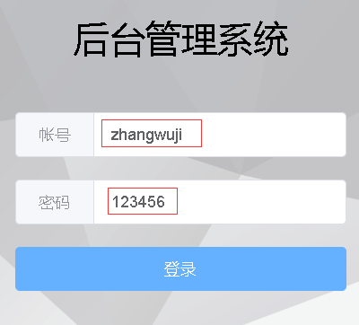

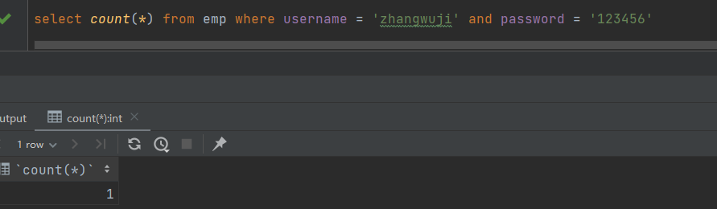

> 登录成功：

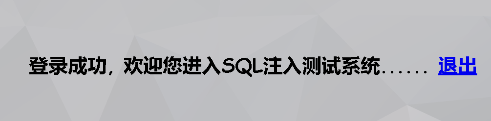

> 控制台：

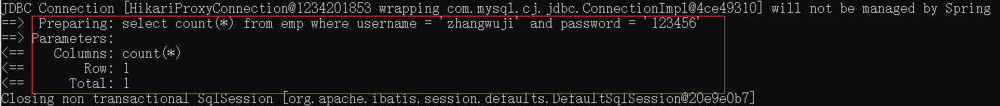

> 然后我登录失败：

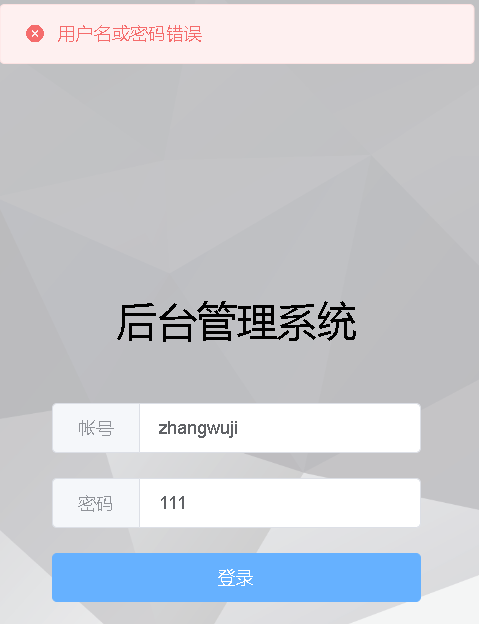

> 控制台，查询的数据为0条：

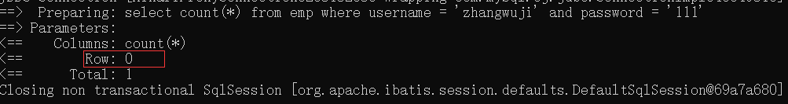

> 现在我们进行SQL注入攻击，用户名随便写，如'wieorelfoiihiwei'，但是密码要写成'or '1' = '1：

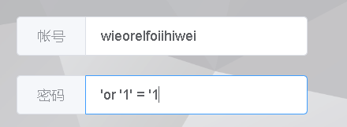


> 登录成功了，原因是我输入的用户名和密码最终形成的SQL长这个样子：

```sql
select count(*) from emp where username = 'wieorelfoiihiwei' and password = ''or '1' = '1'
```

> 你会发现此时的SQL变成了用户名和密码正确或者'1' = '1'正确就能查询出数据，而'1' = '1'是恒等式。因此'1' = '1'永远成立，查询即查询所有数据了，那么总数一定是>=0的。

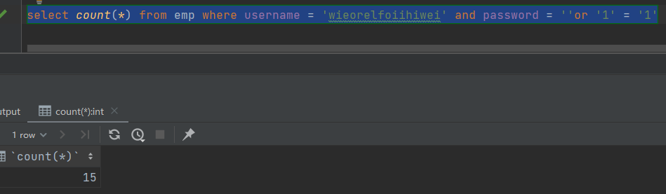

> 控制台也一样：

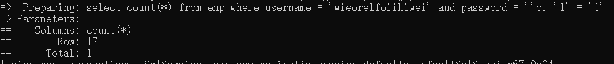

> 之所以SQL注入能成功是因为，我们将参数拼接在SQL语句的''上导致恒等式造成的。
>
> 我们打开使用预编译的项目，再次输入，发现SQL注入失败了：


> 控制台中日志表示使用的是预编译：

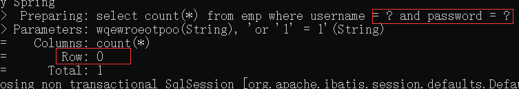

> 根据占位符我们得出最终的SQL长这样：

```sql
select count(*) from emp = username = 'wqewroeotpoo' and password = ''or'1'= 1''
```

> 即便你将密码给补全：' ' or  '1'  =  '1'也不行，因为他是将整个密码作为参数传递到password = ''的''中，像这样：

```sql
select count(*) from emp = username = 'wqewroeotpoo' and password = '' ' or  '1'  =  '1''
```

> 因此预编译有效的防止了SQL注入。


## 占位符

> 在Mybatis，只要使用了#{}占位符，最终执行的就是预编译语句。
>
> Mybatis中的占位符：
>
> - #{}
> - ${}
>
> #{}：
>
> - 执行SQL时会被替换成?，生成预编译SQL，会自动设置参数值
> - 使用时机：参数传递，都是用#{}
>
> ${}：
>
> - 拼接SQL。直接将参数拼接在SQL语句中，存在SQL注入问题
> - 使用时机：如果对表名、列表进行动态设置时使用。


# 新增操作

> 新增员工，我们先梳理以下哪些字段是需要插入的，哪些有不需要：
>
> id是自增主键，不需要插入，密码有默认值，且新增页面没有要求输入密码，不需要插入，剩下的字段都需要插入，我们插入数据时需要将修改日期和创建日期设置为当前日期。
>
> 需要插入的字段：
>
> - username
> - name
> - image
> - job
> - entrydate
> - dept_id
> - create_tiem
> - update_tiem
>
> 插入测试数据：

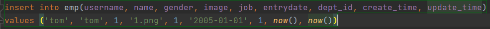

> 我们创建一个新增的方法，声明@Insert注解来编写插入的SQL：

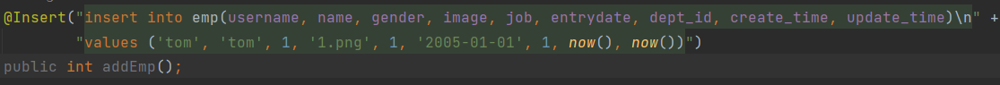

> 但是此时的新增方法是写死的，无法动态的增加数据，因此我们要像删除那样使用参数来替换，为了不在方法的参数列表中声明过多的形参，推荐使用对象作为参数来传递数据，而在SQL中我们使用#{}来接收这些数据，占位符的名字与对象的属性名保持一致就能解析出对应属性的值：

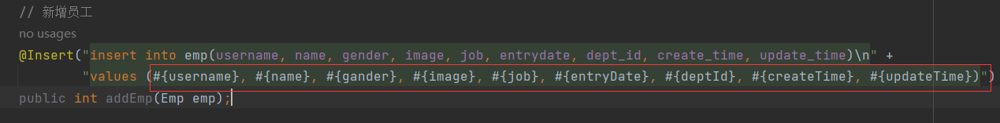

> 然后调用该方法，传入emp对象，对象中的属性事先赋值好，就能将数据传递到SQL中，然后将SQL和数据发送给数据库，数据库就能执行插入的操作了：

```java
@Test
public void addTest() {
    Emp emp = new Emp();
    emp.setUsername("tom");
    emp.setName("tom");
    // 强转
    emp.setGender((short) 1);
    emp.setImage("1.png");
    emp.setJob((short) 1);
    // LocalDate.of()创建LocalDate对象
    emp.setEntryDate(LocalDate.of(2005, 1, 1));
    emp.setDeptId(1);
    // LocalDateTime.now()创建LocalDateTime对象
    emp.setCreateTime(LocalDateTime.now());
    emp.setUpdateTime(LocalDateTime.now());

    int i = empMapper.addEmp(emp);
    System.out.println("新增了" + i + "条数据");
}
```

> 使用了预编译进行处理：

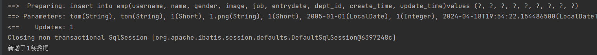

> 插入的数据：

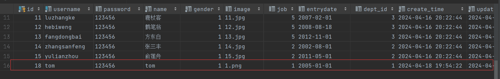


## 新增-主键返回

> 有这样的场景，我们在添加完数据后，需要拿到这条刚添加的数据的id，如添加套餐页面：

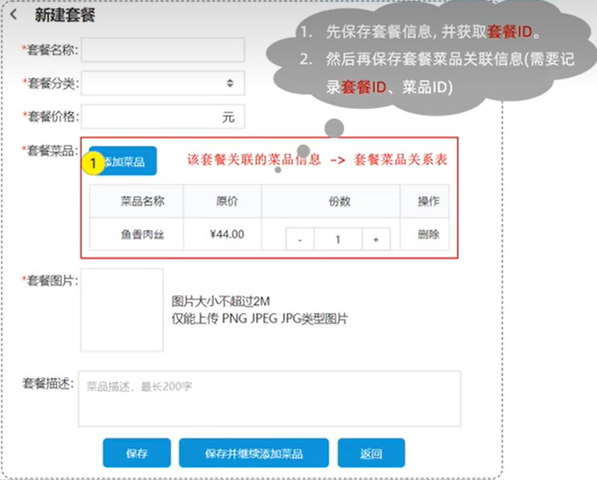

> 之前我们分析过，套餐和菜品之间是多对多的关系，因此有一张中间表来维护这两者的id，现在我新增一条套餐的数据，同时还要增加套餐菜品信息，那么执行插入的流程是先增加一条套餐数据，然后获取这条数据的套餐id，然后将套餐id和菜品id一起录入中间表中，要实现这个功能，就需要在插入套餐数据后能返回该数据的id。
>
> 再执行完新增后直接获取：

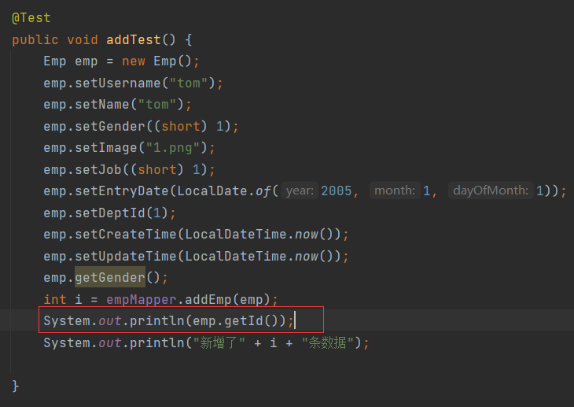


> 直接获取是无法获取这个id的，我们可以使用注解@Options来实现。
>
> 在新增方法上声明注解该注解，然后指定两个属性：
>
> - keyProperty='实体类的属性名'
> - useGeneratedkeys=true
>
> useGeneratedkeys=true表示我们要拿到新增的这条数据的主键值，keyProperty表示我们将拿到的主键封装到该实体类的属性名中。
>
> 如：

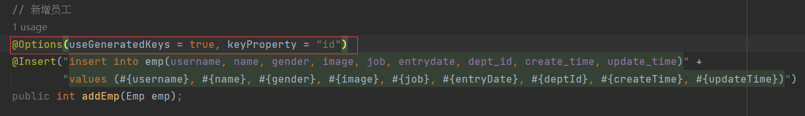

> 这里就是拿到新增的数据的主键，然后将主键封装到emp的id属性中，然后我们再次获取：

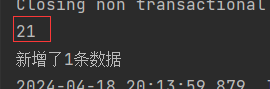

> 就能拿到数据了。


# 修改操作

> 点击修改按钮，展示出员工信息，修改信息保存，数据内容更新。
>
> 更新操作有两部分，第一是询出要修改的员工信息展示在修改页面上，第二部分是保存修改后的内容。
>
> 即点击修改查询出员工信息，点击保存，保存修改后的数据。
>
> 主键是不会发生变化的，我们一般也不会去修改主键值，因此我们可以用主键作为修改的条件。
>
> 注意，修改数据时，创建日期不需要更新。
>
> 与新增类似，我们也创建一个修改的方法，然后声明@Update编写SQL：

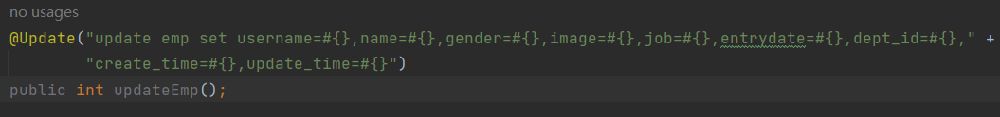

> 我们不能把修改的数据写死，和新增一样，过多的形参我们考虑使用对象来代替：

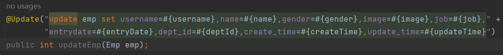

> 给上修改的条件，以id作为条件：

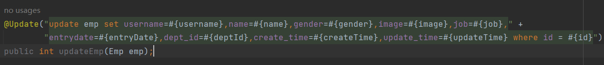

> 测试，修改id=18的数据：

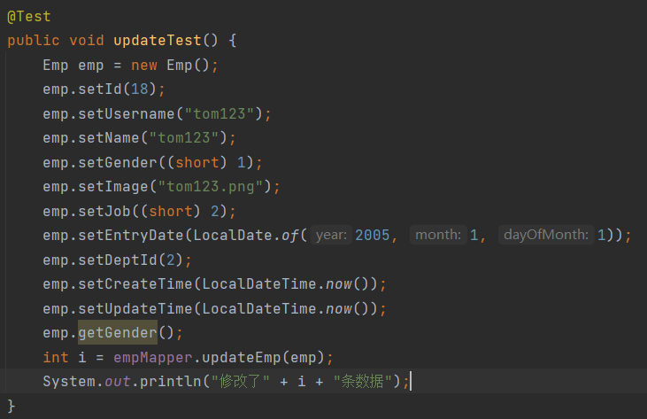

> 运行：

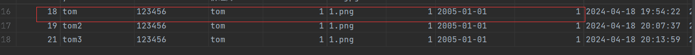

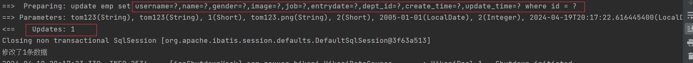


# 查询操作

> 点击编辑会对应出现要编辑的员工信息，这就需要我们查询出员工的信息，其实是根据id来查询：


> 运行：


## Mybatis自动封装问题

> 数据是查询出来了，但是deptId、createTime、updateTime的值都是null，这是为什么？
>
> 这是因为Mybatis自动封装的问题。
>
> - 实体类的属性名与数据表查询返回的的字段名一致，Mybatis会自动封装
> - 实体类的属性名与数据表查询返回的的字段名不一致，Mybatis不会自动封装


> 解决方法1，查询出来的字段起别名与属性名一致：


> 解决方法2，通过@Results、@Result注解手动映射封装：


> @Results注解中的属性value，其需要传入一个数组，数组中声明一系列的@Result。而@Result中有两个属性column和property，column中传入字段名，property传入属性名，这样就能建立字段和属性之间的映射关系，从而将字段的值封装在属性中。

```java
@Results({
	@Result(column = "字段名1",property = "属性名1"),
    @Result(column = "字段名2",property = "属性名2"),
    @Result(column = "字段名3",property = "属性名3"),
    ...
    @Result(column = "字段名n",property = "属性名n"),
})
```

> 上面就建立了entrydate——entryDate、dept_id——deptId、create_time——createTime、update_time——updateTime的关系，然后将其字段值封装在了属性中。


> 解决方法3，打开Mybatis的自动驼峰命名开关，Mybatis打开这个开关后，会自动将a_field自动封装到驼峰命名的属性名aField中。
>
> 开启这个功能需要再application.properties中配置：

```properties
# 开启mybatis驼峰命名自动映射
mybatis.configuration.map-underscore-to-camel-case=true
```


## 条件查询

> 根据条件查询，需求如下：


> 通过姓名、性别、入职时间来查询信息，SQL：

```sql
select * from emp where name like '%张%' and gender = 1 and entrydate between '2010-01-01' and '2020-01-01'
```

> 条件查询方法：


> 传递的参数有姓名、性别、入职日期的开始时间和结束时间，如果用对象作为参数那就不能用emp，因为emp中的入职时间是一个日期，不是一个日期范围，因此这里将参数一一写出：


> 然后将参数替换：


> 注意，这里使用模糊匹配不要用#{}，因为#{}会被替换成预编译中的？而？是不允许出现在''中的，因此这里可以使用${}，不让其预编译而是使用拼接：


> 运行：


> 但是使用${}会造成性能低下，且有SQL注入的风险，所有我们可以使用MySQL的字符串拼接函数concat，concat()接收多个参数，返回多个参数的拼接后的参数：


> 而这里的模糊匹配，我们可以用concat函数，将%张%当成3个字符然后拼接在一起，让将张处理成参数传递，预编译避免SQL注入：


# 注意

> - 如果mapper接口方法中的形参只有一个普通类型的参数，#{}中的属性名可以随便写，如#{id}、#{value}、甚至#{abc}。因为只有一个形参所以只能赋值给这一个占位符，所以名字随便写也没事，但是还是建议两者保持一致增强可读性
> - 注释中的占位符是#{}，#{}在预编译SQL中会被替换成？，？是预编译SQL中的占位符
> - #{}生成预编译SQL，${}直接将参数拼接在SQL上
> - <font color='red'>新增数据后，马上拿到主键</font>：在新增方法上使用@Options(useGeneratedKeys = true, keyProperty = "实体类的属性名")
> - 使用驼峰命名自动映射，需要严格遵循命名规范，字段名用_分隔，属性名用驼峰命名，否则无法建立映射
> - 模糊匹配不允许''中出现？，因此不能直接使用#{}，可以使用${}拼接SQL，但是存在SQL注入问题，因此可以用concat()来拼接参数：concat('%',#{...},'%')
> - 早期1版本的springboot或者单独使用Mybatis时，mapper接口的方法形参中需要用@param()来指定占位符#{}中与哪个形参匹配，因为1点几版本中在编译成字节码文件时，形参名会被替换成var1、var2、var3...，如果不用@Param()来指定参数名，那么#{}就不知道与哪个参数名匹配，2.几版本后由内置插件解决了该问题，因此不用再加@Param。但是单独使用Mybatis因为没有插件，还是要用@Param。
> - 早期的springboot和单独使用mybatis，如果形参只有一个，可以不加@param()，因为只有一个参数，就不用管参数名了之间把参数值传入预编译占位符就行了。