>Mybatis中配置SQL语句有两种方式，一种是注解，另一种就是XML文件。


# 定义规范

> - XML映射文件的名称与Mapper接口名称一致，并且将XML映射文件和Mapper接口放置在相同包下(同包同名)。
> - XML映射文件的namespace属性与Mapper接口全限定名一致。
> - XML映射文件中sql语句的id与Mapper接口中的方法名一致，并保持返回类型一致。
>
> 接口的名字是empMapper，那么XML文件的名字也得是empMapper：

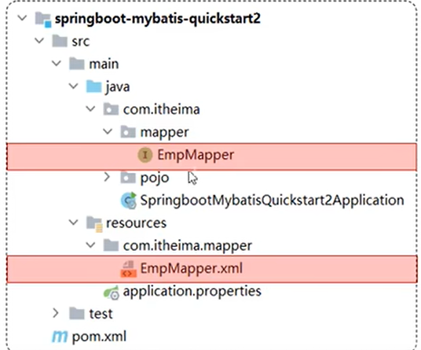

> 且项目开发中，一般是一个接口对应一份映射文件。
>
> 除名字一致外，还要将XML映射文件放在与Mapper接口包路径相同的包下，我们知道springboot中配置文件一般是在resouces包下，我们一般也会将XML文件放在这个包下，所以要保持与Mapper接口包路径相同，就需要在resources包下创建一个与Mapper接口完整包路径一致的包。

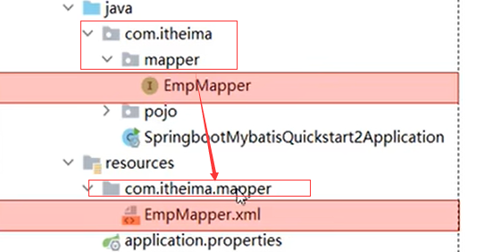

> XML文件的namespace需要与Mapper接口的全类名保持一致，下面是一个映射文件的例子：

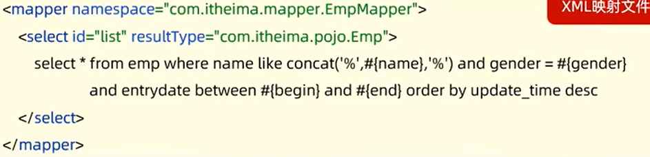

> 其namespace = "com.itheima.mapper.EmpMapper"，而com.itheima.mapper.EmpMapper就是EmpMapper接口类的全类名：

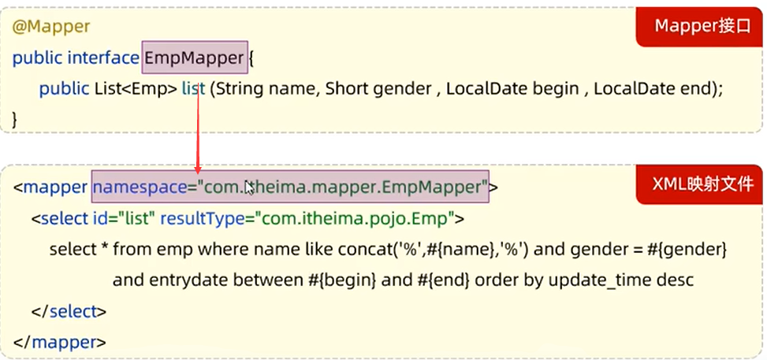

> XML映射文件中sql语句的id与Mapper接口中的方法名一致，这里定义了一个select语句，其id是list，而EmpMapper的list方法名也是list，保持一致：

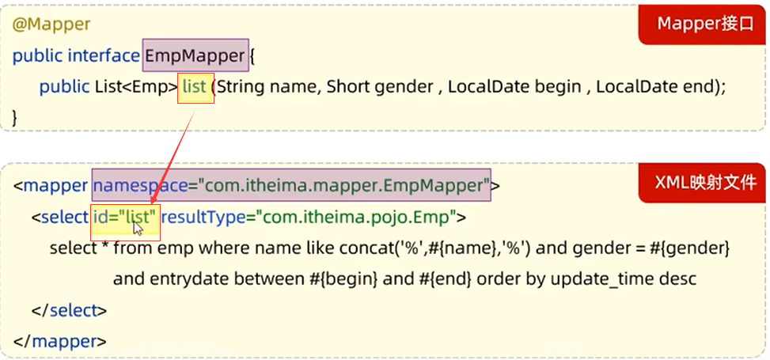

> 至于返回类型值一致，一会儿再说。


# 定义XML映射文件

> 首先在recourses下创建与Mapepr完整包路径一致的包：

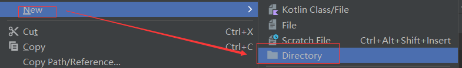


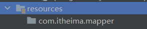

> 我们这里使用的是.创建，这样创建的包是错误的，打开本地磁盘查看：

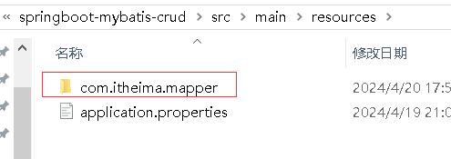

> 只是一个单文件，而不是一级一级的目录，注意我们创建的这个包其实是一个目录，从上面的Directory选项就能看出来，既然是目录，就需要用/分隔：


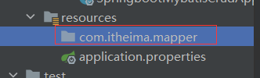

> 虽然在idea中展示的结构与之前一致，但是在本地磁盘中就是分级次的：

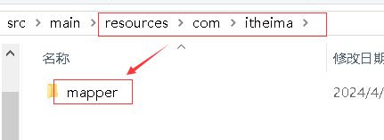

> 右键选择File创建映射文件，与接口名保持一致：

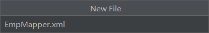


> XML中先编写Mybatis的约束，这个约束在Mybatis官网查看：
>
> https://mybatis.net.cn/getting-started.html

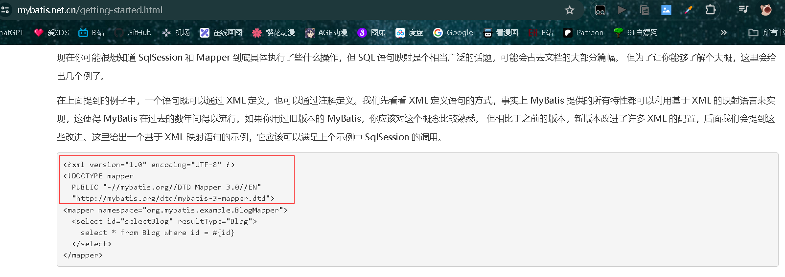


## XML约束模板

> 约束：

```xml
<?xml version="1.0" encoding="UTF-8" ?>
<!DOCTYPE mapper
        PUBLIC "-//mybatis.org//DTD Mapper 3.0//EN"
        "http://mybatis.org/dtd/mybatis-3-mapper.dtd">
<mapper namespace="">
    
</mapper>
```

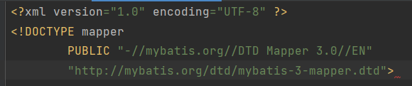

> 然后输入跟标签<mapper>：

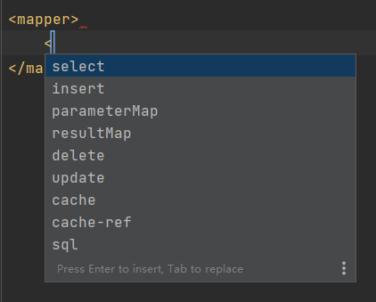

> 输入后提示子标签，通过名字能看出是用来配置对应SQL的标签。
>
> <mapper>中的命名空间namespace属性要与Mapper接口的全类名一致，选中EmpMapper右键【Copy/ Paste Special】>>【Copy Reference】，或者ctrl+alt+shift+c，即可复制全类名。

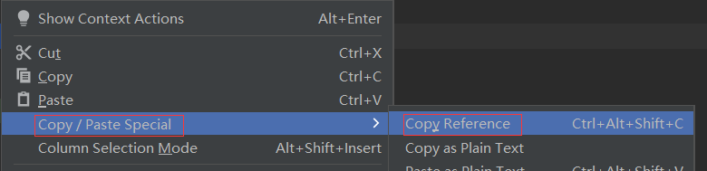

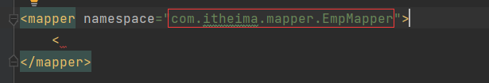

> 以上，该XML映射文件基本结构就配置好了，接下来可以在其中定义SQL语句了。
>
> 如，我们通过XML来实现上文的条件查询功能，查询功能就定义select标签，保持id与接口方法名一致：

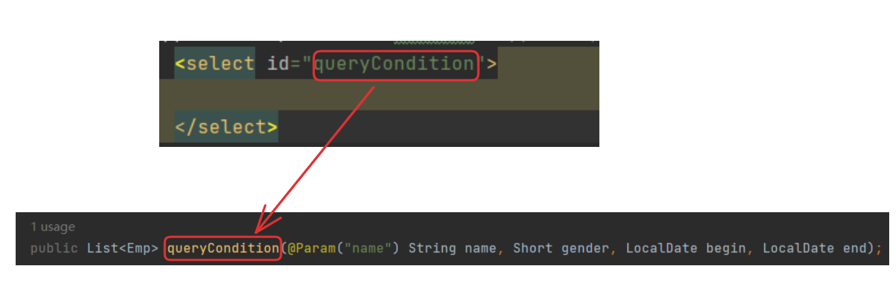

> 然后将注解中的查询语句放在标签中：

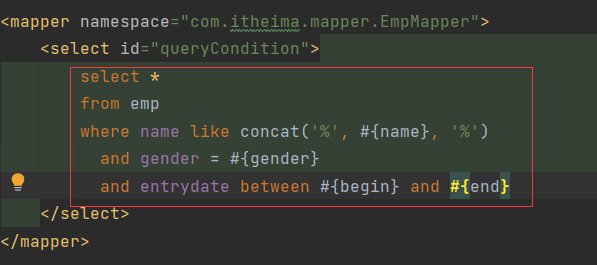

> 这个查询是有返回值的，我们还要在select标签中定义属性resultType来封装该返回值，resultType是结果类型，指的是<font color='yellow'>单条记录所封装的类型的全类名</font>，因此resultType的值等于单条记录所封装的类型的全类名，该查询返回一个List集合，泛型是Emp，那么集合中的单条记录就是Emp类型的，所以resultType等于Emp的全类名:

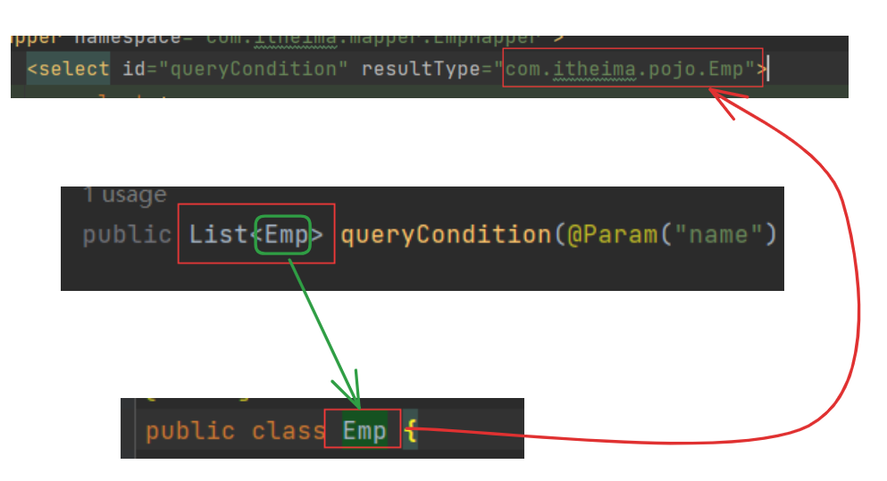

> 这里也就是定义规范中最后一条说的保持返回类型一致，单条记录类型一致。
>
> 测试：

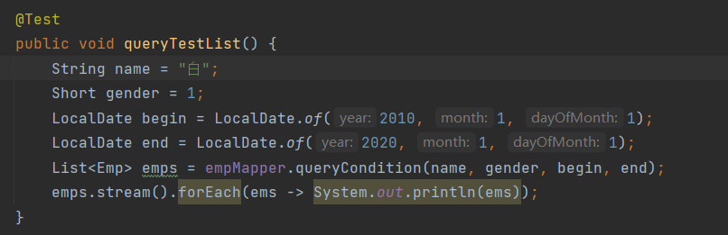

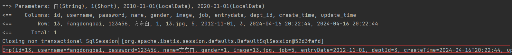


# 为什么遵守规范

> 我们是使用Mybatis，是通过接口方法来执行相应的SQL，那么问题就是如何让方法与要执行的SQL对应起来，即通过该方法找到对应的SQL。注解的方式是在方法的上面编写SQL，即SQL与方法是绑定在一起的，执行这个方法就是执行方法上的SQL，如果使用XML，那么方法与SQL定义是分开的，就需要通过接口方法来找到对应的SQL。
>
> 按照3大规范的定义，当我们执行EmpMapper接口中的queryCondition方法时，Mybatis就会自动去查找namespace属性值与EmpMapper全类名一致的XML文件，并且在该文件中找到id与queryCondition方法一致的SQL，最终运行此SQL：

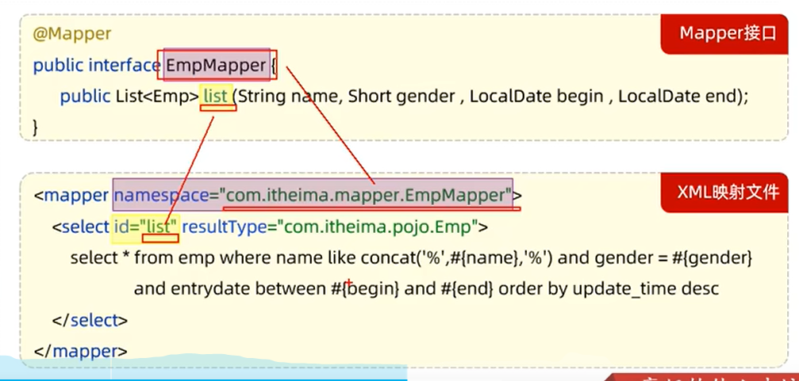

> 如果我们按照这个规范来配置XML，那么Mybatis就能按照这个思路来调用这个方法最终要执行的SQL。


# Mybatisx

> MybatisX是一款基于IDEA的快速开发Mybatis的插件，为效率而生。
>
> 先安装：

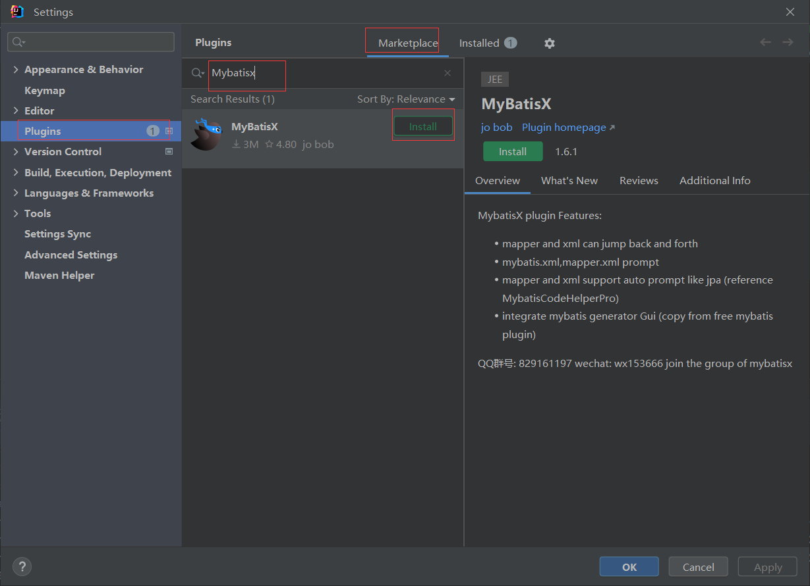

> 安装好后应用，现在Mapper接口和XML都有一只小鸟：

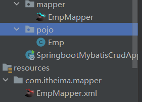

> 点击就能在对应的接口和XML中相互跳转：

.gif)


# 使用注解还是XML

> 官方原话：
>
> 使用注解来映射简单语句会使代码显得更加简洁，但对于稍微复杂一点的语句，Java 注解不仅力不从心，还会让你本就复杂的 SQL 语句更加混乱不堪。 因此，如果你需要做一些很复杂的操作，最好用 XML 来映射语句。
>
> 选择何种方式来配置映射，以及认为是否应该要统一映射语句定义的形式，完全取决于你和你的团队。 换句话说，永远不要拘泥于一种方式，你可以很轻松的在基于注解和 XML 的语句映射方式间自由移植和切换。
>
> 简单的增删改查用注解就够了，但是复杂的SQL，建议使用XML。