# 案例说明

> 本次案例需要完成智能学习系统中的'部门管理'和'员工管理'两个功能模块。
>
> 页面原型：

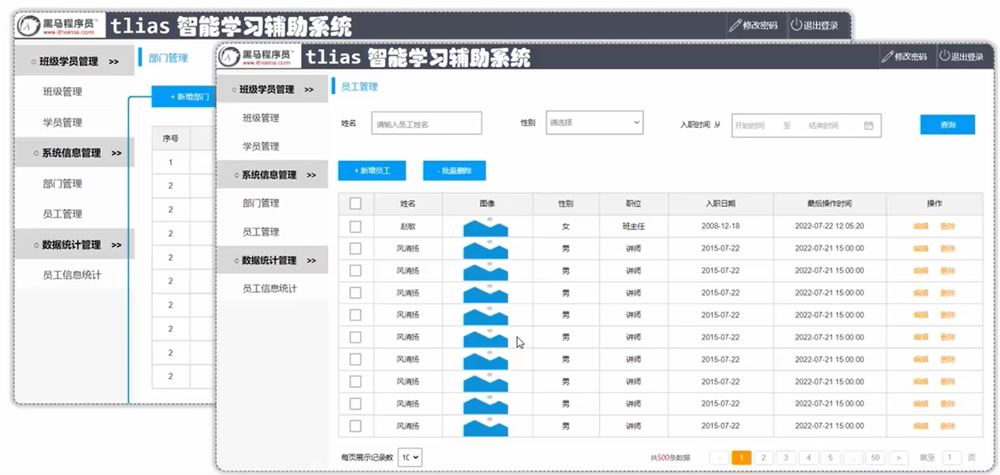

> 最终效果：

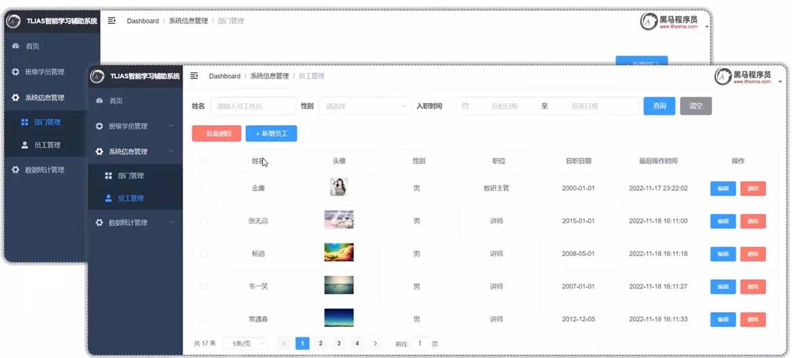

> 前端不用开发，只关注后端部分。


# 准备工作


## 需求

> 完成'部门管理'和'员工管理'两个功能模块，我们打开页面原型
>
> 首先是部门管理：

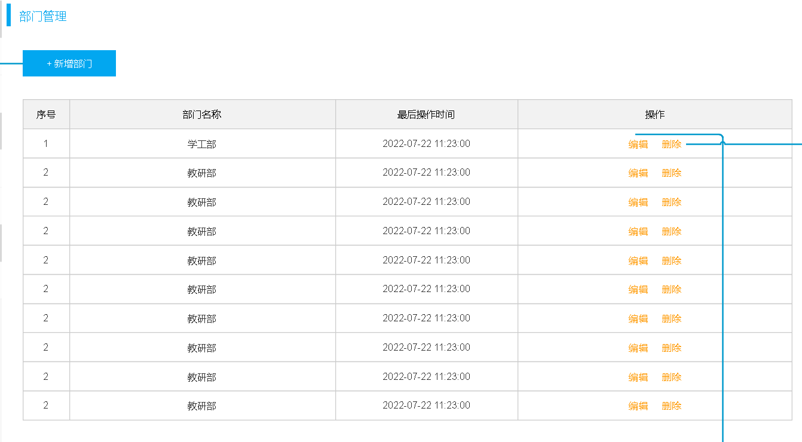

> 部门管理对应的功能：
>
> - 新增部门
> - 编辑部门
> - 删除部门
>
> 员工管理：

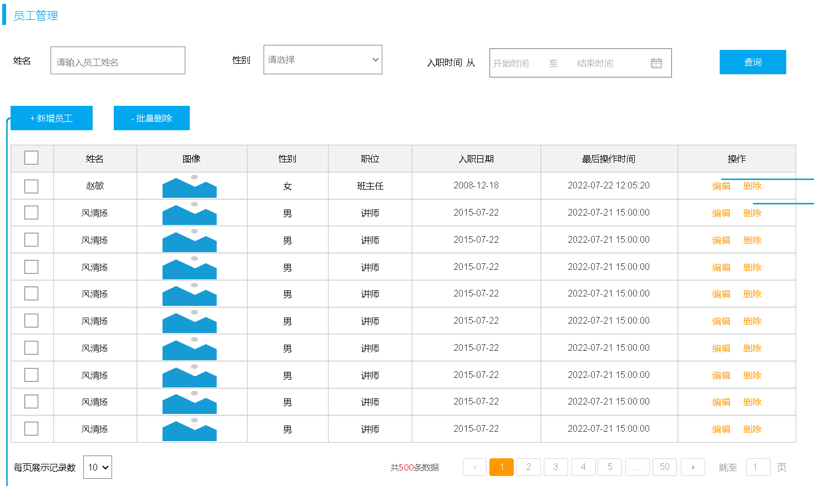

> 对应的功能是：
>
> - 条件查询，分页展示员工信息
> - 新增员工
> - 编辑员工
> - 删除/批量删除员工
>
> 其实是员工信息和部门信息的增删改查功能：

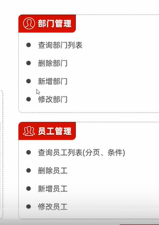


## 环境搭建

> 上面说过，我们关注的是后端部分，因此搭建环境主要关注后端环境和数据库环境。
>
> 1、对于数据库环境，只需要将部门表和员工表导入数据库即可，这两张表上文具体分析过，这里不作分析。
>
> 2、后端环境，基于springboot开发，要创建springboot工程，引入以下依赖：
>
> - 是web工程，引入web依赖
> - 操作数据，引入MySQL驱动和Mybatis依赖
> - 简化实体类开发，引入lombok
>
> 3、在application.properties中配置Mybatis信息，创建员工和部门对应的实体类
>
> 4、以三层架构为框架开发
>
> 架构图：

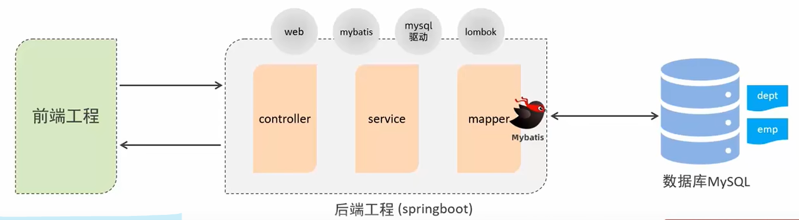


### 数据库环境

> 建库建表：

```sql
-- 部门管理
create table dept(
    id int unsigned primary key auto_increment comment '主键ID',
    name varchar(10) not null unique comment '部门名称',
    create_time datetime not null comment '创建时间',
    update_time datetime not null comment '修改时间'
) comment '部门表';

insert into dept (id, name, create_time, update_time) values(1,'学工部',now(),now()),(2,'教研部',now(),now()),(3,'咨询部',now(),now()), (4,'就业部',now(),now()),(5,'人事部',now(),now());


-- 员工管理
create table emp (
  id int unsigned primary key auto_increment comment 'ID',
  username varchar(20) not null unique comment '用户名',
  password varchar(32) default '123456' comment '密码',
  name varchar(10) not null comment '姓名',
  gender tinyint unsigned not null comment '性别, 说明: 1 男, 2 女',
  image varchar(300) comment '图像',
  job tinyint unsigned comment '职位, 说明: 1 班主任,2 讲师, 3 学工主管, 4 教研主管, 5 咨询师',
  entrydate date comment '入职时间',
  dept_id int unsigned comment '部门ID',
  create_time datetime not null comment '创建时间',
  update_time datetime not null comment '修改时间'
) comment '员工表';

INSERT INTO emp
	(id, username, password, name, gender, image, job, entrydate,dept_id, create_time, update_time) VALUES
	(1,'jinyong','123456','金庸',1,'1.jpg',4,'2000-01-01',2,now(),now()),
	(2,'zhangwuji','123456','张无忌',1,'2.jpg',2,'2015-01-01',2,now(),now()),
	(3,'yangxiao','123456','杨逍',1,'3.jpg',2,'2008-05-01',2,now(),now()),
	(4,'weiyixiao','123456','韦一笑',1,'4.jpg',2,'2007-01-01',2,now(),now()),
	(5,'changyuchun','123456','常遇春',1,'5.jpg',2,'2012-12-05',2,now(),now()),
	(6,'xiaozhao','123456','小昭',2,'6.jpg',3,'2013-09-05',1,now(),now()),
	(7,'jixiaofu','123456','纪晓芙',2,'7.jpg',1,'2005-08-01',1,now(),now()),
	(8,'zhouzhiruo','123456','周芷若',2,'8.jpg',1,'2014-11-09',1,now(),now()),
	(9,'dingminjun','123456','丁敏君',2,'9.jpg',1,'2011-03-11',1,now(),now()),
	(10,'zhaomin','123456','赵敏',2,'10.jpg',1,'2013-09-05',1,now(),now()),
	(11,'luzhangke','123456','鹿杖客',1,'11.jpg',5,'2007-02-01',3,now(),now()),
	(12,'hebiweng','123456','鹤笔翁',1,'12.jpg',5,'2008-08-18',3,now(),now()),
	(13,'fangdongbai','123456','方东白',1,'13.jpg',5,'2012-11-01',3,now(),now()),
	(14,'zhangsanfeng','123456','张三丰',1,'14.jpg',2,'2002-08-01',2,now(),now()),
	(15,'yulianzhou','123456','俞莲舟',1,'15.jpg',2,'2011-05-01',2,now(),now()),
	(16,'songyuanqiao','123456','宋远桥',1,'16.jpg',2,'2010-01-01',2,now(),now()),
	(17,'chenyouliang','123456','陈友谅',1,'17.jpg',NULL,'2015-03-21',NULL,now(),now());
```


### 创建springboot工程

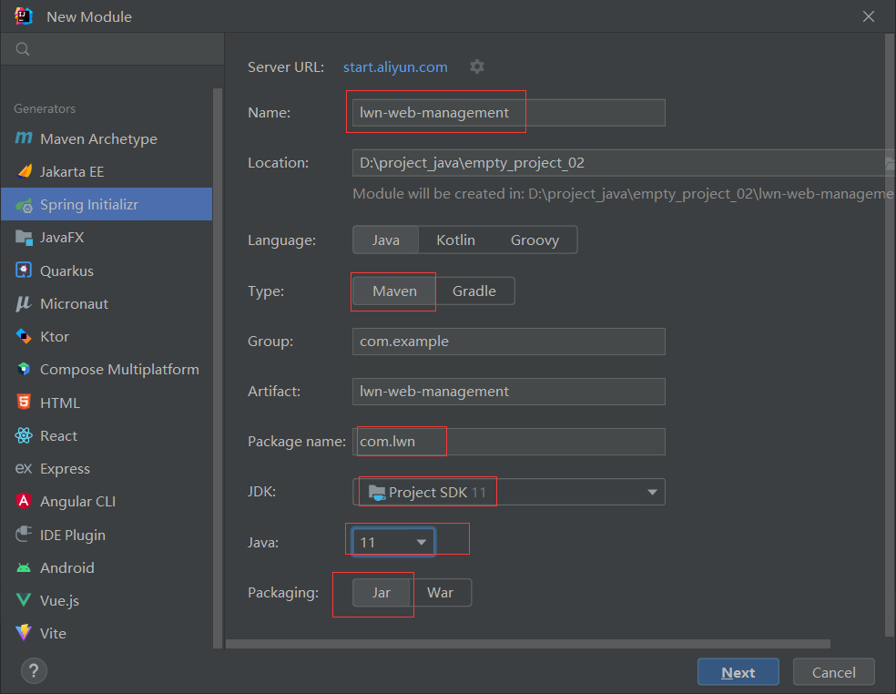

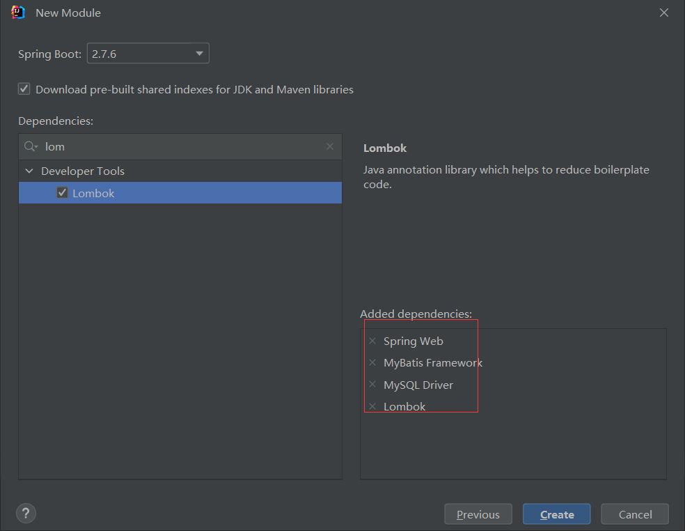

> 准备实体类：

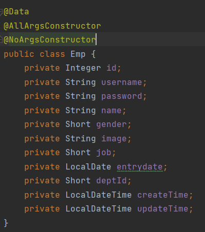

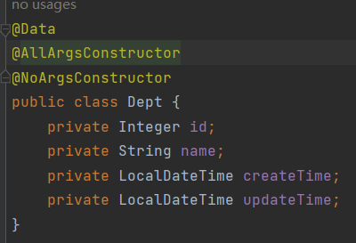

> 配置MySQL连接信息，配置Mybatis日志和自动驼峰命名封装：

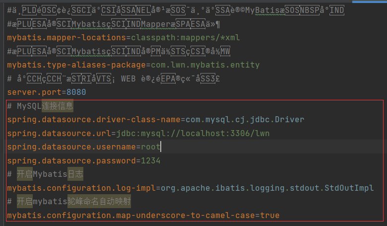

> 创建Mapper接口：

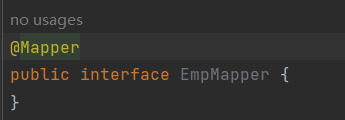

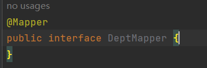

> 创建service层：

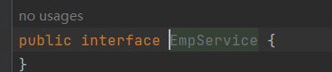

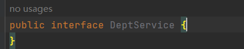

> 实现类，@Service将service层实现类交给IOC容器管理：

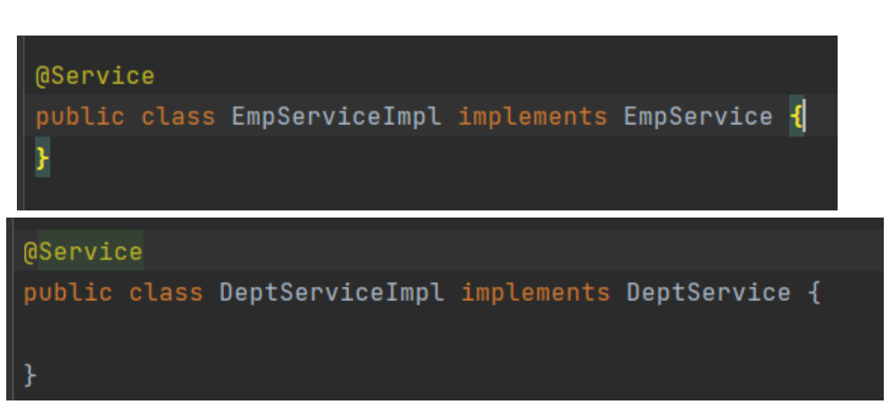

> controller层，@RestController将controller层实现类交给IOC容器管理：

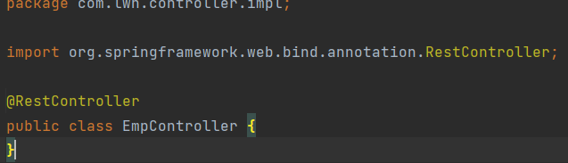

> 统一响应结果类：

```java
package com.lwn.utils;

import lombok.AllArgsConstructor;
import lombok.Data;
import lombok.NoArgsConstructor;

@Data
@AllArgsConstructor
@NoArgsConstructor
public class Result {
    // 状态码
    private Integer code;
    // 提示信息
    private String msg;
    // 响应的数据
    private Object data;
    
    // 静态方法，快速生成成功的响应
    public static Result success(Object data) {
        return new Result(1, "success", data);
    }

    // 静态方法，success的重载，快速生成成功无数据的响应
    public static Result success() {
        return new Result(1, "success", null);
    }

    // 静态方法，快速生成失败的响应
    public static Result error(String msg) {
        return new Result(0, msg, null);
    }

}
```


# 开发规范

> 严格按照需求文档中的要求开发：

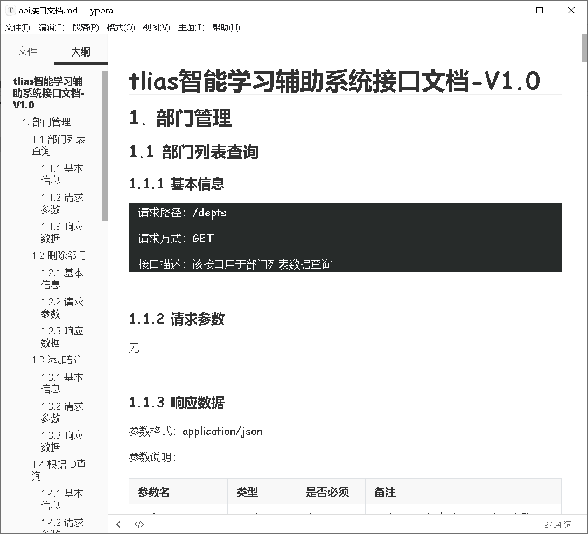


## Restful

> REST (REpresentational State Transfer)， 表述性状态转换，它是一种软件架构风格。
>
> 传统风格的请求：

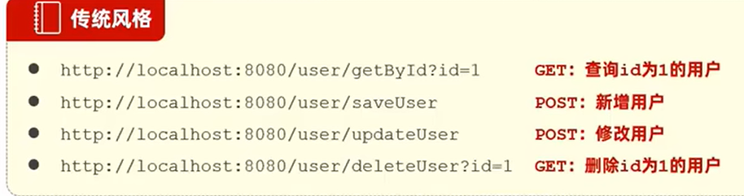

> 比如，查询id为1的用户，访问的是getById，传入参数id=1，但是由于开发人员不同，命名方式也可能不同，比如有些就不叫getById，而叫queryById等等。是完全根据个人喜好定义url的。
>
> 而且我们之前定义的控制器用GET请求可以访问，用POST请求也可以方法，虽然功能实现没有问题，但是项目开发就没有统一的标准了。增加项目后期的维护成本。
>
> Restful风格：

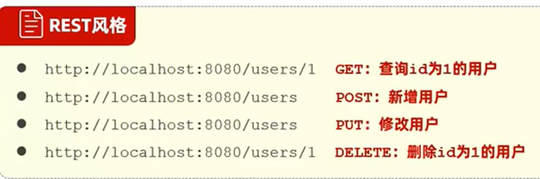

> Restful风格有两个关键要点：
>
> 1、通过URL定位资源，如，访问users/1，我们可以判断出这是访问users中的id=1的user资源，但是具体访问的是查询user还是删除user，这就不能看出来，需要结合第二点来看。
>
> 2、HTTP动词来描述操作，HTTP动词指的是HTTP请求的方式，而操作指的是增删改查，在Restful风格中：
>
> - GET请求：执行查询
> - POST请求：执行新增
> - PUT请求：执行编辑
> - DELETE请求：执行删除
>
> 如果访问users/1发起GET请求，执行查询id=1的user，如果是DELETE请求，执行删除id=1的user。
>
> URL基于Restful风格定义，更简介、规范、优雅。
>
> <font color='yellow'>注意：</font>
>
> - REST是风格，是约定方式，约定不是规定，可以打破。
> - 描述模块的功能通常使用复数，也就是加s的格式来描述，表示此类资源，而非单个资源。如: users、 emps、books...


# 开发流程

