> 上文中，我们成功将文件上传到服务器，并生成临时文件，在请求和响应完成后，临时文件就会被删除，因此我们需要将临时文件保存下来，本文介绍两中方法：
>
> - 本地存储
> - 第三方云存储平台(阿里云存储平台OSS)


# 本地存储

> 本地存储：在服务端，接收到上传上来的文件之后，将文件存储在本地服务器磁盘中。
>
> 比如，当前我们的主机运行着web案例，此时我们的主机就作为服务器，本地存储也将会把文件存储在我们主机的磁盘中。
>
> 我在D盘中创建一个目录：D:\WorkSpace\ApplicationUpload\com.lwn.management\image

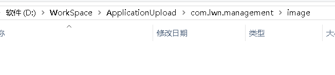

> 用来存放我们上传的图片。那么接下来，我们将把上传的文件保存到该目录下。


## 路径分隔符

> "D:/WorkSpace/ApplicationUpload/com.lwn.management/image/" 使用 / 作为路径分隔符，这是 Windows 和 Unix-like 系统都支持的标准路径分隔符。
>
> "D:\WorkSpace\ApplicationUpload\com.lwn.management\image\" 使用 \ 作为路径分隔符，这是 Windows 系统上常用的路径分隔符。
>
> 在Java字符串中，反斜杠是一个特殊字符，用于转义其他字符，比如 \n 表示换行符。
>
> 这两种写法都是合法的，但根据你的操作系统和个人偏好。
>
> 在Java中，建议使用 / 作为路径分隔符，因为它在所有操作系统上都是有效的。


## transferTo

> 在MultipartFile对象中，为我们提供了一个现成的方法transferTo()，专门用来保存我们上传的文件。
>
> 调用transferTo()，就能将接收到的文件转存到某个磁盘中，transferTo()接收什么样的参数，我们就构造什么样的参数：

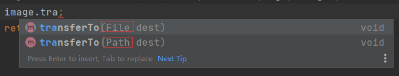

> 我们通过上面创建的路径来构建File对象：

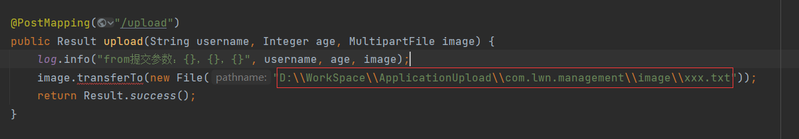

> 这里，我们不能把文件名写死，而是应该上传的文件是什么名子，我们就设置成什么名字，在MultipartFile对象中有封装着文件的名字。


## getOriginalFilename

> 我们可以用getOriginalFilename()来获取文件对象的文件名：

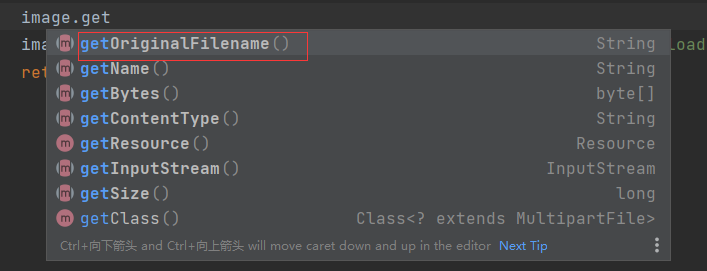

> 注意getName()方法并不是获取文件名，而是获取表单项的名字。getOriginalFilename()表示获取文件的原始文件名，获取文件名后拼接在文文件路径上：

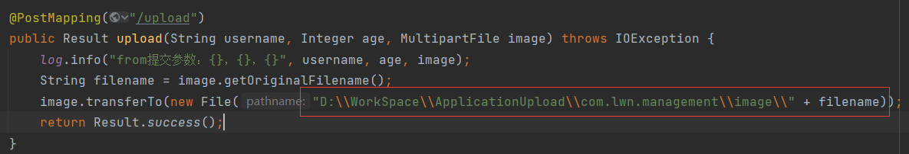

> 我们基本上实现了文件的保存，使用postman来测试，使用postman测试文件上传时，请求方式为POST，请求体内容要在form-data中定义，不要在x-www-form-urlencoded中定义，因为x-www-form-urlencoded是一个常规的表单(即enctype为默认编码)：

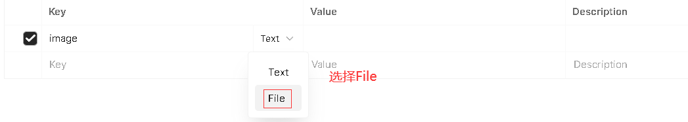

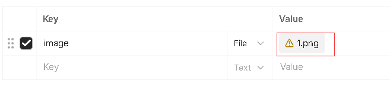

> 文件上传成功，获取到了文件名：

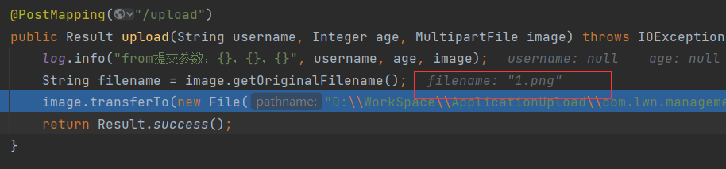

> 此时的目录下还没用文件：

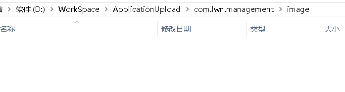

> 放行代码，文件保存成功：

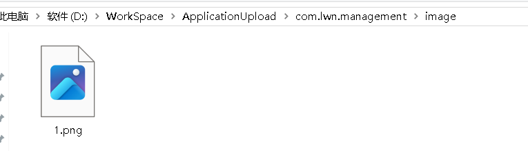

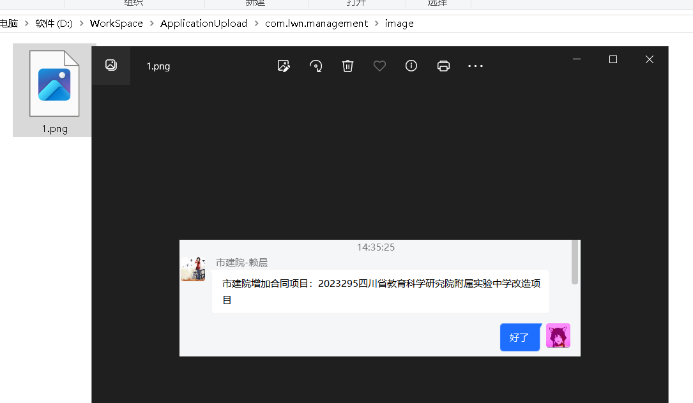


## 文件覆盖问题

> 上面对上传文件本地保存的实现是存在问题的。
>
> 我们使用文件的原始文件名来作为我们保存的文件名是有问题的，当A用户上传了一张1.png的文件后，B用户也上传了一张1.png的文件，就会造成B用户上传的文件把A用户的文件覆盖的情况。
>
> 我们再次上传文件，依旧叫1.png，但是大小是335KB：

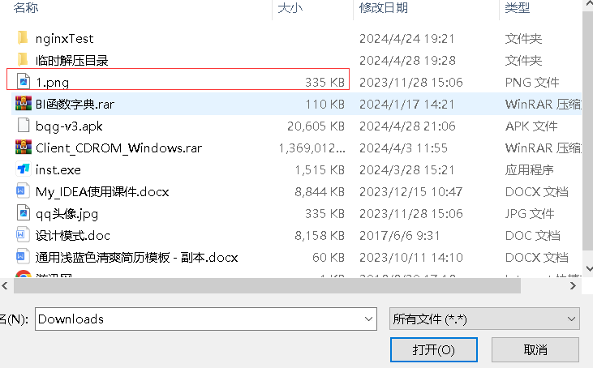

> 此时的文件已经被覆盖了：

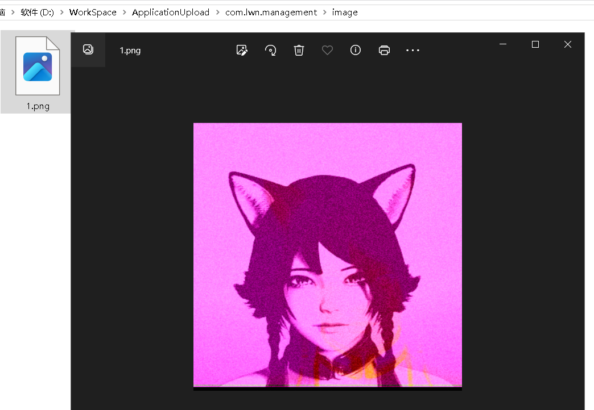

> 根本原因是上传文件使用的是原始文件名，如果不想出现文件覆盖的情况，就要保证每个的文件名唯一。
>
> 我们可以使用UUID实现文件名唯一。UUID详情见"UUID.md"。
>
> UUID是一个36位的字符串，唯一，不会重复。文件是有后缀名的，使用UUID作为文件名时还有拼接文件的后缀名，因此我们需要拿到文件的后缀名。
>
> 而文件的后缀名就在我们获取的原始文件名中，因此我们可以通过字符串截取的方式来获取。
>
> 首先通过lastIndexOf()获取.在文件名中<font color='yellow'>最后一次</font>出现的索引(避免有些文件名是123.1.1.png的情况)，然后从这个索引开始到字符串结尾来截取字符串，就能获取文件后缀名：

```java
String suffix = filename.substring(filename.lastIndexOf("."));
```

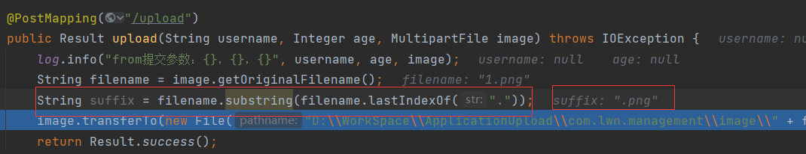

> 拼接文件名。

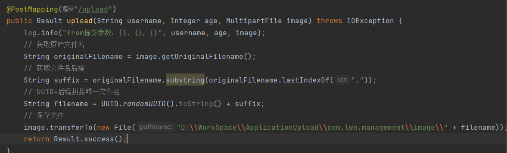

> 再次上传：

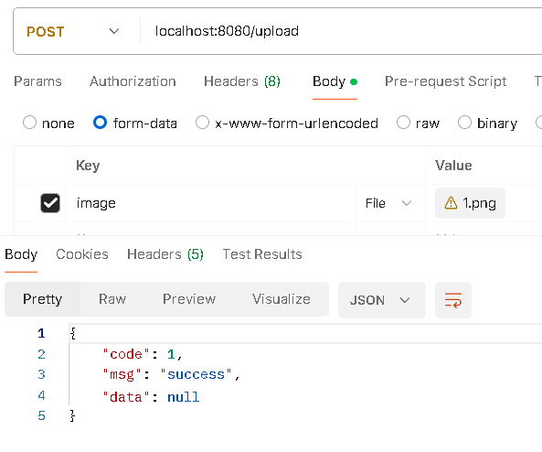

> 此时的文件名就是UUID：

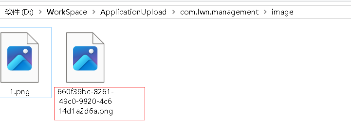


## 文件过大问题

> 上传一个大文件：

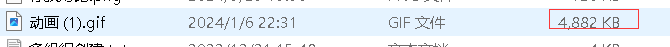

> 程序报错：

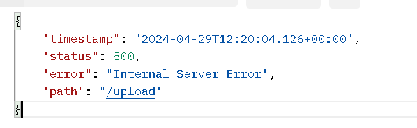

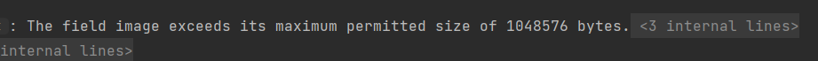

> 意思是文件大小超过了1048576位(1MB)。即springboot中默认上传单文件最大大小是1MB，一但超出就会报错。
>
> 如果我们要上传一个大文件，就需要进行配置。
>
> 在Application.properties中：

```properties
# 配置单个文件上传最大大小
spring.servlet.multipart.max-file-size=10MB
# 配置单个请求文件上传最大大小(一个请求可以携带多个文件)
spring.servlet.multipart.max-request-size=100MB
```

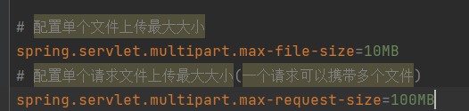

> 再次上传，上传成功：

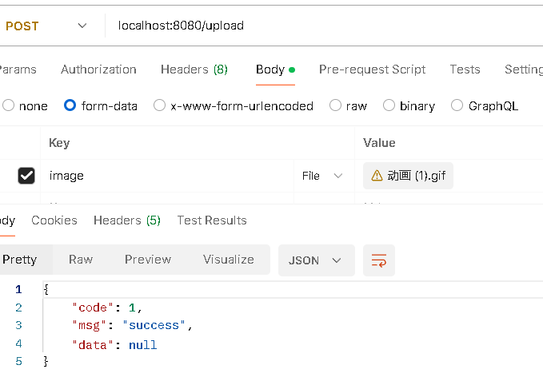

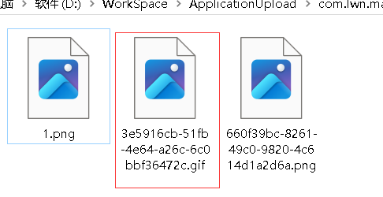


## 系统无法找到路径问题

> 保存文件的目录我们是提前创建好的，当我把目录删除后，上传文件，系统报错了：

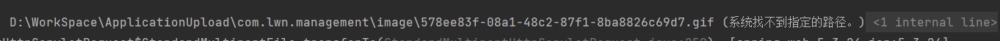

> 系统找不到文件路径，也就是说我们的代码还要判断：当文件目录不存在时创建该目录。
>
> 我们可以使用File对象提供的mkdirs方法，mkdirs会创建指定文件路径的目录，当目录存在返回false，不存在则创建并返回true。
>
> 使用exists方法可以判断目录是否存在，存在返回true，不存在返回false：

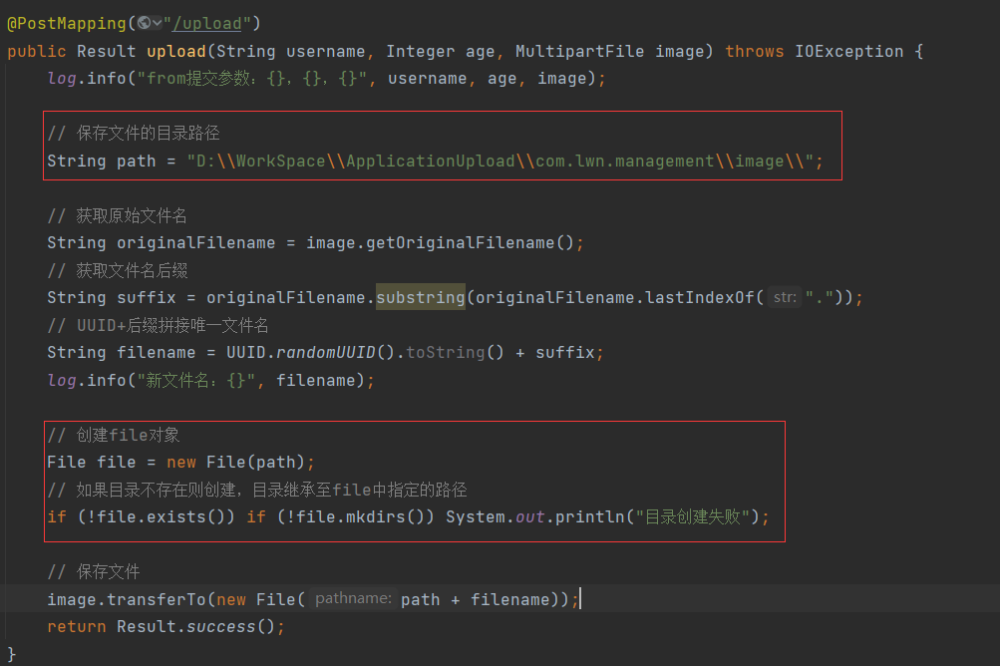

> 再次请求，此时WorkSpace中没用指定目录：

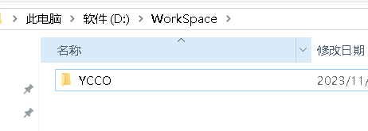

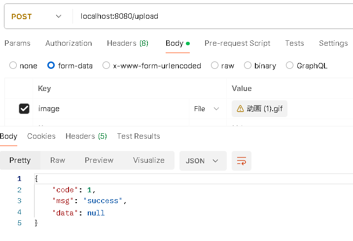

> 请求成功，创建了目录并保存了文件：

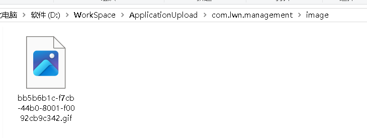

> 我们可以将保存文件的目录地址提取到properties配置文件中，自定义一个key来引用这个路径，如file.upload.path：

```properties
#配置本地存储的目录
file.upload.path=D:/WorkSpace/ApplicationUpload/com.lwn.management/image/
```

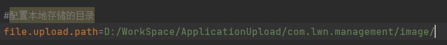

> 然后定义一个私有成员变量，使用${}语法引用配置文件中的属性值。
>
> 方式是：${key}，通过key来引用
>
> 用@Value注解，将配置文件中的属性值注入到 Spring Bean 中的属性中。即通过${}获取到属性值，然后通过@Value将值注入变量中：


> 测试，成功：

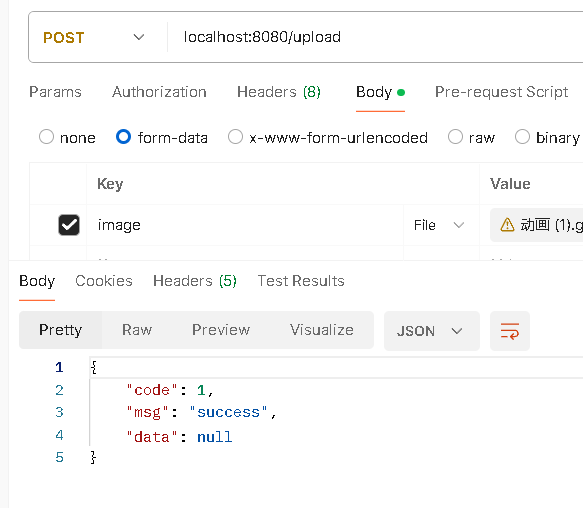


# 本地存储缺点

> 在一般开发中，我们不建议上传到本地：
>
> - 如果文件全部上传到本地地磁盘中，这些文件在前端中是无法访问的。
> - 主机的磁盘容量是有限，将大量的文件上传到本地磁盘中，如果磁盘满了，不方便扩容。
> - 如果本地磁盘坏了，那么我们存储的文件内容就全部丢失了。
>
> 解决方法：
>
> - 企业自己搭建文件存储库，相对于小企业或者个体开发者来说比较繁琐，且维护成本高
> - 使用第三方文件云存储平台，如阿里云OSS、腾讯云、百度云、华为云等等。不过要支付一定费用


# 阿里云存储

> 阿里云是阿里巴巴旗下的云端服务平台，它提供了许多服务。我们要将文件存储在阿里云，就要使用它提供的"对象存储服务"——Object Storage Service(OSS)。
>
> 这里的对象指文件。使用OSS，我们可以通过网络随时存储和调用包括文本、图片、音频和视频等在内的各种文件。


## 准备工作

> 首先我们要开通OSS：
>
> 1、打开https://www.aliyun.com/ ，申请阿里云账号并完成实名认证。


> 2、充值 (可以不用做)
>
> 3、开通OSS，登录阿里云官网。 点击右上角的控制台。

 

> 将鼠标移至产品，找到对象存储OSS，打开OSS产品详情页面。在OSS产品详情页中的单击立即开通。

 

 

 


> 开通服务后，在OSS产品详情页面单击管理控制台直接进入OSS管理控制台界面。您也可以单击位于官网首页右上方菜单栏的控制台，进入阿里云管理控制台首页，然后单击左侧的对象存储OSS菜单进入[OSS管理控制台界面](https://oss.console.aliyun.com/overview)。


## 创建Bucket

> 创建Bucket，Bucket是OSS中存储对象的容器。
>
> 命名为lwn-management ，选择地域为华东1，读写权限为**公共读**，同城冗余选项会收费，依情况而定，个人使用建议本地冗余。

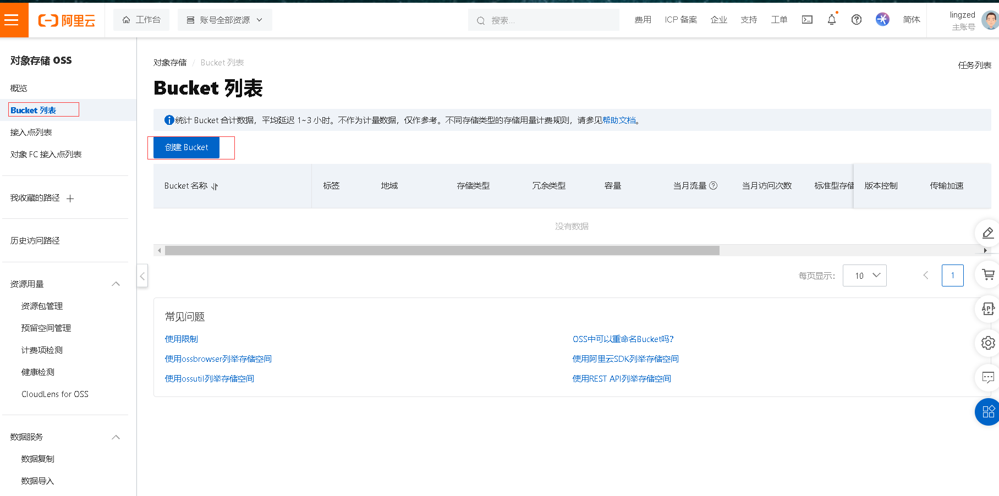

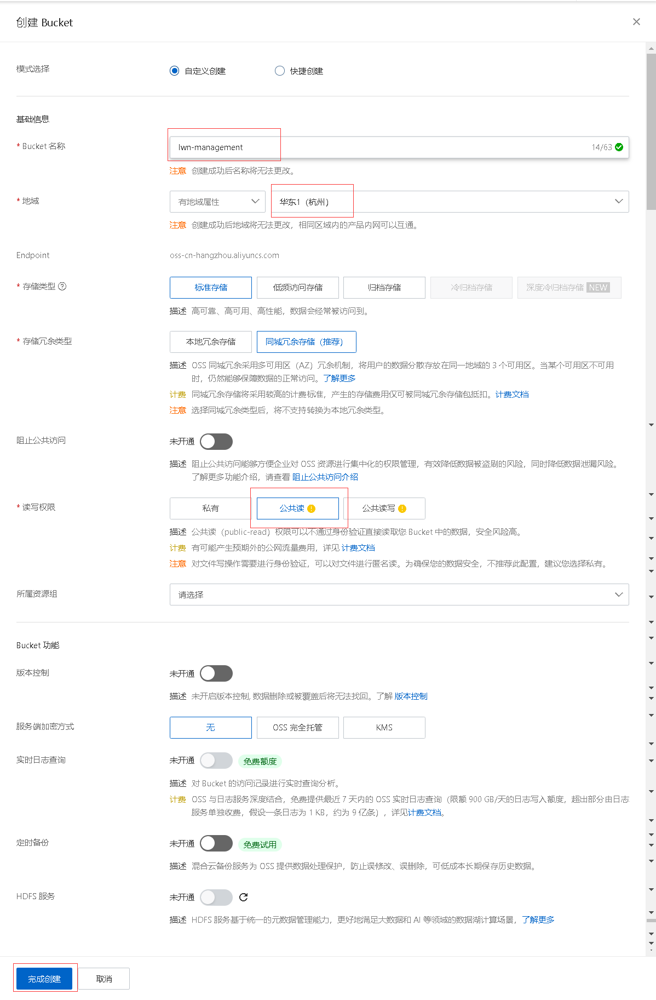  

> 完成：

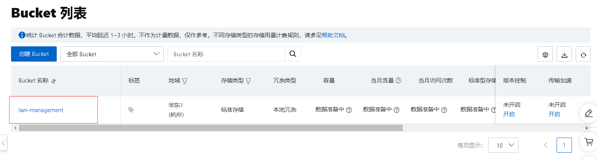


## 获取密钥

> 获取AccessKey，AccessKey是用来证明你是阿里云的合法用户的密钥，这个密钥就是我们的身份凭证。以后我们在案例、项目集成中都需要使用这个密钥。
>
> 选择头像，AccessKey管理：

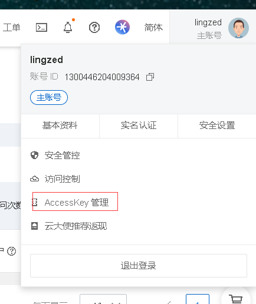

> 选择继续使用：

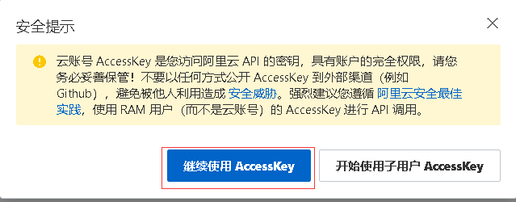

> 创建密钥，手机号验证：

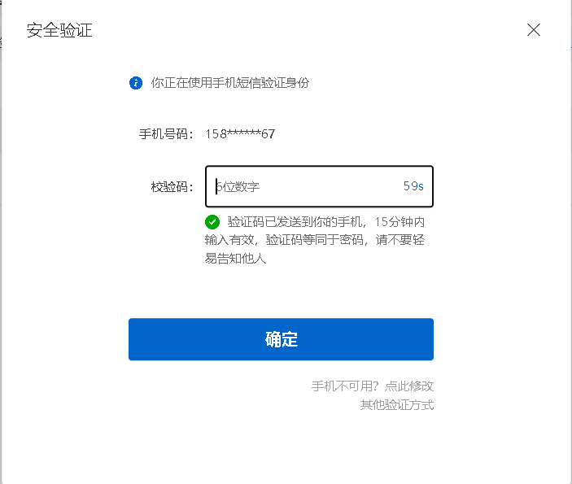

> 创建完成：

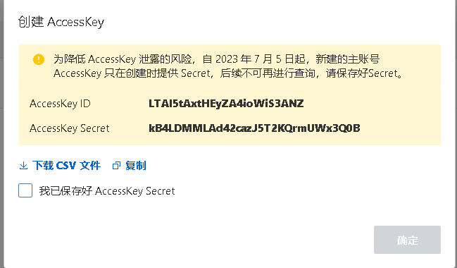

> 密钥分为两个，一个是AccessKey ID，一个是AccessKey  Serret。
>
> <font color='yellow'>注意：至23年11月起，AccessKey  Serret创建以后就无法查看，所以创建的时候务必记住AccessKey  Serret。</font>


## 参照SDK编写入门程序

> SDK: Software Development Kit的缩写，软件开发工具包，包括辅助软件开发的依赖(jar包)、代码示例等，都可以叫做SDK。
>
> 入门程序，需求是将本地文件上传到OSS即可。
>
> 1、打开官方文档，找到OSS实例代码，在OSS主页面左下角选择SDK下载：

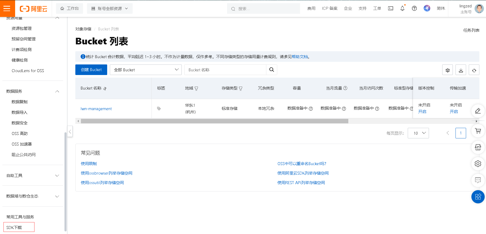

> 选择SDK实例：

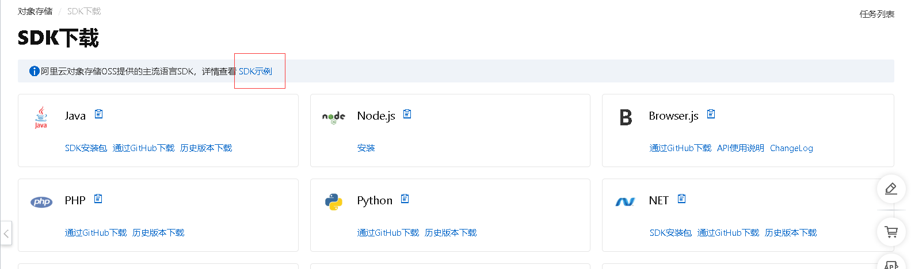

> 帮助文档页面，左下角选择在文档中心打开：

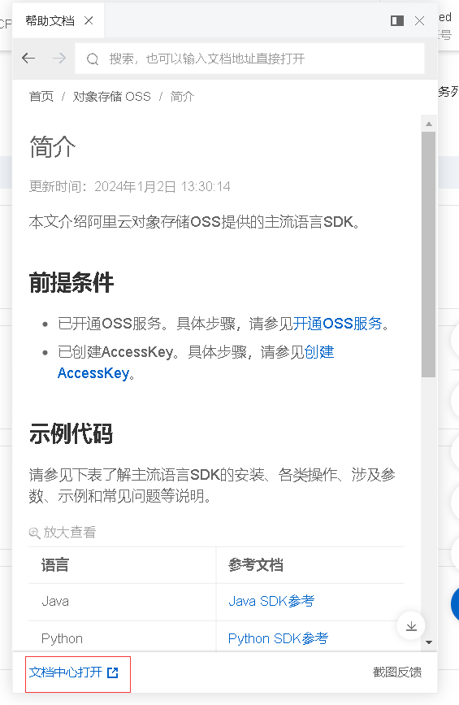

> 找到java，选择安装：

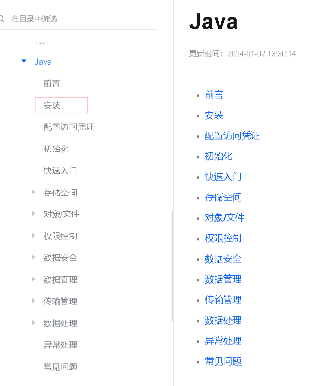

> java版本要求是1.7以上，maven项目引入依赖，且1.9以上的版本还要引入JAXB依赖：

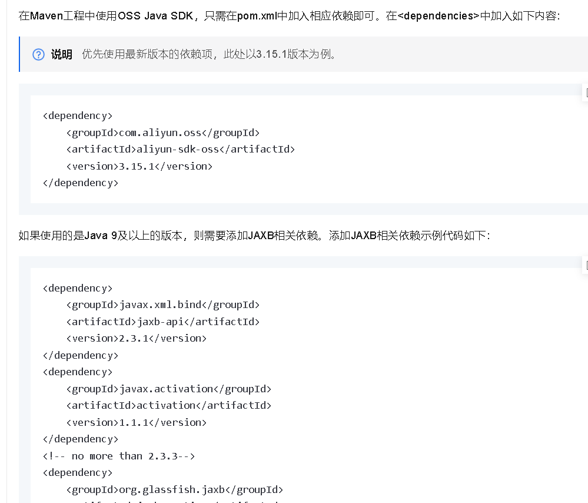

```xml
<!-- oss依赖 -->
<dependency>
    <groupId>com.aliyun.oss</groupId>
    <artifactId>aliyun-sdk-oss</artifactId>
    <version>3.15.1</version>
</dependency>

<!-- JAXB依赖 -->
<dependency>
    <groupId>javax.xml.bind</groupId>
    <artifactId>jaxb-api</artifactId>
    <version>2.3.1</version>
</dependency>
<dependency>
    <groupId>javax.activation</groupId>
    <artifactId>activation</artifactId>
    <version>1.1.1</version>
</dependency>
<!-- no more than 2.3.3-->
<dependency>
    <groupId>org.glassfish.jaxb</groupId>
    <artifactId>jaxb-runtime</artifactId>
    <version>2.3.3</version>
</dependency>
```

> 上传文件代码，在简单上传选项中，选择上传文件流：

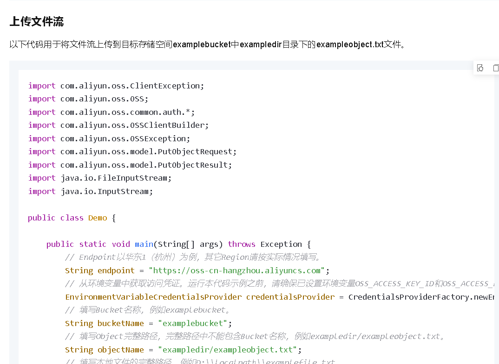

> 代码：

```java
import com.aliyun.oss.ClientException;
import com.aliyun.oss.OSS;
import com.aliyun.oss.common.auth.*;
import com.aliyun.oss.OSSClientBuilder;
import com.aliyun.oss.OSSException;
import com.aliyun.oss.model.PutObjectRequest;
import com.aliyun.oss.model.PutObjectResult;
import java.io.FileInputStream;
import java.io.InputStream;

public class Demo {

    public static void main(String[] args) throws Exception {
        // Endpoint以华东1（杭州）为例，其它Region请按实际情况填写。
        String endpoint = "https://oss-cn-hangzhou.aliyuncs.com";
        // 从环境变量中获取访问凭证。运行本代码示例之前，请确保已设置环境变量OSS_ACCESS_KEY_ID和OSS_ACCESS_KEY_SECRET。
        EnvironmentVariableCredentialsProvider credentialsProvider = CredentialsProviderFactory.newEnvironmentVariableCredentialsProvider();
        // 填写Bucket名称，例如examplebucket。
        String bucketName = "examplebucket";
        // 填写Object完整路径，完整路径中不能包含Bucket名称，例如exampledir/exampleobject.txt。
        String objectName = "exampledir/exampleobject.txt";
        // 填写本地文件的完整路径，例如D:\\localpath\\examplefile.txt。
        // 如果未指定本地路径，则默认从示例程序所属项目对应本地路径中上传文件流。
        String filePath= "D:\\localpath\\examplefile.txt";

        // 创建OSSClient实例。
        OSS ossClient = new OSSClientBuilder().build(endpoint, credentialsProvider);

        try {
            InputStream inputStream = new FileInputStream(filePath);
            // 创建PutObjectRequest对象。
            PutObjectRequest putObjectRequest = new PutObjectRequest(bucketName, objectName, inputStream);
            // 创建PutObject请求。
            PutObjectResult result = ossClient.putObject(putObjectRequest);
        } catch (OSSException oe) {
            System.out.println("Caught an OSSException, which means your request made it to OSS, "
                    + "but was rejected with an error response for some reason.");
            System.out.println("Error Message:" + oe.getErrorMessage());
            System.out.println("Error Code:" + oe.getErrorCode());
            System.out.println("Request ID:" + oe.getRequestId());
            System.out.println("Host ID:" + oe.getHostId());
        } catch (ClientException ce) {
            System.out.println("Caught an ClientException, which means the client encountered "
                    + "a serious internal problem while trying to communicate with OSS, "
                    + "such as not being able to access the network.");
            System.out.println("Error Message:" + ce.getMessage());
        } finally {
            if (ossClient != null) {
                ossClient.shutdown();
            }
        }
    }
} 
```

> - java操作OSS，需要连接OSS，endpoint指定了连接地址
> - credentialsProvider访问凭证，即AccessKey，确保是阿里云用户来上传文件
> - bucketName是容器Bucket的名称，指定文件存储在我们创建的哪个容器里
> - objectName是Bucket中的存储的文件的文件名
>
> 关键的地方是创建了一个OSSClient实例，然后创建了一个input流读取文件，然后将容器Bucket、文件名objectName和input流一起传入OSSClient实例，调用put方法上传。


### 配置AccessKey环境变量

> 上面说过，为了防止密钥泄露，现在要求将密钥信息配置在环境变量中，然后由credentialsProvider来获取变量
>
> AccessKey ID：

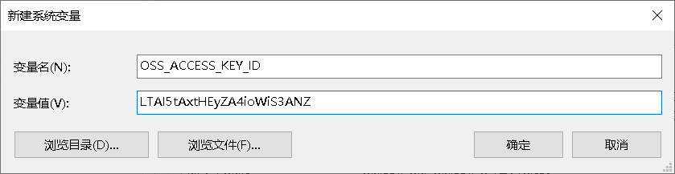

> AccessKey Secret：

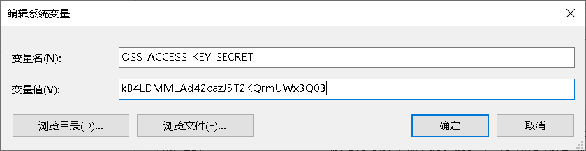

> 环境变量配置好后，重启电脑。


### 上传文件

> 本地文件：


> 现在上传该文件，将配置信息改成自己的，endpoint是我们选择的地域的域名，在这里看：

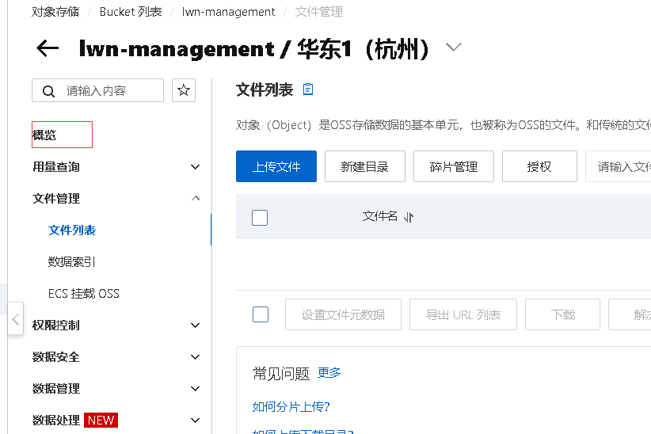

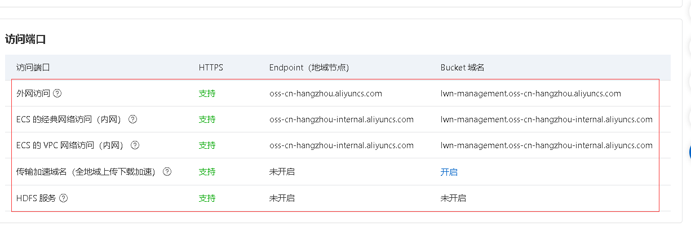

> 其他信息：

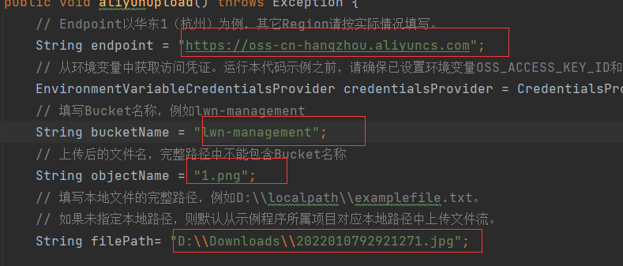

> 运行，上传成功：

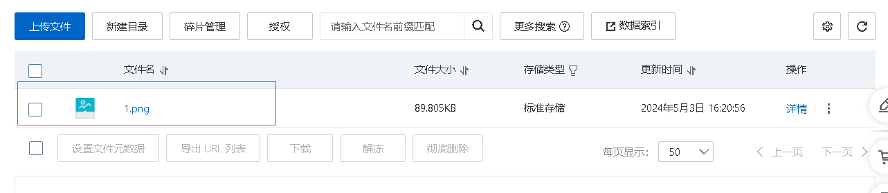

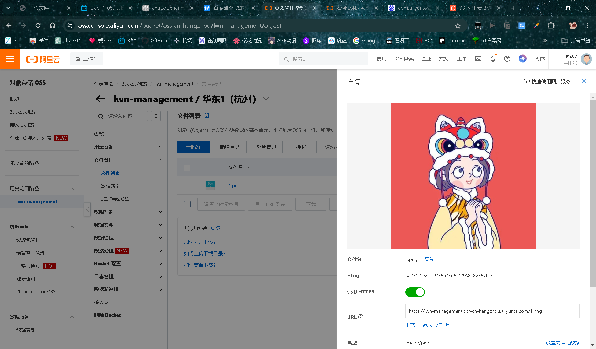

> 文件上传后，OSS会为每个文件分配URL访问地址，我们可以在URL地址栏进行访问，有了这个URL，前端中也能访问该图片了：

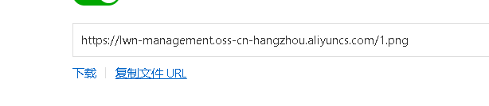

> 地址栏访问时，会自动将该文件下载下来：


### 请求的URL组成

> 这个URL的组成成分：https://lwn-management.oss-cn-hangzhou.aliyuncs.com/1.png
>
> 我们的endpoint = https://oss-cn-hangzhou.aliyuncs.com，Bucket = lwn-management
>
> 即就是在oss-cn-hangzhou的前面加上Bucket名称和一个点，然后在com的后面跟上文件名。


## 集成OSS

> 我们将上传的代码封装成工具类：

```java
package com.lwn.utils;

import com.aliyun.oss.OSS;
import com.aliyun.oss.OSSClientBuilder;
import com.aliyun.oss.common.auth.CredentialsProviderFactory;
import com.aliyun.oss.common.auth.EnvironmentVariableCredentialsProvider;
import com.aliyun.oss.model.PutObjectRequest;
import org.springframework.stereotype.Component;
import org.springframework.web.multipart.MultipartFile;

import java.io.IOException;
import java.io.InputStream;
import java.util.UUID;

/**
 * OSS上传工具类
 */
@Component
public class AliOSSUtils {
    // 存储服务所在地域的域名
    private String endpoint = "https://oss-cn-hangzhou.aliyuncs.com";
    // bucket名称
    private String bucketName = "lwn-management";

    /**
     * 实现上传图片到OSS
     */
    public String upload(MultipartFile file) throws Exception {
        // 从环境变量中获取密钥
        EnvironmentVariableCredentialsProvider credentialsProvider = CredentialsProviderFactory.newEnvironmentVariableCredentialsProvider();
        // 获取上传的文件的输入流
        InputStream inputStream = file.getInputStream();

        // 避免文件覆盖
        String originalFilename = file.getOriginalFilename();
        String suffix = originalFilename.substring(originalFilename.lastIndexOf("."));
        String fileName = UUID.randomUUID() + suffix;

        // 创建OSSClient实例。
        OSS ossClient = new OSSClientBuilder().build(endpoint, credentialsProvider);
        // 创建PutObjectRequest对象。
        PutObjectRequest putObjectRequest = new PutObjectRequest(bucketName, fileName, inputStream);
        // put方法上传
        ossClient.putObject(putObjectRequest);

        //文件访问路径
        String url = endpoint.split("//")[0] + "//" + bucketName + "." + endpoint.split("//")[1] + "/" + fileName;
        // 关闭ossClient
        ossClient.shutdown();
        return url;// 把上传到oss的路径返回
    }
}
```

> 然后使用工具类完成文件上传至OSS：

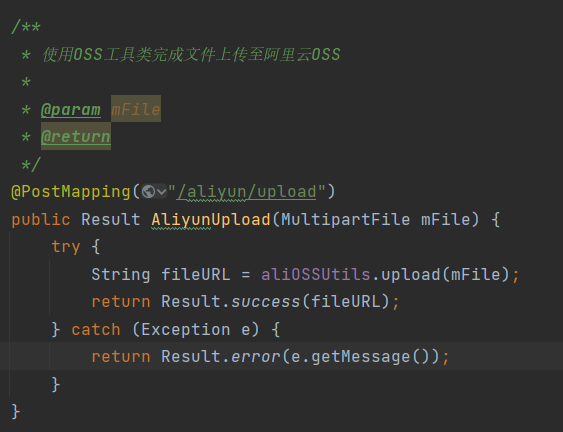

> 测试，成功：

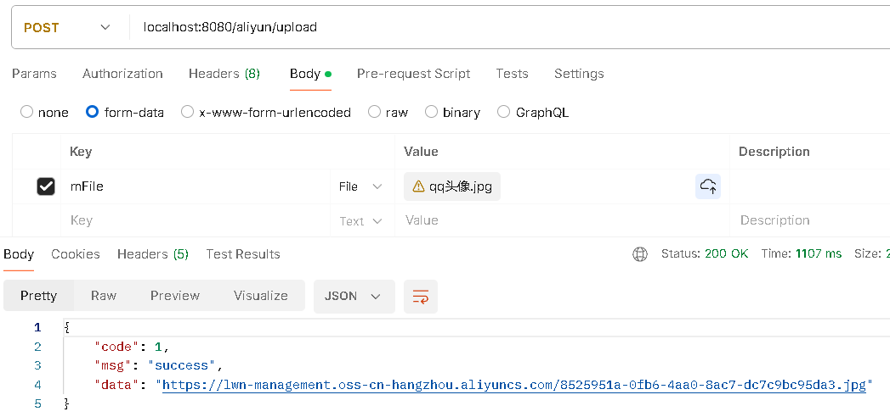

> OSS：

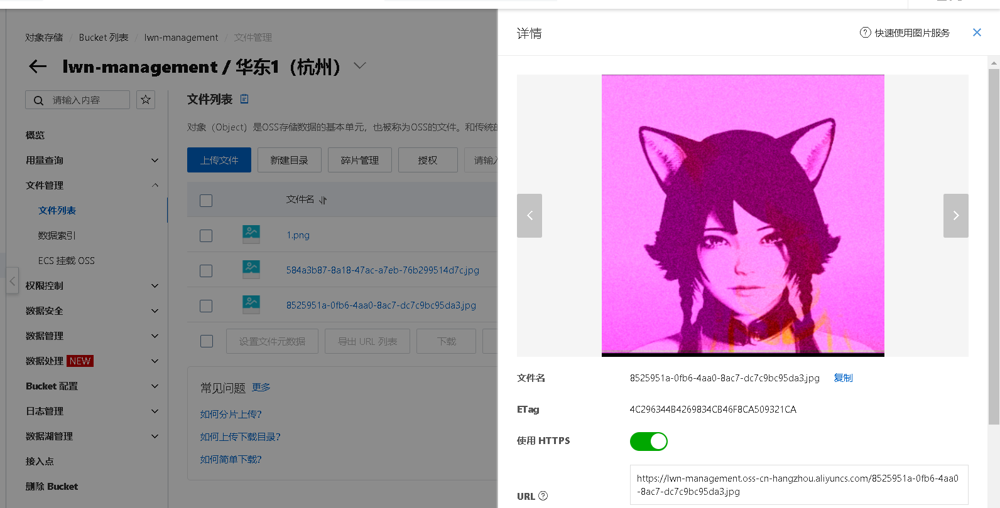
