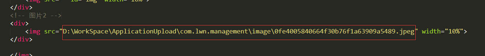
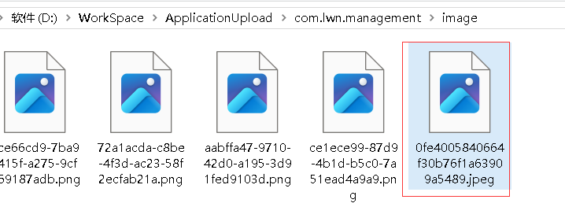
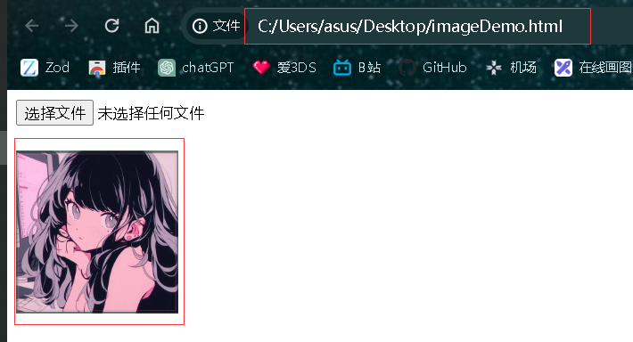
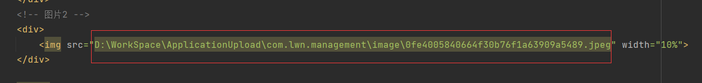
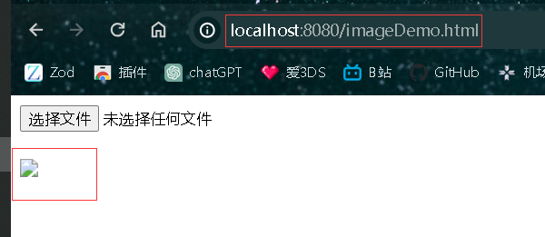
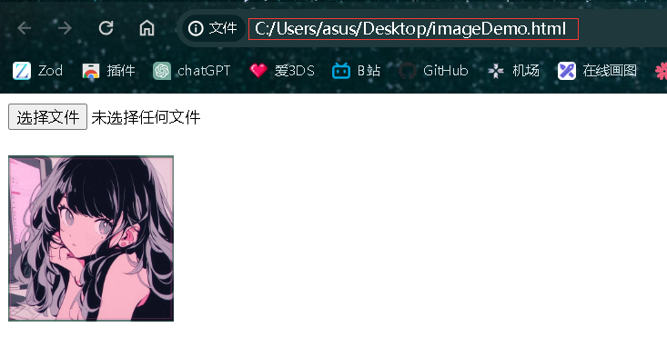
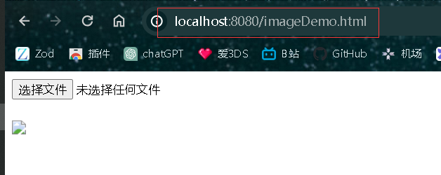

# 浏览器的同源策略

> 使用单HTML文件访问保存上传文件的目录中上传的文件资源：

> 页面：

> 使用运行在HTTP服务器上的同HTML文件访问同样的图片：

> 页面：

> 文件无法访问。
>
> 我们使用单文件HTML，其实运行的是本地的HTML文件，URL地址栏中显示的也是本地磁盘上的文件：
>
> file:///C:/Users/asus/Desktop/imageDemo.html

> 而在HTTP服务器上运行的HTML文件，URL地址栏显示的是HTTP服务器的地址：
>
> http://localhost:8080/imageDemo.html

> 使用file:///表示本地协议，而http://则表示HTTP协议。因为被访问的文件资源：
>
> D:\WorkSpace\ApplicationUpload\com.lwn.management\image\0fe4005840664f30b76f1a63909a5489.jpeg
>
> 是一个本地的文件资源，也就是说使用的也是file:///协议，与本地HTML是同一个协议，即同源，那么本地HTML文件就能访问该资源，但是服务器上的HTML文件是HTTP协议，与file:///协议不同，即不同源，因此服务器上的HTML文件就无法访问该资源。
>
> 这就是浏览器的同源策略：
>
> - **协议相同**：网页中所有资源（如 JavaScript、CSS、图片等）的协议必须与网页本身的协议相同。例如，如果网页是通过 HTTPS 协议加载的，则所有的资源也必须使用 HTTPS 协议加载。
> - **域名相同**：网页中所有资源的域名（或者 IP 地址）必须与网页本身的域名相同。例如，如果网页是从 [www.example.com](http://www.example.com/) 加载的，则所有的资源也必须从相同的域名加载，比如 www.example.com/image.jpg。
> - **端口相同**：网页中所有资源的端口号必须与网页本身的端口号相同。例如，如果网页是从 www.example.com:8080 加载的，则所有的资源也必须从相同的端口号加载。

