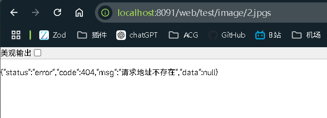

# 1 本地存储目录设置

> 上文中，我们上传文件时，是将文件保存在本地，但是这会造成前端无法访问的问题，因为我们的项目要么前后端分离，要么是前后端不分离，但是不管分不分离，前端项目都是跑在服务器上的，并不是在本地运行的，所以使用的协议必然不是本地协议。所以我们的保存路径不应该设置为本地路径，而是将保存路径设置为服务器路径，或者使用第三方存储平台。保证与前端服务器使用的协议相同。
>
> 在springboot中，我们推荐将存储路径定义在static目录下。
>
> 注意，这里的static目录不是resources/static，而是target/classes/static，即编译项目后的目录：


> 为什么要定义在编译后的目录下？因为java运行的不是java文件而是java文件编译后的字节码文件即class文件。maven项目在运行时会先编译生成target包，最终运行的就是target包下面的程序，因此要将文件存放目录定义在target/classes/static。
>
> 而且，即便我们在测试环境中将存放目录定义在resources/static，在编译时resources/static下的文件目录也会被复制到target/classes/static下：

.gif)


# 2 获取类路径下资源目录的路径

```java
// 获取ResourceUtils的类加载器
ClassLoader classLoader = ResourceUtils.class.getClassLoader();
// 获取类路径下static的URL对象
URL targetStatic = classLoader.getResource("static");
// 通过URL对象获取对应的路径
String path = targetStatic.getPath();
```

> 使用ResourceUtils获取target/classes/static的路径：


# 3 静态资源映射

文件保存在target/classes下的资源目录中，因此我们可以直接通过HTTP请求访问服务器上的资源，比如static/image下的图片：

其路径：

```bash
target/classes/static/image/0fe4005840664f30b76f1a63909a5489.jpeg
```

访问：

```bash
http://localhost:8080/static/image/0fe4005840664f30b76f1a63909a5489.jpeg
```

但是报错404：


这是因为，在项目编译后，target/classes可以存在四个资源目录，按照访问优先级从上到下排列：
1、`/META-INF/resources`
2、`/resources`
3、`/static`
4、`/public`

static是其中一个，且是编译后默认生成的目录，这些资源目录的名称是约定好的，不可改变。

这是一个请求地址：

```
localhost:8080/aaa/bbb
```

其中这部分叫做主机地址，也就是服务器的地址：

```bash
http://localhost:8080
# 或
localhost:8080
```

而主机地址之后的地址才是访问具体资源的地址，我们一般叫做**路径**或**资源路径**，如下：

```bash
/aaa/bbb
```

第一个分隔符也被称为根路径 `/`。

所谓的静态资源映射，就是将根路径 `/`映射为资源目录，就像这样：


即我们实际访问的是：

```
localhost:8080/static/aaa/bbb
```

static就是加上的资源目录。访问资源时，会到这4个资源目录中按照访问优先级逐一查找(通常项目只会有一个，若四个都在的话)。找到就返回找不到就报404。

这也就是解释了为什么访问：

```bash
static/image/0fe4005840664f30b76f1a63909a5489.jpeg
```

时会显示404。因为我们定义的URL中image前多了一个static，但是因为有资源映射动作的存在，最终映射出来的路径是：

```bash
static/static/image/0fe4005840664f30b76f1a63909a5489.jpeg
```

所以，程序会到static下先查找static目录，而不是image目录。但是static下面又没有static目录，所以找不到：


直接从image开始访问，就能找到目录：

```bash
http://localhost:8080/image/0fe4005840664f30b76f1a63909a5489.jpeg
```


> 通常，编译后target/classes下的静态资源目录只有一个，一般是static，只有一个时，查找的时候也就只会去查找这个目录。
>
> 当存在多个静态资源目录，且要请求的资源两个目录下都有的时候，如resources和static下都有image/0fe4005840664f30b76f1a63909a5489.jpeg时（同名但不一定内容一样），会按照顺序来返回，resources在static之前，因此返回的是resources下的图片。
> 上面说到的顺序是springboot默认的，我们是可以进行配置更改顺序的。

-1714652750060-3.gif)


> 因为resources/static会被映射到根路径后面，即：
>
> http://localhost:8080/resources/static/image
>
> 会变成
>
> http://localhost:8080/image
>
> 现在再次访问，访问成功：


> 这里介绍一下如何获取springboot项目中


# 4 请求前缀与静态资源映射

如果配置了请求前缀，那么所有资源路径都需要以前缀开头：


这种情况下的静态资源映射是`/web/static/aaa/bbb`？还是`/static/web/aaa/bbb`?

其实都不是，真实的映射是这样的，和之前一样，没有变化：

```bash
/static/aaa/bbb
```

我们只需要知道请求前缀实际上是在改变根路径`/`，也就是将`/`改成指定的值：


现在根路径变成了`/web`，而静态资源映射又是去映射根路径，所以又将当前的根路径`/web`映射为了`/static`，最终变成`/static/aaa/bbb`：


# 5 访问服务器文件

若文件在静态资源目录下，可以直接访问，但是文件如果不在静态资源目录下，甚至不在项目目录下，该如何访问？

一般就是到文件所在目录去读取该文件，然后写回给前端。文件目录可能存在大量的文件，如果使用遍历，那么效率不高，可以使用`Resource`，只要知道文件路径以及文件名就能快速定位文件，比遍历查找的效率要高。`Resource`封装文件内部提供了字节读，可以读取文件内容。

文件保存的路径通常配置在`yml`中，一般很少改动，直接读取即可。文件名通常由前端发送过来。实现代码如下：

```java
@GetMapping("/image/{fileName}")
public void test4(HttpServletResponse response, @PathVariable String fileName) throws IOException {
    response.setContentType("image/jpeg");
    String projectFolder = webConfig.getProjectFolder();
    Path path = Paths.get(projectFolder + File.separator + "image").resolve(fileName).normalize();
    org.springframework.core.io.Resource resource = new UrlResource(path.toUri());
    if (!resource.exists() || !resource.isReadable()) {
        response.setStatus(HttpServletResponse.SC_NOT_FOUND); // 返回404状态码
        response.getWriter().write("Image not found or not readable."); // 返回错误信息
        return;
    }
    try (InputStream is = resource.getInputStream();
         OutputStream os = response.getOutputStream()) {
        byte[] bytes = new byte[1024];
        int len;
        while ((len = is.read(bytes)) != -1) {
            os.write(bytes, 0, len);
        }
    }
}
```

效果：


下面是细节：

`webConfig`是配置类，读取`yml`或者`properties`中的字段，项目目录配置在这里面：


`Resource`用法：

1. 构建`Path`对象。
2. 创建`UrlResource`对象，将`Path`对象传入生成`Resource`。

`Path`用`Paths`构建。`Paths`中`get()`中传入的是文件所在地址，`resolve()`中传入的是文件名。`normalize()`用于清理路径字符串中多余的部分，形成规范化的路径。

`Path`描述的是文件路径，在操作系统中，每个文件路径是唯一的，通过路径可定位这个文件，这就是`Resource`定义资源高效的原因。也正因如此，创建`Resource`需要用到`Path`。

`Resource`封装了文件，底层提供了字节读，调用`getInputStream()`就能获取。

`exists()`和`isReadable`判断文件是否存在以及是否可读，如果文件不存在或不可读，直接进行读操作会报错。

当文件不存在或不可读时，我这里是写出字符，以及响应404。假如我们抛出404异常：

```java
if (!resource.exists() || !resource.isReadable()) {
	throw new BusinessException(ResponseCodeEnum.CODE_404);
}
```

不是不可以，只是异常会被全局异常拦截，然后响应一个错误JSON：



如果直接写回一个字符串，浏览器按照图片格式解析失败，会显示图片错误格式：


两者用哪个，应该具体情况具体分析，假如是封面，头像，之类的遇到文件不存在或不可读，我觉得应该用第二种。

如果返回的是头像或者是一些不会经常修改的图片，那么可以加上一个缓存，第一次请求时，服务器写出图片，第二次直接走缓存，降低服务器的压力：

```java
response.setHeader("Cache-Control", "public, max-age=3600");	// 缓存过期时间1h
```

