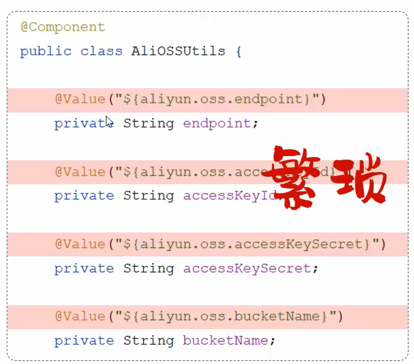
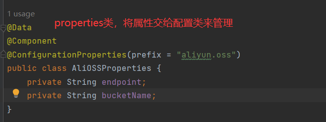
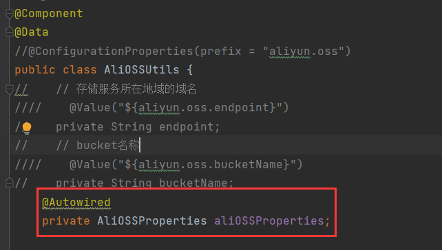
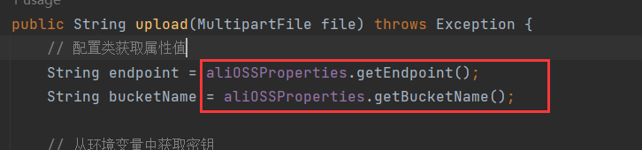
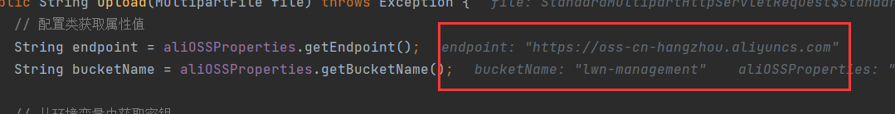
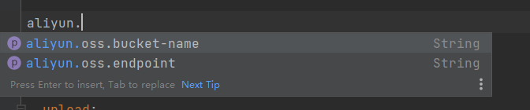

> 上文中，我们将OSS工具类中的配置信息提取到了springboot的配置文件yml中，然后在类中通过@Value来为属性注入配置的值，我们也推荐这种方式，但是这种方式存在一个问题，就是当一个类的属性非常多的时候，我们需要为每个属性都定义@Value，这导致我们的代码非常臃肿，而且编写也很繁琐。




# @ConfigurationProperties

> 那么在springboot中就为我们提供了一个注解@ConfigurationProperties，它能帮助我们简化@Value的注入，在类上声明@ConfigurationProperties，就能将配置文件中的值自动注入到类的属性中，使用@ConfigurationProperties需要满足：
>
> - 配置文件中的最后一层级key值与类的属性名一致
> - 需要类为属性提供getter和setter，加@Data即可
> - 该类需要交给IOC容器管理，成为Bean，加@Component即可
> - 我们只是保证了最后一层级的key与类的属性一致，还要保证key的前缀一致，这由@ConfigurationProperties来完成
> - @ConfigurationProperties的prefix属性值与key的前缀保持一致
>
> 以OSS工具类为例：


## propertirs类

> 既然我们可以通过以上方法来完成属性的注入，我们不妨将这些属性提取出来专门创建一个properties类来管理这些属性，然后注入该配置类，用配置类的get方法来获取属性值：



> 注入该类：



> 调用getter获取属性值：



> 断点测试，值注入成功：




## 关闭警告

> 我们添加@ConfigurationProperties，idea中出现了警告：


> 这个警告不会影响程序正常运行。它提示我们需要引入依赖：

```xml
<dependency>
    <groupId>org.springframework.boot</groupId>
    <artifactId>spring-boot-configuration-processor</artifactId>
</dependency>
```

> 引入这个依赖后，这时就没有警告了，反而提示我们重启项目：


> 项目重启后，在配置文件中就能联想出aliyun相关的配置项，这个依赖的作用就是被@ConfigurationProperties标识的Bean，在配置文件就会自动提示与该对象的属性名相对应的配置项的名字。



> 该依赖不影响程序的运行，是一个可选依赖


# 与@Value的区别

> - 相同点
>   - 都是用来注入外部配置的属性
> - 不同点
>   - @Value只能一个一个注入外部属性
>   - @ConfigurationProperties能批量将外部属性注入到Bean对象中
>
> 在项目中如果使用的配置非常简单，且使用次数很少可以只用@Value，但是当属性配置很多，且多个第三方类需要属性配置，又要做到属性配置复用时，建议使用@ConfigurationProperties结合properties类注入的方式。