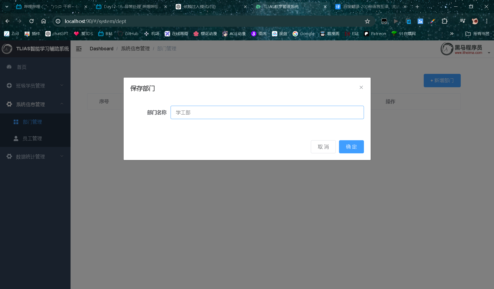
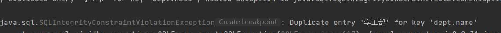
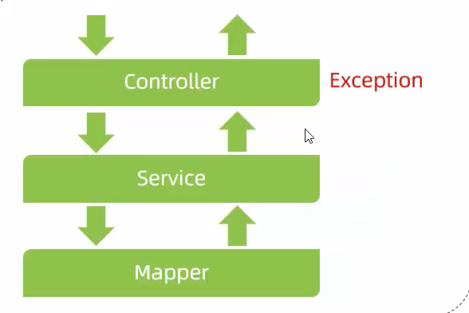
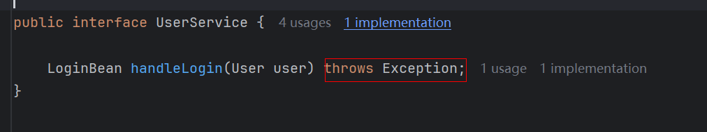

# 异常处理

> 我们添加部门，比如添加学工部：

> 页面没用任何变化，但是在后台已经报错了：

> 错误原因提示name字段添加了重复的值，是因为部门表的name字段有唯一约束，所以name字段不能重复，所以才报错。
>
> 出现异常后，后端给前端响应的数据：

> 是一个JSON格式的数据，但是与接口文档中要求的规范格式不一样，所以前端无法无法解析这个格式的JSON也就无法在页面做出响应。
>
> 在我们项目运行中，不可避免会出现很多异常。而这些异常与开发规范定义的统一响应结果的格式是不一样的。所以前端接收到这个数据，是无法对这样的数据进行解析的。
>
> 目前的项目中，出现异常后，我们并没有对异常进行任何的处理，controller调用servic，service调用dao，当任意一层出现异常，谁调用它，它就会抛给谁。比如dao出现异常就抛给service，service再抛给controller。

> 而controller中我们未对该异常进行处理，最终就会抛给框架，框架给我返回这样的JSON数据：

# 如何处理

> 方法1：最上层controller中进行try...catch处理。但是controller的方法有很多，每个方法都要进行try...catch处理，代码就会变得很臃肿，操作也很繁琐。
>
> 方法2：定义一个全局异常处理器，捕获项目中所有的异常。我们更推荐这种。

# 全局异常处理器

> 出现异常会往上抛出，最终会抛给全局异常处理器，处理器进行处理给前端响应规范的格式数据。
>
> 定义全局异常处理器类，在类上声明@RestControllerAdvice。
>
> @RestControllerAdvice=@ControllerAdvice+@ResponseBody
>
> 所以这个注解可以将返回的对象封装成Json。
>
> 然后定义方法，在方法上声明注解@ExceptionHandler(Exception.class)，表示这个方法接收所有类型的异常：

> 这是一个简单的处理，我们只是打印出了堆栈信息。

> 测试，出现异常，前端响应：

如果希望由全局异常处理器来捕获异常并处理，那么service接口要抛出异常，其实现类要抛出异常，然后在代码中手动抛出异常，controller层也要往上抛出异常：

接口：

实现类：

控制器：

