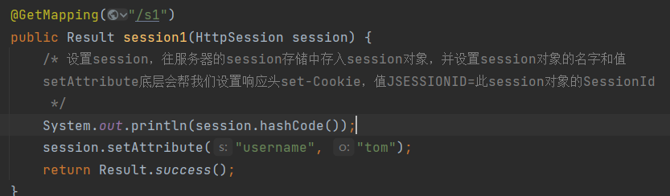
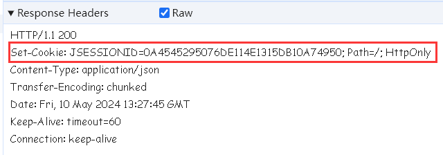
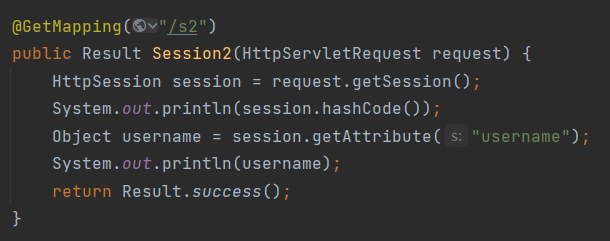
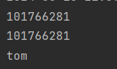

# Session原理

> Session是服务器端会话跟踪技术，是存储在服务器端的。而Session的底层就是基于Cookie来实现的。
>
> 它的原理是这样：
>
> 当浏览器第一次请求服务器时，会在服务器内部创建一个Session对象，由于是第一次请求，所以此时的Session是不存在的，所以在服务器内部会创建一个Session对象。
>
> 每一个Session对象都有一个id，叫做SessionId。接下来服务器响应数据时，会将这个SessionId通过Cookie来响应给浏览器。其实就是在响应头中增加了一个set-Cookie，其值是固定格式JSESSIONID=SessionId，比如创建的SessionId为1，那么响应头为set-Cookie:JSESSIONID=1。
>
> 然后浏览器拿到Cookie将JSESSIONID=1保存在浏览器本地，之后的请求中都会携带这个Cookie，在服务器中接收到请求中的Cookie值即JSESSIONID=1，从而得到JSESSIONID的值，然后到服务器保存Session的地方去查找有没有与之匹配的id，如果能找到说明用户之前登录过，否则用户没有登录。

# Session格式

> Session的格式是SessionId关联一个Session对象的形式：

> 我们可以通过SeesinId来获取对应的Session对象，而要获取Session对象中的值，就需要通过Session对象名字name值来获取。

# 设置Session

> 设置Session很简单，在控制器的方法形参中声明HttpSession类型的参数，通过HttpSession的setAttribute方法就能往Session中存入值。setAttribute方法接收两个参数，一个是Session对象的名字，另一个是Session对象的值。而且setAttribute底层帮我们设置了set-Cookie的响应头，也就是说我们不需要在手敲一遍设置响应头的代码。

> 响应头：

# 获取Session

> 从请求中获取Session可以通过HttpServletRequest类来获取，它的getSession方法能获取一个HttpSession对象，然后调用getAttribute方法通过Session对象的名字就能获取对应的值。

> 请求头：

> 可以看到，请求头中的JSESSIONID的值与响应头中的JSESSIONID的值是一致的，在控制台我们也获取了Session对象的值：

> 而且通过hashCode判断，两次请求的HttpSession是同一个对象：

> 这说明在这次会话中两次请求的Session是同一个。

# Seesion优缺点

> 优点：
>
> - Session存储在服务器端，一般的用户很难获取，安全性比Cookie高。
>
> 缺点：
>
> - Session是基于Cookie的，也就是说在Seesion继承了Cookie的所有缺点。
> - Session存储在服务器端，而现在的大型项目一般是部署在多台服务器上，既然是多台服务器，那么每台服务器上存储的Seesion就必须要求同步。但是这很难办到，因为多台服务器的前置服务器一般是用来对请求进行负载均衡的，它会将请求分均匀的发到合适的服务器上，这时存在这种情况，当分发请求给A服务器时，A生成一个Session其id为1，这时浏览器存储这个1，然后再次请求，这时请求如果被分发到B服务器，那么就需要根据id为1来找Session，但是B上面显然没有id=1的Session，这时就出现问题了，同一个浏览器发起两次请求结果获取的Session不是同一个。