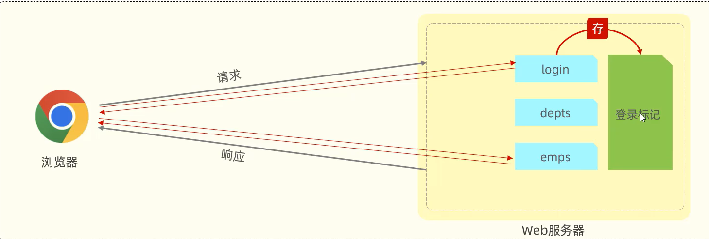
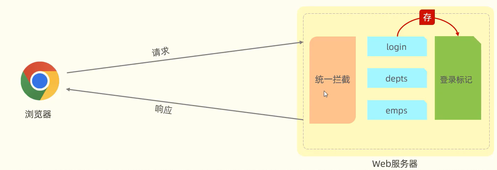

# 存在的BUG

> 在上文中，我们已经完成了基础登录的接口，但是这存在一个BUG，首先我们在登录成功后复制URL地址，然后退出，再次访问该地址，依然能访问资源：

-1715172003079-1.gif)

> 这显然是不合理的，我已经退出，再次访问资源时应该访问失败才对，而且在未登录的情况下应该重定向到登录页面，这里以机场为例：

-1715172629038-3.gif)

# 未登录直接访问的问题

> 问题就是在未登录的情况下，我依然可以来访问资源。
>
> 原因就是我们开发的接口时，没有对请求做任何的判断，不管是员工管理还是部门管理，我们的代码只是对员工和部门的信息进行crud操作，并没有对用户是否登录进行判断，所以无论用户是否登录，都能访问相应的资源。所以我们目前开发的登录功能只是徒有其表，因此我们需要完成一步非常重要的步骤即，登录校验。

# 登录校验

> 登录校验指的是，我们在服务器端接收到浏览器的请求后，我们要对这个请求进行校验，要校验一下用户是否登录，如果用户登录，则执行对应操作，否则判定为未登录，直接给前端响应一个错误信息并重定向到登录页面。
>
> HTTP协议是无状态的，浏览器发送请求协议给服务器，这次的请求与下次的请求是相互独立的，下一次请求无法携带上一次请求的数据，这次的请求过来，而这次的请求恰好是上传一次的请求，但是服务器只是认为这次的请求是新请求，它无法识别这次的请求是上一次的请求。
>
> 当我们登录后，再次访问其他资源，由于HTTP无状态，这次的请求无法携带用户的登录状态，浏览器就无法识别用户是否登录。
>
> 我们解决这个问题的思路是，用户登录成功后，在服务器存储登录成功的标记：

> 然后，我们就可以在每一个方法之前做一个条件判断，判断员工是否登录，如果登录执行相应操作，否则返回错误信息重定向到登录页面：

> 这只是查询的功能，还有删除、修改、添加的功能需要判断，而这仅仅是员工功能，还有部门功能，上传文件的功能等等，都需要我们进行相同的逻辑处理，这会导致我们的代码非常臃肿。为了简化这种操作，我们可以使用一种技术：统一拦截。

> 通过统一拦截，我们可以拦截请求，并在统一拦截中进行用户是否登录的校验，如何校验？可以通过登录标记来校验：

> 校验通过，说明这个请求是登录成功的请求，就放行该请求，否则我们给前端响应错误信息，前端自动跳转到登录页面：

> 所以，要完成登录校验就要涉及两个部分：登录标记和统一拦截
>
> 登录标记，这涉及到会话技术

> 统一拦截，一种是传统方法，servlet提供的过滤器Filter，另一种是springboot提供的拦截器Interceptor

