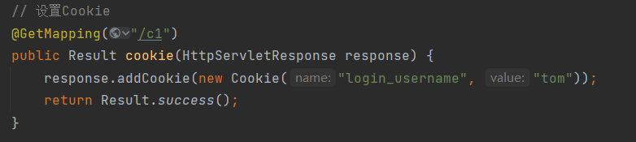
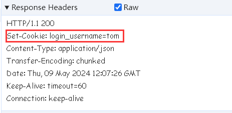
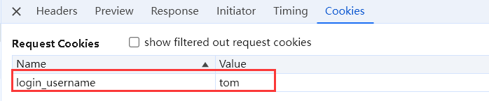
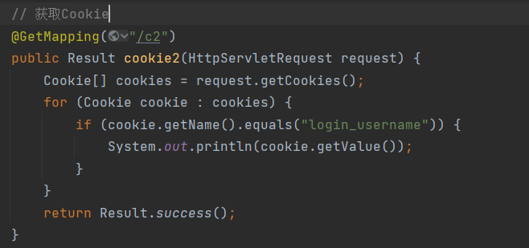
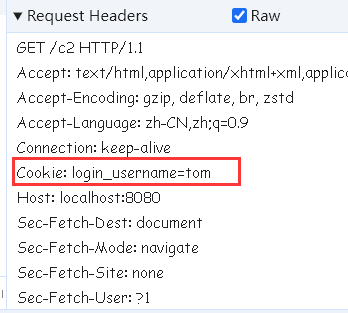
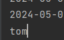
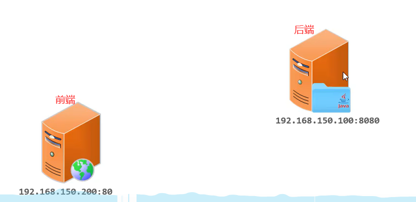
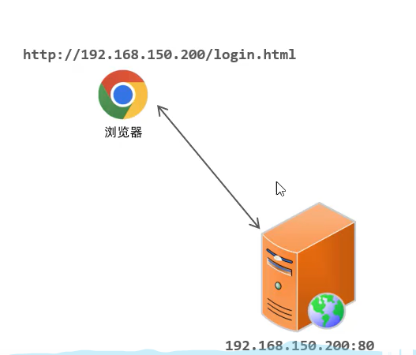
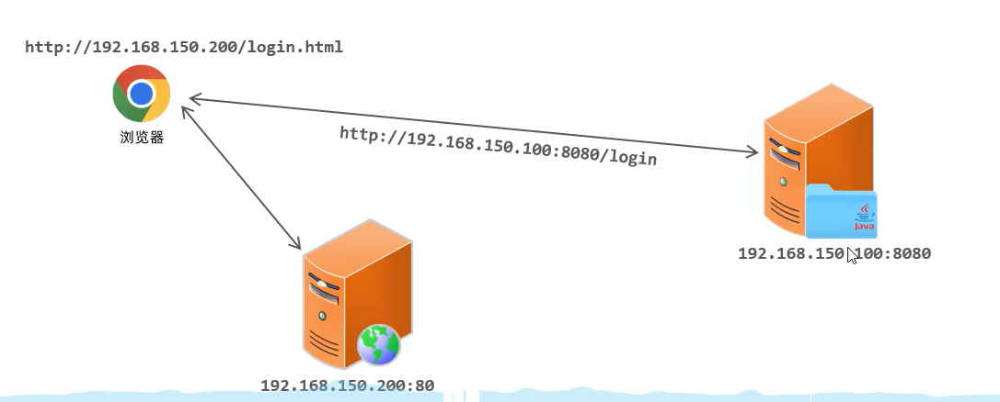

# Cookie原理

> Cookie是存储在浏览器端的，我们可以在第一次请求服务器时设置一个Cookie。
>
> 比如，请求一个登录接口，登录成功后，就可以设置一个Cookie，然后将用户的登录信息如用户名、id等存储在Cookie中，然后响应数据时服务器自动响应Cookie给浏览器，浏览器接收Cookie并自动保存。
>
> 而之后的每次请求中，浏览器都会自动携带Cookie到服务器，而服务器就能获取到Cookie值，进而判断Cookie值是否存在，如何不存在那么说明这个浏览器之前是没有登录。否则说明这个浏览器之前已经登录完成了。

# Cookie的响应头和请求头

> 上面用到了3个自动：
>
> - 服务器会自动响应Cookie
> - 浏览器会自动保存Cookie
> - 浏览器发送会自动携带Cookie
>
> 自动的原因是HTTP协议支持Cookie技术，浏览器基于HTTP协议，自然支持Cookie技术。
>
> 在请求协议中有一个请求头Cookie，这个请求头传递的就是之前服务器响应的Cookie信息，所以Cookie请求头就是给服务器端传递Cookie数据的。
>
> 而响应中也有这么一个响应头set-Cookie，它传递的就是服务器中设置的Cookie信息，即服务器发送给浏览器的Cookie。

# 设置Cookie

> 在tomcat中提供了操作Cookie的API。
>
> HttpServletResponse，是响应类，这个类提供了addCookie方法，用来添加Cookie，通过传入一个Cookie对象来设置Cookie信息。
>
> Cookie是name=value的形式，当我们实例化一个Cookie就需要name和value信息，name是Cookie的名字,value是Cookie的值。

> 上面设置了一个Cookie叫login_username，它的值是tom，请求之后的响应应该有set-Cookie响应头，它的值应该为login_username=tom

> 在Cookies选项中能看见当前会话的所以Cookie：

# 获取Cookie

> 请求类HttpServletRequest能获取Cookie，通过getCookies能获取到Cookie数组，因为Cookie可能不止一个，我们可以循环找到设置的Cookie：

> 当我们设置了Cookie后，之后的请求浏览器都会自动携带Cookie信息，在请求头中就有Cookie这个头，其值为login_username=tom：

> 后台拿到Cookie之后，我们可以通过getValue来获取Cookie的值：

# 优缺点

> Cookie会话跟踪最核心的就是请求头Cookie和响应头set-Cookie，set-Cookie头用来设置Cookie，Cookie头用来携带Cookie。
>
> 优点：
>
> - HTTP协议中支持的技术，存储和携带自动完成。
>
> 缺点：
>
> - 移动端APP无法使用Cookie
> - 不安全，用户可以自己禁用Cookie，Cookie存储在浏览器本地，容易被截取用户信息造成信息泄露
> - Cookie不能跨域

## 跨域

> 现在的开发模式基本上都是前后端分离的，因此前端和后端程序是要独立部署的。前端在一台服务器上，后端在一台服务器上。

> 假如前端的IP是192.168.150.200，端口是80，而后端是192.168.150.100，端口是8080，我们访问一个web程序是访问前端，此时访问一个登录页面：

> 然后进行登录操作，这时就要发起请求访问服务器的登录接口，而这时的请求中就不是HTTP//192.168.150.200而是HTTP//192.168.150.100:8080：

> 我们这时可以发现，我们访问login.html页面，同时我们访问login
>
> 接口，它们的IP不一样，一个是200，一个是100，而且端口也不一样，一个是80，一个是8080。这种情况，我们就称为跨域请求。
>
> 跨域请求的维度判断有3点：
>
> - 协议
> - IP
> - 端口
>
> 有任何一点不一样，我们就叫跨域请求。
>
> 上面的例子已经发生了跨域，因此我们设置的Cookie就不能使用，因为Cookie是不能跨域的。