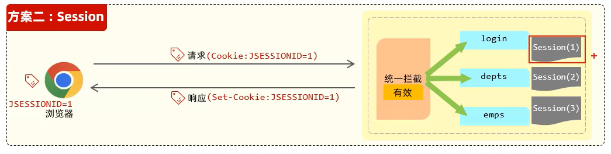
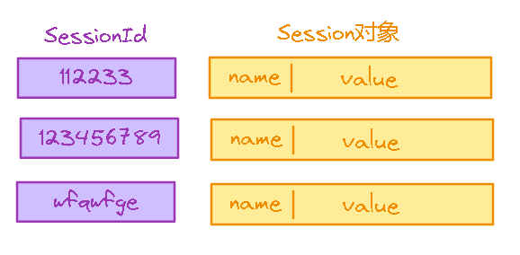
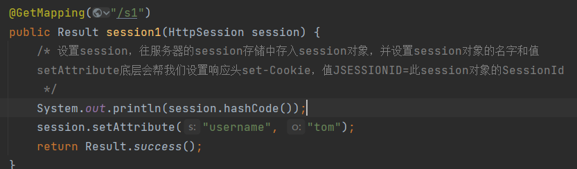
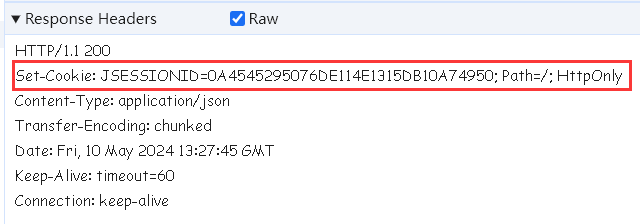
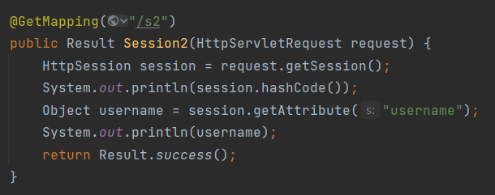
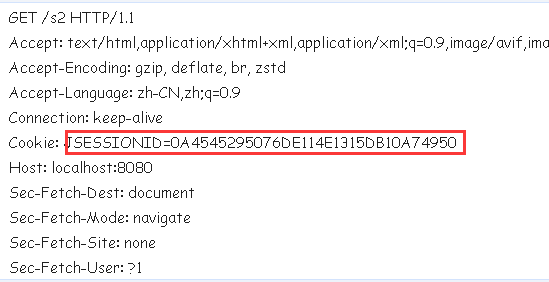
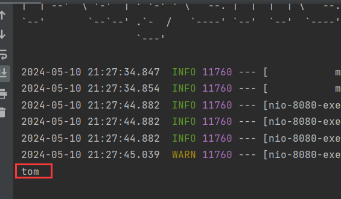
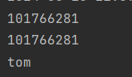

# 1 Session原理

`Session`是服务器端会话跟踪技术，存储在服务器端，底层基于`Cookie`实现。

它的原理是这样：

当浏览器第一次请求服务器时，即建立会话，服务器会产生一个会话对象(`Session`)。每一个`Session`对象都有一个id，叫做SessionId。服务器会自动将SeesionId响应给浏览器，其实就是在响应头中增加了一个字段：`set-CooKie`。

`set-CooKie`字段的值是一个固定格式，形如：

```
JSESSIONID=SessionId
```

> 注意⚠：
>
> JSESSIONID是SessionId的标识符，不同web容器的标识符可能存在差异，一般java web容器(tomcat、jetty等)的标识符是JSESSIONID。

浏览器会自动识别`set-CooKie`头，将id存入请求头的`Cookie`字段中。之后的请求中都会携带这个字段，服务器接收请求时从`Cookie`中取出id，在`Seesion`集合中匹配，如果能找到对应的`Seesion`说明用户之前登录过，否则用户没有登录。



# 2 Session格式

`Session`的格式是SessionId关联一个`Session`对象的形式：



通过id获取对应的`Session`。

`Session`存储值采用类似于Key-Value的Name-Value格式，使用时通过Name获取对应的Value。


# 3 设置Session

> 设置Session很简单，在控制器的方法形参中声明HttpSession类型的参数，通过HttpSession的setAttribute方法就能往Session中存入值。setAttribute方法接收两个参数，一个是Session对象的名字，另一个是Session对象的值。而且setAttribute底层帮我们设置了set-Cookie的响应头，也就是说我们不需要在手敲一遍设置响应头的代码。



> 响应头：




# 4 获取Session

> 从请求中获取Session可以通过HttpServletRequest类来获取，它的getSession方法能获取一个HttpSession对象，然后调用getAttribute方法通过Session对象的名字就能获取对应的值。



> 请求头：



> 可以看到，请求头中的JSESSIONID的值与响应头中的JSESSIONID的值是一致的，在控制台我们也获取了Session对象的值：



> 而且通过hashCode判断，两次请求的HttpSession是同一个对象：



> 这说明在这次会话中两次请求的Session是同一个。


# 5 Seesion优缺点

> 优点：
>
> - Session存储在服务器端，一般的用户很难获取，安全性比Cookie高。
>
> 缺点：
>
> - Session是基于Cookie的，也就是说在Seesion继承了Cookie的所有缺点。
> - Session存储在服务器端，而现在的大型项目一般是部署在多台服务器上，既然是多台服务器，那么每台服务器上存储的Seesion就必须要求同步。但是这很难办到，因为多台服务器的前置服务器一般是用来对请求进行负载均衡的，它会将请求分均匀的发到合适的服务器上，这时存在这种情况，当分发请求给A服务器时，A生成一个Session其id为1，这时浏览器存储这个1，然后再次请求，这时请求如果被分发到B服务器，那么就需要根据id为1来找Session，但是B上面显然没有id=1的Session，这时就出现问题了，同一个浏览器发起两次请求结果获取的Session不是同一个。


# 6 保持登录状态

`CooKie`和【Session】是基于会话建立的，浏览器访问服务器，会话建立，浏览器关闭，会话断开。会话断开，Cookie就会销毁，但是我们可以设置Cookie的持久化，也就是设置Cookie的过期时间。保证在浏览器断开连接时，【Cookie】不会立即被销毁，而是等到过期时间之后再销毁。只要用户在Cookie过期之前再次访问，那么浏览器仍然保有上一次访问时的【Cookie】。

【Session】会不会销毁和浏览器没有关系，而是和web容器有关。服务器不会因为浏览器断开连接而销毁【Session】，【Session】有自己的生命周期。

在tomcat容器这中设置【Session】的过期时间(默认30分钟)：

```xml
<session-config>
    <session-timeout>30</session-timeout>
</session-config>
```

下面提供一个多设备之间同一时间只能一个登录的实现思路：

【account_session】表，用于存储用户id和SessionId。

假如用户是第一次登录，那么先进行查表，没有数据就往【account_session】中插入一条数据，此时另一台设备如果有人用相同的账户登录，也会进行查表，由于两次的SessionId不同，那么就是不同设备登录，拦截此次登录。

假如用户第一次登录后，过段时间再次登录，只要【session】没有过期，那么前后的SessionId是一样的，乃同一台设备登录。

但是这个流程存在一个问题就是，用户第一次登出，到第二次登录这段时间，如果session过期，那么第二次生成的是新的id，前后id不一样，即使是同一台设备。因此我们还需要在【SeesionId】过期时，将此记录删除。

可以增加一个过期字段，记录过期时间。当用户在过期之后登录时，只查未过期的记录，避免出现上述的问题，同时还可以定义一个任务定期清理过期的记录。

可以考虑采用Redis来替代物理表，提高性能。