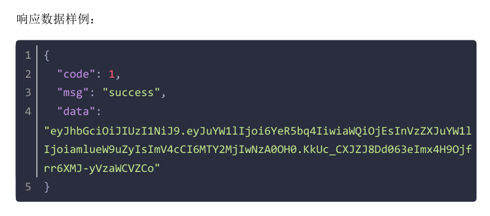
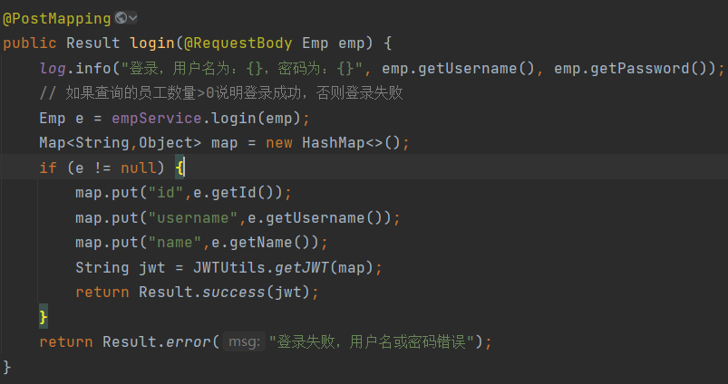
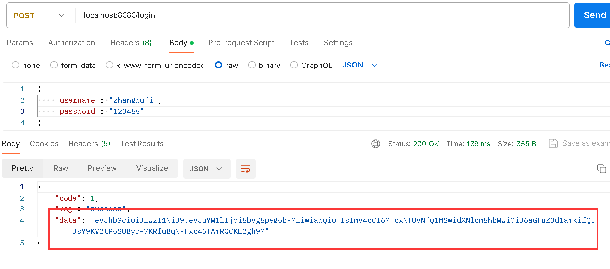
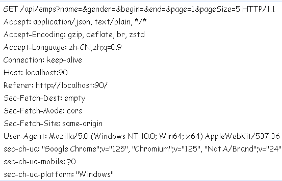
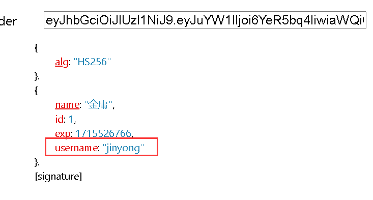
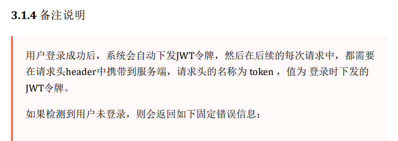

# 登录接口返回JWT

> 之前的开发的登录接口中登录成功时没有响应任何数据。
>
> 登录接口的需求，在登录成功后需要我们响应一个JWT：

> 之前查询是查询个数，只要个数>0就说明登录信息没有问题，但是现在需要响应JWT，因此我们需要查询出员工信息，方便自定义payload。
>
> mapper方法：

> service：

> 控制器：

> 将id、username和name添加到payload中去。
>
> 测试：

# token请求头

> 现在我们成功将JWT响应给了前端，前端在接收到JWT后，会在之后每次请求中携带JWT，通过请求头token。
>
> 现在我是未登录的状态来访问资源，请求中没有token头

> 当我登录后，后端响应给前端JWT，此时再访问资源，请求头中就会增加一个token头：

> 解析这个JWT信息，与登录信息一致：

> 而发送有token头的请求，这是由前端来实现的，与后端没有关系。

# 校验失败的响应

> 登录接口的备注信息：

> 备注信息中明确规定了登录成功后，后续的每次请求，都要携带JWT，我上面说过这里的实现是由前端来完成的，与后端没有关系，有关系的是校验请求头中的token是否有效这部分，备注信息明确规定了，如果JWT是无效的，应该返回一个固定的错误信息：

> 即，后端需要在统一拦截的地方当校验失败时响应这样的信息。