# 拦截器

> 拦截器(interceptor)是一种动态拦截方法调用的机制，类似于过滤器。是Spring框架中提供的，用来动态拦截控制器方法的执行。
>
> 它的作用就是拦截请求，在指定的方法调用前后，根据业务需要执行预先设定的代码。
>
> 我们可以使用拦截器来拦截请求，在拦截器种统一进行登录校验，如果请求携带JWT且JWT合法，就放行请求访问资源。如果登录校验失败，就直接给前端返回错误信息。


> 拦截器和过滤器非常类似。


# 快速入门

> 拦截器使用分成两步：
>
> 1. 定义拦截器，实现HandlerInterceptor接口，并重写其所有方法。
> 2. 注册、配置拦截器


## 定义拦截器

> 1、定义拦截器、实现HandlerInterceptor接口。
>
> HandlerInterceptor接口中有3种方法，这3种方法都有默认实现，我们根据需要来重写其中的方法即可。
>
> - preHandle：该方法在目标资源方法执行之前执行，这里的目标资源方法指控制器中的方法，该方法返回布尔值，返回true放行，就代表可以运行控制器中的方法，返回false不放行，此时就相当于拦截住了不允许执行控制器的方法。
> - postHandle：该方法在目标资源方法执行之后执行，在控制器方法执行完成之后再运行该方法。
> - afterCompletion：在整个视图渲染完成之后才会执行，这个方法是最后执行的方法。
>
> 拦截器类定义好后还需要将该类交给IOC，声明@Component。方便配置拦截器时注入。

```java
package com.lwn.interceptor;

import org.springframework.stereotype.Component;
import org.springframework.web.servlet.HandlerInterceptor;
import org.springframework.web.servlet.ModelAndView;

import javax.servlet.http.HttpServletRequest;
import javax.servlet.http.HttpServletResponse;

@Component
public class LoginCheckInterceptor implements HandlerInterceptor {
    @Override // 目标资源(控制器)方法执行之前执行，返回true，目标资源方法执行，返回false，拦截，目标资源方法不执行
    public boolean preHandle(HttpServletRequest request, HttpServletResponse response, Object handler) throws Exception {
        System.out.println("preHandle 运行了");
        return true;
    }

    @Override // 控制器方法执行之后执行
    public void postHandle(HttpServletRequest request, HttpServletResponse response, Object handler, ModelAndView modelAndView) throws Exception {
        System.out.println("postHandle 运行了");
    }

    @Override // 视图渲染完成之后执行，最后执行
    public void afterCompletion(HttpServletRequest request, HttpServletResponse response, Object handler, Exception ex) throws Exception {
        System.out.println("afterCompletion 运行了");
    }
}
```


## 配置拦截器

> 2、配置拦截器，首先要实现WebMvcConfigurer接口，并在类上传声明@Configuration，表示该类为springboot中的配置类。
>
> 然后重写WebMvcConfigurer中的addInterceptors方法，在该方法中注册拦截器，用该方法提供的InterceptorRegistry对象，该对象中有一个addInterceptor方法，就可以加入拦截器，就是我们上面定义好的拦截器类，即为该拦截器进行了配置，往环境中注册了该拦截器。
>
> 同时还可以指定这个拦截器的拦截路径是什么，用addPathPatterns方法，比如addPathPatterns("/**")拦截所有请求，与过滤器不同，过滤器中使用/\*，而拦截器中需要使用/\*\*。
>
> 这个类的写法比较固定。

```java
package com.lwn.config;

import com.lwn.interceptor.LoginCheckInterceptor;
import org.springframework.beans.factory.annotation.Autowired;
import org.springframework.context.annotation.Configuration;
import org.springframework.web.servlet.config.annotation.InterceptorRegistry;
import org.springframework.web.servlet.config.annotation.WebMvcConfigurer;

@Configuration // 声明该类为springboot中的配置类
public class WebConfig implements WebMvcConfigurer {
    @Autowired // 注入定义好的LoginCheckInterceptor拦截器
    private LoginCheckInterceptor loginCheckInterceptor;

    @Override // 重写addInterceptors方法
    public void addInterceptors(InterceptorRegistry registry) {
        /*
        registry.addInterceptor(loginCheckInterceptor)往环境中注册该拦截器
        addPathPatterns，指定该拦截器拦截哪些请求
         */
        registry.addInterceptor(loginCheckInterceptor).addPathPatterns("/**");
    }
}
```

> 测试：

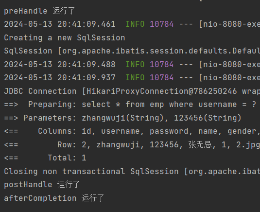

> 在执行登录方法之前，先执行了preHandle，然后放行，执行登录方法，登录方法执行完成后又回来执行postHandle，最后才执行afterCompletion。
>
> 改为false：


> 测试：


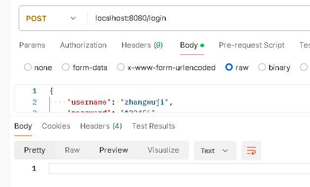

> false不放行，就不会执行登录方法。


# 拦截路径配置

> 拦截器可以根据需求，配置不同的拦截路径：
>
> - addPathPatterns：需要拦截哪些资源
> - excludePatterns：不需要拦截哪些资源
>
> addPathPatterns和excludePatterns可以接收List参数，当多个请求需要被拦截或者不需要拦截时，可以将多个请求封装成List。


> 拦截器中的常见拦截路径：

| 拦截路径  | 含义               | 举例                                                         |
| --------- | ------------------ | ------------------------------------------------------------ |
| /*        | 一级路径           | 能匹配/ depts、/emps、/login<br /><font color='red'>不能匹配/depts/1</font> |
| /**       | 任意路径           | 能匹配/dept、/depts/1、/depts/1/2                            |
| /depts/*  | /depts下的一级路径 | 能匹配/depts/1<br /><font color='red'>不能匹配/depts/1/2、 /depts</font> |
| /depts/** | /depts下的任意路径 | 能匹配/depts、/depts/1、/depts/1/2<br /><font color='red'>不能匹配/emps/1</font> |

> /**路径拦截，不需要拦截/login：

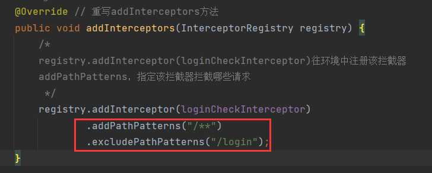

> 测试，首先是登录接口：

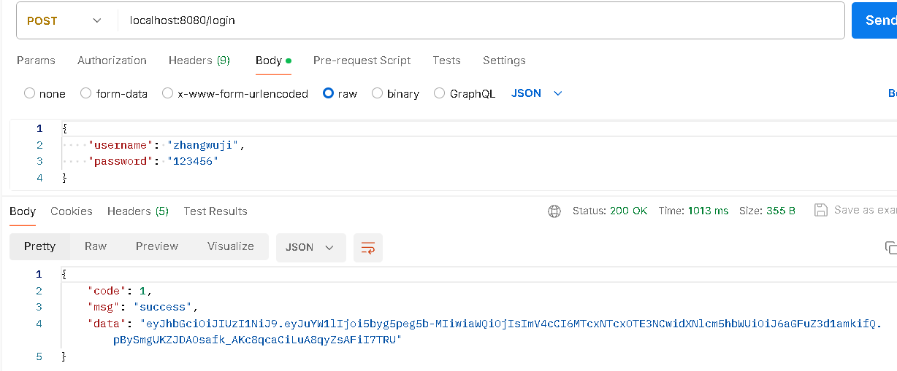

> /login没用拦截，System.*out*.println("preHandle 运行了");没用输出：

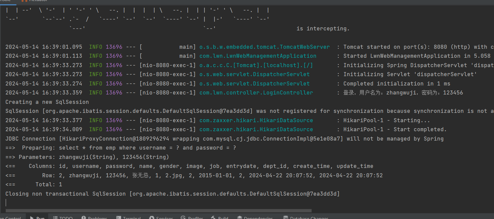

> 查询部门接口：


> 请求被拦截，三个方法被执行：

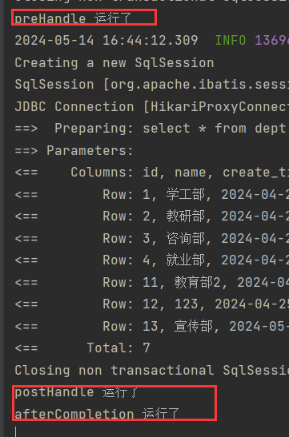

> 在执行删除部门的请求：/depts/5，这是二级路径，请求依然被拦截：

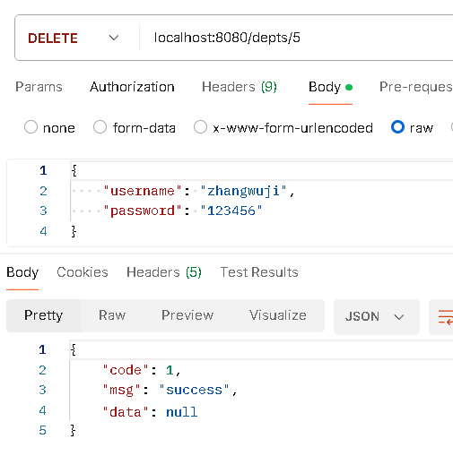

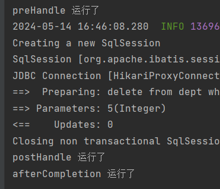

> 将拦截请求改为/*，再次测试：


> 查询可以被拦截：

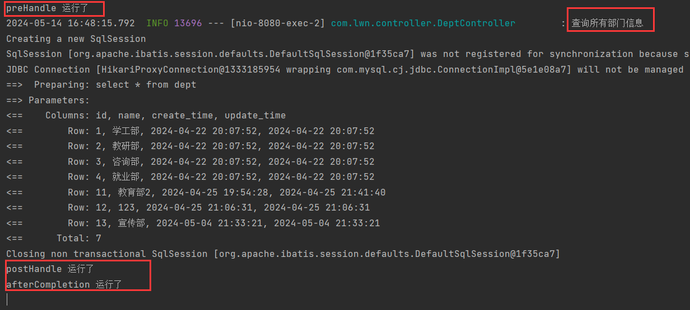

> 删除不能被拦截，因为/*只能拦截一级路径：


# 拦截器的执行流程

> 浏览器访问服务器，请求过来，过滤器会拦截这次请求，它会先执行放行前的逻辑，然后再执行放行操作。由于我们是基于springboot开发，所以放行后是进入到spring的环境中来访问controller，而tomcat是一个servlet容器，在spring中是无法直接访问controller的，于是spring的web环境为我们提供了一个非常核心的servlet：DispatcherServlet，于是过滤器放行的请求就会经过DispatcherServlet，由DispatcherServlet将请求转给controller去执行对应的接口方法。但是我们现在又定义了拦截器，所以在转给controller之前，拦截器会先将请求拦截住，对请求进行处理，先执行preHandle方法，返回true放行请求去访问controller，返回false则不会放行，controller执行完毕后，响应回到拦截器后，执行postHandle和afterCompletion，然后返回响应给DispatcherServlet，DispatcherServlet又返回给过滤器，再来执行过滤器放行后的逻辑，最后给浏览器响应。


> 测试，查询部门的请求，首先由过滤器拦截请求，执行放行前的逻辑，有效则放行：


> 然后放行，给DispatcherServlet，DispatcherServlet转给controller中途被拦截器拦截，执行preHandle，校验通过后放行，才被DispatcherServlet转给controller：


> 最后响应回到拦截器执行postHandle和afterCompletion，然后响应回到过滤器执行放行后的逻辑：

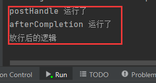

> 最终再响应给浏览器。


# filter和interceptor的区别

> - 接口规范不同，过滤器实现Filter接口，拦截器实现HandleInterceptor接口
> - 拦截范围不同，过滤器比拦截器的范围更广，过滤器会拦截所有资源，而拦截器只会拦截spring环境中的资源。


# 拦截器实现登录校验

> 拦截器来实现登录校验，逻辑与过滤器一致，校验过程定义在preHandle中：

```java
package com.lwn.interceptor;

import com.alibaba.fastjson.JSONObject;
import com.lwn.entry.Result;
import com.lwn.utils.JWTUtils;
import lombok.extern.slf4j.Slf4j;
import org.springframework.stereotype.Component;
import org.springframework.util.StringUtils;
import org.springframework.web.servlet.HandlerInterceptor;
import org.springframework.web.servlet.ModelAndView;

import javax.servlet.http.HttpServletRequest;
import javax.servlet.http.HttpServletResponse;

@Component
@Slf4j
public class LoginCheckInterceptor implements HandlerInterceptor {
    @Override // 目标资源(控制器)方法执行之前执行，返回true，目标资源方法执行，返回false，拦截，目标资源方法不执行
    public boolean preHandle(HttpServletRequest request, HttpServletResponse response, Object handler) throws Exception {
        System.out.println("preHandle 运行了");

        // 定义错误的返回，并转换为Json字符串
        String error = JSONObject.toJSONString(Result.error("NOT_LOGIN"));

        // 获取JWT
        String jwt = request.getHeader("token");
        log.info("jwt:{}", jwt);

        // 如果JWT不存在，不放行
        if (!StringUtils.hasLength(jwt)) {
            log.info("jwt不存在");
            response.getWriter().write(error);
            return false;
        }

        // 校验JWT，如果失效不放行
        try {
            log.info("jwt有效");
            JWTUtils.parseJWT(jwt);
        } catch (Exception e) {
            log.info("jwt无效");
            response.getWriter().write(error);
            return false;
        }

        return true;
    }

    @Override // 控制器方法执行之后执行
    public void postHandle(HttpServletRequest request, HttpServletResponse response, Object handler, ModelAndView modelAndView) throws Exception {
        System.out.println("postHandle 运行了");
    }

    @Override // 视图渲染完成之后执行，最后执行
    public void afterCompletion(HttpServletRequest request, HttpServletResponse response, Object handler, Exception ex) throws Exception {
        System.out.println("afterCompletion 运行了");
    }
}
```


# 解决跨域

> 之前提到过，当前端与和后端不处于同一域下(协议、IP、端口任意一点不同)，就会出现跨域问题。
>
> 解决跨域问题需要靠后端来实现。


## @CrossOrigin

> 我们可以通过@CrossOrigin来解决跨域，将它声明在控制器上，那么该控制器就能处理跨域请求。
>
> 通过@CrossOrigin的origins属性来设置需要允许的域名，比如：

```java
@CrossOrigin(origins = "http://localhost:3001")
```

如果不行，采用这种：

```java
@CrossOrigin(origins = "http://localhost:3001", allowCredentials = "true")
```

> 但是@CrossOrigin的弊端很明细，它需要声明在控制器上，如果一个项目中的控制器很多，那么声明起来就很繁琐，因此可以考虑在全局配置中统一处理跨域请求。


## addCorsMappings

> 我们可以实现WebMvcConfigurer接口并重写addCorsMappings方法来配置全局跨域处理。
>
> 事实上这就是配置拦截器时，我们创建的WebConfig配置类。
>
> addCorsMappings方法中接收一个CorsRegistry类型的对象。
>
> 该对象的方法有：
>
> - addMapping()：指定允许跨域的请求路径，配置规则与拦截路径一致
> - allowedOrigins()：设置允许跨域请求的来源，比如：http:localhost:3001
> - allowedMethods()：设置允许的请求方法
> - allowedHeaders()：设置响应头中允许包含的请求头字段
>
> 在跨域请求中，浏览器会先发送一个预检请求OPTIONS请求给服务器，向服务器确定是否允许实际请求。
>
> 预检请求中包含了一个 Access-Control-Request-Headers头部，用来列出实际请求会携带的请求头字段。
>
> 服务器在处理预检请求时，会根据Access-Control-Request-Headers头部指定的请求头字段来决定是否允许实际请求。allowedHeaders方法就是用来配置响应头中允许包含的请求头字段，以便服务器向浏览器返回允许的请求头字段列表。
>
> 配置类如下：

```java
import org.springframework.context.annotation.Configuration;
import org.springframework.web.servlet.config.annotation.CorsRegistry;
import org.springframework.web.servlet.config.annotation.WebMvcConfigurer;

@Configuration
public class WebConfig implements WebMvcConfigurer {
    // 配置跨域
    public void addCorsMappings(CorsRegistry registry) {
        registry.addMapping("/**") // 所有URL路径启用CORS配置
            // 允许http:localhost:3001源发起跨域请求
            .allowedOrigins("http:localhost:3001") 
            // 允许GET、POST、PUT、DELETE、OPTIONS方法
            .allowedMethods("GET", "POST", "PUT", "DELETE", "OPTIONS")
            .allowedHeaders("Content-Type", "Authorization") // 设置允许的请求头字段
            .maxAge(3600); // 每小時一次
    }
}
```

> 如果，前端在请求时设置了Credentials，即是允许跨域请求时携带凭证（如 cookies、HTTP 认证头）比如：


> 那么在跨域配置的时候也得配置Credentials：


```java
@Override
public void addCorsMappings(CorsRegistry registry) {
    registry.addMapping("/**") // 所有URL路径启用CORS配置
        .maxAge(3600) // 预检请求的缓存时间，1h
        .allowedMethods("GET", "POST", "PUT", "DELETE", "OPTION") // 允许GET、POST、PUT、DELETE和OPTIONS请求
        .allowedOrigins("http://localhost:3001/") // 允许哪些源发起跨域请求
        .allowedHeaders("Content-Type", "Authorization") // 指定了Content-Type和Authorization头可以用于跨域请求
        .allowCredentials(true); // 允许跨域请求时携带凭证（如 cookies、HTTP 认证头）比如：
}
```

> 另外，allowedHeaders方法可以使用通配符表示允许所有的请求头字段跨域：

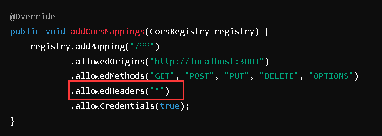


## 放行OPTION请求

跨域请求，在发送真正的请求之前，会发送一个OPTION方式的预检请求，来向服务器确定是否要允许跨域，根据 CORS 标准，预检请求不会携带任何凭证(如 tokens、cookies 等)，如果拦截器把这个请求给拦截下来，那么校验jwt就不会通过导致预检请求被服务器驳回，进而导致跨域请求失败，因此，我们需要在拦截器中为预计请求开发，同时为了避免有心之人用OPTION请求来访问服务器的资源，需要保证服务器的接口不使用OPTION请求。

拦截器放行OPTION请求：

```java
@Override // 目标资源(控制器)方法执行之前执行，返回true，目标资源方法执行，返回false，拦截，目标资源方法不执行
public boolean preHandle(HttpServletRequest request, HttpServletResponse response, Object handler) throws Exception {
    // 放行 OPTIONS 请求
    if (request.getMethod().equalsIgnoreCase(HttpMethod.OPTIONS.name())) {
        return true;
    }

    // jwt校验
    ......
}
```

