# 事务

> 在MySQL阶段，我们就学习过事务，简单来说，事务就是一组操作的集合，它是一个不可分隔的单位，这组操作<font color='yellow'>要么同时成功，要么同时失败。</font>
>
> 在MySQL中，我们是通过以下操作来控制事务：
>
> - 开启事务( 一组操作开始前，开启事务) : start transaction / begin ;
> - 提交事务(这组操作全部成功后，提交事务) : commit ;
> - 回滚事务(中间任何一个操作出现异常，回滚事务) : rollback ;


# spring事务管理

> 我们首先来看一个案例：
>
> 解散部门时，需要将该部门下的所有员工都删除。
>
> 我们修改案例的业务逻辑：
>
> 在删除部门的service中，我们根据部门id来调用mapper删除部门，这里我们可以根据部门id和员工表的外键dept_id来删除对应的员工，因此我们需要在员工管理中再增加一个根据dept_id来删除员工的操作逻辑，然后在删除部门这里执行这个逻辑。
>
> EmpService：

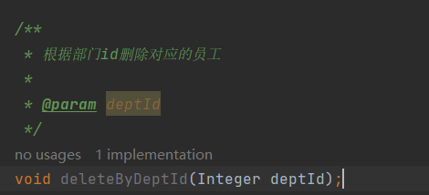

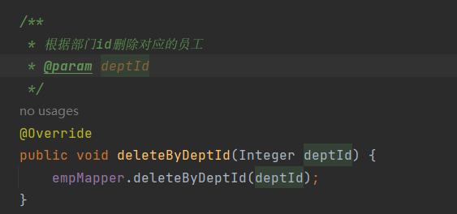

> mapper：

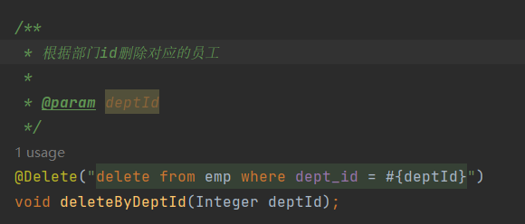

> 在删除部门这里执行：

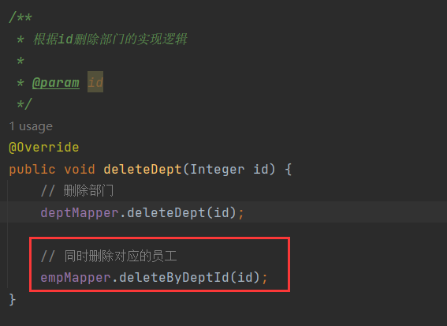

> 测试，删除id=3的部门，emp表中dept_id=3有一条数据：

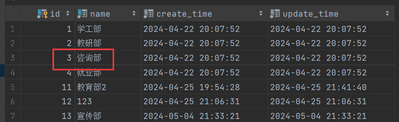

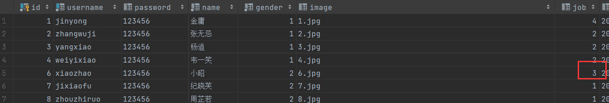

> 删除成功：

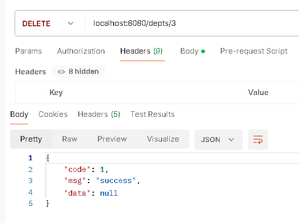

> 执行了两张表的删除：

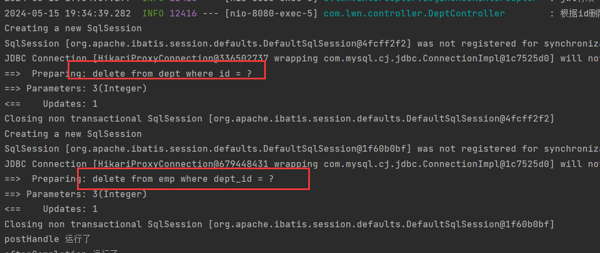

> 表：

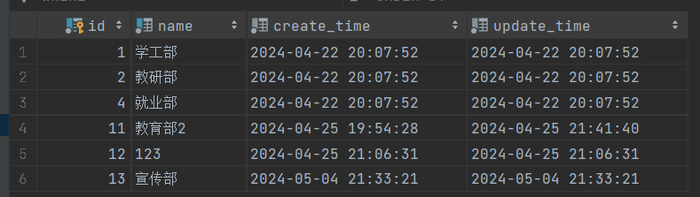

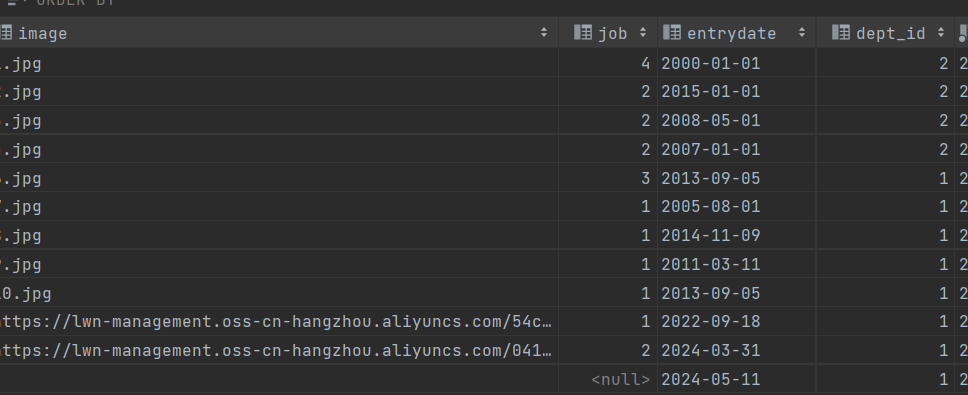

> 下面，我们演示异常的情况，在删除对应部门的员工之前我们模拟一个异常：

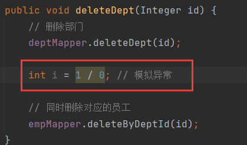

> 然后再来执行删除id=2的部门的操作：

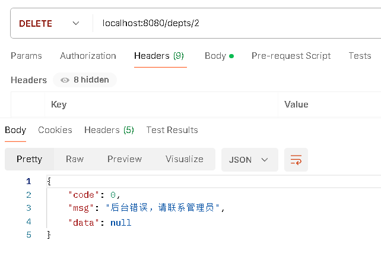

> 报错，看表：

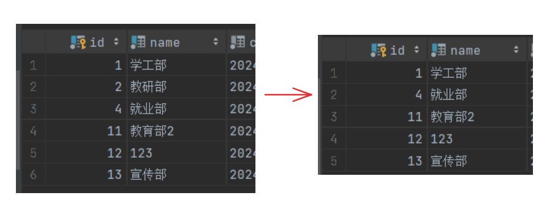

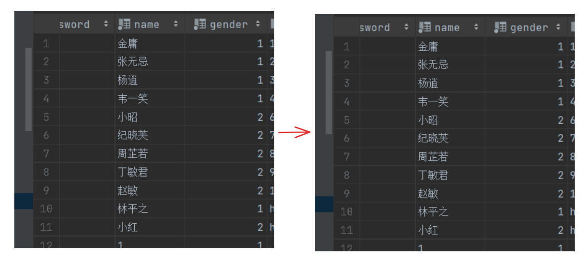

> 部门被删除了，但是员工没有被删除。
>
> 原因是在删除员工的操作之前，我们自定义了一个异常，当中执行到这个异常的时候，程序会中止执行，也就是不会执行删除员工的操作，但是删除部门的操作是在异常之前执行的，所以删除部门不会受到异常的影响。
>
> 这就造成了数据的不一致，我们要保证数据的一致性。而要保证数据的一致性，就需要这两步操作要么同时成功，要么同时失败。也就是要让这两个操作处于同一个事务内。

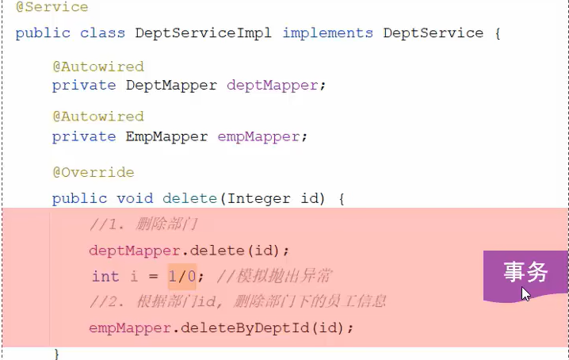

> 在spring框架中为我们封装好了事务，我们只需使用@Transactional就可以完成事务的控制。


# @Transactional

> @Transactional是spring提供的事务管理注解，它可以声明在类、方法、接口上，它的作用是将方法交给spring进行事务管理，方法执行前开启事务，成功执行，提交事务，出现异常，回滚事务。
>
> 如果声明在类上，表示该类的所有方法都进行事务管理。
>
> 如果声明在接口上，表示实现该接口的所有类的所有方法都进行事务管理。
>
> 我们一般是将@Transactional声明在service层的增、删、改的方法上，更加准确的说是声明在执行多次数据增、删、改操作的这一类的方法上。
>
> 现在我们开启事务管理，再来执行：

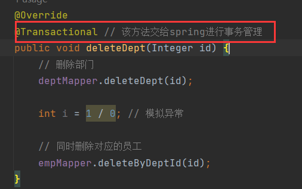

> 补全id=2的部门，然后再次删除：

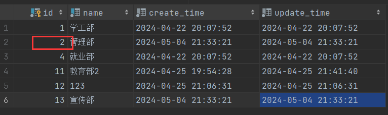

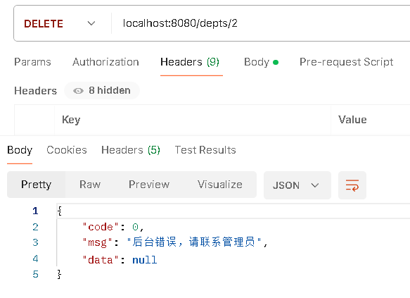

> 现在出现异常，部门表的数据也不会被删除了：


## 开启事务管理日志

> 配置信息如下：

```yaml
# 开启事务管理日志
logging:
  level:
    org.springframework.jdbc.support.JdbcTransactionManager: debug
```

> 再次运行，看控制台：

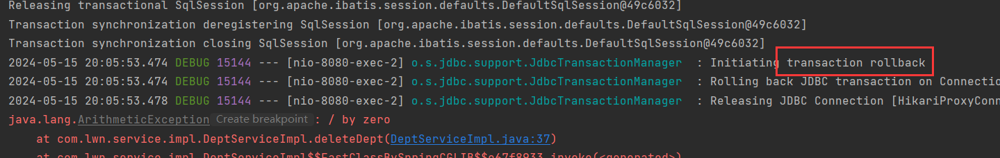

> 关键字，transaction rollback，说明事务已经回滚了。
>
> 下面介绍跟@Transactional有关的两个重要属性。


## rollbackFor

> 上面的例子中我们使用了一个计算异常来模拟一个异常，现在我们直接抛出一个异常：

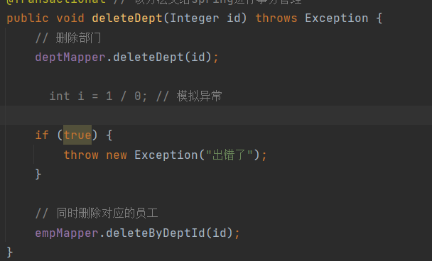

> 然后再次id=2的部门：

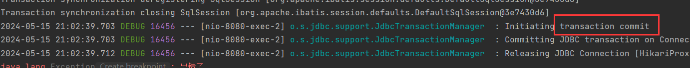

> 此时，事务显示提交，部门表id=2被删除，但是员工表并没被删除数据：

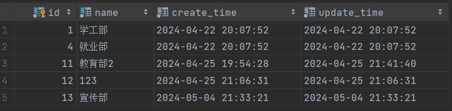

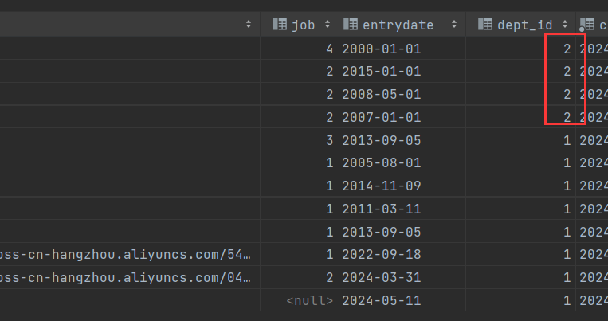

> 为什么报了异常，事务没用回滚反而提交了？因为@Transactional默认只对运行时异常进行回滚处理。
>
> 再第一个案例中，int i = 1 / 0;就是一个运行时异常，而我们手动抛出的异常并非运行时异常，因此事务提交了。
>
> 我们可以通过@Transactional的rollbackFor属性来控制要对哪个异常进行回滚，比如我们对所有异常都进行回滚：

```java
// 开启spring事务，rollbackFor = Exception.class表示对所有异常都进行事务回滚
@Transactional(rollbackFor = Exception.class)
```

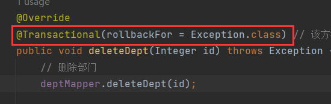

> 再次执行，事务回滚了

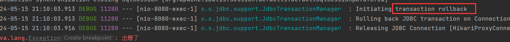


## propagation

> @propagation控制事务的<font color='yellow'>传播行为</font>。
>
> 什么是事务的传播行为？
>
> 所谓事务的传播行为，指的就是当一个事务方法被另一个事务方法调用时，这个事务方法应该如何进行事务控制。
>
> 比如，我现在有两个事务方法，a和b，在a方法中，调用了b方法：

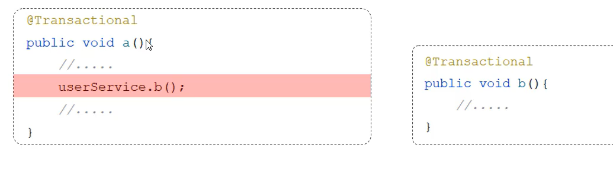

> 在a方法运行的时候，就会开启事务，然后a调用b，假设b也具有事务，那b在运行时应该加入a方法中与a成为一个事务还是b新建一个事务？
>
> 这就涉及到事务的传播行为。
>
> 我们可以通过@Transactional的propagation来控制事务的传播行为。
>
> 比如，@Transactional(propagation = Propagation.REQUIRED)

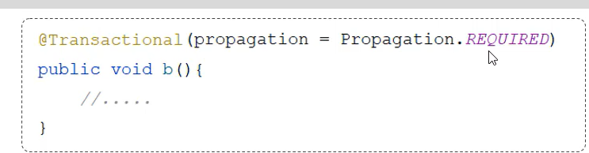

> 传播行为有：

| 属性值                                | 含义                                                         |
| :------------------------------------ | :----------------------------------------------------------- |
| <font color='red'>REQUIRED</font>     | 默认值，需要事务，有则加入，无则创建新事务。即使没用指定propagation的值为REQUIRED，其默认值也为REQUIRED |
| <font color='red'>REQUIRES_NEW</font> | 需要事务，无论有无，总是创建新事务                           |
| SUPPORTS                              | 支持事务，有则加入，无则在无事务状态中运行                   |
| NOT_ SUPPORTED                        | 不支持事务，在无事务状态下运行，如果当前存在已有事务，则挂起当前事务 |
| MANDATORY                             | 必须有事务，否则抛异常                                       |
| NEVER                                 | 必须没事务，否则抛异常                                       |

> 以ab举例：

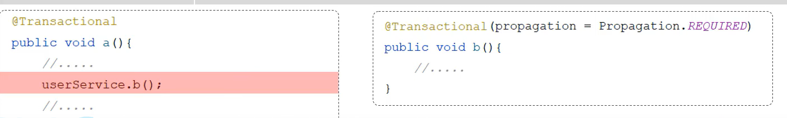

> - REQUIRED：表示b方法需要事务，a调用b，a如果有事务，则b加入到a的事务中，若a没用事务，则b新建一个事务。
>
> - REQUIRES_NEW：表示这个b需要事务，无论a有没有事务，b都创建新事务。
>
> - SUPPORTS：表示b需要事务，如果a有事务，则b加入到a的事务中，若a没用事务，则b在无事务状态中运行。
> - NOT_ SUPPORTED：表示b不需要事务，b要在无事务状态中运行，如果a有事务，则a的事务会被挂起，等b执行完成后再执行a的事务。
> - MANDATORY：b必须需要事务，否则抛出异常。
> - NEVER：b必须不需要事务，否则抛出异常。
>
> 对于这些传播行为，我们只需关注REQUIRED和REQUIRES_NEW即可。
>
> 来看下面的需求：
>
> 解散部门时，记录操作日志
>
> 需求：解散部门时，无论是成功还是失败，都要记录操作日志。
>
> 1. 解散部门：删除部门、删除部门下的员工
> 2. 记录日志到数据库表中
>
> 部门日志表，三个字段：id、create_time、description：

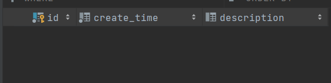

> DeptLogMapper：

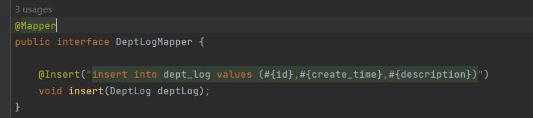

> 部门日志的service，开启了事务：


> 在删除部门方法里调用addDeptLog方法：

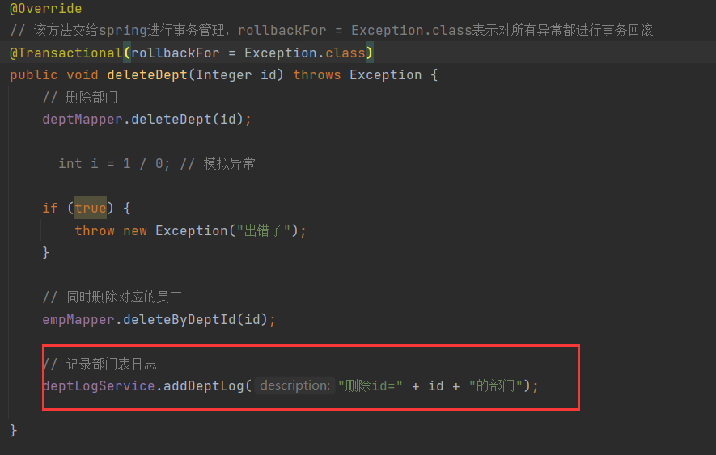

> 需求指出，无论删除部门是否成功，记录日志都得执行，因此使用try...finally：

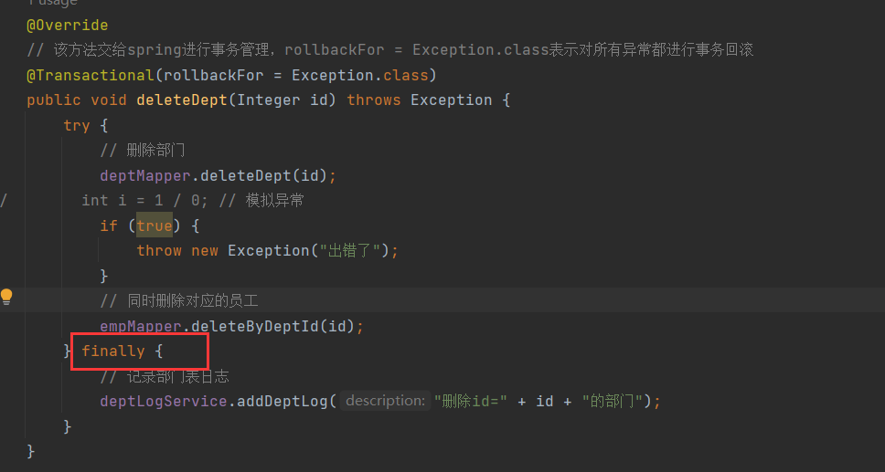

> addDeptLog方法开启了事务，而deleteDept也有事务，在默认传播行为的情况下执行，已经删除id=2的部门：

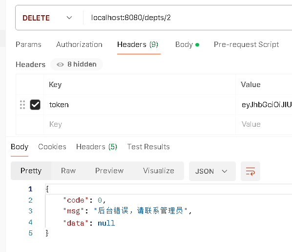

> 异常，报错，我们查看dept_log表：

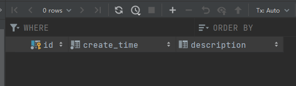

> 没有值，控制台中显示事务回滚：

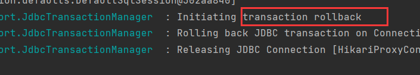

> 因为，我们为addDeptLog方法开启了事务，但是没有指定其传播行为，因此它的传播行为就是默认值REQUIRED。
>
> REQUIRED在有事务的情况下会将标注的方法加入到该事务中，即将addDeptLog方法加入到deleteDept方法中成为一个事务，而deleteDept中存在异常，因此事务被回滚了即执行添加日志的操作也被回滚了所以日志表中没有数据。
>
> 看事务日志：

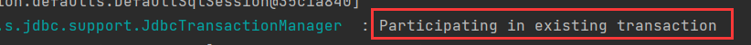

> Participating in existing transaction表示参与到一个已存在的事务，这个已存在的事务就是deleteDept方法，addDeptLog方法参与到deleteDept方法的事务中。
>
> 所以，要实现需求，就应该让这两个方法处于不同的事务中，因此addDeptLog方法的传播行为应该为：REQUIRES_NEW开启一个新事务：

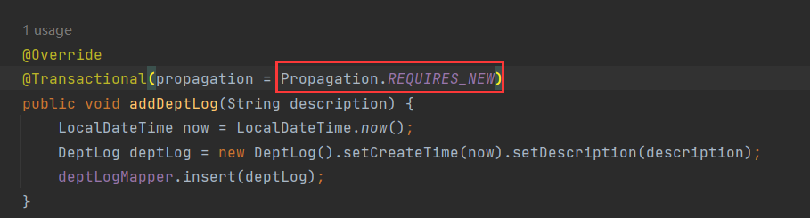

> 再来测试，两次独立事务，一次提交，一次回滚：

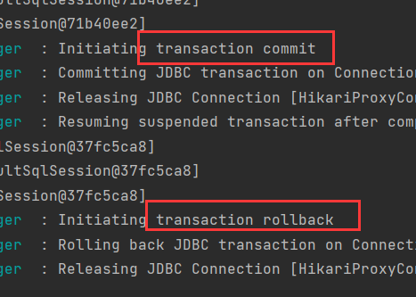

> 表：

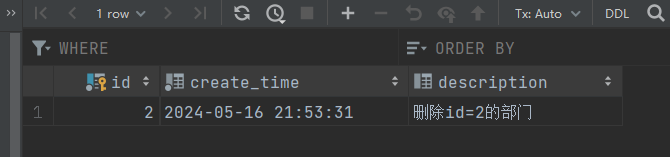

> 应用场景：
>
> - REQUIRED：大部分情况下都是用该传播行为即可。
> - REQUIRES_ NEW：当我们不希望事务之间相互影响时，可以使用该传播行为。比如:下订单前需要记录日志，不论订单保存成功与否，都需要保证日志记录能够记录成功。