# 通知类型

> 在入门程序中，我们使用了一种功能最为强大的通知类型，@Around环绕通知，在方法上声明@Around，表示当前通知为环绕通知。
>
> 所谓环绕通知，指此注解标注的通知方法在目标方法运行前和运行后都被执行。
>
> spring支持的通知：
>
> - @Around：环绕通知，此注解标注的通知方法在目标方法执行前和执行后都被执行
> - @Before：前置通知，此注解标注的通知方法在目标方法执行前被执行
> - @After：后置通知，此注解标注的通知方法在目标方法执行后被执行，无论是否有异常都会执行
> - @AfterReturning：返回后通知， 此注解标注的通知方法在目标方法执行后被执行，有异常不会执行
> - @AfterThrowing：异常后通知，此注解标注的通知方法在目标方法发生异常后执行
>
> @Before在目标方法执行前执行。
>
> @After、@AfterReturning、@AfterThrowing都是在目标方法执行后执行。
>
> @Around是功能最为强大的通知，环绕通知中的代码，有一部分是在目标方法执行前执行，有一部分是在目标方法执行后执行。


## 演示

> @Before前置通知：

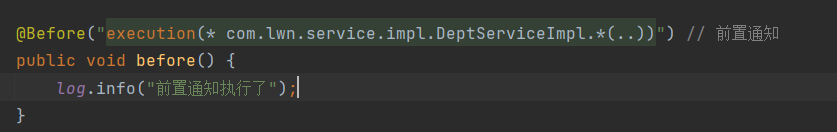

> 目标方法是com下lwn下service下impl下的所有方法。有一个细节，当我们给这个方法声明通知时，它会生成一个m图标：

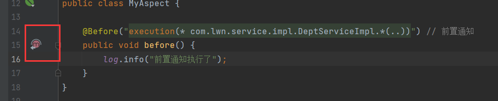

> 之前的Around方法也是：

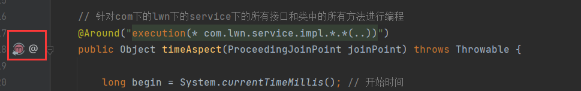

> before是一个半圆形状，且半圆向上，这表示该方法是一个前置方法，而环绕方法就是一个完整的圆。同理后置方法就是一个向下的半圆。
>
> 测试：

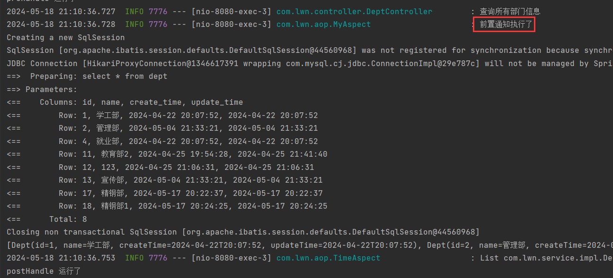

> 前置通知在目标方法执行前执行。
>
> @Around环绕通知：


> 测试：

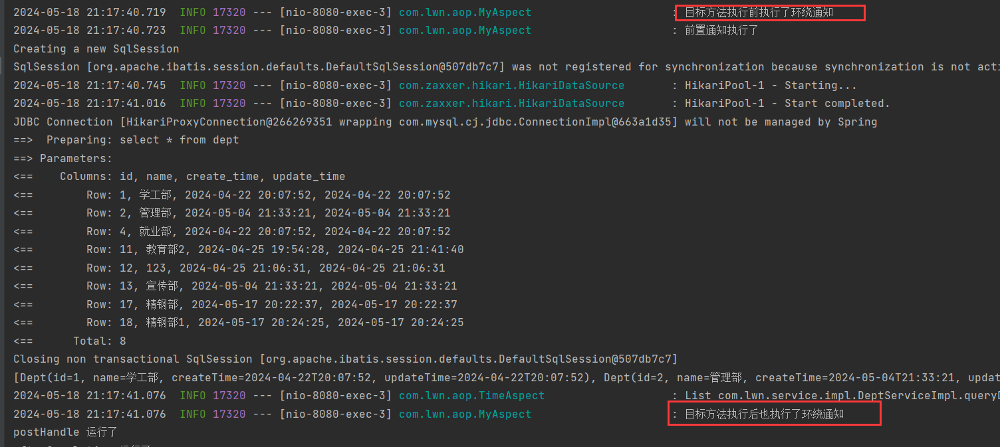

> 在目标方法执行前和执行后都在执行了环绕通知。
>
> @After后置通知：

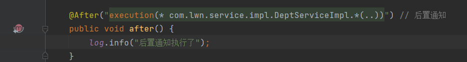

> 图标是一个向下的半圆。测试：

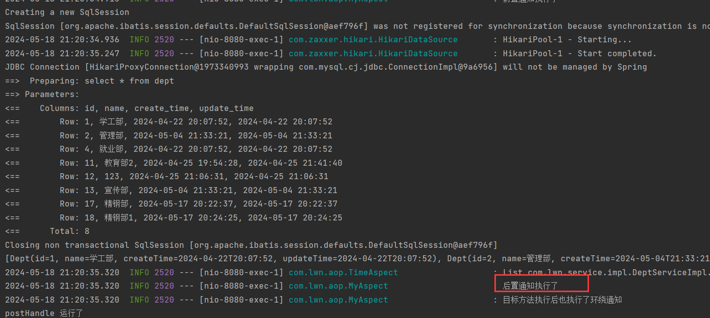

> 在目标方法执行后执行。
>
> @AfterReturning返回后通知，

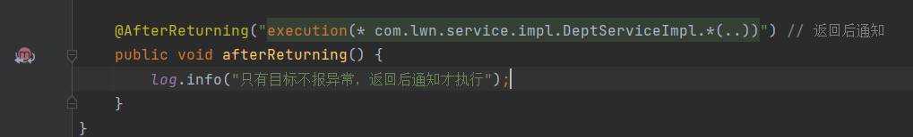

> 图标多了一个返回箭头，测试：

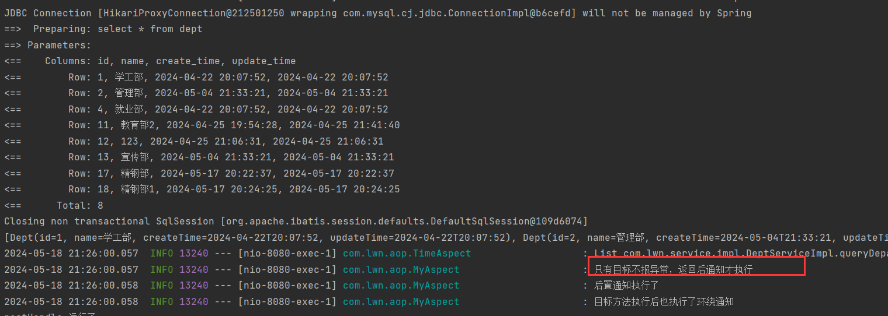

> 当报出异常：

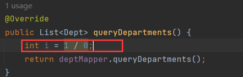

> 返回后通知不执行：

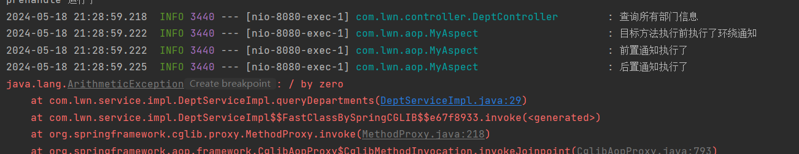

> @AfterThrowing异常后通知：


> 异常后通知的图标有一个闪电，测试：

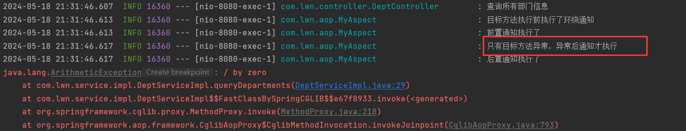

> 报异常的情况下，环绕后通知没有执行，因为环绕通知中通过joinPoint.proceed()来调用原始方法执行，原始方法都报异常了，后面的代码自然就不会执行了。
>
> @Before和@Around的环绕前都是在原始方法执行前执行，而@Around的环绕后以及@After、@AfterReturning、@AfterThrowing都是在原始方法执行后执行。
>
> @AfterReturning和@AfterThrowing是互斥的。
>
> 我们来看完整代码：


> 我们定义的5个通知其切入点表达式是一样的，我们可以提取出来。我们定义一个方法，方法名随意，无参，空方法，无返回值，但是在方法上声明@Pointcut()，在这个注解中定义切入点表达式，然后在之后的通知中调用该方法就能引用该方法的切入点表达式：

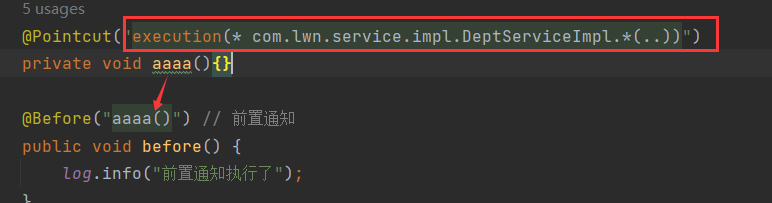

```java
@Aspect
@Component
@Slf4j
public class MyAspect {
    @Pointcut("execution(* com.lwn.service.impl.DeptServiceImpl.*(..))")
    private void aaaa(){}

    @Before("aaaa()") // 前置通知
    public void before() {
        log.info("前置通知执行了");
    }

    @Around("aaaa()") // 环绕通知
    public Object around(ProceedingJoinPoint joinPoint) throws Throwable {
        log.info("目标方法执行前执行了环绕通知");

        Object proceed = joinPoint.proceed();

        log.info("目标方法执行后也执行了环绕通知");
        return proceed;
    }

    @After("aaaa()") // 后置通知
    public void after() {
        log.info("后置通知执行了");
    }

    @AfterReturning("aaaa()") // 返回后通知
    public void afterReturning() {
        log.info("只有目标不报异常，返回后通知才执行");
    }

    @AfterThrowing("aaaa()") // 异常后通知
    public void afterThrowing() {
        log.info("只有目标方法异常，异常后通知才执行");
    }
}
```

> 其他切面类也可以获取我当前这个切面类中的切入点表达式，但是我当前的方法是私有的，其他切面类要想使用，就需要定义为public：

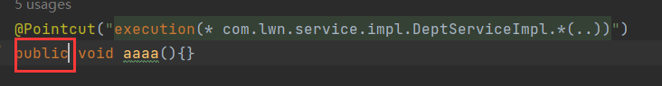

> 其他切面类使用，引用时需要使用完整包路径。

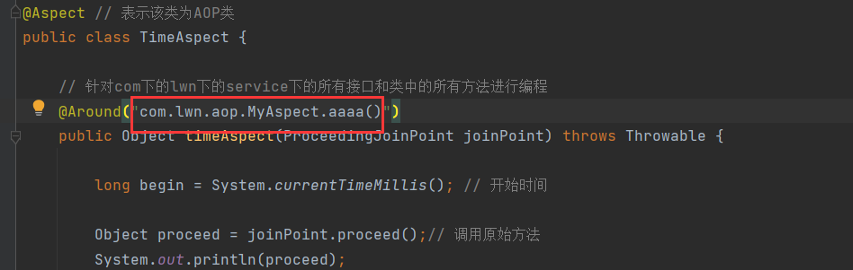

> @Pointcut的作用就是将公共的切入点抽取出来复用。


# 执行顺序

> 我们定义多个切面类，这些切面类的切入点都匹配到了同一个目标方法，目标方法执行时，这些切面类的通知都会执行，这时就有一个问题，这些通知哪个先执行呢？哪个后执行呢？
>
> 同一个切面类中，不同通知的执行顺序：
>
> - @Around前 >> @Before >> 原始方法成功 >> @Around后 >> @AfterReturning >> @after
>
> - @Around前  >> @Before >> 原始方法报错 \>> @AfterThrowing \>> @after
>
> 不同切面类中通知的执行顺序：
>
> 我们先定义3个切面类，类中的切入点一致，都定义@Before和@after，只是输出的内容不同，其余一致，以1举例：

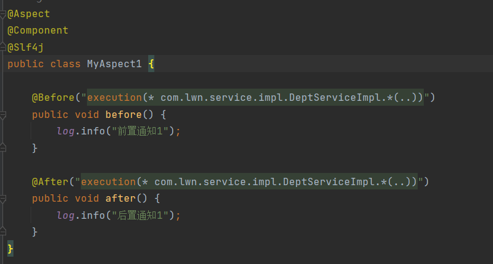

> 测试：

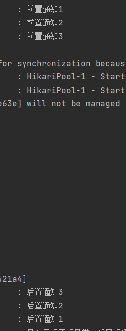

> 这个运行顺序与切面类的类名有关，在原始方法运行前运行的通知，其类名排名越靠前，越先执行。在原始方法执行之后执行的通知，其类名排名越靠后，越先执行。

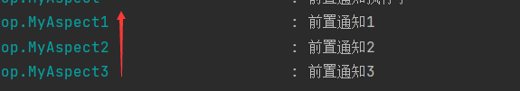

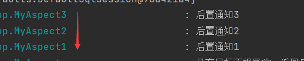

> 现在，我将2改成5，再来测试：

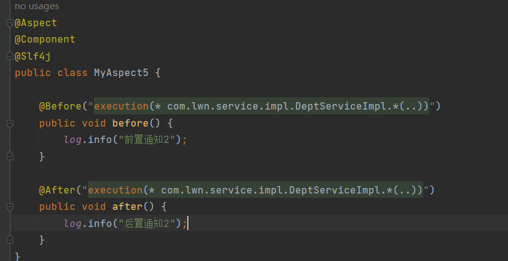

> 2变成5后，自然排序在3之后，原始方法执行前，其指顺序就在3之后，在原始方法执行后其因为排在最后所以第一个执行：

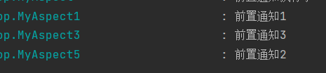

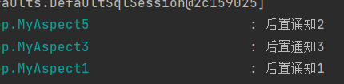

> 不同切面类中，默认按照切面类的类名字母排序：
>
> - 目标方法前的通知方法：字母排名靠前的先执行
> - 目标方法后的通知方法：字母排名靠后的先执行
>
> 我们控制切面类的顺序，可以通过改变类名来控制，也可以通过注解。
>
> 用@Order(数字)加在切面类上来控制顺序：
>
> - 目标方法前的通知方法：数字小的先执行
> - 目标方法后的通知方法：数字大的先执行
>
> 现在我想让3的前置通知先执行，然后再执行5的前置通知，最后执行1的前置通过，我们就可以通过@Order来实现：

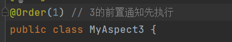

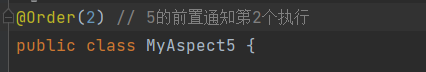

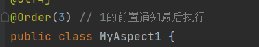

> 测试：

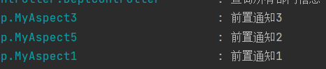

# 注意

> - @Around环绕通知需要自己调用ProceedingJoinPoint.proceed()来让原始方法执行，其他通知不需要考虑目标方法执行。
> - @Around环绕通知方法的返回值，必须指定为0bject，来接收原始方法的返回值。
> - @After后置通知无论方法是否出现异常，它都会执行，因此也叫做最终通知。
> - 切入点表达式的书写建议
>   - 所有业务方法名在命名时尽量规范，方便切入点表达式快速匹配。如：查询类方法都是find 开头，更新类方法都以update开头。
>   - 描述切入点方法通常基于接口描述，而不是直接描述实现类，增强拓展性。
>   - 在满足业务需要的前提下，尽量缩小切入点的匹配范围。如：包名匹配尽量不使用..而使用*匹配单个包。


# 切入点表达式

> 切入点表达式：描述切入点方法的一种表达式
>
> 作用：主要用来决定项目中的哪些方法需要加入通知
>
> 常见形式：
>
> 1. excution(......)：根据方法的签名来匹配
> 2. @annotation(......)：根据注解匹配


## excution

> execution主要根据方法的返回值、包名、类名、方法名、方法参数等信息来匹配，语法为：

```java
execution(访问修饰符? 返回值 包名.类名.?方法名(形参) throws 异常?)
```

> 其中带?表示可以省略。
>
> - 访问修饰符：可省略(比如：public.、protected)
> - 包名.类名：可省略，一般不建议省略
> - throws异常：可省略(注意是方法上声明抛出的异常，不是实际抛出的异常)

```java
@Component
@Aspect
@Slf4j
public class MyAspect6 {
    @Pointcut("execution(public void com.lwn.service.impl.DeptServiceImpl.deleteDept(java.lang.Integer) throws java.lang.Exception)")
    private void pt() {}

    @Before("pt()")
    public void before() {
        log.info("MyAspect6的前置通知执行了");
    }
}
```

> 这个切入点表达式是：

```java
execution(public void com.lwn.service.impl.DeptServiceImpl.deleteDept(java.lang.Integer) throws java.lang.Exception)
```

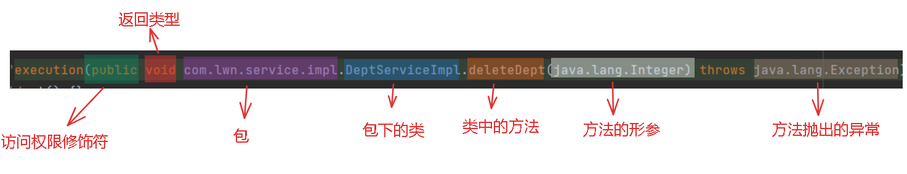

> 这个表达式定义的切入点就是com.lwn.service.impl包下的DeptServiceImpl类的deleteDept方法，需要注意的是，方法的形参声明时需要这个类型的全类型名。deleteDept方法的返回值是void，所以表达式的返回值类型也是void，其访问权限是public，表达式也是public，其形参是Integer类型的参数，所以表达式的参数类型为Integer(全类名)，方法抛出了Exception，所以表达式也抛出异常Exception(异常不用全类名)

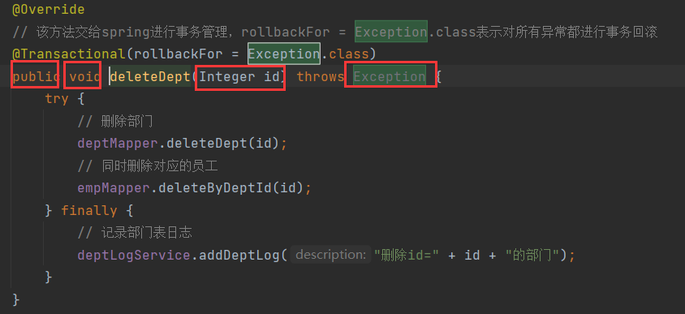

> 测试，删除id=10的部门：

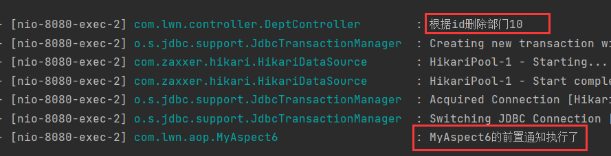

> 说明我们的表达式成功匹配到了对应的类。
>
> 方法权限修饰符可以省略：

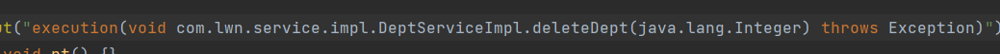

> 测试，通知依然执行：

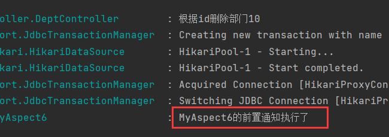

> 包名.类名也可以省略：

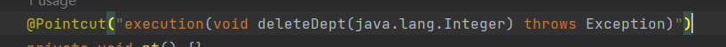

> 测试：

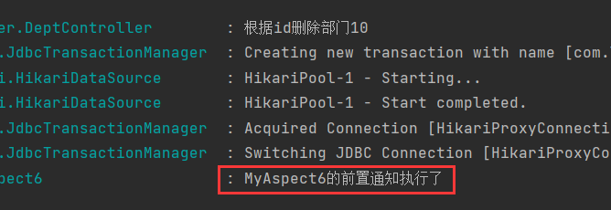

> MyAspect6执行了两次：

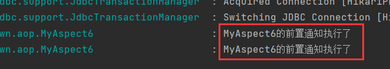

> 因为我们没有指定包名和类名，因此只要方法名、方法形参和返回值一致都能被表达式匹配，在mapper中的deleteDept方法：

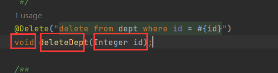

> 包名.类名我们不建议省略，因为省略匹配返回就会变大，影响匹配效率。
>
> 抛出的异常也可以省略：

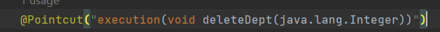

> 测试：

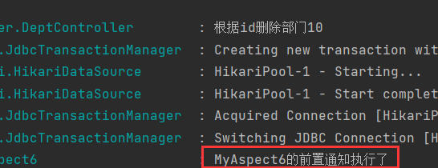


### 通配符

> execution中有两个通配符：
>
> - *：单个独立的任意符号，可以通配任意返回值、包名、类名、方法名、任意类型的一个参数，也可以通配包、类、方法名的一部分
> - ..：多个连续的任意符号，可以通配任意层级的包，或任意类型、任意个数的参数
>
> *通配符比如：

```java
execution(* com.*.service.*.update*(*))
```

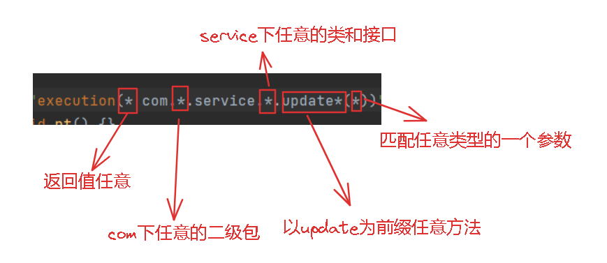

> *表示单独的任意符号，因此\*为形参时，表示这个方法只有一个参数。\*可以作为包、类、方法名的一部分，比如update\*就表示以update开头的方法名。
>
> ..通配符：

```java
execution(* com.lwn..DeptService.*(..))
```

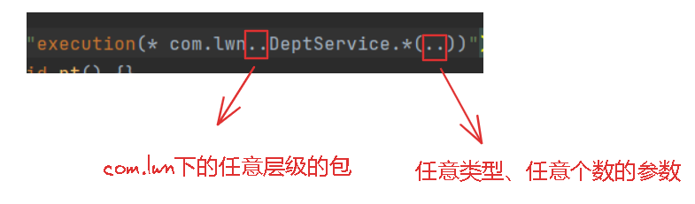

> 这表示匹配，返回值任意，com.lwn下任意层级的包下的DeptService接口或者类中的任意方法，且方法的形参个数和类型任意。
>
> ..一般出现在两个位置，一个是方法的形参中，一个是包中。
>
> 如果我要匹配DepetService下的查询和删除的方法：

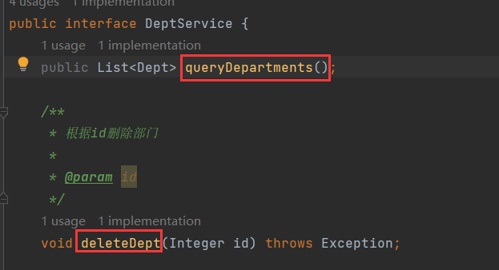

> 我们可以使用或运算符||：

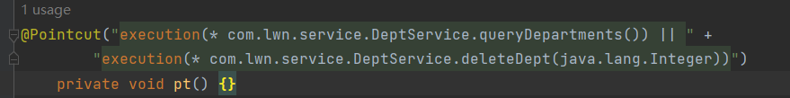

> 根据业务需要，可以使用且(&&)、或(||)、非(!)来组合比较复杂的切入点表达式。


## @annotation

> 上面我们定义匹配DepetService下的查询和删除的方法的切入点表达式时，使用了或运算符来匹配，但是这样写法太繁琐。以此我们可以基于另一个切入点表达式@annotation来匹配。
>
> @annotation切入点表达式，它用于匹配标识有特定注解的方法。什么意思呢？就是你方法上标识一个特定的注解，然后我通过@annotation匹配这个特定注解，进行匹配到方法。比如：

```java
@annotation(com.lwn.anno.Log)
```

> 这个表达式就是用来匹配标识有Log注解的方法。
>
> 我们自定义一个Log注解：

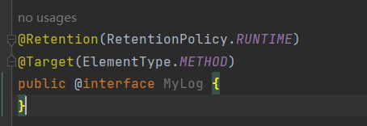

> @Retention和@Target是原注解，它们是用来描述这个MyLog注解的。
>
> @Retention描述MyLog注解什么时候生效，RetentionPolicy.RUNTIME表示运行时生效
>
> @Target描述MyLog注解作用在什么地方，ElementType.METHOD表示作用在方法上
>
> 注解定义好了，在查询和删除的方法上加上注解：

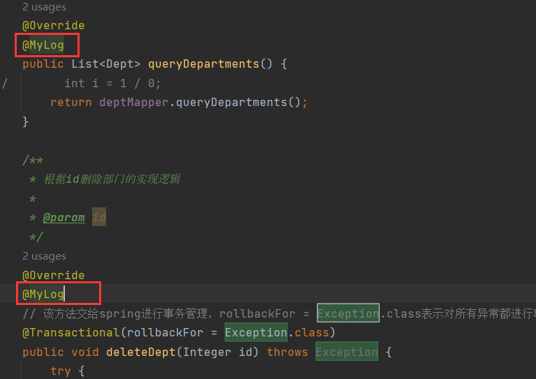

> 切入点表达式：


> 里面指定注解的全类名，那么现在就会匹配加了@MyLog的方法，测试：
>
> 查询：

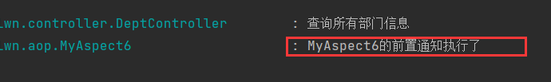

> 删除：

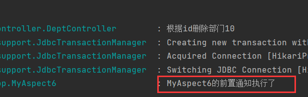

> 其他操作则不会执行通知：

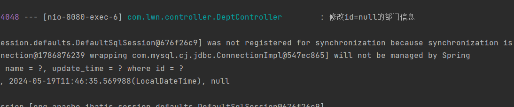

> 我将查询的注解注释掉：

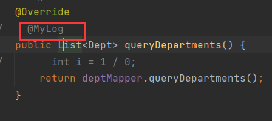

> 再次执行，这时通知不会执行了：

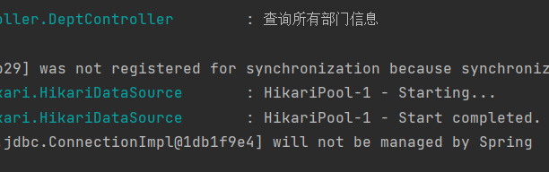


# 连接点

> 上文说过，连接点简单来说就是能被AOP控制的方法，目标对象中的所有方法都是连接点。
>
> 在Spring中用JoinPoint抽象了连接点，用它可以获得方法执行时的相关信息，如目标类名、方法名、方法参数等。
>
> 对于不同的通知类型，其获取连接点信息方式不同：
>
> - 对于@Around通知，获取连接点信息只能使用ProceedingJoinPoint
> - 对于其他四种通知， 获取连接点信息只能使用JoinPoint ，它是ProceedingJoinPoint的父类
>
> 下面演示环绕通知中获取连接点的信息：
>
> 1、获取目标对象的类名：

```java
// 需要通过getTraget来目标对象，然后再通过getClass获取Class对象，最后通过getName获取类名
String name = proceedingJoinPoint.getTarget().getClass().getName();
```

> 2、获取目标方法的方法名：

```java
// 通过getSignature来获取目标方法的方法签名对象，然后通过getName来获取方法名 
String name = proceedingJoinPoint.getSignature().getName();
```

> 3、获取目标方法在运行时传入的参数：

```java
// 通过getArgs获取参数数组，方法可以传入多个参数，所以返回数组
Object[] args = proceedingJoinPoint.getArgs();
```

> 4、执行目标方法，获取目标方法的返回值

```java
// 通过proceed方法调用原始方法，返回一个Object类型的对象，这个对象就是原始方法的返回值
Object result = proceedingJoinPoint.proceed();

// proceed的重载，接收一个参数数组
Object result = proceedingJoinPoint.proceed(Object[] args);
```

> 示例代码如下：

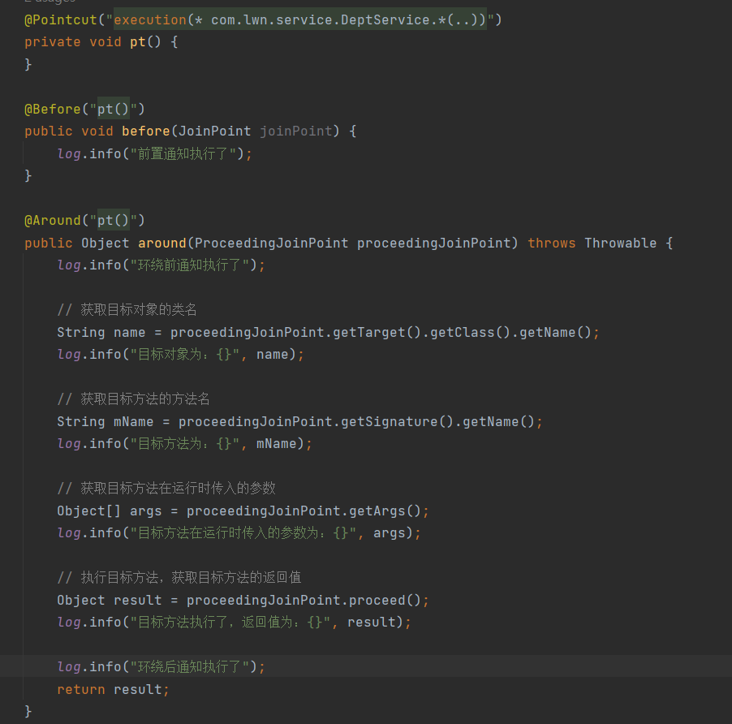

> 测试，删除id=10的部门：

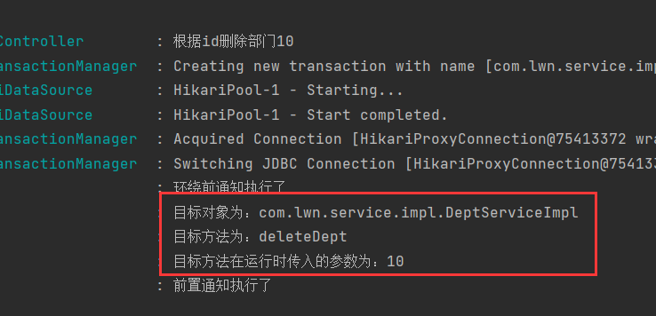


> 其他四个通知通过JoinPoint来获取连接点的信息，而JoinPoint是ProceedingJoinPoint的父类，所以JoinPoint的方法与ProccedingJoinPoint的方法一致，只是JoinPoint的方法中没有proceed方法，因为前置通知是在目标方法执行前执行，所以它没法执行目标方法，也就没有proceed。
>
> 对于proceed()方法，它返回一个Object类型的对象，这个对象就是目标方法的返回值，我们做一个改变，将环绕通知的返回值设为null：


> 然后我们测试，查询id=1部门：


> 返回值确实被封装在result中，但是postman中拿到的数据是null：


> 这就是因为我们环绕通知返回值设置成了null，所以目标方法才会返回null值。由此可见，环绕通知可以篡改目标方法的返回值。
