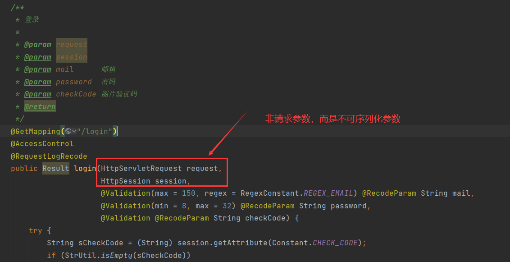
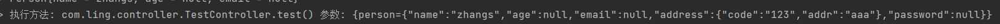

# 1 日志记录方法执行

作用在方法上，当请求接口时在日志中打印出方法的执行，形如：

```
执行方法: com.ling.controller.AccountController.getCheckCode() 参数: {type=1}
```

## 1.1 @RequestLogRecode

注解如下：

```java
package com.ling.annotation;

import java.lang.annotation.ElementType;
import java.lang.annotation.Retention;
import java.lang.annotation.RetentionPolicy;
import java.lang.annotation.Target;

/**
 * 日志记录方法执行
 */
@Retention(RetentionPolicy.RUNTIME)
@Target(ElementType.METHOD)
public @interface RequestLogRecode {
    boolean enable() default true;
}
```

`enable`：是否启用日志记录方法执行。

## 1.2 @ExcludeParamLog

```java
package com.ling.annotation;

import java.lang.annotation.ElementType;
import java.lang.annotation.Retention;
import java.lang.annotation.RetentionPolicy;
import java.lang.annotation.Target;

/**
 * 排除参数，不记录日志
 */
@Retention(RetentionPolicy.RUNTIME)
@Target(ElementType.PARAMETER)
public @interface ExcludeParamLog {

}
```

`@ExcludeParamLog`注解作用于形参，被标识的参数不会通过日志打印出来。

Q：为什么需要这样一个注解在标识形参？

A：因为一些不可序列化的对象，如`HttpServletRequest`、`HttpSession`这种作为形参：



对它进行序列化操作会报错，而这类形参通常也不是请求参数，因此用`@ExcludeParamLog`标识参数排除掉，从而过滤出请求参数。

## 1.3 切面实现

```java
package com.ling.aspect;

import com.fasterxml.jackson.databind.ObjectMapper;
import com.ling.annotation.RequestLogRecode;
import com.ling.annotation.ExcludeParamLog;
import org.aspectj.lang.JoinPoint;
import org.aspectj.lang.annotation.Aspect;
import org.aspectj.lang.annotation.Before;
import org.aspectj.lang.annotation.Pointcut;
import org.aspectj.lang.reflect.MethodSignature;
import org.slf4j.Logger;
import org.slf4j.LoggerFactory;
import org.springframework.core.annotation.Order;
import org.springframework.stereotype.Component;

import javax.annotation.Resource;
import java.lang.reflect.Method;
import java.lang.reflect.Parameter;
import java.util.HashMap;
import java.util.Map;

/**
 * 日志记录方法执行切面
 */
@Aspect
@Component
@Order(2)
public class RequestLogRecodeAspect {
    private Logger log = LoggerFactory.getLogger(RequestLogRecodeAspect.class);

    @Resource
    private ObjectMapper objectMapper;

    @Pointcut("@annotation(com.ling.annotation.RequestLogRecode)")
    public void pt() {

    }

    @Before("pt()")
    public void logMethodExecute(JoinPoint joinPoint) {
        try {
            Method method = ((MethodSignature) joinPoint.getSignature()).getMethod();
            RequestLogRecode lme = method.getAnnotation(RequestLogRecode.class);
            String classname = joinPoint.getTarget().getClass().getName();
            if (lme == null || !lme.enable()) return;
            Object[] args = joinPoint.getArgs();
            Parameter[] parameters = method.getParameters();
            Map<String, String> paramMap = new HashMap<>();
            for (int i = 0; i < parameters.length; i++) {
                Parameter parameter = parameters[i];
                if (parameter.getAnnotation(ExcludeParamLog.class) != null) continue;
                // 序列化深层对象
                String argsStr = objectMapper.writer().writeValueAsString(args[i]);
                log.info("{}", args[i]);
                paramMap.put(parameter.getName(), argsStr);
            }
            log.info("执行方法: {}.{}() 参数: {}", classname, method.getName(), paramMap);
        } catch (Exception e) {
            log.error("记录方法执行日志时发生异常: {}", e.getMessage(), e);
        }
    }
}
```

`ObjectMapper` 是 Jackson 提供的类，支持对对象进行深层次的序列化。当对象的属性中嵌套了其他对象时，普通的打印方法无法完整显示其内部结构，而 `ObjectMapper` 可以将其序列化为 JSON 格式，清晰地展现嵌套内容。

就像这样：



`Person`中嵌套的对象`address`也能显示出来。

## 1.4 执行顺序

在应用中同时使用 **参数校验注解** 和 **日志记录注解** 时，**参数校验注解** 应该优先执行：

- **校验先行**：如果方法参数不合法，业务逻辑不应该继续执行。因此，校验注解的优先级应高于日志记录注解。

- **避免无效日志**：如果在日志记录注解中打印了参数信息，而后续的参数校验抛出异常，就会导致日志中记录了无效的调用信息。

用`@Order`来控制 **参数校验注解** 和 **日志记录注解** 的执行顺序。