# 3种配置文件的优先级

> 在之前的项目中，我们已经说过springboot中支持3种配置属性的方法：properties、yml、yaml：

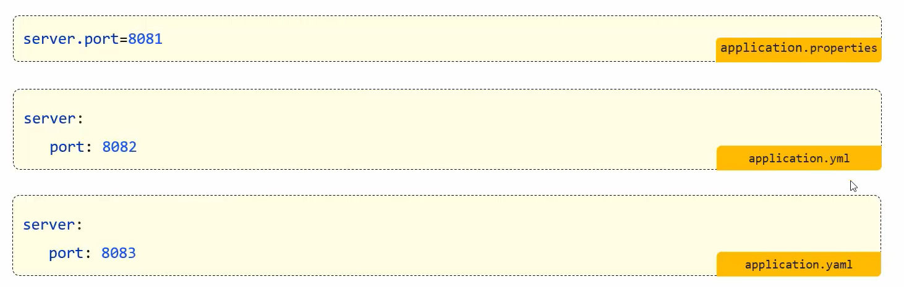

> 那么接下来，我们来研究一下，这3种配置文件都配置同一种属性，它们之间的优先级如何。
>
> 我们分别配置端口：

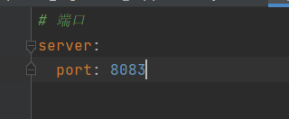

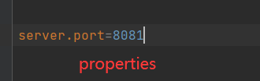

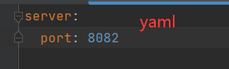

> 运行测试：

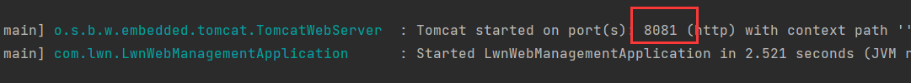

> 运行在8081端口上，也就是properties配置的端口生效了，然后将properties配置注释掉，再次运行：

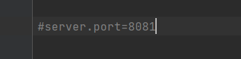


> 现在运行在8083端口上，也就是yml配置生效了，再将yml注释掉运行：

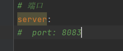

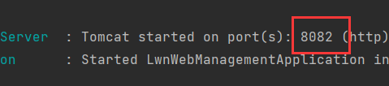

> 端口是8082，yaml生效了。我们可以看出优先级是properties > yml > yaml。


# 其他配置属性的方式

> 在springboot项目中为了增强语句的扩展性，除了这3种配置文件外，还支持另外两种常见的配置方式：
>
> - java系统属性
> - 命令行参数
>
> java系统属性配置属性，它的格式也是key=value的形式，不过它的key有一个前缀：-D，如：

```java
// java系统属性的格式为key=value，key以-D开头
-Dserver.port=8081
```

> 命令行参数，也是key=value的形式，不过key的前缀为--，如：

```java
// 命令行参数的格式为key=value，key以--开头
--server.port=8081
```

> 我们可以使用idea的可视化工具来设置这些配置，选择Edit Configurations...

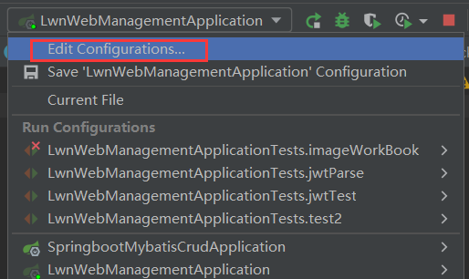

> 选中当前项目启动类，选择Modify options：

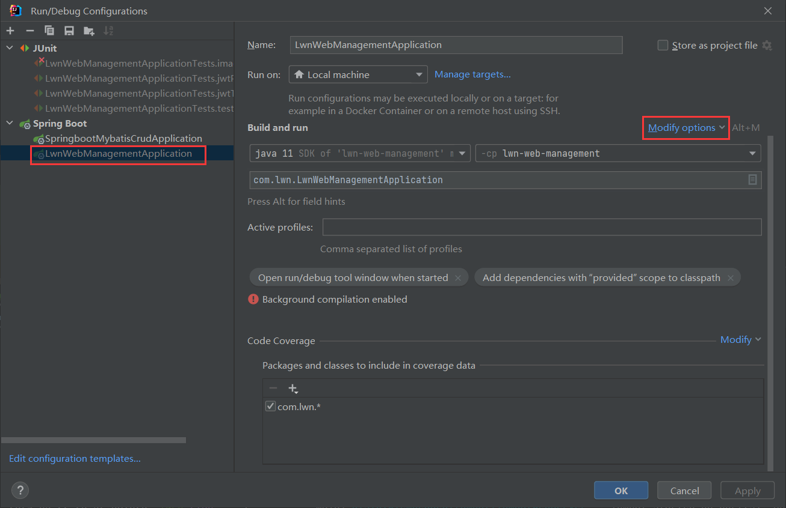

> 将Add VM options和Program arguments打勾：

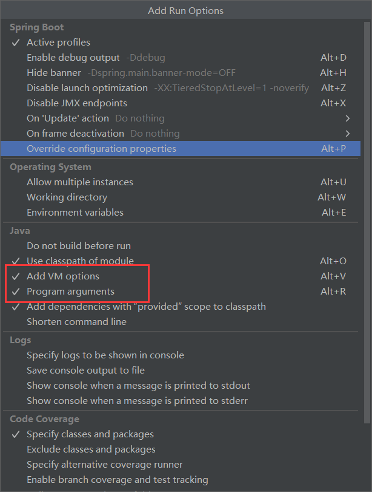

> 其中Add VM options配置java系统属性，Program arguments配置命令行参数：

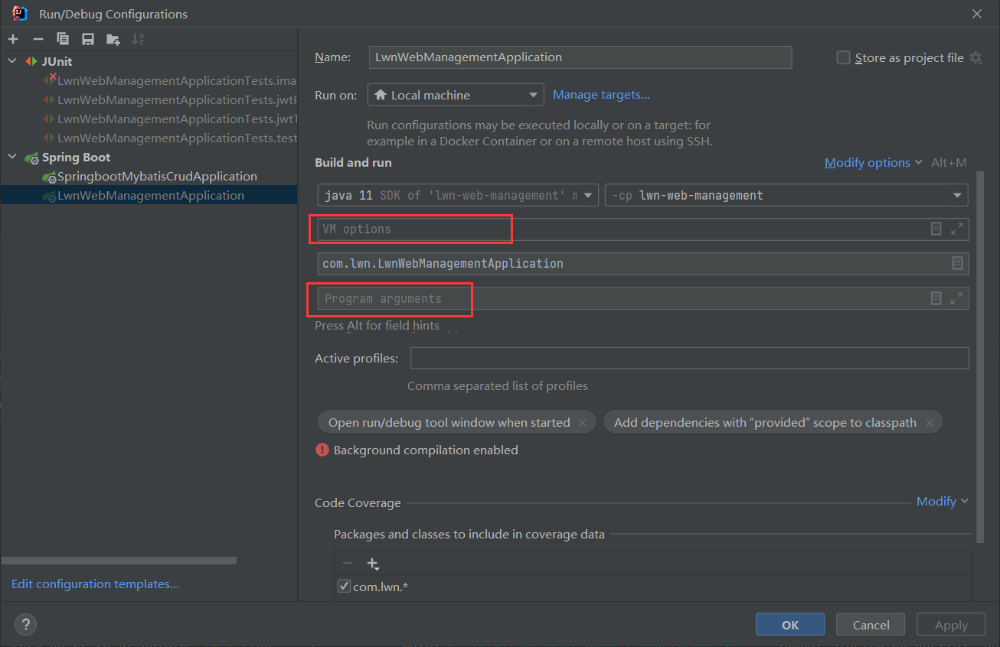

> 如：

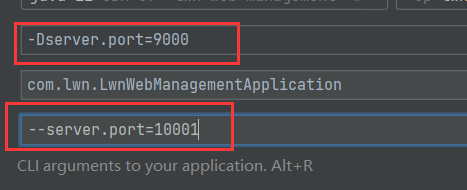

> 运行：

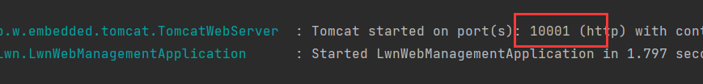

> 端口是10001，命令行参数生效，我们删除命令行参数，再次运行：

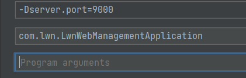

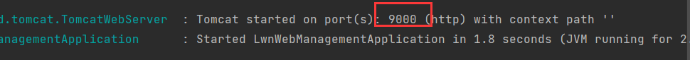

> 端口是9000，由此可见，这两种配置的优先级：命令行参数 > java系统属性。
>
> 但是这是我们在idea种配置的属性，当项目打包后如何指定java系统属性和命令行参数？


## 打包后如何配置属性

> 首先，我们需要运行maven的打包命令，将项目打包成jar包。
>
> 注意，springboot进行打包时，需要引入插件：spring-boot-maven-plugin。
>
> 但是我们一般不用手动引入，因为基于官方骨架创建的项目会自动引入：


> 然后我们执行命令：

```shell
java -jar jar包名
```

> 就能运行这个jar包，那么我们在执行这个命令时输入java系统属性或命令行参数的配置就能在打包的程序种配置其属性。
>
> 在java关键字后面写java系统属性，在最后写命令行参数，如：

```shell
java -Dserver.port=9000 jar包名 --server.port=10001
```

> 测试，先将项目打成jar包：

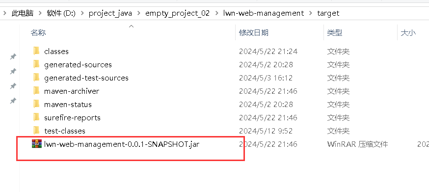

> 执行命令，先看命令提示：

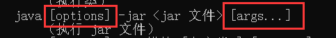

> [options]就是java配置属性而【args...】就是命令行参数。
>
> 一般的执行jar命令，端口默认8080：

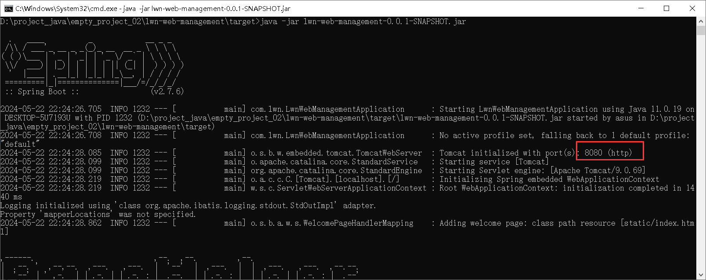

> 指定java系统属性和命令行参数：

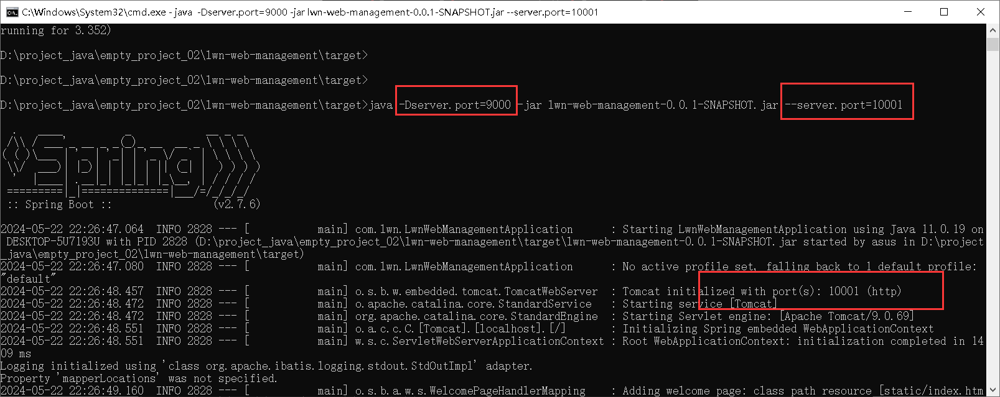

> 只保留java系统属性：

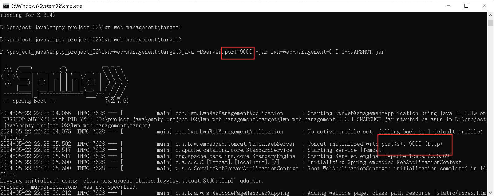


# 5种配置的优先级

> 创建的配置方法有5种：
>
> - properties
> - yml
> - yaml
> - java系统属性
> - 参数命令行
>
> 前3种是配置文件，后两种是外部属性的配置，现在测试3种和2种外部属性的配置的优先级：

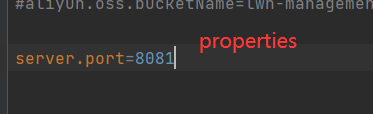

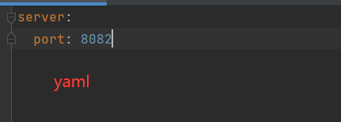

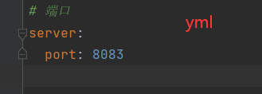

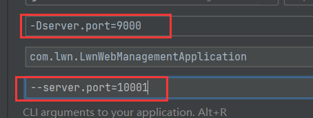

> 运行：

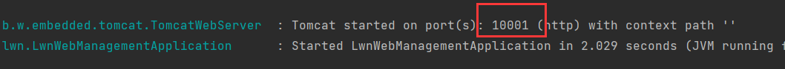

> 命令行参数生效参数，我们删除再测试：

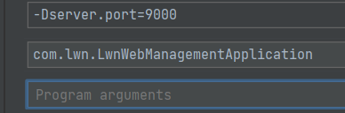

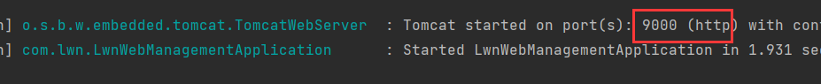

> java系统属性生效了，可见外部属性的配置是要被3种配置文件的优先级高。
>
> 5种配置的优先级：
>
> 命令行参数 > java系统属性 > properties > yml > yaml
