> 我们之前使用springboot开发应用非常方便，我们只需要关注业务层面的开发，框架层面由springboot帮我做了。接下来我们就来学习springboot为什么能简化我们的开发，以及它都帮我们做了什么。
>
> spring家族由很多优秀的框架，spring就是其中一种。而这些spring家族框架都是基于一个最核心的框架：spring框架来构建的。
>
> 我用原始的spring框架进行开发比较繁琐，主要体现在两方面：
>
> 1. 在pom.xml中的依赖配置比较繁琐，在项目开发时，我们需要自己去找依赖，还要找到这个依赖需要的其他依赖以及对应的版本。否则就会出现版本冲突问题。
> 2. 我们要想使用spring框架进行开发，就需要在spring的配置文件中进行大量的配置。这造成spring入门难度大，学习成本高。
>
> 基于此，spring官方在spring4.0以后推出了全新的框架：springboot。来简化spring框架的开发。springboot是简化spring框架的开发，而非替代。
>
> springboot之所以用起来简单快捷是因为springboot底层提供了2个非常重要的功能：
>
> - 起步依赖
> - 自动配置
>
> 起步依赖解决pom.xml文件配置依赖繁琐的问题，自动配置简化开发过程中Bean的声明和配置。

# 起步依赖

> 如果我们使用spring进行web开发，我们需要引入各种依赖：

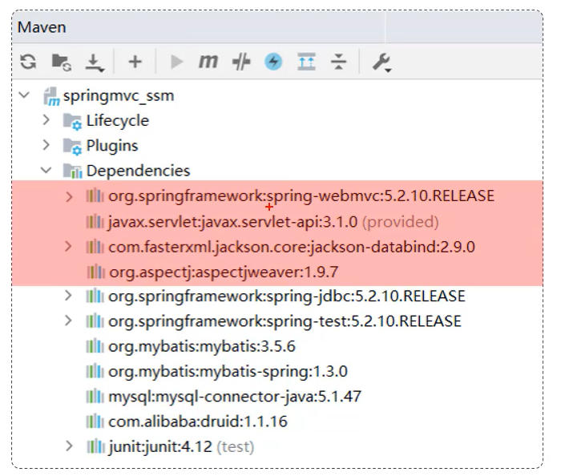

> 比如，我们要引入webmvc依赖，这是spring框架进行web开发所需要的依赖：

> 除此以外，我们按照需求还需要引入各种依赖：

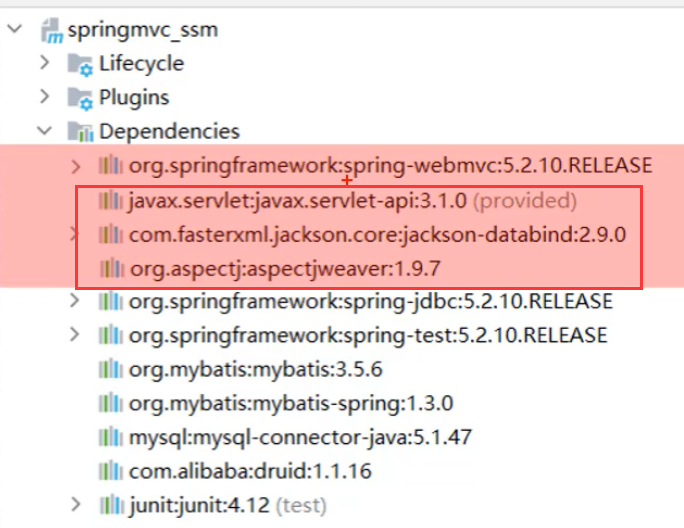

> 而且这些依赖的版本必须匹配，否则版本冲突。
>
> 而如果我们使用springboot进行开发，我们就不需要进入这么多依赖，我们只需要引入一种依赖即可，它就是起步依赖。
>
> 比如，进行web开发的起步依赖，spring-boot-starter-web：

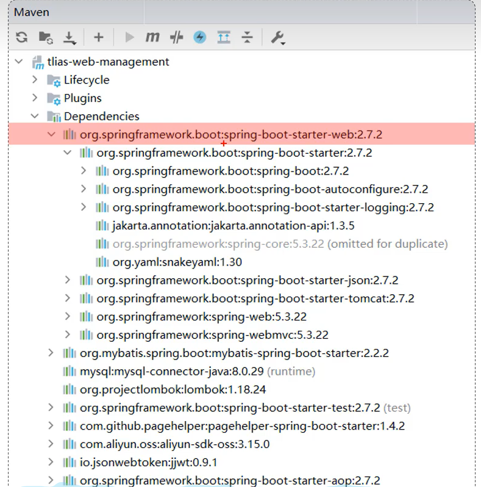

> 为什么我们只需要引入起步依赖就行了呢？原因非常简单，就是因为maven的依赖传递。在springboot为我们提供的这些起步依赖中都提供了当前程序开发所需要的所有的常见依赖。
>
> 比如，spring-boot-starter-web，它是web开发所需要的依赖，在这个依赖中就集成了所有web开发需要的常见依赖。我们只需要引入这一个依赖，其他的依赖都会通过maven的依赖传递传递进来。

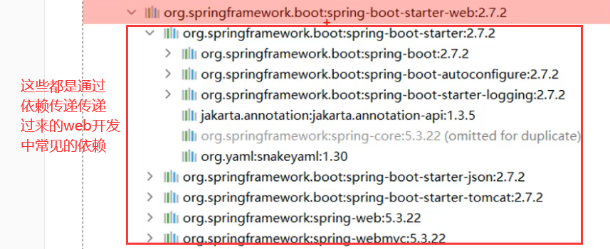

> 再比如，我们需要进行AOP相关的开发，我们也只需要进入AOP的起步依赖，那么就把AOP开发所需要的所有常见依赖都引入进来了。

# 自动配置

> 自动配置：SpringBoot的自动配置就是当spring容器启动后，一些配置类、bean对象就自动存入到了IOC容器中，不需要我们手动去声明，从而简化了开发，省去了繁琐的配置操作。
>
> 比如，sprinboot启动：

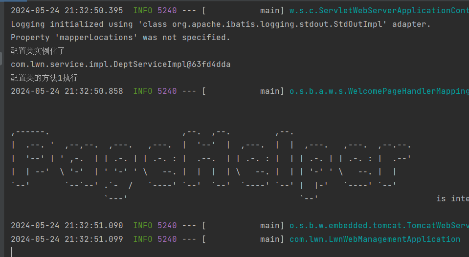

> 我们查看Bean：

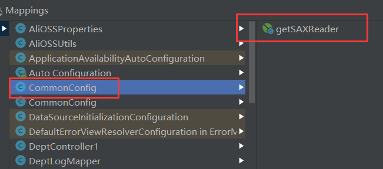

> 有这样的Bean：getSAXReader，这就是我们之前声明第三方Bean时创建的：

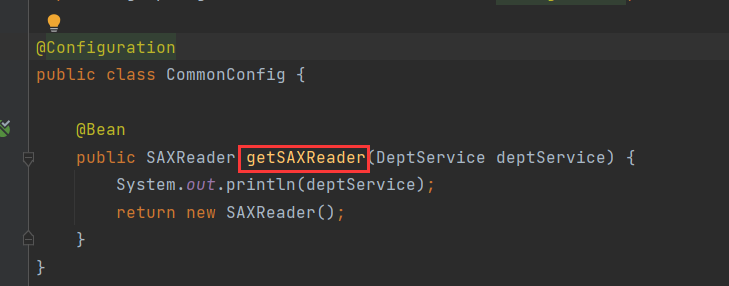

> 而且还有第二个Bean：commonConfig：

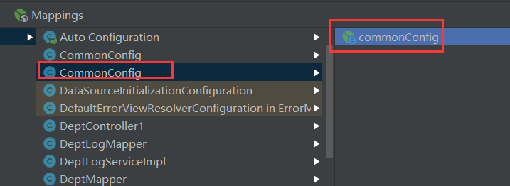

> 是CommonConfig的Bean，因为它声明了@Configuration注解，此注解底层有@Component：

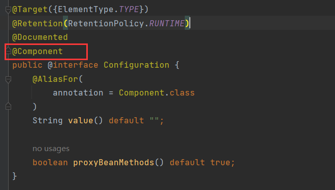

> 除此，还有controller、service、mapper的Bean：

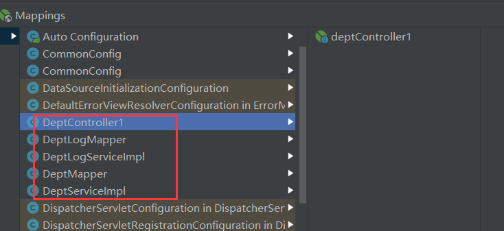

> 这是我们自定义的Bean，除此还有很多很多的Bean：

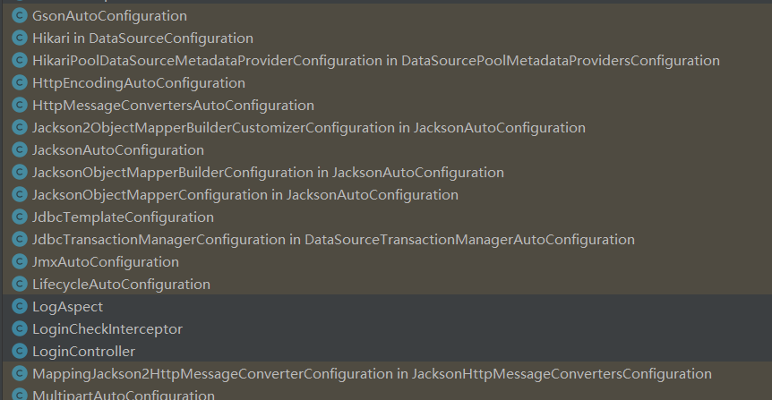

> 而且这些Bean基本上都带有Configuration这个单词，说明这些Bean基本上都是配置类。这些配置类都是springboot在启动时加载进来的。
>
> 比如这里有一个配置类叫GsonAutoConfiguration，它里面有一些Bean：

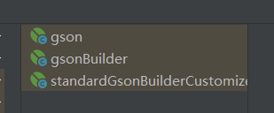

> 这个gson就是谷歌提供的处理JSON格式的数据的接口。既然它已经是Bean了，我们就可以直接注入来使用。
>
> 比如：

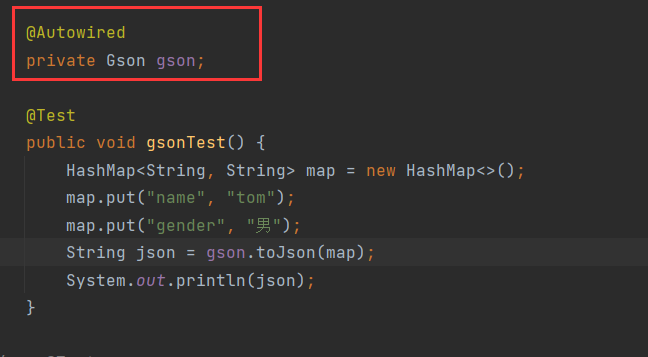

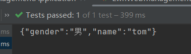

> 我们并没有声明gson这样的Bean但是我们却能使用，这就是因为springboot已经帮我们声明好了这样一个Bean，这就是自动配置的体现。

## 自动配置的原理

> 分析自动配置的原理，就是分析我们引入依赖后，依赖中的Bean或者配置类是如何加载到IOC中去的。
>
> 首先我们自定义一个工程来模拟第三方依赖：

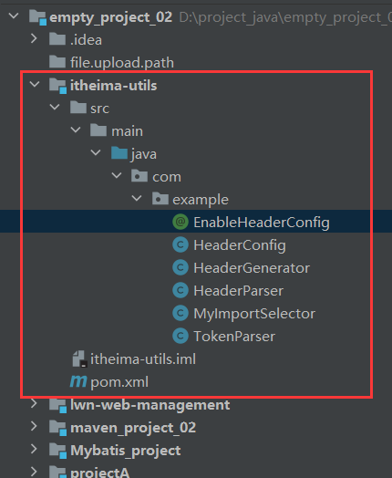

> 然后我们引入这个依赖：

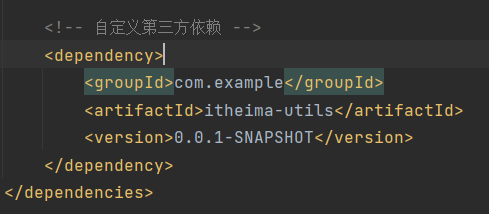

> 这个工程中定义了一些类：

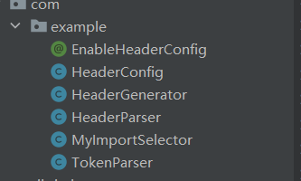

> 在TokenParser类中声明了@Component：

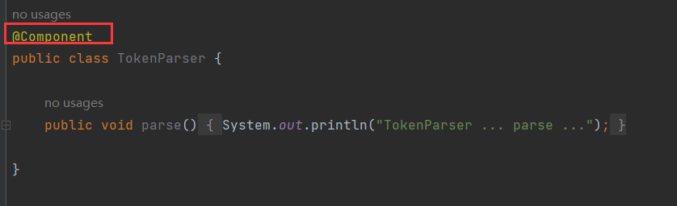

> 还有一个配置类，声明@Configuration，其底层使用了@Component：

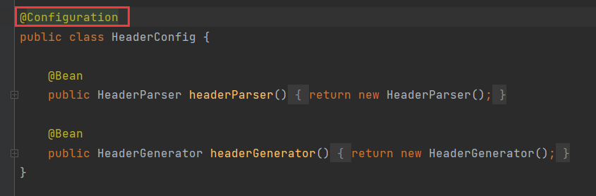

> 在这个配置类中，我们定义了两个Bean，一个是HeaderParser，一个是HeaderGenerator，分别是自定义的两个类：

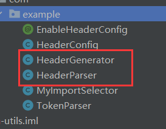

> 目前我们已经引入了这个依赖，启动项目后，IOC中是否会有HeaderParser和HeaderGenerator这些Bean呢？
>
> 测试一下：

> 从IOC容器中分别获取HeaderParser、HeaderGenerator、TokenParser的Bean，看看能不能获取到。
>
> 测试：

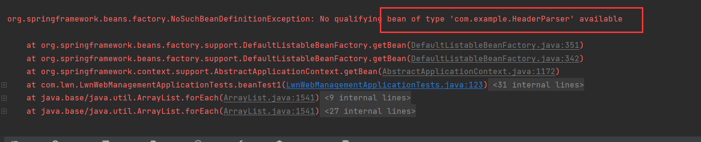

> 报错了，说没有找到HeaderParser类型的Bean，这说明我们引入的第三方依赖中声明的这些Bean和配置类没有生效。
>
> 为什么呢？原因很简单，Bean扫描范围的问题，默认情况下启动类上的注解扫描Bean的范围是启动类所在包及其子包，我们引入的第三方依赖并不在这个包下，所以扫描不到Bean自然无法存入IOC中。
>
> 我们用以前的老办法来解决，使用@ComponentScan重新配置扫描范围，注意@ComponentScan中需要传入数组：

> 测试，成功获取到Bean：

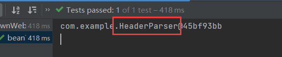

> 我们回想一下，之前开发中使用的第三方库像Mybatis，使用它提供的Bean，我们并没有在启动类上配置扫描，为什么没有采用这种方式呢？我们可以想象一下，如果采用这种方式，那么第三方需要配置的包名就会很多，非常繁琐，我们每引入新依赖，就得添加一个包名。

## @Import

> spring为我们提供了解决方法，使用@Import导入。使用@lmport导入的类会被Spring加载到IOC容器中，导入形式主要有以下几种：
>
> - 导入普通类，通过@Import将普通类导入后，就能将这个类交给ICO管理，这个类不管有没有声明@Component，被导入都能成为Bean
> - 导入配置类，配置类导入后，配置类中所有Bean对象都会加载到IOC中
> - 导入ImportSelector接口实现类
> - @EnableXxxx
>
> @Import的value属性中指定要导入的类，它接收一个数组。
>
> @Import主要是将组件和配置类(声明了@Component和@Configuration的类)导入，使得这些被导入的类能够被Spring容器扫描和实例化，但其实普通类(未声明任何注解的类)被导入后也能生成对应的Bean。@Import并不将导入的类生成Bean，他只是辅助Spring容器扫描和实例化，生成的动作是spring容器完成的。简单来说，@Import就是告诉spring容器，我导入的这些类你要生成对应的Bean。
>
> 1、导入普通类：

> 比如，我这里导入TokenParser这个类。测试：

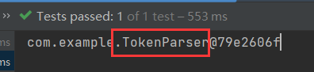

> 成功。
>
> 2、然后我们导入配置类，HeaderConfig，它下面声明了2个Bean，我们来看看导入后能否获取这两个Bean：

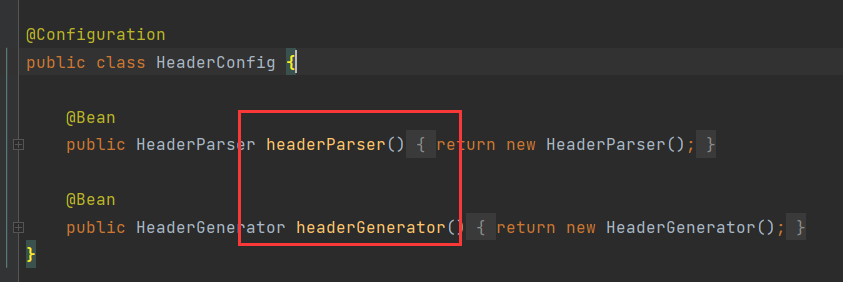

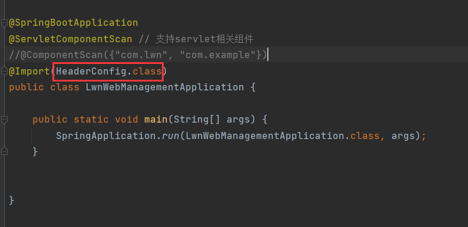

> 测试，成功：

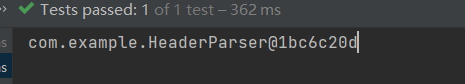

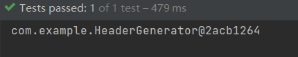

> 3、导入ImportSelector接口的实现类，ImportSelector中有一个selectImports方法，它返回一个String数组，这个数组中封装类名的信息。就是我们需要将哪些类交给IOC，可以直接将类的全类名封装在这个数组中。

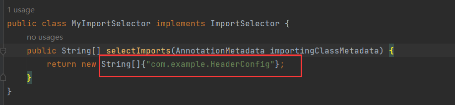

> 这个实现类中我们指定的类是HeaderConfig，这表示要将HeaderConfig交给IOC，然后我们导入该实现类：

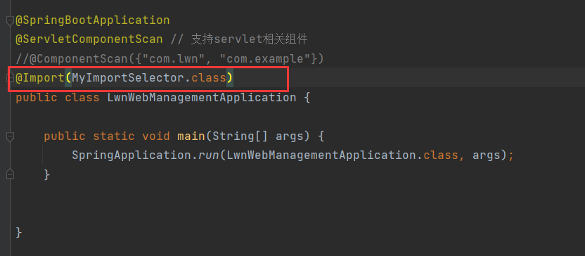

> 测试，配置类下的两个Bean看能不能获取：

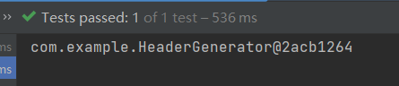

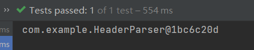

> 成功获取。
>
> 我们再想一下，虽然我们可以使用@Import来简化Bean扫描的麻烦，但是我们使用@Import是不是还得知道第三方依赖都有哪些可以导入的Bean，如果我们不知道我们就没法导入，虽然我们自己不清楚，但是第三方依赖它是清楚它有哪些Bean。所以，我们就不用自己来指定需要导入哪些Bean，交给第三方依赖来指定就行了。

## @EnableXxxx

> 一般第三方依赖它提供一个注解，一般以Enable开头，形如@EnableXxxx。这个注解它封装@Import注解，然后在@Import中再来指定要导入哪些Bean或者配置类。
>
> 比如，这个第三方依赖提供的注解EnableHeaderConfig：

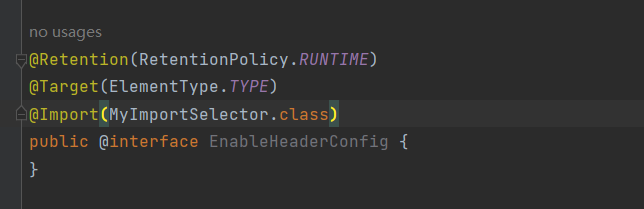

> 它使用了@Import，并声明了导入的类是MyImportSelector这个实现类：

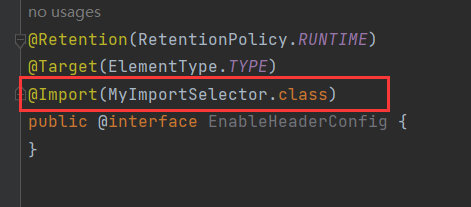

> 然后我们在启动类上就可以直接声明这个注解：

> 声明这个注解相当于是把@EnableHeaderConfig注解中导入的类导入到启动类这里来。
>
> 测试：

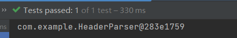

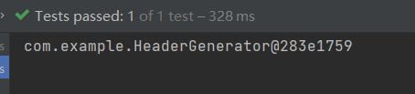

> 成功获取。

## @SpringBootApplication如何完成自动配置

> @SpringBootApplication是启动类的注解，是springboot框架的核心注解。
>
> 我们打开该注解：

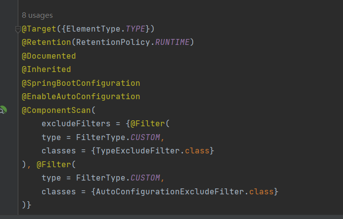

> 它封装了一系列注解，其中前四个是原生注解，我们不过多关注，主要看后三个注解：

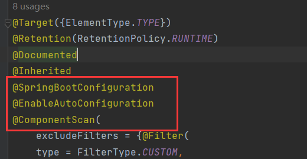

> @ComponentScan这个我们已经很熟悉了，它声明扫描包的范围，控制着由@Component及其衍生注解创建的Bean是否生效。
>
> @SpringBootConfiguration带Configuration字眼，是一个配置注解，打开查看：

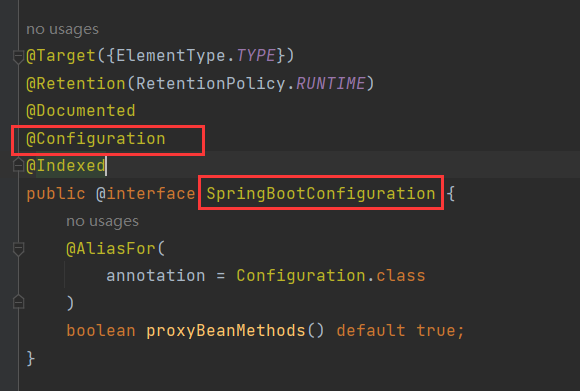

> 内部封装了@Configuration，所以我们的启动类同时也是一个配置类，这也是为什么我们上面可以直接在启动类中声明@Bean：

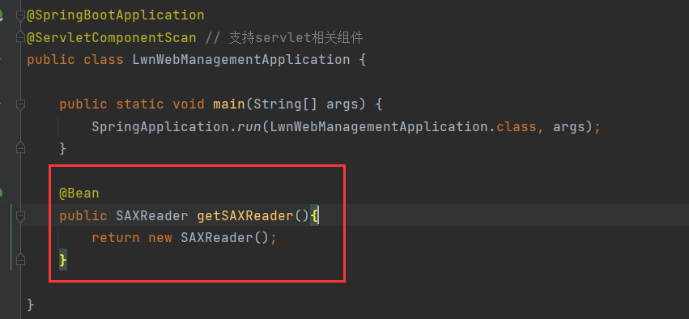

> 最后是@EnableAutoConfiguration这个注解，它的前缀是Enable，上面说过一般以Enable开头注解其内部都封装了@Import：

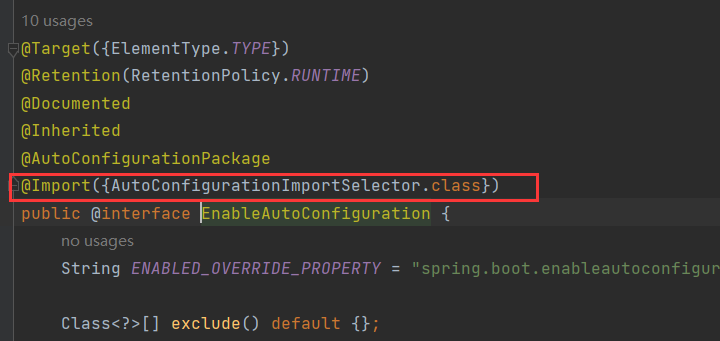

> 这里是导入了AutoConfigurationImportSelector类，所以我们再来看AutoConfigurationImportSelector类：

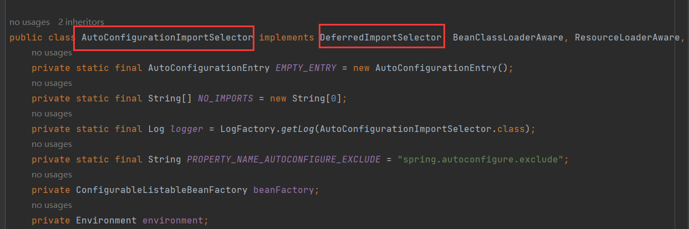

> AutoConfigurationImportSelector实现了DeferredImportSelector接口，而DeferredImportSelector接口继承自ImportSelector接口。

> 换句话说，AutoConfigurationImportSelector实现了ImportSelector接口。而且AutoConfigurationImportSelector的selectImports方法还返回一个String数组：

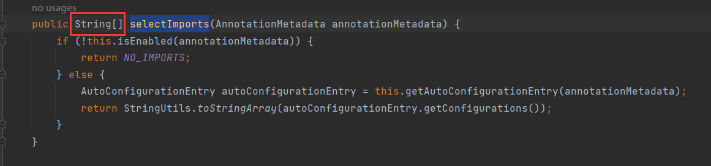

> 这不正好是上面所说的自动装配的流程吗。AutoConfigurationImportSelector实现了ImportSelector接口，并重写selectImports方法，然后返回一个String类型的数组，这个数组中就封装着需要装配的类。然后用@Import({AutoConfigurationImportSelector.class})来导入这个实现类，这是自动装配的第3种方法，@EnableAutoConfiguration底层封装了@Import({AutoConfigurationImportSelector.class})，这个是使用的自动装配的第4个方法为了简化在启动类上声明@Import。
>
> 以上这一系列操作的最终目的就是为了导入数组，然后让spring容器去生成数组中这些类的Bean。
>
> 那么这个数组是如何获取到需要装配的类的呢？
>
> 我们继续深挖，最终追踪到了这样的方法：

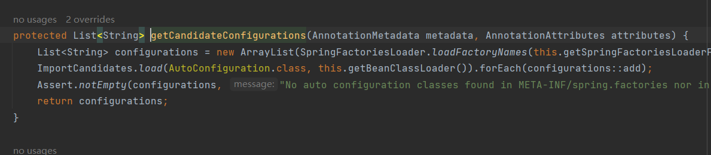

> 这里有一段描述：
>
> No auto configuration classes found in META-INF/spring.factories nor in META-INF/spring/org.springframework.boot.autoconfigure.AutoConfiguration.imports. If you are using a custom packaging, make sure that file is correct.
>
> 翻译：
>
> 在META-INF/spring.factores和META-INF/spring/org.springframework.boot.autoconfigure.AutoConfiguration.imports中都找不到自动配置类。自动配置导入。如果您使用的是自定义包装，请确保该文件是正确的。
>
> 什么意思呢，你看它说的，在META-INF/spring.factores和META-INF/spring/org.springframework.boot.autoconfigure.AutoConfiguration.imports中都找不到自动配置类，这说明它要去这两个地方找自动配的类。一个是spring.factores，另一个是AutoConfiguration.imports，META-INF是在jar包中的，所以要在存储项目jar包的地方External Libraries这里查找：

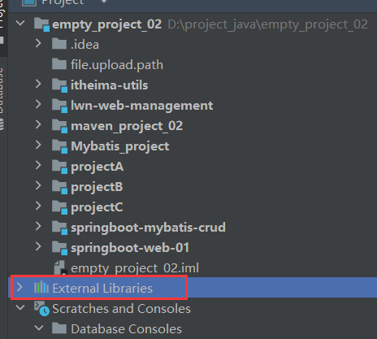

> 找到一个springboot的autonfigure：

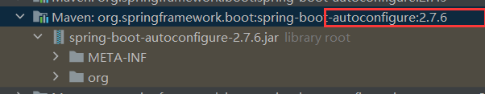

> 打开META-INF，它下面有一个spring.factores：

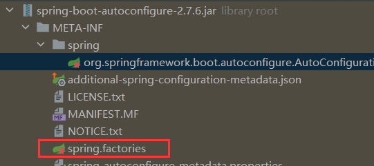

> ok，我们现在找到了一个，我们先打开该文件：

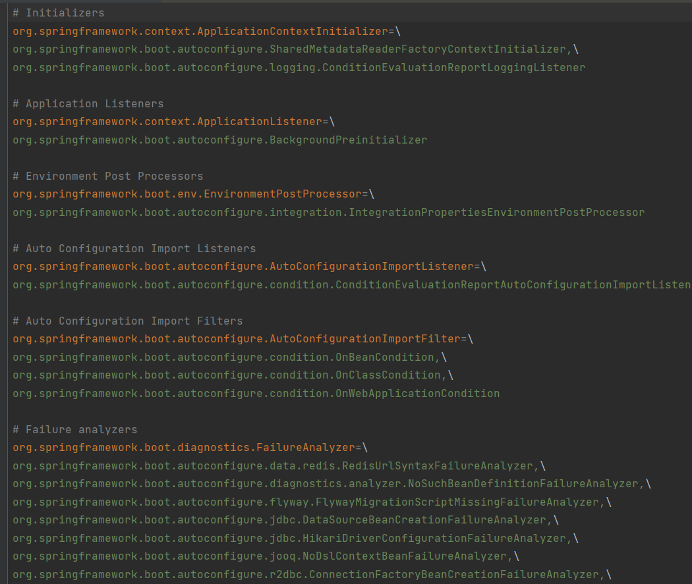

> 可以看到，它内部全部是类，这些类都是全类名，这些类就是需要配装的类。
>
> 然后再找到AutoConfiguration.imports：

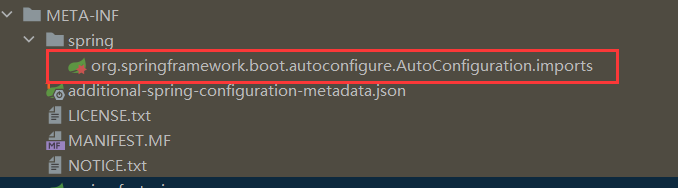

> 打开：

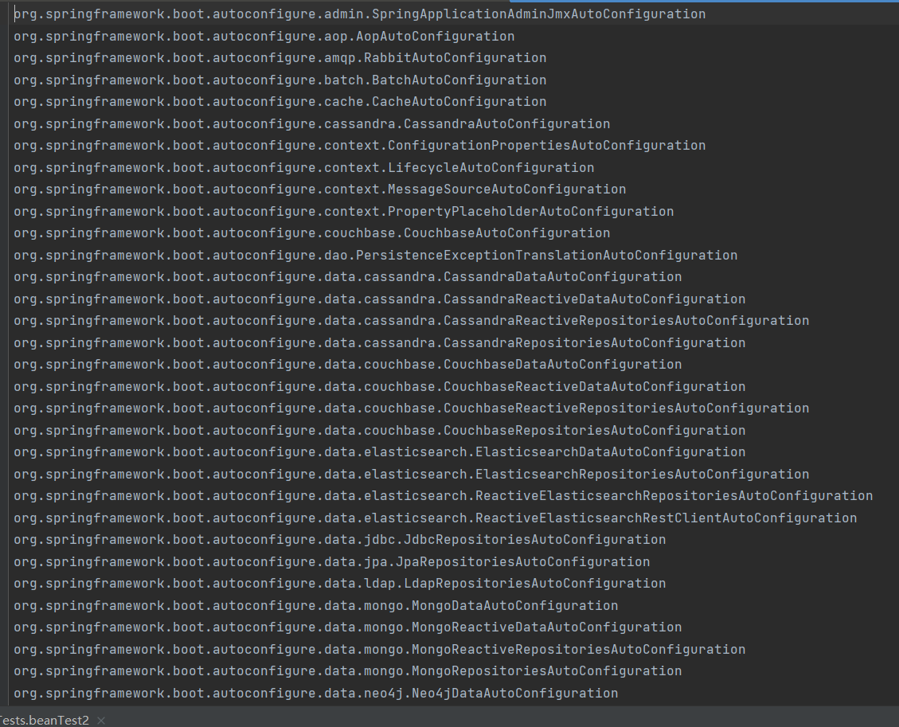

> 跟spring.factores很像，它内部也是全类名，这些也是需要装配的类。
>
> 那么getCandidateConfigurations方法它大致的作用，我们就清楚了：

> 它就是去解析这两个文件spring.factores和AutoConfiguration.imports，将这两个文件中的类封装到String[]中，然后返回。这就是数组能获取需要装配的类的原因。
>
> 注意： spring.factores是spring早期自动配置所加载的文件，在2.7版本之后引入了AutoConfiguration.imports文件，在2.7到3的版本中会兼容spring.factores，但是在3以后，springboot不再支持spring.factores，而是只使用AutoConfiguration.imports。
>
> @SpringBootApplication完成自动配置的整个流程我们也清楚了。
>
> 首先是AutoConfigurationImportSelector实现了ImportSelector接口，重写了selectImports方法，selectImports返回一个封装了需要装配的类的数组，这些需要装配的类都是在spring.factores和AutoConfiguration.imports这两个文件中解析出来的，返回以后，利用@Import的第3个方法，导入ImportSelector的实现类也就是AutoConfigurationImportSelector，从而导入返回的数组中的类，将这些类导入后由spring容器去生成对应的Bean。
>
> 这两份文件中定义了很多的类，这些类是否都会加载到IOC中去呢？并不是，我们随便打开一个类查看：

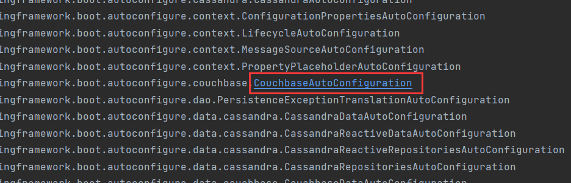

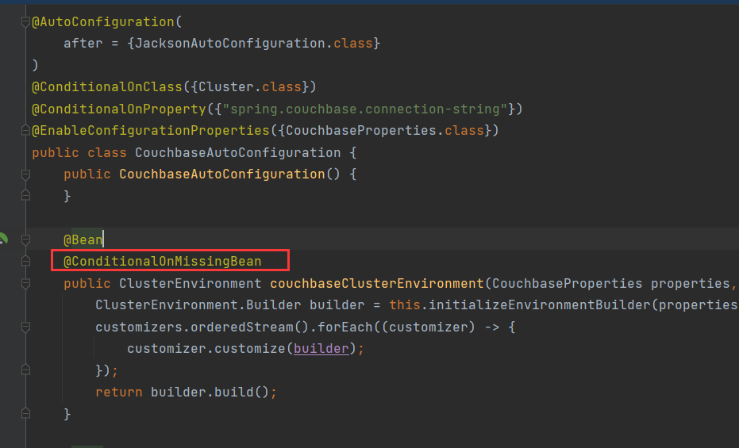

> 它的这个方法上声明了@ConditionalOnMissingBean，除了这个注解以外还有很多以Conditional为前缀的注解，这些注解的作用就是按条件装配，当满足条件才会将这个Bean注册到IOC中。

## @Conditional

> @Conditional是条件装配的注解，按照一定的条件进行判断，在满足给定条件后才会注册对应的bean对象到Spring IOC容器中。
>
> 它可以作用在方法和类上，在方法是表示只是针对该方法声明的这个Bean有效，如果加在类上表示针对于整个配置类都有效。
>
> @Conditional本身是一个父注解，派生出大量的子注解，下面介绍其中3种：
>
> - @ConditionalOnClass：判断环境中是否有对应字节码文件，有才注册bean到IOC容器。
> - @ConditionalOnMissingBean：判断环境中有没有对应的bean (可以根据Bean类型或名称判断)， 没有才注册bean到IOC容器。
> - @ConditionalOnProperty：判断配置文件中有没有对应属性和值，有才注册bean到IOC容器。
>
> 测试，我在启动类上加了一个注解@EnableHeaderConfig，它底层封装了@Import，导入的是MyImportSelector这个类，这个类实现ImportSelector，重写selectImports方法，返回的是com.example.HeaderConfig，说明要将com.example.HeaderConfig导入，生成对应的Bean：

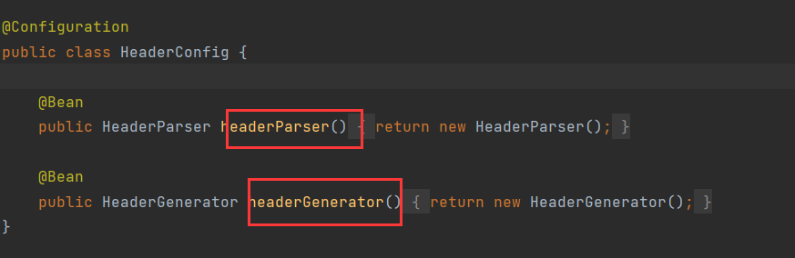

> 现在，我测试一个@ConditionalOnClass，他是只有当环境存在对应的字节码时，才注册到IOC中：

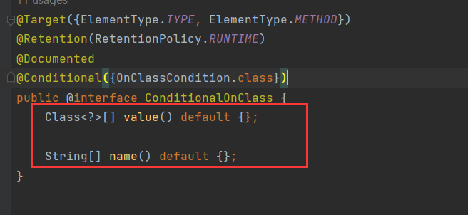

> 它指定字节码文件的方式有两种，一种时通过name属性，需要传入String[]里面存字节码文件对应的类的全类名。第二种是通过value，直接指定字节码文件对象数组。
>
> 我们就指定当前环境中有JWT的字节码文件才注册：

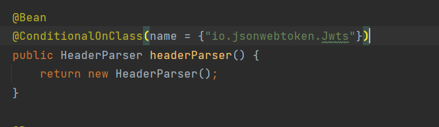

> pom中是有JWT的，也就是当前环境有JWT字节码，然后测试：

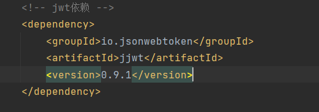

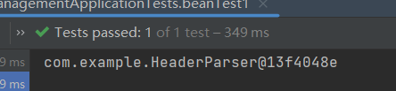

> 成功获取。现在我们改变字节码文化名，这个字节码肯定不存在：

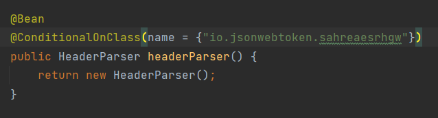

> 这时就找不到了：

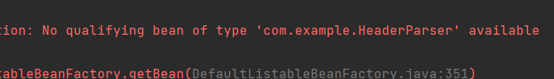

> 当前环境就是使用这个依赖的环境。
>
> 第二个@ConditionalOnMissingBean，环境中没有对应的bean注册bean到IOC容器。
>
> 如果@ConditionalOnMissingBean什么属性也没指定，就表示没有该类型的Bean才会注册，类型是方法的返回类型。

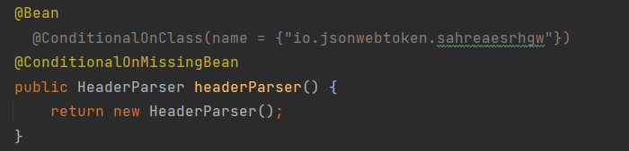

> 测试：

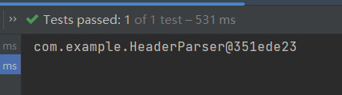

> @ConditionalOnMissingBean可以根据指定的类型和名称来判断，指定类型使用value属性，指定名称使用name属性。
>
> @ConditionalOnMissingBean的应用场景，通常是用来定义默认的Bean对象，默认的Bean对象指如果用户需要这个Bean，它自己定义了那么就用它自己定义的，如果它没有定义，还是要用那么就用默认的Bean对象。
>
> 第三个@ConditionalOnProperty，他跟配置文件有关系，在这个注解中我们可以指定两个属性name和havingValue，name指定配置文件中的配置项的key，而havingValue指定配置项的value。
>
> 比如，我指定@ConditionalOnProperty(name="name",havingValue="123")，那么它会到当前环境的配置文件中去找有没有name：123(name=123)这一项，有则注册没有则不注册。

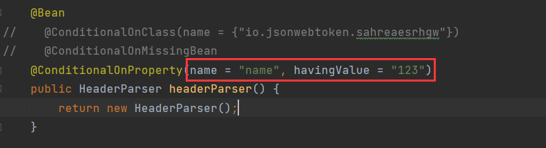

> 测试：

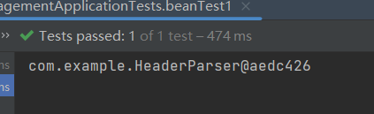

> 配置一改，报错：

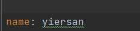

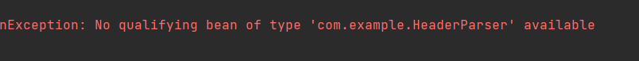

> 这个使用场景也比较多，比如我们使用第三方库时需要在配置文件中声明对应的配置项，才能生成对应的Bean。