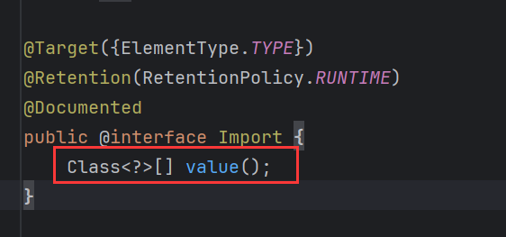
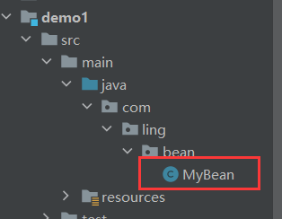
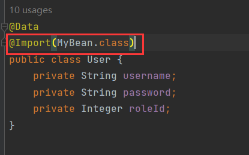
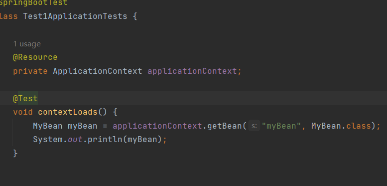
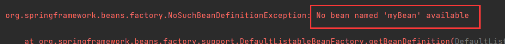
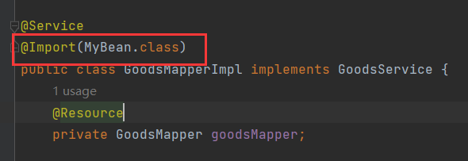
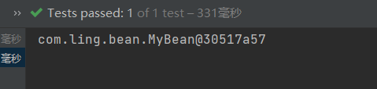

# 1 springboot框架简化开发

使用springboot开发应用非常方便，我们只需要关注业务层面的开发，框架层面由springboot帮我做了。下面介绍springboot为什么能简化我们的开发，以及它都帮我们做了什么。

spring家族有很多优秀的框架，spring就是其中一种。而spring家族的框架都是基于一个最核心的框架：spring框架来构建的。

spring框架开发较繁琐主要体现在两方面：

1. 在pom.xml中的依赖配置比较繁琐，在项目开发时，需要自己去找依赖，还要找到这个依赖需要的其他依赖以及对应的版本。否则就会出现版本冲突问题。
2. spring开发需要在配置文件中进行大量的配置。这造成spring入门难度大，学习成本高。

基于此，spring官方在spring4.0以后推出了全新的框架：springboot。来简化spring框架的开发。springboot用于简化spring框架的开发，而非替代。

springboot之所以用起来简单快捷是因为springboot底层提供了2个非常重要的功能：

- **起步依赖**，解决pom.xml文件配置依赖繁琐的问题。
- **自动配置**，简化开发过程中`Bean`的声明和配置。


# 2 起步依赖

spring进行web开发，需要引入各种依赖：


比如，webmvc依赖，这是spring框架进行web开发所需要的依赖：


除此以外，按照需求还需要引入其他的依赖：


而且这些依赖的版本必须匹配，否则版本冲突。如果使用springboot进行开发，我们就不需要进入这么多依赖，只需要起步依赖即可。

比如，进行web开发的起步依赖，spring-boot-starter-web：


**Q：为什么我们只需要引入起步依赖就行了呢？**

**A：**因为maven的依赖传递。在springboot为我们提供的这些起步依赖中都提供了当前程序开发所需要的所有的常见依赖。比如，spring-boot-starter-web，它是web开发所需要的依赖，在这个依赖中就集成了所有web开发需要的常见依赖。只需要引入这一个依赖，其他的依赖都会通过maven的依赖传递传递进来。


假设现在需要进行AOP相关的开发，我们也只需引入AOP的起步依赖，相应的AOP开发所需要的所有常见依赖也都会传递过来。


# 3 自动配置

> 当spring容器启动后，一些配置类、`Bean`对象就自动存入到了IOC容器中，不需要我们手动去声明，从而简化了开发，省去了繁琐的配置操作。

启动sprinboot时，spring容器会自动加载配置类：


查看`Bean`：


`getSAXReader`，这是之前声明的第三方`Bean`：


诸如配置类`CommonConfig`的`Bean`：


此外，还有三层架构的`Bean`：


非自定义的`Bean`，这些`Bean`都带有Configuration后缀，说明大概率是配置类：


这些配置类都是springboot在启动时加载进来的。比如`GsonAutoConfiguration`配置类的`Bean`：


`Gson`是谷歌提供的处理JSON格式的数据的接口。既然它已经是`Bean`了，我们就可以直接注入来使用：


## 3.1 自动配置的原理

分析自动配置的原理，就是分析引入依赖后，依赖中的`Bean`或者配置类是如何加载到IOC中去的。

首先自定义一个工程来模拟第三方依赖：


引入这个依赖：


工程中定义了一些类：


`TokenParser`中声明为组件：


配置类`HanderConfig`，其中定义两个`Bean方法`返回`HeaderParser`和`HeaderGenerator`：


测试，引入依赖启动项目，IOC中是否会有这些`Bean`：


报错，无法获取`Bean`：


这说明引入的第三方依赖中声明的这些`Bean`和配置类没有生效。

这是`Bean`扫描范围的问题。默认情况下启动类扫描`Bean`的范围是启动类所在包及其子包，我们引入的第三方依赖并不在这个包下，所以扫描不到`Bean`自然无法存入IOC中。

使用`@ComponentScan`重新配置扫描范围：


测试，成功获取到`Bean`：


第三方库Mybatis，使用它提供的`Bean`时，并没有在启动类上配置扫描。

**Q：Mybatis为什么没有采用采用配置扫描的方式呢？**

**A：**如果采用这种方式，那么第三方需要配置的包名就会很多，非常繁琐，我们每引入新依赖，就得添加一个包名。


## 3.2 @Import

为了解决第三方依赖引入，启动类无法扫描到第三方包的包扫描问题，spring提供了`@Import`注解。

> `@Import`用于导入其他配置类或组件。

导入形式主要有以下几种：

- 导入组件，通过`@Import`将组件导入。
- 导入配置类，配置类导入后，配置类中所有`Bean`对象都会加载到IOC中。
- 导入`ImportSelector`接口实现类。
- `@Enable`前缀的注解。

`@Import`解决包扫描问题的思路：
第三方库定义了`@Component`和`@Configeration`的`Bean`，但是由于不在启动类所在包及其子包下，导致这些`Bean`不能被扫描到，无法注入IOC中。虽然第三方库存在这些包限制，但是在自己的项目中肯定存在一个配置类是位于启动类所在包及其子包下的，没错它就是启动类本身，因为启动类它自己就是一个配置类。那么用`@Import`将第三方的`Bean`导入到这个配置类中，这样在配置类加载的过程中，就会顺便把这些导入的`Bean`也一起加载了，从而跨越了包限制，导入可以理解为将被导入的内容复制到当前配置类中

更简单的理解，就是我(第三方)因为存在包限制无法将我的内容(`Bean`)注入到你(自己的项目)的容器中，但是你可以通过`@Import`将我的`Bean`委托给你，由你在加载时顺便帮我把我的`Bean`注入到容器中。

`@Import`的`value`属性中来指定需要导入的类，类型为`Class`数组：



1、导入组件`TokenParser`：


2、导入配置类`HeaderConfig`：


3、导入`ImportSelector`接口的实现类，`ImportSelector`提供的`selectImports()`，反回一个`String[]`，在这个数组中封装需要导入的类：


这里`selectImports()`返回的是`HeaderConfig`，spring容器就会去加载`HeaderConfig`：


**Q：必须导入到配置类中才能导入`Bean`吗？**

**A：**准确来说应该是导入到组件中才能导入`Bean`，因为`@Configeration`底层封装了`@Component`，所以配置类也是一个组件，只不过是一个特殊的组件。如果我将被注册的`Bean`导入到一个普通类中，那么这些`Bean`不会注入IOC：

`MyBean`位于demo1项目：



引入该项目依赖，然后导入到当前项目的普通类中：



尝试获取这个`Bean`：





显然，这个`Bean`并没有注入到IOC中。

如果将其导入到组件中：



`@Service`底层封装了`@Component`，所以它修饰的类也是组件，再次运行，则能成功获取到`Bean`：



**Q：导入普通类，该类的`Bean`也能注入IOC中去吗？**

**A：**看情况，如果该类没有实现`ImportSelector`，则不能。因为该类连`Bean`都没有，我们回顾一下`@Import`的作用，将配置类(组件)或组件导入，你得首先是一个组件，如果都不是组件，spring容器如何为你创建`Bean`。


## 3.3 @EnableXxxx

`@Import`使用时需要指定被导入的组件，但是对于第三方依赖，我们很难直接获取它提供的组件名称，不过，虽然我们自己不清楚，但是第三方依赖的作者清楚他的库有哪些组件。所以，我们不需要自己来指定导入哪些组件，交给第三方依赖来指定就行了。

一般第三方依赖会提供一个注解，以`Enable`开头，形如`@EnableXxxx`。这个注解底层封装了`@Import`，并在`@Import`中指定了提供的组件。

比如，这个第三方依赖提供的注解`@EnableHeaderConfig`：


它指定导入`MyImportSelector`：


在启动类上声明`@EnableHeaderConfig`：


即相对于把`@EnableHeaderConfig`底层指定的组件导入到当前组件中，那么IOC中就存在这些`Bean`：


## 3.4 @SpringBootApplication如何完成自动配置

`@SpringBootApplication`是启动类注解，是springboot框架的核心注解。

底层源码如下：


它封装了一系列注解，其中前四个是原生注解，主要看后三个注解：


`@ComponentScan`它声明扫描包的范围，控制着@Component及其衍生注解创建的`Bean`是否生效。

`@SpringBootConfiguration`是一个配置类注解，源码如下：


内部封装了`@Configuration`，启动类也是一个配置类。

最后是`@EnableAutoConfiguration`这个注解，它的前缀是Enable，上面说过一般以Enable开头的注解其内部都封装了`@Import`：


这里是导入了`AutoConfigurationImportSelector`类，源码如下：


`AutoConfigurationImportSelector`实现了`DeferredImportSelector`接口，而`DeferredImportSelector`接口继承自`ImportSelector`接口。


即`AutoConfigurationImportSelector`实现了`ImportSelector`，且其`selectImports()`还返回一个`String[]`：


这正好是`@Import`的第三种导入方式，`String[]`存在着需要装配的组件。

为了查看`String[]`如何获取到需要装配组件，继续深挖最终追踪到了这样的方法：


这里有一段描述：

```java
No auto configuration classes found in META-INF/spring.factories nor in META-INF/spring/org.springframework.boot.autoconfigure.AutoConfiguration.imports. If you are using a custom packaging, make sure that file is correct.
// 翻译
在META-INF/spring.factores和META-INF/spring/org.springframework.boot.autoconfigure.AutoConfiguration.imports中都找不到自动配置类。自动配置导入。如果您使用的是自定义包装，请确保该文件是正确的。
```

根据描述信息可知，这个方法会到这两个地方去查找组件：

- META-INF/spring.factores
- META-INF/spring/org.springframework.boot.autoconfigure.AutoConfiguration.imports

一个是spring.factores，另一个是AutoConfiguration.imports，它们位于META-INF下，而META-INF是jar包中的目录，所以到存放jar包的目录External Libraries这里查看：


找到一个springboot的autonfigure：


打开META-INF，它下面有一个spring.factores：


此文件内容：


可以看到，它内部全部是类，这些类就正是需要配装的组件。

然后再找到AutoConfiguration.imports：


此文件内容：


跟spring.factores一样，它内部也全是类，这些也是需要装配的组件。

那么getCandidateConfigurations方法它大致的作用，我们就清楚了：


它就是去解析这两个文件，将这两个文件中的类封装到`String[]`中，然后返回。这就是数组能获取需要装配的组件的原因。

> spring.factores是spring早期自动配置所加载的文件，在2.7版本之后引入了AutoConfiguration.imports文件，在2.7到3的版本中会兼容spring.factores但是在3以后，springboot不再支持spring.factores，而是只使用AutoConfiguration.imports。

`@SpringBootApplication`完成自动配置的整个流程我们也清楚了。

**Q：这两份文件中定义了很多的类，这些类是否都会加载到IOC中去呢？**

**A：**并不是，随便打开一个类查看：


它的这个方法上声明了`@ConditionalOnMissingBean`，除了这个注解以外还有很多以Conditional为前缀的注解，这些注解的作用就是按条件装配，当满足条件才会将这个`Bean`注册到IOC中。


## 3.5 @Conditional

`@Conditional`是条件装配的注解，按照一定的条件进行判断，在满足给定条件后才会注册对应的`Bean`对象到IOC容器中。

它可以作用在方法和类上：

- 在方法上，表示条件只是针对该方法声明的这个`Bean`有效，
- 在类上，表示针对于整个配置类都有效。

`@Conditional`本身是一个父注解，派生出大量的子注解，下面介绍其中3种：

| 注解名称                    | 作用                                                         |
| --------------------------- | ------------------------------------------------------------ |
| `@ConditionalOnClass`       | 判断环境中是否有对应字节码文件，有才注册到容器。             |
| `@ConditionalOnMissingBean` | 判断环境中有没有对应的`Bean`(根据`Bean`类型或名称判断)， 没有才注册到容器 |
| `@ConditionalOnProperty`    | 判断配置文件中有没有对应属性和值，有才注册到容器。           |

在启动类上加了一个注解`@EnableHeaderConfig`，它底层封导入的是`MyImportSelector`类，该类的`selectImports()`，返回的数组中的内容为com.example.HeaderConfig，说明要将`HeaderConfig`导入，生成对应的`Bean`：


添加`@ConditionalOnClass`，它只有在当环境存在对应的字节码时，才注册到IOC中：


它指定字节码文件的方式有两种，`name`和`value`，一个是全类名的数组，一个是字节码对象的数组。

条件设置为当前环境中存在`Jwts`的字节码文件才注册：


当前环境有JWT的字节码：


成功获取：


换另一个不存在的字节码：


这时就找不到了：


第二个`@ConditionalOnMissingBean`，环境中没有对应的`Bean`时注册到IOC容器。如果`@ConditionalOnMissingBean`什么属性也没指定，就表示没有该类型的`Bean`才会注册，类型是方法的返回类型。


`@ConditionalOnMissingBean`可以根据指定的类型和名称来判断，指定类型使用`value`属性，指定名称使用`name`属性。其应用场景，通常是用来定义默认的`Bean`对象，指的是如果用户需要这个`Bean`，但他自己定义了那么就用他自己定义的，如果他没有定义，那么就用默认的`Bean`对象。

第三个`@ConditionalOnProperty`，他跟配置文件有关系，在这个注解中可以指定两个属性`name`和`havingValue`，`name`指定配置文件中的配置项的key，而havingValue指定配置项的value。

比如：

```java
@ConditionalOnProperty(name="name",havingValue="123")
```

那么它就会到当前环境的配置文件中去找有没有name=123这一项，有则注册没有则不注册。


有匹配的键值对：


没有匹配的键值对：


这个使用场景也比较多，因为我们在使用第三方库时需要大量依赖于配置文件，且保证配置文件按照规定的格式定义，正是基于此注解。