# 1 自定义starter分析

starter是springboot中的起步依赖。springboot本身为我了提供了很多的起步依赖，为什么我们还要自定义starter呢？因为不是所有第三方依赖都提供了整合springboot的起步依赖。

比如，之前使用的OSS，阿里云官方并没有提供OSS的起步依赖。但是OSS适用性很广泛，在很多项目中都能使用。如果没有起步依赖，那么在这些项目中我们需要重复进行OSS的依赖引入，编写工具类等操作，非常麻烦。

在实际开发中，经常会定义一些公共组件，提供给各个项目团队使用。而在SpringBoot的项目中，一般会将这些公共组件封装为SpringBoot的starter。

## 1.1 命名规范

starter命名规范：

如果是springboot提供的，命名以 "spring-boot-starter-功能" 的格式

如果是第三方提供的，命名以 "功能-spring-boot-starter"  的格式

比如：


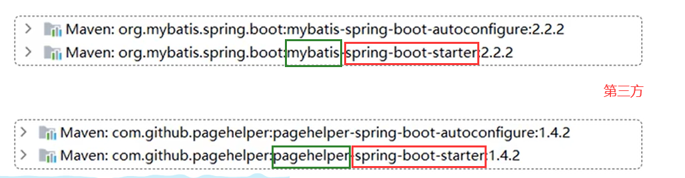

## 1.2 starter分析

以mybatis的依赖为例：

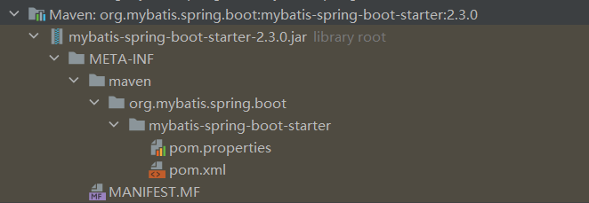

一个java代码都没有，这个starter就只做了一件事，就是将mybatis开发所需要的依赖配置在POM中：

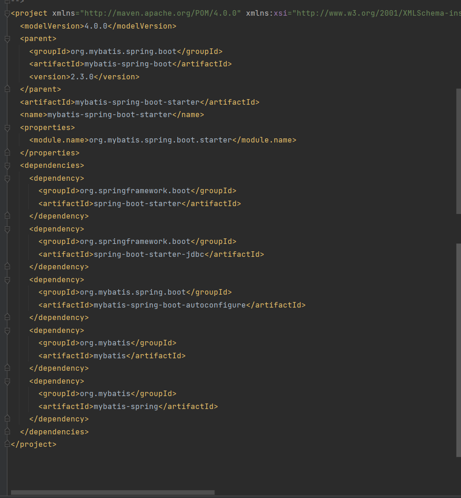

这其中，有一个依赖比较特殊：

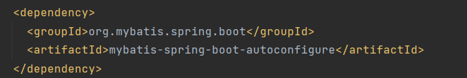

它是mybatis的自动配置依赖，在mybatis依赖的上面：


里面定义了一些类和注解：

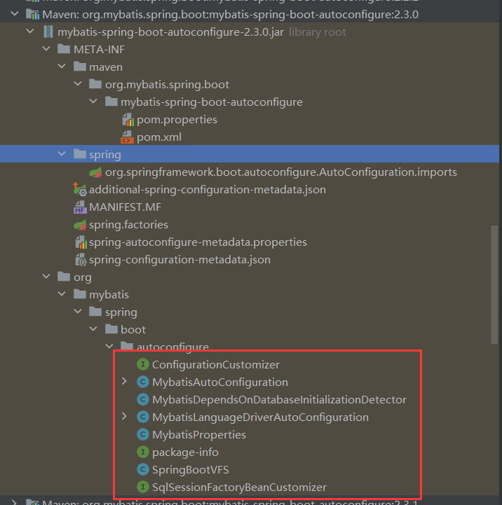

在这个自动配置依赖中就声明mybatis提供的组件，上文说过springboot要完成自动配置需要加载两份配置文件：

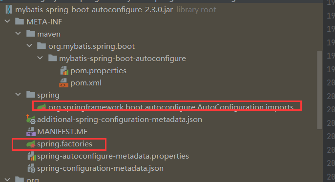

这些组件就声明在这些文件中，从而能被springboot识别完成自动配置：

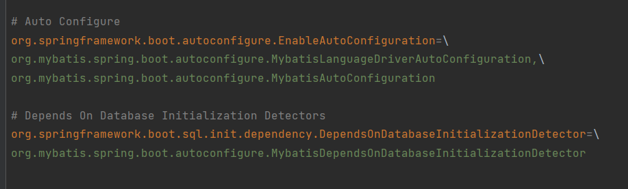

这就是为什么我们在使用mybatis的时候不用在启动类上导入组件，因为mybatis依赖中配置了spring.factories和AutoConfiguration.imports这两个文件，由springboot去识别这两个文件，完成自动装配。

在第三方模块案例中，虽然最后使用了`@Enable`注解来简化了导入的书写，但是依然要在启动类上声明`@Enable`。可以考虑创建者两个文件，将提供的组件定义在文件中，由springboot完成自动装配。

## 1.3 starter的定义规范

在自定义starter时，按照规范需要定义两个模块，第一个模块是starter模块，这个模块只用来做依赖管理：

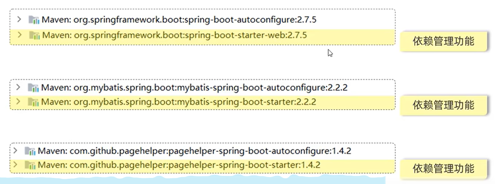

把需要的依赖都定义在starter中。

第二个模块就是autoconfigure，这个模块用来完成自动配置的操作：

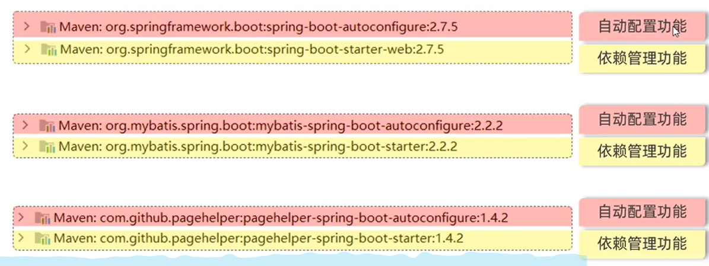

最后在starter中引入autoconfigure，通过依赖传递，项目开发中只需引入starter即可。


# 2 实现

## 2.1 需求和目标

**需求：**

自定义aliyun-oss-spring-boot-starter，完成阿里云OSS操作工具类`AliyunOSSUtils`的自动配置。

**目标：**

引入起步依赖，依赖注入后，拿到`AliyunOSSUtils`能直接使用。

## 2.2 步骤

1. 创建starter模块，其中引入OSS相关依赖
2. 创建autoconfigure模块，在starter中引入autoconfigure
3. 在autoconfigure中完成自动配置的操作，需要定义自动配置文件META-INF/spring/ xxxx.imports，此处不定义spring.factories

## 2.3 创建starter模块

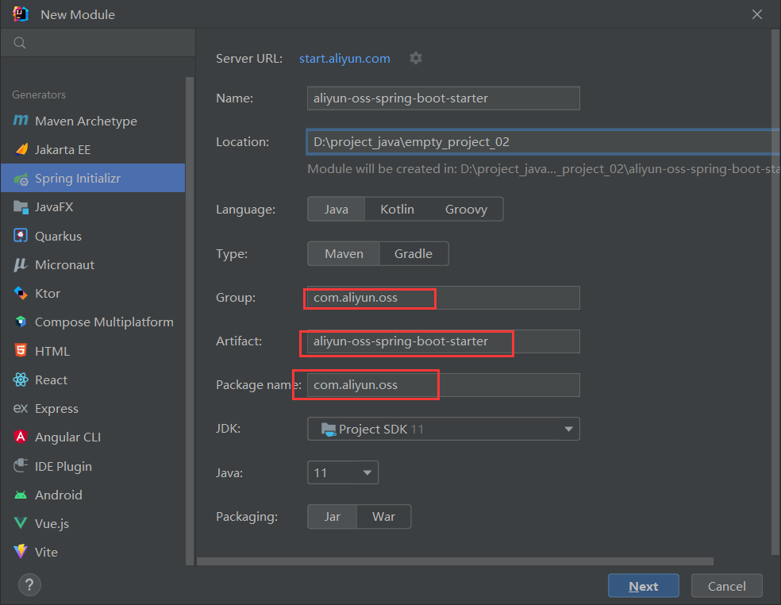

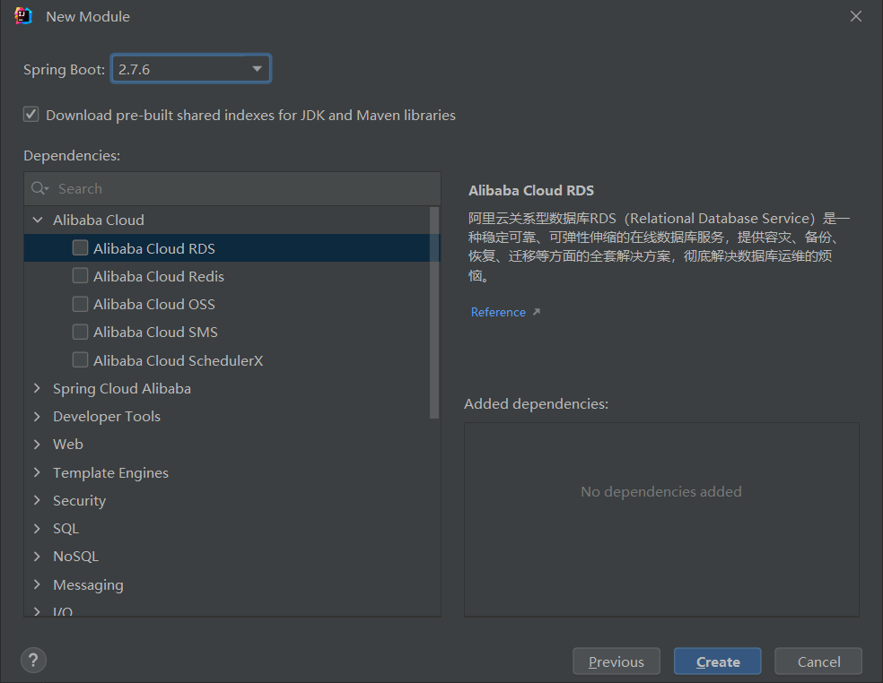

starter仅作依赖管理，因此pom诸如描述类的信息可以删除：

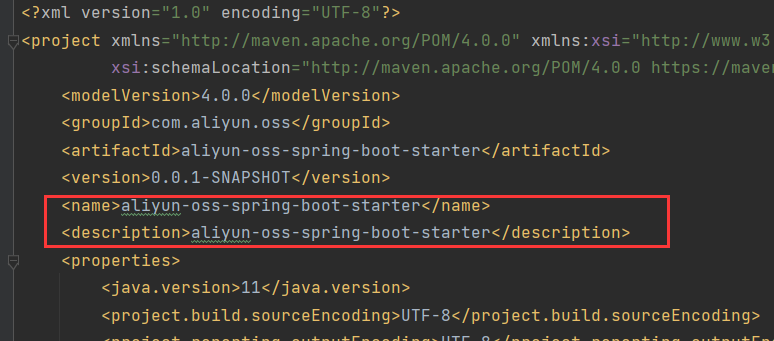

单元测试可以删除：

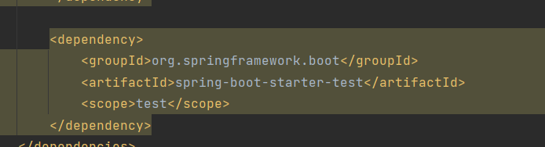

插件可以删除：


starter中没有任何的java代码，所以目录可以删除。

<font color=red>**注意**</font>：.iml文件不能删除，这是idea的配置文件。如果没有.iml文件，就点两下ctrl：


点Project下拉框，选择项目模块：

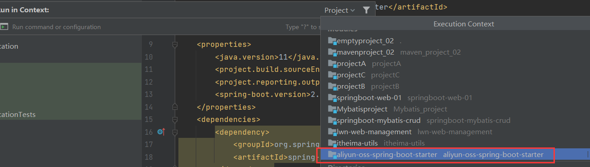

输入：

```shell
mvn idea:module
```


文件出现：

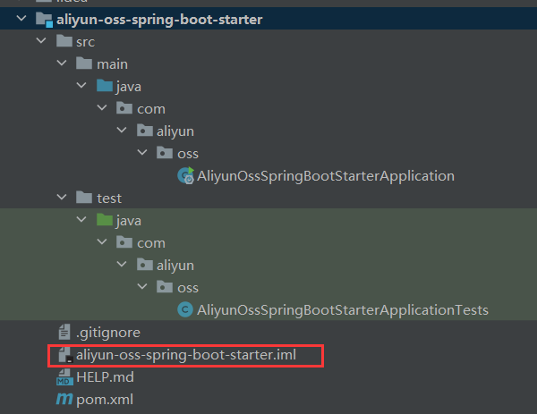

然后删除其他目录：


## 2.4 创建autoconfigure模块

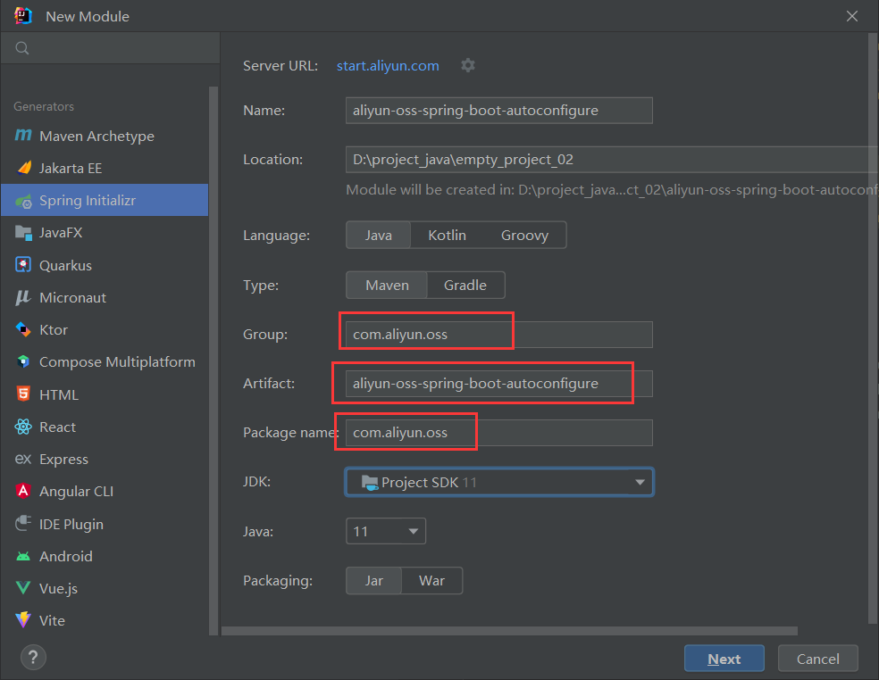

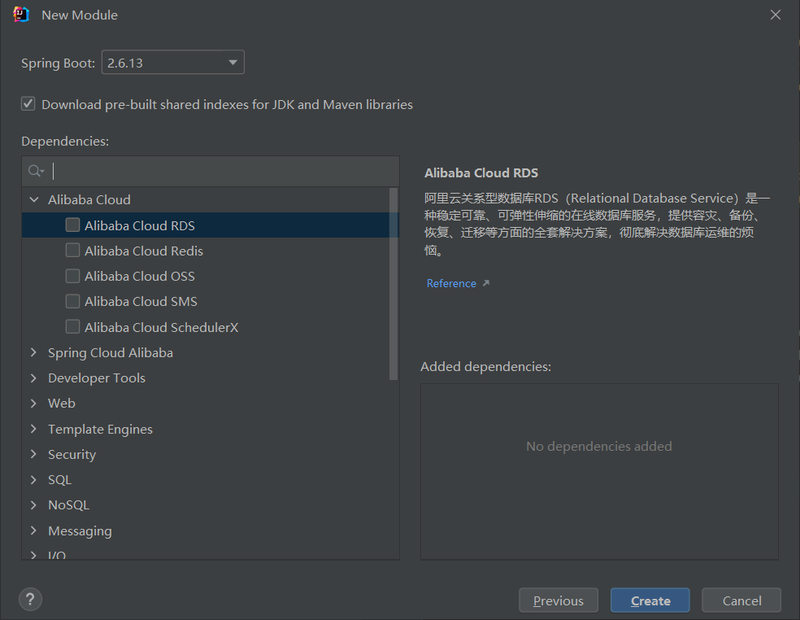

pom如法炮制，描述信息、单元测试和插件都可以删除：


目录可删除，保留src：

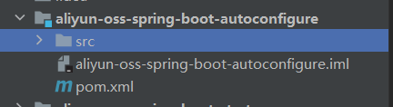

删除启动类：


删除单元测试：


在starter中引入autoconfigure模块：

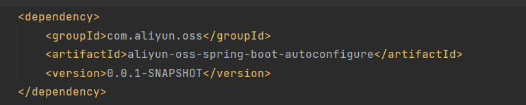

## 2.5 构建自动配置操作

在autoconfigure中配置`AliyunOSSUtils`，首先引入OSS的依赖：

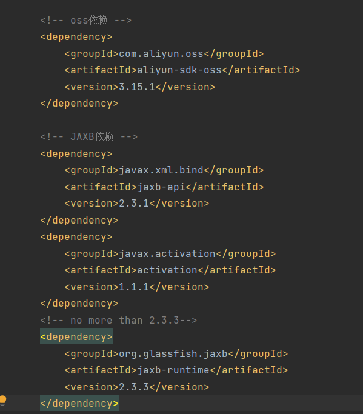

将之前的OSS工具类拷贝过来：

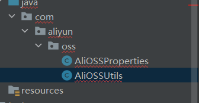

报错了，一个一个来解决：

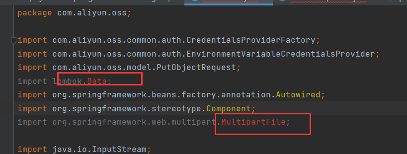

lombok依赖和web起步依赖没有引入，我们引入：

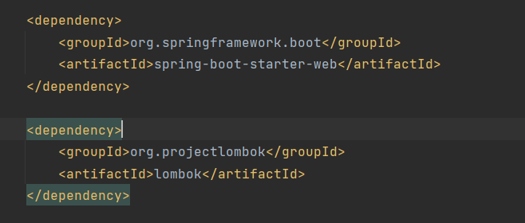


然后把`@Component`删除，为什么要删除呢？一般建议用一个配置类来生成`AliOSSUtils`的`Bean`进行统一管理，因此不需要`AliOSSUtils`声明为组件：

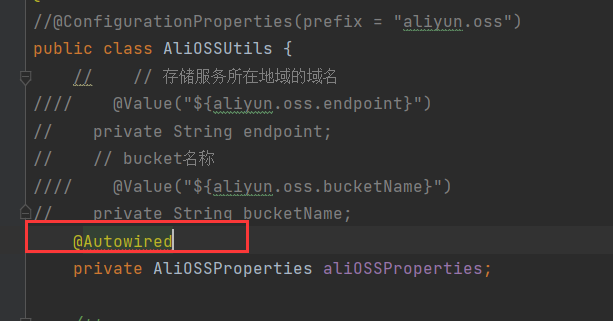

定义配置类来生成`AliOSSUtils`的`Bean`：

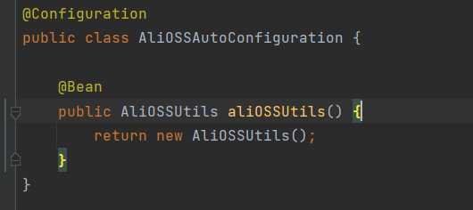

`AliOSSUtils`的成员变量`aliOSSProperties`，之前是通过自动注入的方式来得到值，现在自动注入删除了，那么它就是`null`，我们需要解决这个问题。而且`AliOSSProperties`在删除`@Component`后报错了，因为`@ConfigurationProperties`修饰的类需要成`Bean`：

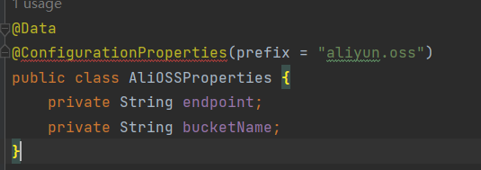

如何解决上面两个问题？只需要让`AliOSSProperties`成为`Bean`即可，成为`Bean`后`@ConfigurationProperties`不会报错，而且在Bean方法的形参可以自动注入，这样它就不为`null`。

最终的问题就是如何让`AliOSSProperties`成为`Bean`？我们可以使用`@Import`将`AliOSSProperties`导入到配置类中：

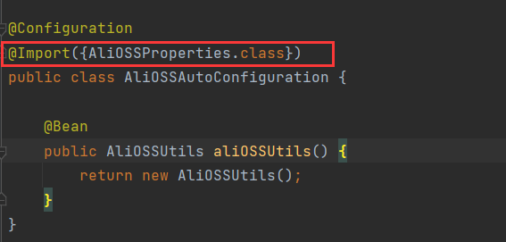

### 2.5.1 @Import补充

之前说过，`@Import`只能导入组件和配置类才能生成`Bean`，但是导入被`@ConfigurationProperties`修饰的类也能生成`Bean`，因为它通过 Springboot 的自动配置机制，被自动注册为 `Bean`。只需要知道导入`@ConfigurationProperties`也能生成`Bean`就行了。

导入之后不再报错：


形参完成依赖注入：

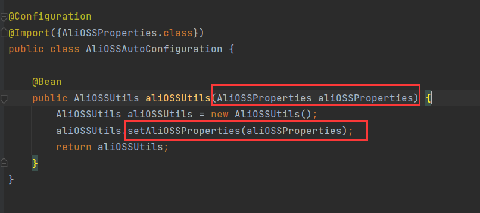

### 2.5.2 @EnableConfigurationProperties

对于像`AliOSSProperties`这样的配置文件类，更加推荐使用`@EnableConfigurationProperties`注解

它底层封装了`@Import`：

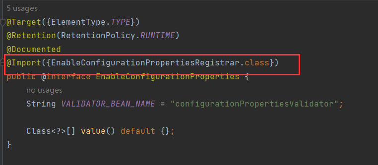

所以它的作用也是将类导入，但是它只能作用于配置类以及`Bean方法`上：

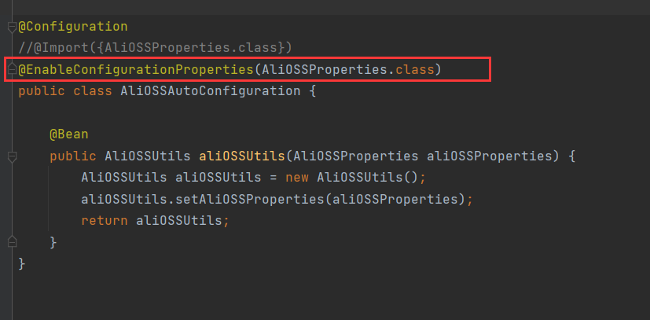

将`AliOSSAutoConfiguration`配置在META-INF/spring/ xxxx.imports文件中，方便springboot自动配置。

在resources下创建META-INF/spring：


创建文件：org.springframework.boot.autoconfigure.AutoConfiguration.imports：

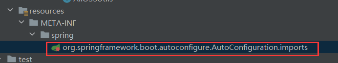

配置需要自动配置的类，全类名：

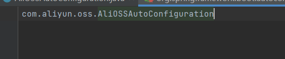

测试：

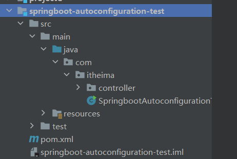

有一个上传的源码：

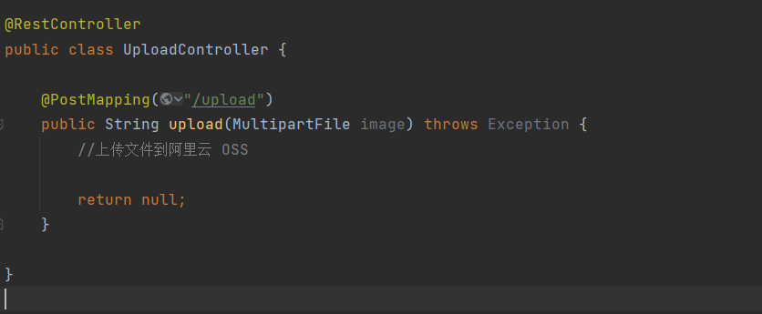

引入封装好的起步依赖：

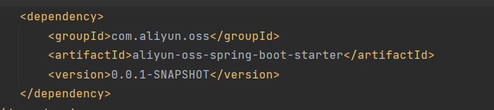

然后配置OSS需要的配置信息：

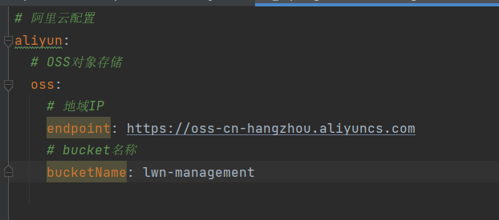

直接依赖注入：

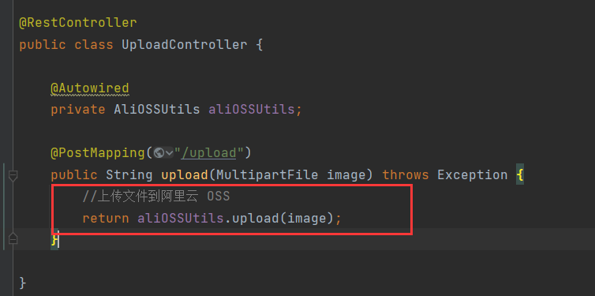

运行测试：


断点测试：

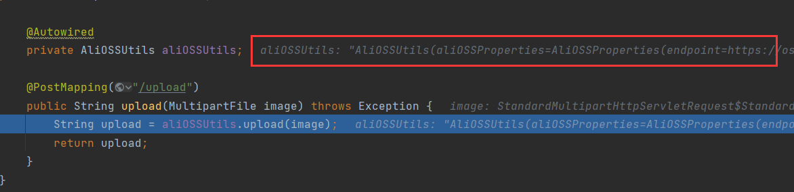
