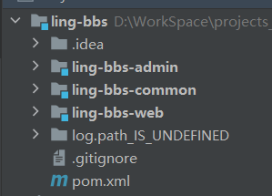
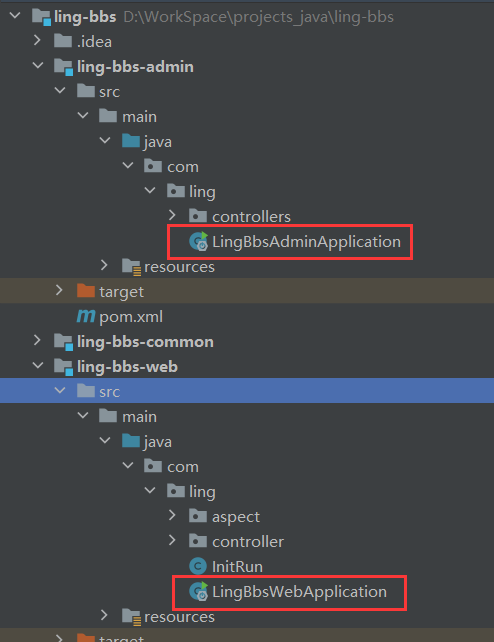
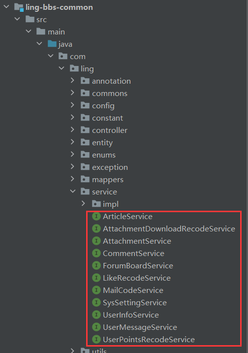
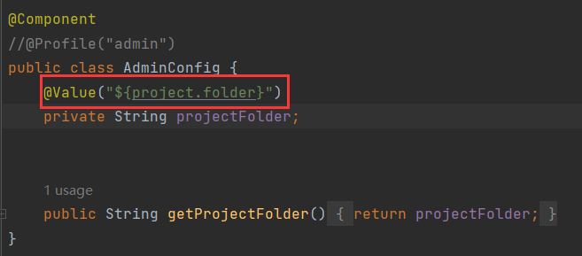
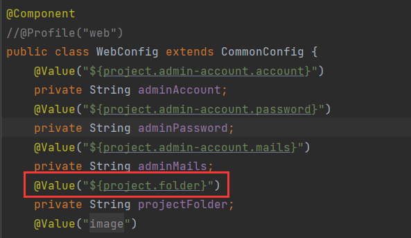
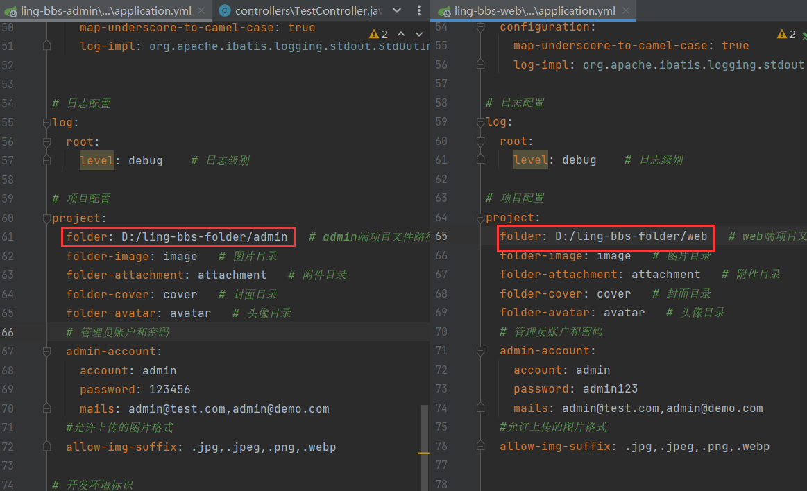

# 1 多模块环境下的配置类读取问题

举例：



当前项目ling-bbs：

- ling-bbs-admin：后端模块、admin模块。
- ling-bbs-web：前端模块、web模块。
- ling-bbs-common：公共模块，被admin模块和web模块依赖。

web模块和admin模块是相互独立的，运行时不会相互影响：



只是它们都依赖了common模块，使用common提供的服务：



**配置文件的加载机制**

在 `Spring Boot` 中，应用程序运行时**只会加载自身模块下的配置文件**，不会主动加载其他模块的配置文件。例如：

- **当 web 模块启动时**，它只会加载 `application.yml(web)`，不会加载 admin 模块的 `application.yml(admin)`。
- **当 admin 模块启动时**，它只会加载 `application.yml(admin)`，不会加载 web 模块的配置文件。

我想说的是千万不要想成：这个子模块启动时会加载另一个子模块的配置文件，这是没有道理的。

这个子模块和另一个子模块它们根本就没有什么关联性，模块启动只会去加载自己资源目录下的配置文件。

common模块因为被web和admin依赖，所以需要供两个模块读取配置项value，因此我在common中定义了两个配置类：`AdminConfig`和`WebConfig`用于读取各自的配置项value，同时又定义了`CommonConfig`来读取公共的配置项value，让两个类继承至它，减少重复代码：


我的想法是`AdminConfig` 读取 `admin` 模块的 `application.yml(admin)`，`WebConfig` 读取 `web` 模块的 `application.yml(web)`，以确保不同模块的配置项互不影响。

但实际情况是两个配置类读取同一个配置文件。

`AdminConfig`和`WebConfig`中都要读取项目的目录`project.folder`这个配置项：





在配置文件中，两个模块的项目目录不同：



但在 `web` 模块启动时，无论是 `WebConfig` 还是 `AdminConfig`，都读取到 `D:/ling-bbs-folder/web`，同理，在 `admin` 模块启动时，两个配置类都读取到 `D:/ling-bbs-folder/admin`。这说明 **`AdminConfig` 和 `WebConfig` 读取的是相同的配置文件，而不是各自独立的配置文件**。

为什么会这样呢？我想到的应该是`WebConfig`和`AdminConfig`读各自的配置文件，分别读到D:/ling-bbs-folder/web和D:/ling-bbs-folder/admin才对，为什么会读出相同的value？

这正是我上面说到的，模块启动时只会读取自己的配置文件，它不会去读取其他模块的配置文件。这里也一样，启动web模块时，只会读取web的配置文件，即`WebConfig`和`AdminConfig`都读取application.yml(web)，而application.yml(web)中的value是D:/ling-bbs-folder/web，自然都读到D:/ling-bbs-folder/web，同理，启动admin模块也一样，都读取到application.yml(admin)，自然都读到D:/ling-bbs-folder/admin。

为什么我会想成`WebConfig`和`AdminConfig`各自读自己的配置文件，就是因为我理解为web模块启动还会加载admin的配置文件。

其实这里有一个反直觉的现象，web模块和admin模块都依赖common模块，配置类都在common模块中，而配置文件则在web模块和admin模块下，读取时反而读取的是web模块或admin模块的配置文件，因为我们直线思维认为common的配置类应该读取的是common下的配置文件。关键是，去读取web模块或admin模块下的配置文件居然能读取到。不过common模块毕竟没有配置文件，其实我们可以把common模块理解为jar包，我们以前在依赖某些jar包时也会在当前的配置文件中进行配置以便jar包正常使用，jar读取的就是当前模块下的配置文件，而这里也是一样的情况，在web模块中配置以便common能正常使用，读取的是web下的配置文件。

然后我在说一下key差异导致的报错问题，什么意思呢？就是两个模块的配置文件的key有差异，一个配置文件中有某个key而另一个没有。假设 `application.yml(admin)` 中定义了 `my-tag`，但 `application.yml(web)` 没有：

```yaml
# application.yml(admin)
my-tag: admin-specific-tag
```

此时，如果 `AdminConfig` 试图读取 `my-tag`，在 `web` 模块启动时会抛出异常：提示application.yml(web)中找不到配置项`my-tag`。

其实原因很简单，还是因为`WebConfig`和`AdminConfig`读取都一个配置文件， `web` 模块运行时，**`AdminConfig` 依然会读取 `application.yml(web)`**，但其中没有 `my-tag`，导致配置解析失败。如果启动admin模块，那么加载的是application.yml(admin)，两个配置类也会读取这个配置文件，那么`AdminConfig`就能读取到`my-tag`的值，但是要注意，如`WebConfig`读取的配置项在application.yml(admin)没有，也会抛出找不到配置项的异常。

解决这个问题有一个最low的方法， **在每个 `application.yml` 中都包含所有可能的配置项**，即 `web` 和 `admin` 的 `application.yml` 应该保证 key 统一，避免因缺少 key 而导致异常。

其实造成上述问题的原因，我觉得是`WebConfig`和`AdminConfig`定义在了同一个模块中，这就导致它们是都是读取相同的配置文件，而不是各自读取各自的配置文件，但是我又不能把`WebConfig`和`AdminConfig`迁移到各自的模块下，因为common模块中业务代码用到了`WebConfig`和`AdminConfig`，如果迁移到web模块和admin模块下，common模块就找不到配置类了。目前的也只能采用每个配置文件中都定义上对方的配置项的方案。
