# idea中配置maven环境

> 在idea中配置maven有两种方案：
>
> - 在当前工程
> - 全局配置


## 当前工程配置

> 在当前工程中配置：【File】>>【Settins】>>【Bulid, Execution, Deployment】>>【Bulid Tools】>>【Maven】


> 在右侧配置maven的安装目录和settings.xml文件的路径，应用即可：

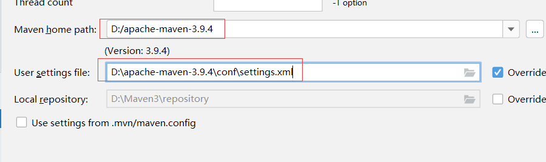

> 【Maven】>>【Runner】，选择JRE版本同JDK版本，应用即可：

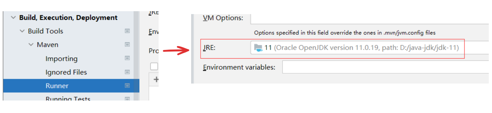

> 然后还需要配置当前项目的字节码版本，【Bulid, Execution, Deployment】>>【Bulid Tools】>>【Compiler】>>【Java Compiler】同JDK版本，应用即可：

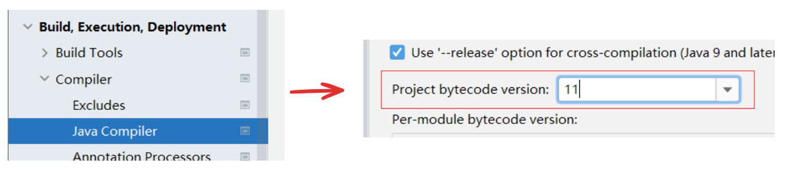

> 上述操作完成，当前工程与maven的环境就配置好了。如果以后再创建一个项目，需要按照这些步骤再配置一次，虽然可以但是太繁琐，因此介绍第二种方案全局配置。


## 全局配置

> 如果是配置全局，就不要打开任何一个工程，【File】>>【Close Project】：

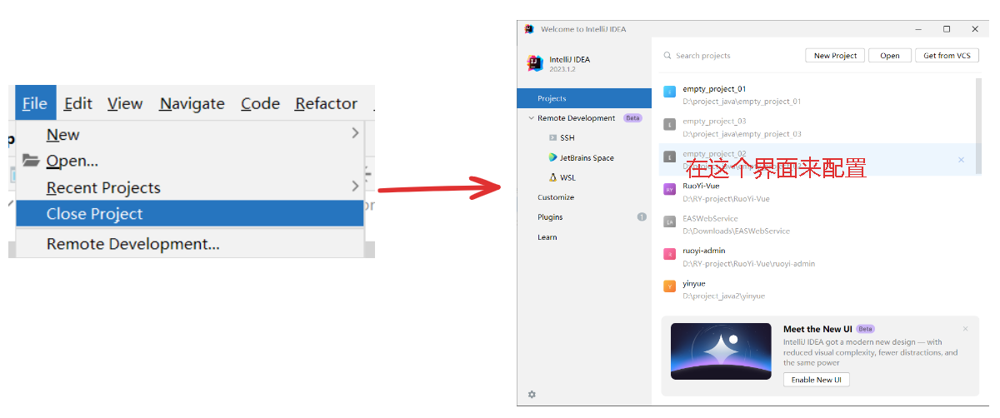

> 【Customize】>>【All Settins】>>【Bulid, Execution, Deployment】>>【Bulid Tools】>>【Maven】：

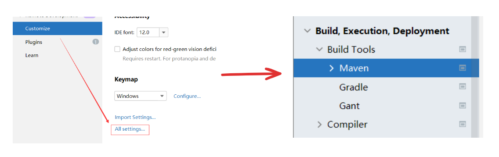

> 同当前项目的配置maven路径和settings.xml文件时一致：


> 接下来的步骤同当前项目的配置JRE和字节码版本一致，这里不作演示。如此全局配置便完成了。


# 创建maven项目

> 创建maven项目，就是在空项目中(空项目创建见"**idea空项目创建.mp4**")创建maven模块，【File】>>【New】>>【Module...】>>【New Module】

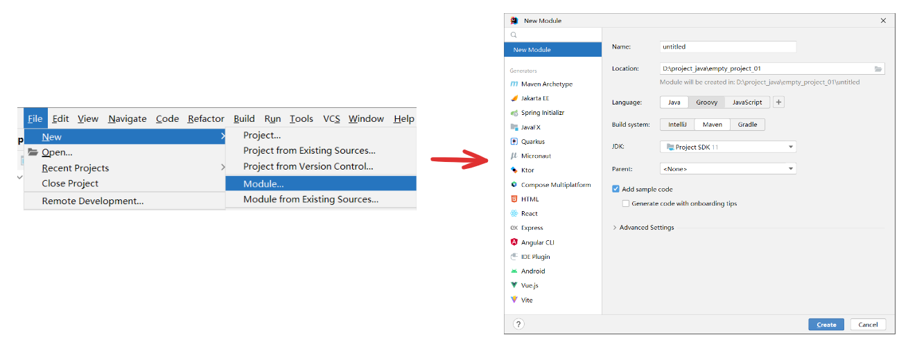

> 在打开的页面中Language选择Java、Build System选择Maven，JDK选择对应的版本。然后选择Advanced Settings下拉框，出现了两项值分别是GroupId、ArtifactId、这两项值再之前介绍过正是maven的坐标其二，还差一个Version值。
>
> GroupId：指的是组织名，一般是域名的反写
>
> ArtifactId：指的是maven 项目的模块名，当填入模块名后，Name值会自动等于模块名
>
> Version：版本号
>
> 之所以没有Version是因为版本号是默认创建的：

.gif)

> 这三项就是pom.xml中的坐标描述信息，你配置成什么样，在pom中就显示什么样，如：

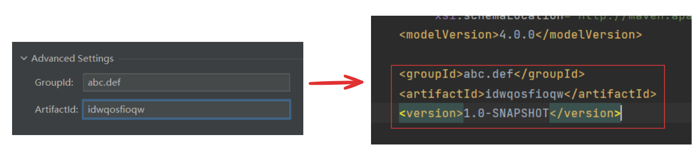

> Name值就是你这个项目下模块的名称，如：

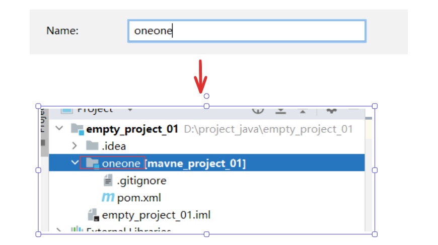

> 需要注意，虽然ArtifactId的值会被Name引用，但是更改Name的值不会影响ArtifactId，这是一个单向的影响。
>
> 之前说过，通过maven创建的项目拥有相同的目录结构：


> 这么对比会发现，test目录下缺少测试的resources目录，这是因为测试的resources很少使用，因此maven默认没有创建，我们可以右键新建目录，此时idea会自动联想出resources目录，创建即可：

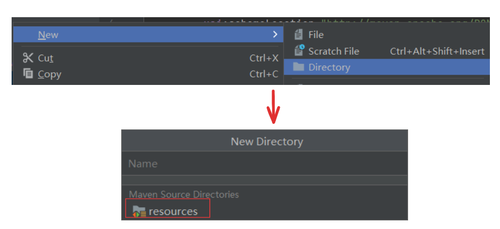

> 另外提一嘴，pom文件中有一个<properties>标签，是maven自动生成的，介绍如下：

```xml
<properties>
    <!-- 表示项目源码使用的jdk版本是11 -->
    <maven.compiler.source>11</maven.compiler.source>
    <!-- 表示项目打包后字节码使用的jdk版本是11 -->
    <maven.compiler.target>11</maven.compiler.target>
    <!-- 表示项目源码使用的字符集是UTF-8 -->
    <project.build.sourceEncoding>UTF-8</project.build.sourceEncoding>
</properties>
```

> 这些是在选择jdk版本时，会自动生成的，如何没有建议手动加上。
>
> 当运行时，会产生一个target目录，这个目录存放的就是编译后的文件：

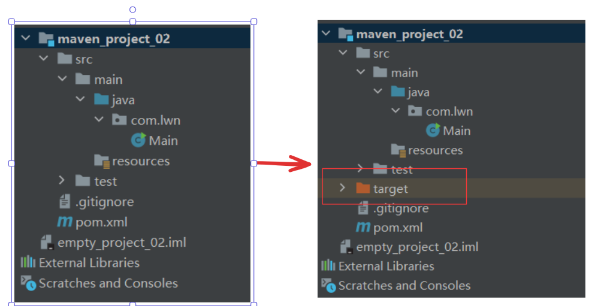

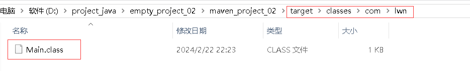


## 坐标

> 什么是坐标？
>
> maven中的坐标是<font color='red'>**资源的唯一标识，通过该坐标可以唯一定位资源位置**</font>
>
> 既然坐标是资源的唯一标识，那么需要引入其他资源时，只需要引入该资源的坐标信息即可，这就是pom中引入依赖的规则。
>
> 上文提到过坐标的组成：
>
> - groupId：定义当前maven项目所属组织名称(通常是域名的反写，如：com.lwn)
> - artifactId：定义当前maven项目的名称(通常是模块名)
> - version：定义当前项目的版本

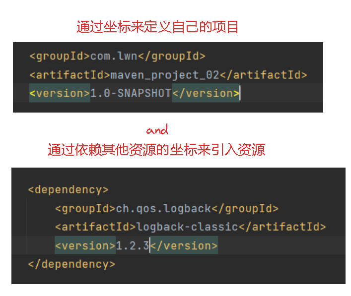


# 导入maven项目

> 首先说一下怎么打开maven项目的文件位置，【选中maven模块】>>【右键】>>【Open In】>>【Explorer】：

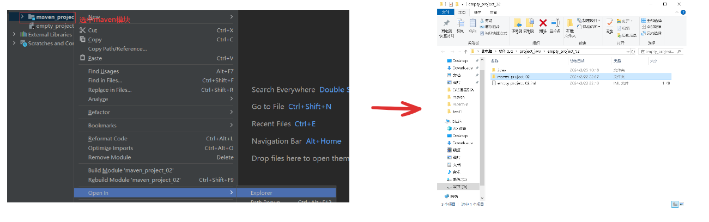

> 导入maven项目有两种方式。
>
> 第一种，将项目放到当前工程下，此时idea自动识别出项目：

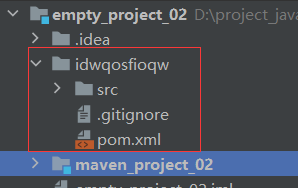

> 但是这个只是一个目录还不是mavne项目，通过文件图标的右下角蓝色方块可以识别。【Maven】>>【+】>>【选择这个项目的pom.xml】：


> 等待编译导入结束，可以看到导入的maven项目右下角已经出现蓝色方块：

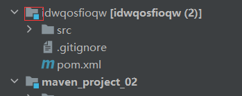


> 如果右侧没有Maven选项，【View】>>【Sppearance】>>【Tool Window Bars】：

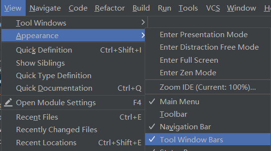

> 第二种方式，【File】>>【Project Structure】>>【Modules】>>【+】>>【Import Module】>>【选择这个项目的pom.xml】：

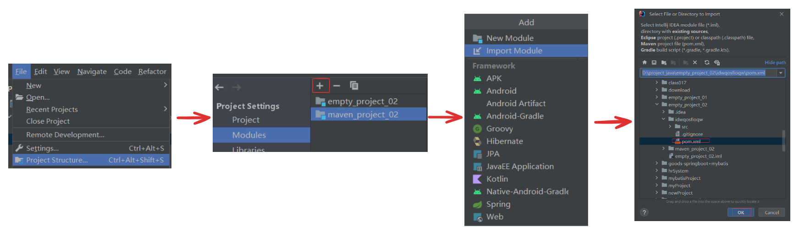

导入的时候容易遇到的问题：

1、由于其他电脑上的maven安装目录与本机上的不同，而该项目又是在其他电脑上传过来的，因此该项目使用的maven路径很可能是那个电脑上的路径，这与本机上的路径冲突，进而导致项目配置失败。

比如，maven的setting.xml配置文件的路径选错了：

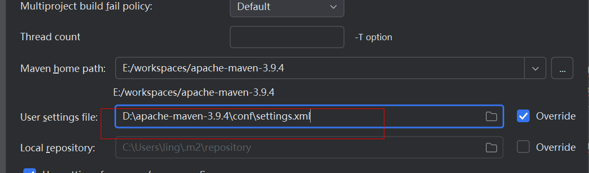

解决：

将其改成本机上的路径：

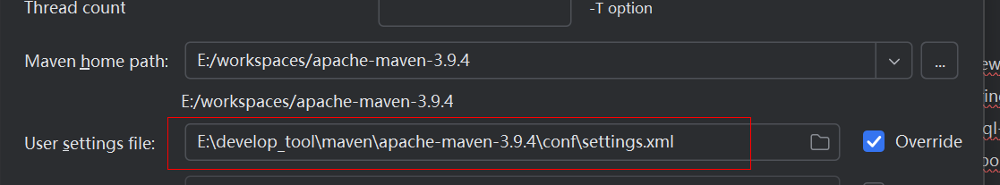

2、项目的JDK版本没有选对：

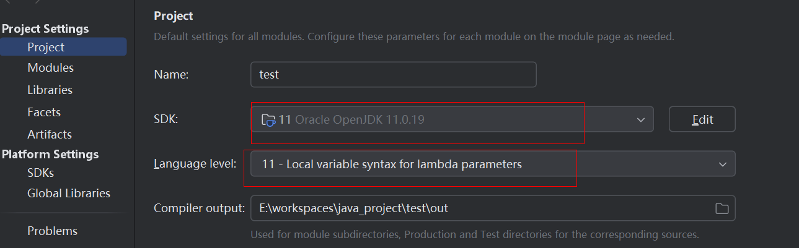


# 删除maven项目

> mavne项目右键选择Remove Module：

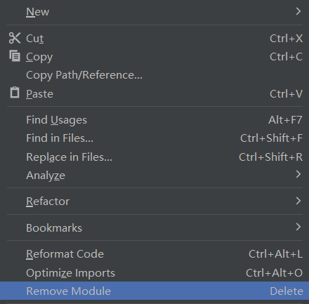

> 此时，项目的目录还在，但是右下角没有蓝色方块，idea不会将其作为maven项目，之所以还在是因为文件夹中还未删除该项目，同时pom文件已经失效了：

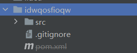


# pom中间一条杠

> 如果pom变成这样：

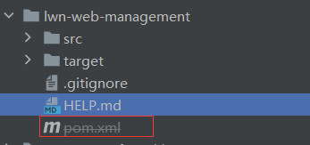

> 说明pom设置在maven忽略文件清单中文件清单中。
>
> 【File】>>【Settings】>>【Build, Execution, Deployment】>>【Build Tools】>>【Maven】>>【Ignored Files】

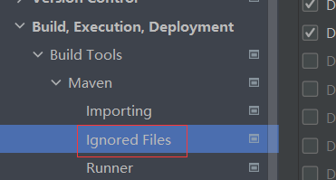

> 找到对应的pom，将勾去掉，刷新mavne即可：

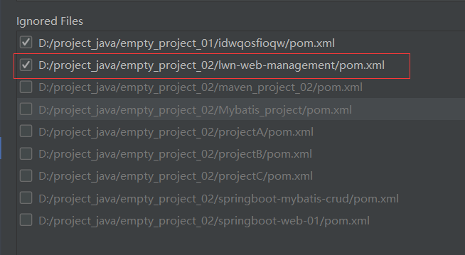

> 如果点击ok还没有恢复正常的话，重新启动一下idea。
