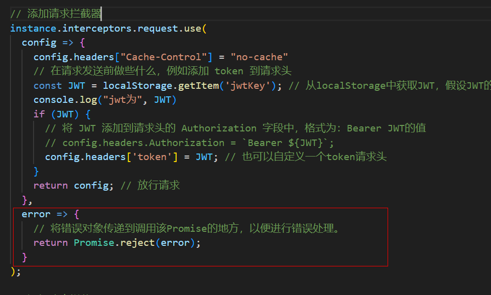
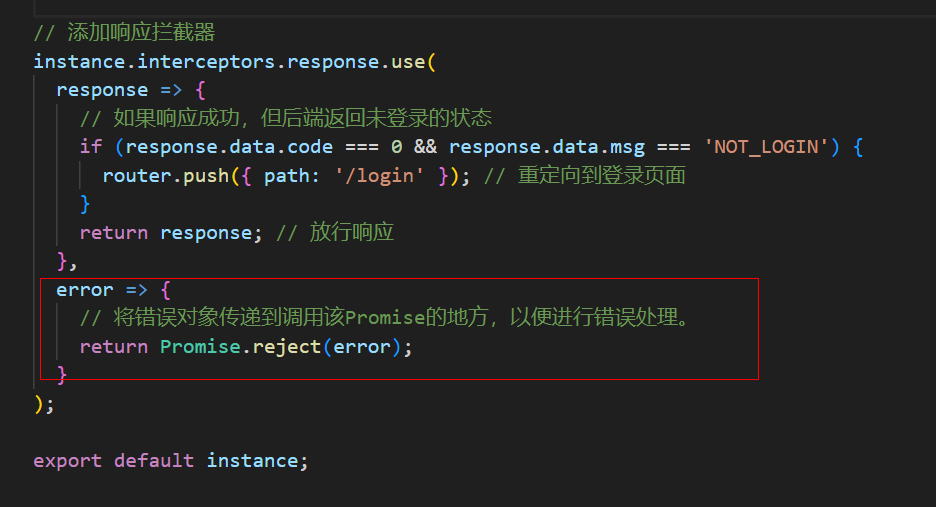
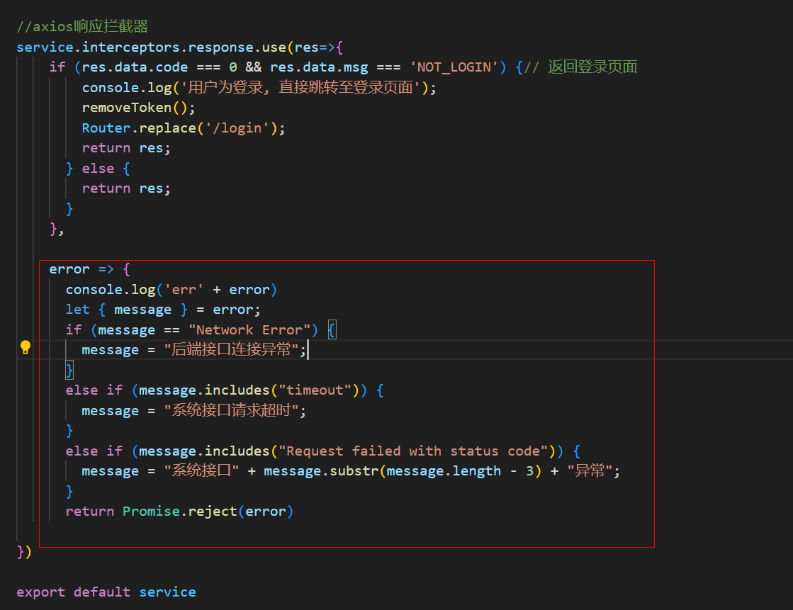
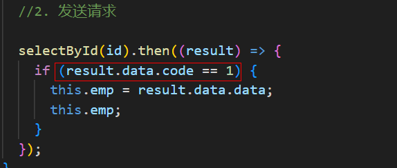
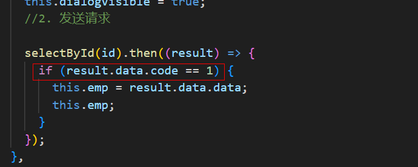

# 需求分析

当后端检查到前端发送的请求没有登录信息时，前端统一重定向到登录页面。

一般是检查请求中的JWT令牌：

- 如果请求头中没有JWT(一般是token头)，返回未登录的响应。
- 有JWT，但是JWT无效(过期、被篡改、为null为空等)，返回未登录的响应。

返回的统一未登录的响应：

```JSON
{
    "code": 0, // 0：失败，1：成功
    "msg": "NOT_LOGIN", // 登录校验不通过统一返回NOT_LOGIN
    data: null
}
```


# Axios拦截器

前端统一重定向， 需要借助Axios 请求拦截器（interceptors）进行处理。当后端返回包含 `msg: "NOT_LOGIN"` 且 `code: 0` 的响应时，前端会自动重定向到 `/login` 页面。

```javascript
import axios from 'axios'; // 导入axios
import router from '@/router'; // 导入Vue Router 实例

// 创建一个 axios 实例
const instance = axios.create({
  baseURL: 'https://localhost:8801/', // API基础URL
  timeout: 10000, // 超时10s
});

// 添加响应拦截器
instance.interceptors.response.use(
  response => {
    // 如果响应成功，但后端返回未登录的状态
    if (response.data.code === 0 && response.data.msg === 'NOT_LOGIN') {
      router.push({ path: '/login' }); // 重定向到登录页面
    }
    return response; // 放行响应
  },
  error => {
    // 将错误对象传递到调用该Promise的地方，以便进行错误处理。
    return Promise.reject(error);
  }
);

export default instance;
```

除了响应，还可添加请求拦截器，对请求进行处理，比如每次请求添加token请求头：

```js
import axios from 'axios'; // 导入axios
import router from '@/router'; // 导入Vue Router 实例

// 创建一个 axios 实例
const instance = axios.create({
  baseURL: 'http://localhost:8801/', // API基础URL
  withCredentials: true, // 允许跨域请求时携带凭证（如 cookies、HTTP 认证头）
  timeout: 10000, // 超时10s
});

// 添加请求拦截器
instance.interceptors.request.use(
  config => {
    // 在请求发送前做些什么，例如添加 token 到请求头
    const JWT = localStorage.getItem('jwtKey'); // 从localStorage中获取JWT，假设JWT的key为jwtKey
    if (JWT) {
      // 将 JWT 添加到请求头的 Authorization 字段中，格式为：Bearer JWT的值
      // config.headers.Authorization = `Bearer ${JWT}`;
        config.headers['token'] = JWT; // 也可以自定义一个token请求头
    }
    return config; // 放行请求
  },
  error => {
    // 将错误对象传递到调用该Promise的地方，以便进行错误处理。
    return Promise.reject(error);
  }
);

// 添加响应拦截器
instance.interceptors.response.use(
  response => {
    // 如果响应成功，但后端返回未登录的状态
    if (response.data.code === 0 && response.data.msg === 'NOT_LOGIN') {
      router.push({ path: '/login' }); // 重定向到登录页面
    }
    return response; // 放行响应
  },
  error => {
    // 将错误对象传递到调用该Promise的地方，以便进行错误处理。
    return Promise.reject(error);
  }
);

export default instance;
```


## 使用封装的Axios

将封装的Axios注册成全局属性，在main.js中：

```js
import { createApp } from 'vue';
import App from './App.vue';
import router from './router';
import axios from "@/utils/axios";  // 导入封装好的axios实例

const app = createApp(App);

// 将 axios 实例挂载到全局属性，这种方法在setup中不方便使用
// app.config.globalProperties.$axios = axios;

// provide提供axios实例，需要用的地方由inject注入
app.provide('$axios', axios);

app.use(router);
app.mount('#app');
```

使用inject注入：

```html
<script setup>
import { inject, onMounted } from 'vue'; // 要解构出inject

// 在子组件中使用inject来注入$axios
const axios = inject("$axios");

// 使用async和await让异步代码看起来像同步代码
const fetchData = async () => {
  try {
    const response = await axios.get('/');
    // 处理成功响应
    console.log(response.data);
  } catch (error) {
    // 处理错误响应
    console.error('请求失败:', error);
    // 例如，显示错误通知或消息给用户
  }
};

// 不使用async和await
const fetchData = () => {
    axios.get('/some-protected-api').then(res => {
        // 请求成功
		console.log(res.data);
    }).catch(err => {
        // 请求失败
        console.error('请求失败:', err);
    })
}

onMounted(() => {
  fetchData();
});
</script>
```


# 请求拦截器执行error时机



执行error有以下时机：

- **请求配置出错**：如果在处理请求配置的过程中发生了错误，例如在拦截器中操作请求配置对象时发生了异常。

- **网络错误或请求被取消**：如果请求在发送前因为网络问题或手动取消（使用`axios.CancelToken`）而失败。

如果返回拒绝的Promise，如Promise.reject()，那么catch方法会执行，而then方法不会执行。对于使用async和await语法糖的代码块可以用try...catch来捕获Promise.reject()，前提是reject()中抛出异常，比如Promise.reject(new error())，否则try...catch中catch不会执行。


# 响应拦截器执行error时机



- **HTTP错误状态码**：服务器返回的HTTP状态码表示错误（例如，4xx或5xx状态码）。

- **网络错误**：请求未能发送或接收到响应，例如网络连接问题、超时等。

- **请求被取消**：请求被手动取消。

为了不在发送请求的地方使用catch，我们可以统一在请求和响应拦截器的error处对error进行处理，即使我返回了一个Promise.reject(error)，我也可以不调用catch方法：



这样在使用请求的地方就不需要调用catch方法或在async和await语法糖中就不需要try...catch了。比如这里就只使用了then：


需要注意的是，后端返回统一响应类Result，它包含success和error，不管返回Result.success还是返回Result.error，都是成功的响应。因此这里才会根据code进行相应的操作：



我们可以在响应拦截器中对code进行判断，如果code===0，则说明返回的是Result.error，然后在响应拦截器中进行相应的操作，比如信息提示。然后再返回响应，可以你会觉得返回响应很多余，但是返回是为了保证Promise链的完整性，防止一些未知错误。但是返回的code===0，还要让程序执行后续的操作吗？没关系，我们可以加一个前置条件，即当code===1，才能操作，比如这样：



即便我返回了响应，拦截器放行响应到请求处，也不会执行，因为有前置条件在，所以后续的逻辑都是被保护起来的。


# 总结

- 在请求拦截器和响应拦截器中的error会传递到请求的catch方法处，我们可以在请求拦截器和响应拦截器中的error处进行统一的错误处理，这样请求处就不用使用catch方法，或try...catch
- 无论返回Result.success还是返回Result.error，都代表响应是成功的，只是我们会根据Result.code===1还是0进行不同的处理，我们可以在响应拦截器中对code===0进行处理，在请求处只对code===1进行处理。同时，只要在请求处加上if(code===1)的前置条件，就能将针对Result.success的执行逻辑保护起来，即便响应拦截器最终会将Result.error返回，也不会执行受保护的操作。


# 补充

axios拦截器，可以在响应拦截器中对响应进行统一的处理，但是不能对请求进行统一的处理，原因如下：

1. **Promise 的性质**：Axios 的请求返回一个 Promise。Promise 的错误处理应该通过 `.catch()` 方法或者在 `async/await` 结构中使用 `try...catch` 来处理。拦截器主要处理的是请求和响应，而不是 Promise 本身的错误。
2. **网络错误**：如果请求因为网络问题（如请求被取消、请求超时等）而失败，这些错误通常会直接抛给 Promise 的错误处理器，而不是先经过拦截器。
3. **异步操作的本质**：即使你在拦截器中处理了某些错误，这也不会阻止异步操作本身的错误继续传播。你仍然需要在调用 Axios 的地方处理这些错误


# 封装axios第二版

需要msg工具，见"11.封装消息提示.md"。建议配合"23.异常处理/1.springboot全局异常处理.md"一起使用

```js
import axios from 'axios'; // 导入axios
import router from '@/router'; // 导入Vue Router 实例
import { errorMsg, msgFields } from "@/utils/msg";

// 类似AxiosError对象
const likeAxiosError = (code) => {
    const AxiosError = {
        response: {
            data: { status: code }
        }
    }
    return AxiosError
}

// 验证请求的权限
const validPermission = (config) => {
    const permission = config.headers['Permission']; // 获取请求头中的请求权限
    if (!permission) return false; // 如果请求头中没有权限，则不放行请求
    const rights = router.currentRoute.value.meta.rights || [] // 获取当前路由的权限，如果没有则为空数组
    // 如果权限是登录权限，则放行请求，否则判断是否包含权限，包含则放行请求，不包含则不放行请求
    return permission === "login" || rights.includes(permission)
}

// 处理响应拦截器中成功的响应返回的Result实体code=0的情况
const code0Map = {
    NOT_LOGIN: () => {
        errorMsg(msgFields.TOKEN_ERROR) // token过期
        router.push({ path: '/login' }); // 重定向到登录页面
    },
    ACCOUNT_ERROR: () => errorMsg(msgFields.ACCOUNT_ERROR), // 账号错误
    NOT_PERMISSION: () => errorMsg(msgFields.NOT_PERMISSION), // 没有权限
}

// 错误处理
const errorMap = {
    isCode: { // 如果error中没有response，则使用code判断
        ERR_NETWORK: () => errorMsg(msgFields.ERR_NETWORK), // 响应状态为网络错误时，处理方式
        ECONNABORTED: () => errorMsg(msgFields.REQUEST_TIMEOUT), // 响应状态为请求超时时，处理方式
    },
    isResponse: { // 如果error中有response，则使用response中的状态码处理
        500: () => errorMsg(msgFields.SYSTEM_ERROR), // 响应状态500时，处理方式
        401: () => errorMsg(msgFields.TOKEN_ERROR), // 响应状态401时，处理方式
        403: () => errorMsg(msgFields.NOT_PERMISSION), // 响应状态403时，处理方式
    }
}

// 创建一个 axios 实例
const instance = axios.create({
    baseURL: 'http://localhost:7788/', // API基础URL
    // withCredentials: true, // 允许跨域请求时携带凭证（如 cookies、HTTP 认证头）
    timeout: 10000, // 超时10s
});

// 添加请求拦截器
instance.interceptors.request.use(
    config => {
        const token = localStorage.getItem('token'); // 从localStorage中获取令牌，假设令牌的key为token
        if (token) {
            config.headers['token'] = token; // 如果存在令牌，则将令牌添加到请求头中
        }
        if (!validPermission(config)) { // 验证请求的权限
            return Promise.reject(likeAxiosError(403)); // 请求无权限，返回错误
        }

        return config; // 放行请求
    },
    error => {
        console.error("请求拦截器error回调执行：", error);
        return Promise.reject(error);
    }
);

// 添加响应拦截器
instance.interceptors.response.use(
    response => {
        // 如果响应成功，但是响应的Result实体code为0，则提示错误信息
        if (response.data.code === 0) {
            code0Map[response.data.msg] && code0Map[response.data.msg](); // 调用对应处理方法
            alert(response.data.msg); // 提示错误信息
        }
        return response; // 放行响应
    },
    error => {
        console.error("响应拦截器error回调执行：", error)
        if (error.response) {
            const { status } = error.response.data
            errorMap.isResponse[status] && errorMap.isResponse[status](); // 如果error中有response，那就用response中的状态码判断
        } else {
            if (!errorMap.isCode[error.code]) {
                errorMsg(msgFields.UNDEFINED_ERROR) // 如果
                return Promise.reject(error);
            }
            errorMap.isCode[error.code](); // 如果error中没有response，那就用code判断
        }
        return Promise.reject(error);
    }
);

export default instance;
```

