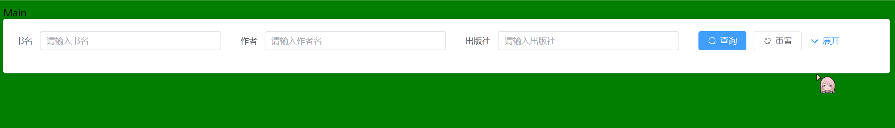

有些时候，需要卡片实现折叠功能。比如查询的时候，我们将查询项放到一个卡片中，展开卡片时展示更多的查询项。效果如下：



实现的方式很简单，控制卡片的展开和收起并不是改变卡片的高度，而是控制卡片内元素是否渲染。如果元素渲染，自然会撑起卡片，元素不渲染，卡片又会变回去，这样就构造了卡片展开和收起的效果。而控制元素是否渲染可以使用`v-if`。

```vue
<template>
    <!-- 卡片 -->
    <el-card>
        <div>
            <!-- form表单 -->
            <el-form :inline="true" :model="book" class="demo-form-inline">
                <el-form-item label="书名">
                    <el-input v-model="book.name" placeholder="请输入书名" clearable />
                </el-form-item>
                <el-form-item label="作者">
                    <el-input v-model="book.author" placeholder="请输入作者名" clearable />
                </el-form-item>
                <el-form-item label="出版社">
                    <el-input v-model="book.publishe" placeholder="请输入出版社" clearable />
                </el-form-item>
                <!-- 选择表单项这里用v-if去控制它是否渲染 -->
                <el-form-item label="类型" v-if="isExpand">
                    <el-select v-model="book.type" placeholder="请选择类型" clearable>
                        <el-option label="类型1" value="1" />
                        <el-option label="类型2" value="2" />
                    </el-select>
                </el-form-item>
                <!-- 日期选择表单项这里用v-if去控制它是否渲染 -->
                <el-form-item label="出版日期" v-if="isExpand">
                    <el-date-picker v-model="book.date" type="daterange" range-separator="至"
                        start-placeholder="起始日期" end-placeholder="结束日期" />
                </el-form-item>
                <el-form-item>
                    <el-button type="primary" :icon="Search" @click="onSubmit">查询</el-button>
                    <el-button :icon="Refresh">重置</el-button>
                    <!-- 按钮控制isExpand属性的布尔值，进而影响选中项和日期选中项是否渲染 -->
                    <el-button type="primary" link @click="handleExpand"
                        :icon="isExpand ? ArrowUpBold : ArrowDownBold">
                        {{ isExpand ? "收起" : "展开" }}
                    </el-button>
                </el-form-item>
            </el-form>
        </div>
    </el-card>
</template>

<script setup>
import { ref, reactive } from 'vue'
import { Search, Refresh, ArrowUpBold, ArrowDownBold } from '@element-plus/icons-vue'
const isExpand = ref(false); // 是否展开
const handleExpand = () => {
    isExpand.value = !isExpand.value;
}
const book = reactive({
    name: '',
    author: '',
    publishe: '',
    type: "",
    date: ["", ""]
})
</script>
```

