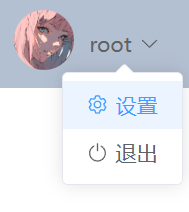
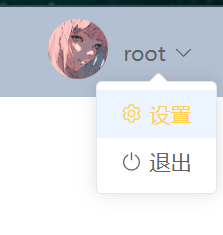

# 下拉菜单样式

下拉菜单，鼠标悬浮时激活样式默认是这样：



修改样式：

```css
::v-deep .el-dropdown-menu__item._dropdown-item {
  /* 下拉菜单的字体颜色 */
  color: #606266 !important;
}

::v-deep .el-dropdown-menu__item._dropdown-item:hover {
  /* 下拉菜单悬停背景颜色 */
  background-color: #ecf5ff !important;
  /* 下拉菜单悬停字体颜色 */
  color: #ffd04b !important;

}
```

效果：

