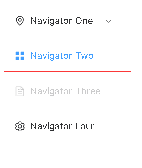
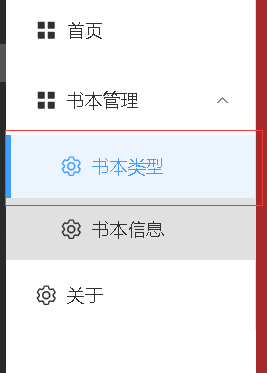
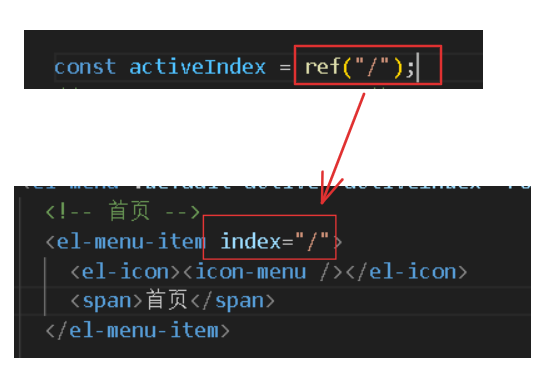

# 菜单激活状态

1、element的菜单在激活状态时显示如下（垂直排列）：

> 激活状态：
>
> - 处于激活状态的菜单，会显示激活状态的样式
> - 如果是子菜单处于激活状态，父级菜单会自动展开，让子菜单显示出来



其激活样式类为`.is-active`，我们可以自定义样式：

```css
/* 自定义高亮样式，使用伪元素 */
.el-menu-item.is-active {
  background-color: #ecf5ff !important;
  color: #409eff !important;
  position: relative;
}

.el-menu-item.is-active::before {
  content: "";
  position: absolute;
  left: 0;
  top: 0;
  bottom: 0;
  width: 4px;
  background-color: #409eff;
}
```



 2、默认激活状态是当我们点击到某一级的菜单，才会生效。比如，此时我未选中任何菜单，那么激活状态不会生效：


当我选中某一级菜单后，激活状态生效：

.gif)

element菜单有一个属性`activeIndex`，该属性指定的index，其对应菜单就会处于激活状态。比如，这里我指定了/，那么首页菜单就会处于激活状态，直到我点击下一个菜单：



-1717073920612-2.gif)

3、菜单跟随路由动态变化激活状态，当前的路由是哪个就，其对应的菜单就处于激活状态。当我在地址栏访问其他路由时，路由对应的菜单未处于激活状态，处于激活状依旧然是原来的菜单。比如：

.gif)

当我访问/about和/bookType时，依旧是首页菜单处于激活状态。我们可以监听路由的变化，拿到当前的路由然后赋值给`.activeIndex`属性。而菜单的index值由恰好是路由，因此与`.activeIndex`值一致的菜单就会处于激活状态，进而实现菜单跟随路由动态变化激活状态。

`watchEffect()`函数能监听路由的变化：

```js
import { ref, watchEffect } from "vue";
import { useRoute } from 'vue-router'; // 导入router实例

const activeIndex = ref("/"); // activeIndex属性进行响应式
const route = useRoute();

// 根据当前路由路径设置激活状态和展开状态
const setActiveIndex = (path) => {
  activeIndex.value = path;
};

// 在路由变化时更新激活状态和展开状态
watchEffect(() => {
  // 由router实例的path属性，拿到当前的路由
  setActiveIndex(route.path); 
});
```

-1717076046913-6.gif)

