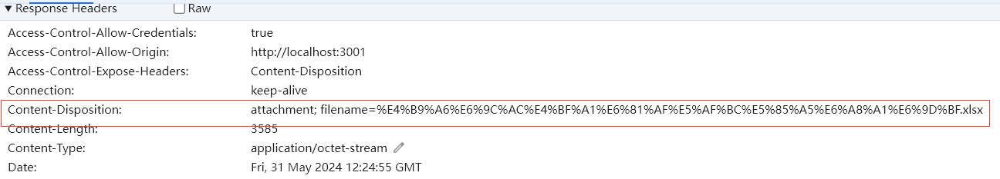
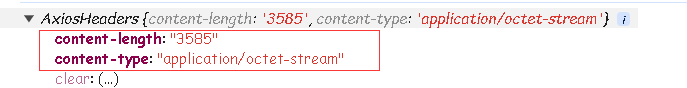
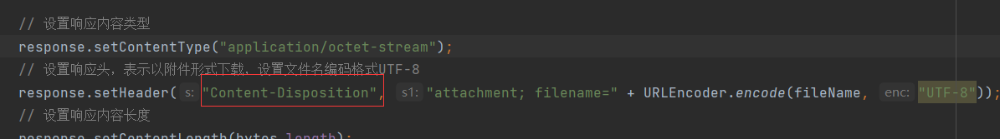
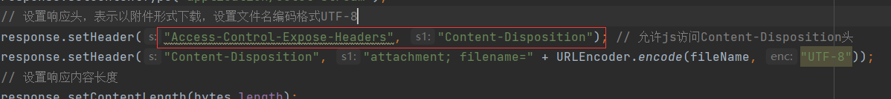
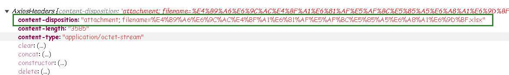

后端的下载实现：

```java
@GetMapping
    public void exportExcel(HttpServletResponse response) throws IOException {
        String fileName = "书本信息导入模板.xlsx";
        // 获取当前类的类加载器
        ClassLoader classLoader = ExcelController.class.getClassLoader();
        // 获取资源路径下static的URL对象
        URL aStatic = classLoader.getResource("static");
        // 获取路径
        String path = aStatic.getPath();
        // 获取资源目录下download目录的文件对象
        String downloadPath = path + File.separator + "download";
        File file = new File(downloadPath);
        if (!file.exists()) {
            // 如果download目录不存在则创建
            file.mkdir();
        }
        String templatePath = downloadPath + File.separator + "template.xlsx";
        File template = new File(templatePath);
        // 如果模板文件不存在，则创建
        if (!template.exists()) {
            List<Book> books = new ArrayList<>();
            EasyExcel.write(templatePath, Book.class).sheet("sheet1").doWrite(books);
        }

        // 模板文件的输入流
        FileInputStream templateInputStream = new FileInputStream(templatePath);
        // 从响应对象获取输出流
        ServletOutputStream outputStream = response.getOutputStream();
        byte[] bytes = templateInputStream.readAllBytes();

        // 设置响应内容类型
        response.setContentType("application/octet-stream");
        // 设置响应头，表示以附件形式下载，设置文件名编码格式UTF-8
        response.setHeader("Content-Disposition", "attachment; filename=" + URLEncoder.encode(fileName, "UTF-8"));
        // 设置响应内容长度
        response.setContentLength(bytes.length);
        outputStream.write(bytes);
    }
```

访问的请求是`http://localhost:8801/excel`，下载服务器上的excel文件。前端一般使用a标签访问下载请求：

```html
<a href="http://localhost:8801/excel">下载</a>
<!-- 或 -->
<a href="http://localhost:8801/excel" download="file.xlsx">下载</a>
```

但是这种方式存在一个问题，访问下载请求的时候，无法携带JWT，因此下载的请求会被拦截。

有几种解决方法：

1. 拦截器放行下载请求
2. 在下载请求的参数上携带JWT，后端拦截器中从请求参数中获取JWT
3. 使用异步请求构造一个携带JWT的下载请求去请求下载资源，由于是异步请求，因此获取的是请求资源的二进制表示，拿到这个二进制对象，构造a标签，执行点击即可下载文件。

使用异步方法下载文件：

```js
const url = "http://localhost:8801/excel"
// axios已经封装了JWT，详情见"1.axios的封装.md"
axios.get(url,{
    responseType: "blob", // 重点，告诉浏览器以二进制大对象（Blob）的形式处理响应数据
}).then(res => {
    // 创建一个链接元素
      const blob = new Blob([res.data]); // 拿到响应的数据创建二进制对象
      const url = window.URL.createObjectURL(blob); // 通过二进制对象创建URL
      // 创建a标签，将url赋值给a
      const link = document.createElement("a"); 
      link.href = url;

      // 设置下载文件的名称
      link.setAttribute("download", "filename.xlsx"); // 替换为实际文件名

      // 将链接添加到DOM
      document.body.appendChild(link);

      // 模拟点击下载
      link.click();

      // 移除链接元素
      document.body.removeChild(link);
}).catch(err => {
    alert(err.data);
})
```

效果：

-1717145197918-1.gif)

注意，这里的文件名是写死的，可以从响应头`Content-Disposition`中获取文件名：

```js
const url = "http://localhost:8801/excel"
// axios已经封装了JWT，详情见"1.axios的封装.md"
axios.get(url,{
    responseType: "blob", // 重点，告诉浏览器以二进制大对象（Blob）的形式处理响应数据
}).then(res => {
    // 从响应头获取文件名
    const contentDisposition = res.headers['content-disposition'];
    // 正则表达式，匹配content-disposition头中的filename后面紧跟的等号和文件名部分
    const filenameRegex = /filename[^;=\n]*=((['"]).*?\2|[^;\n]*)/;
    // 得到匹配的数组，数组的第一个元素是完整的匹配字符串，第二个元素是文件名部分
    const matches = filenameRegex.exec(resHead);
    var filename = null;
    if (matches != null && matches[1]) {
		filename = matches[1].replace(/['"]/g, ""); // 去掉引号
    }
    
    // 进行url解码
    const decodedFilename = decodeURIComponent(filename);

    // 创建一个链接元素
    const blob = new Blob([res.data]); // 拿到响应的数据创建二进制对象
    const url = window.URL.createObjectURL(blob); // 通过二进制对象创建URL
    // 创建a标签，将url赋值给a
    const link = document.createElement("a"); 
    link.href = url;

    // 设置下载文件的名称
    link.setAttribute("download", decodedFileName); // 替换为实际文件名

    // 将链接添加到DOM
    document.body.appendChild(link);

    // 模拟点击下载
    link.click();

    // 移除链接元素
    document.body.removeChild(link);
}).catch(err => {
    alert(err.data);
})
```

这里容易遇到一个问题，实际的响应中可以看到`Content-Disposition`头，但是`AxiosHeaders`对象中却没有这个头部：



`AxiosHeaders`对象中只有`content-length`和`content-type`头部：



后端已经设置了`Content-Disposition`：



但是为什么在`AxiosHeaders`对象中没有`Content-Disposition`头？这与跨域资源共享（CORS）有关，默认情况下，浏览器不允许js代码访问某些响应头信息，比如这里的`Content-Disposition`头。

***如果想要让客户端访问到相关头，服务器不仅要在heade里添加这些头，还要将它们设置在`Access-Control-Expose-Headers`头中***。

因此，后端还需要将`Content-Disposition`加到`Access-Control-Expose-Headers`头中：



```java
@GetMapping
    public void exportExcel(HttpServletResponse response) throws IOException {
        String fileName = "书本信息导入模板.xlsx";
        // 获取当前类的类加载器
        ClassLoader classLoader = ExcelController.class.getClassLoader();
        // 获取资源路径下static的URL对象
        URL aStatic = classLoader.getResource("static");
        // 获取路径
        String path = aStatic.getPath();
        // 获取资源目录下download目录的文件对象
        String downloadPath = path + File.separator + "download";
        File file = new File(downloadPath);
        if (!file.exists()) {
            // 如果download目录不存在则创建
            file.mkdir();
        }
        String templatePath = downloadPath + File.separator + "template.xlsx";
        File template = new File(templatePath);
        // 如果模板文件不存在，则创建
        if (!template.exists()) {
            List<Book> books = new ArrayList<>();
            EasyExcel.write(templatePath, Book.class).sheet("sheet1").doWrite(books);
        }

        // 模板文件的输入流
        FileInputStream templateInputStream = new FileInputStream(templatePath);
        // 从响应对象获取输出流
        ServletOutputStream outputStream = response.getOutputStream();
        byte[] bytes = templateInputStream.readAllBytes();

        // 设置响应内容类型
        response.setContentType("application/octet-stream");
        response.setHeader("Access-Control-Expose-Headers", "Content-Disposition"); // 允许js访问Content-Disposition头
        // 设置响应头，表示以附件形式下载，设置文件名编码格式UTF-8
        response.setHeader("Content-Disposition", "attachment; filename=" + URLEncoder.encode(fileName, "UTF-8"));
        // 设置响应内容长度
        response.setContentLength(bytes.length);
        outputStream.write(bytes);
    }
```

现在`AxiosHeaders`对象中就有`Content-Disposition`头了：



解析`Content-Disposition`头的文件名过程的封装：

```js
/**
 * 从content-disposition头中解析出文件名，传入content-disposition的值
 * 
 * @param {String} resHead 
 * @returns 文件名
 */
export function getFileName(resHead) {
    let filename = null
    // 正则表达式，匹配content-disposition头中的filename后面紧跟的等号和文件名部分
    const filenameRegex = /filename[^;=\n]*=((['"]).*?\2|[^;\n]*)/;
    // 得到匹配的数组，数组的第一个元素是完整的匹配字符串，第二个元素是文件名部分
    const matches = filenameRegex.exec(resHead);
    if (matches != null && matches[1]) {
        filename = matches[1].replace(/['"]/g, ""); // 去掉引号
    }

    // 进行url解码
    const decodedFilename = decodeURIComponent(filename);
    return decodedFilename;
}
```

