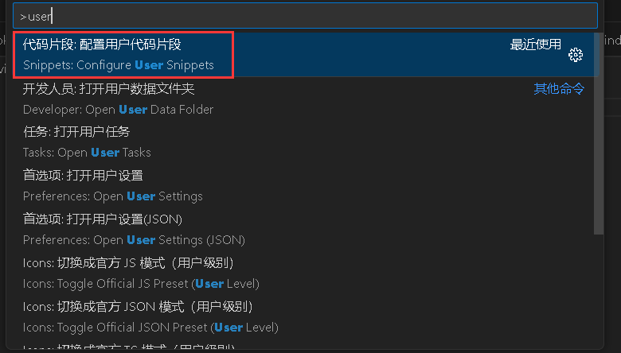
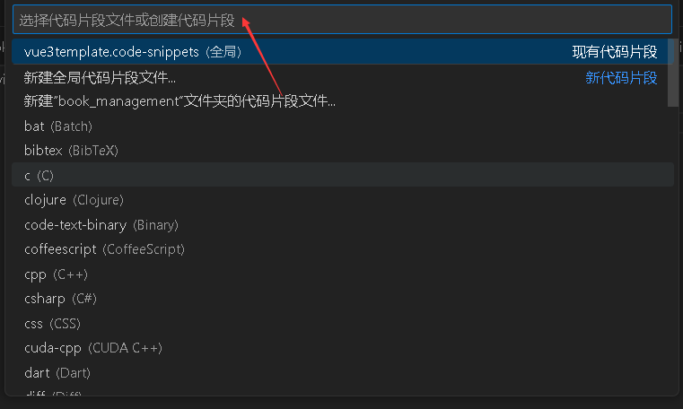

在vscode中配置全局代码片段，如vue3模板：

【ctrl】+【shift】+【p】>>【输入user】：



【选择Snippets】>>【选择全局代码片段】>>【输入文件名】：



替换成一下内容：

```json
{
	"Print to console": {
		"prefix": "vue3",
		"body": [
			"<template>",
			"  <div></div>",
			"</template>",
			"",
			"<script setup>",
			"// import { ref, reactive } from 'vue'",
			"",
			"</script>",
			"",
			"<style scoped>",
			"",
			"</style>",
		],
		"description": "Log output to console"
	}
}
```

vue3是快捷方式，输入vue3就能快速生成body中定义的模板：


