后端需要返回这样的数据：

```json
[
    {
        "id": "01",
        "authName": "用户管理",
        "icon": "User",
        "parentId": "0",
        "path": null,
        "rights": null,
        "children": [
            {
                "id": "0101",
                "authName": "用户列表",
                "icon": "User",
                "parentId": "01",
                "path": "/users",
                "rights": null,
                "children": null
            }
        ]
    },
    {
        "id": "02",
        "authName": "角色管理",
        "icon": "Avatar",
        "parentId": "0",
        "path": null,
        "rights": null,
        "children": [
            {
                "id": "0201",
                "authName": "角色列表",
                "icon": "Avatar",
                "parentId": "02",
                "path": "/roles",
                "rights": null,
                "children": null
            }
        ]
    },
    {
        "id": "03",
        "authName": "商品管理",
        "icon": "Goods",
        "parentId": "0",
        "path": null,
        "rights": null,
        "children": [
            {
                "id": "0301",
                "authName": "商品列表",
                "icon": "Goods",
                "parentId": "03",
                "path": "/goods",
                "rights": null,
                "children": null
            },
            {
                "id": "0302",
                "authName": "商品种类",
                "icon": "Goods",
                "parentId": "03",
                "path": "/types",
                "rights": null,
                "children": null
            }
        ]
    },
    {
        "id": "04",
        "authName": "订单管理",
        "icon": "List",
        "parentId": "0",
        "path": null,
        "rights": null,
        "children": [
            {
                "id": "0401",
                "authName": "订单列表",
                "icon": "List",
                "parentId": "04",
                "path": "/order",
                "rights": null,
                "children": null
            }
        ]
    }
]
```

这是admin所具有menutree，其中包括admin的权限信息


# 菜单(路由)的控制

在登录请求中，会得到权限数据，前端根据权限数据展示对应的菜单，点击菜单才能查看相关的界面。

登录成功后，后端会返回一个jwt，我们拿到jwt解析出payload部分，就能得到用户信息以及用户的权限信息。

jwt字符串：

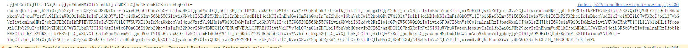

解析payload部分，解析工具见"15.前端JWT总结.md"

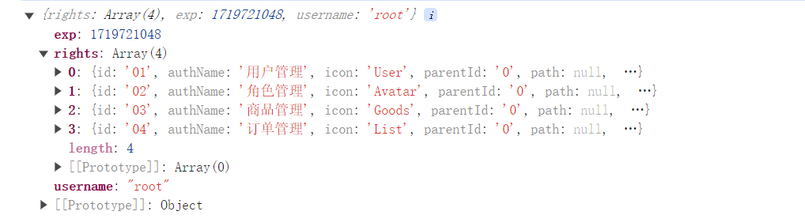

解析出的数据：

- exp：jwt的过期时间。

- rights：该用户的权限列表也就是上面的menutree。

- username：用户信息。

现在我们已经成功的拿到了menutree，接下来就需要根据menutree来生成对应的菜单了。

这里再说一下为什么后端需要返回一个menutree数据，因为这个用户的菜单是什么样一定是由他所拥有的权限决定的。因此我们需要后端为我们响应一个含有权限的层次结构的数据，这就是menutree。而这个menutree中的层次是与菜单的层次对应的，一级权限对应一级菜单，二级权限对应二级菜单，三级权限对应三级菜单......。

菜单的渲染，见"14.动态菜单.md"。

这里有一个问题，我们的jwt数据是登录成功后后端响应的，是在login组件中，而菜单是在sidebar组件中。也就是说我们要使用一个数据，这个数据在login组件中获取，但是在sidebar组件中使用。当一个数据在多个组件之间共享时，需要使用vuex。

因此我们需要将权限数据存入vuex中以便在多个组件之间共享，vuex在store中：

```js
import { createStore } from 'vuex'

export default createStore({
  state: {
  },
  getters: {
  },
  mutations: {
  },
  actions: {
  },
  modules: {
  }
})
```

我们在state对象中增加一个属性(数据)reightList：

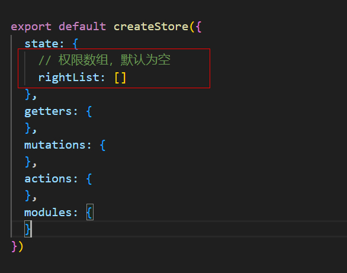

state中的数据是不能直接更改的，需要通过mutations来更改，因此我们在mutations中增加一个函数：setRightList来更改reightList：


这个函数有两个参数，第一个参数**固定为state对象**，第二个是所需要修改成为的数据：

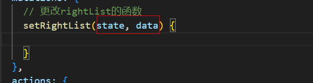

setRightList函数中所需要做的就是将传递过来的data赋值给reightList：


接下来我们就需要在login组件中调用setRightList函数将权限数据赋值给reightList。在vue3组合式API中调用mutations中的方法，首先要全局挂在store，这点在创建vue工程时已经自动创好了：

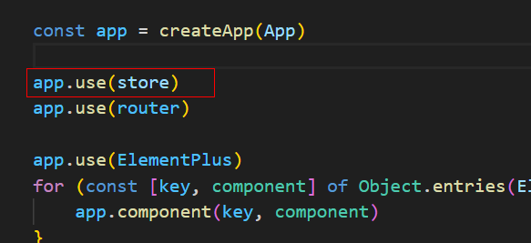

然后导入useStore函数，通过该函数来访问store：

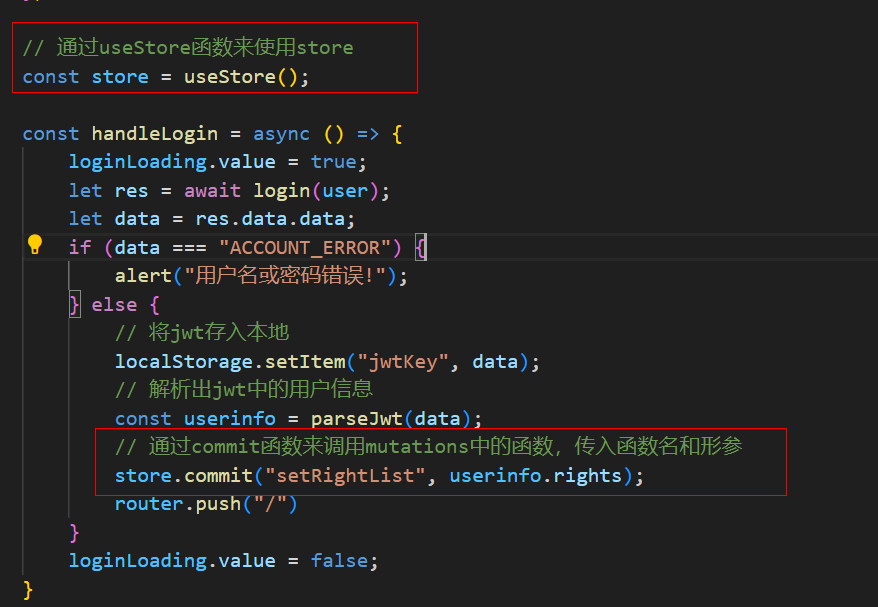

```js
// 导入useStore
import { useStore } from "vuex"

// 通过useStore函数来使用store
const store = useStore();

// 解析出jwt中的用户信息
const userinfo = parseJwt(data);
// 通过commit函数来调用mutations中的函数，传入函数名和形参
store.commit("setRightList", userinfo.rights);
```

这样，数据就存储到vuex中了。

然后在sidebar组件中使用，要获取vuex中state的数据，可以使用vue提供的computed函数，使用computed函数创建响应式的属性，直接访问 Vuex store 中的 state。简单来说，computed函数接受一个回调，回调去映射state的数据，computed将映射到的数据返回：

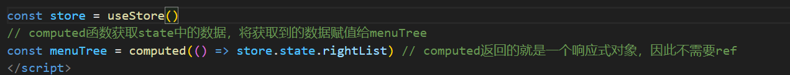

```js
import { ref, computed } from 'vue'
import { useStore } from 'vuex';

const store = useStore()
// computed函数获取state中的数据，将获取到的数据赋值给menuTree
const menuTree = computed(() => store.state.rightList) // computed返回的就是一个响应式对象，因此不需要ref

```

树形菜单组件就会根据menuTree来动态渲染菜单，不同用户拥有不同的权限，其菜单也不同：

admin：

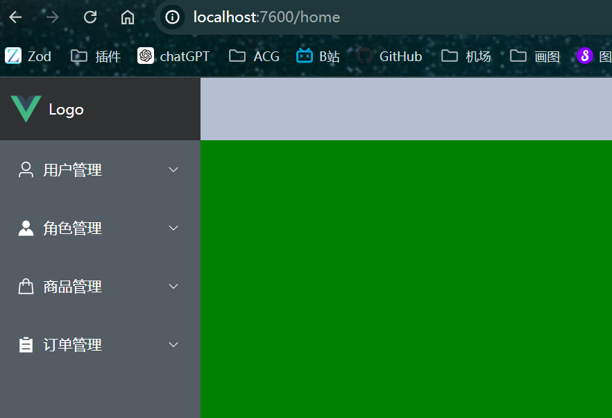

user：

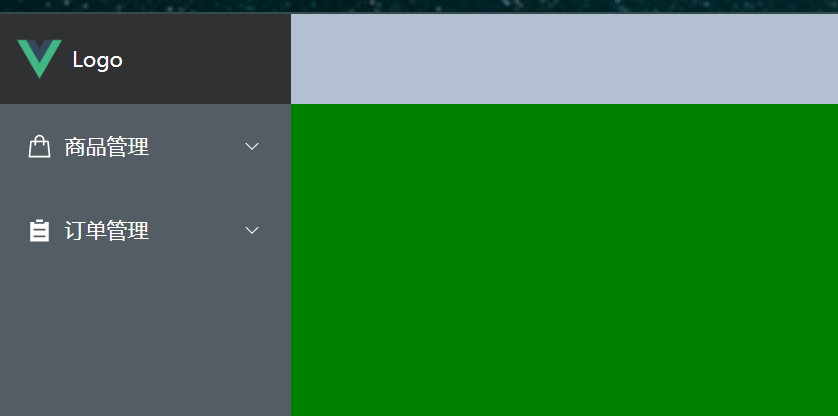

这里有一个bug，当刷新页面，菜单栏消失了：

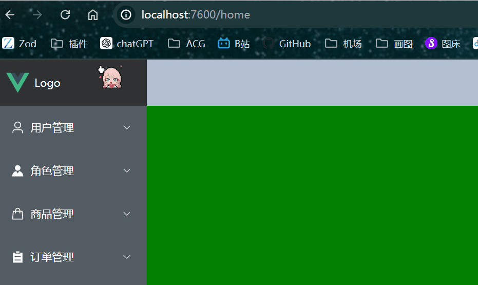

bug产生的原因：state中rightList默认值是空数组[]：

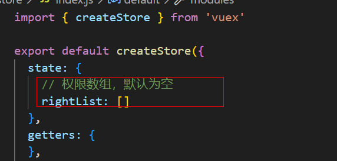

当我们刷新页面vuex会重新加载，重新加载导致rightsList为默认值，而此时我们没有进行登录的操作，因此rightList就会从有数据数组变成空数组。

所以，我们不仅仅将权限数据存入vuex中，还应该存入到localstorage中。为了防止篡改本地的权限数据，可以将其存入到jwt中：

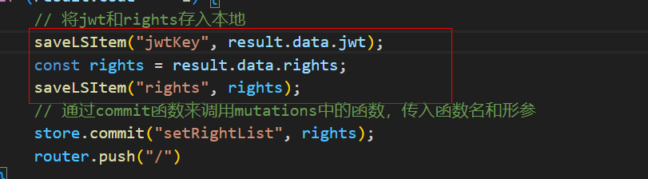

初始化时，就从本地获取：

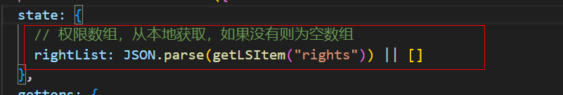

现在，刷新后，菜单就不会消失了：

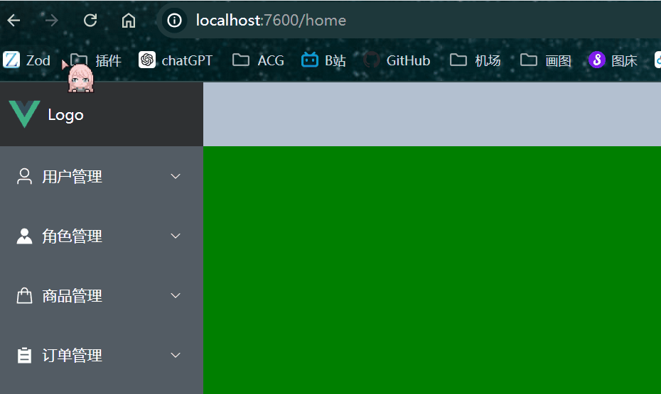

或者，你也可以将rights存入本地的逻辑写在mutations中：

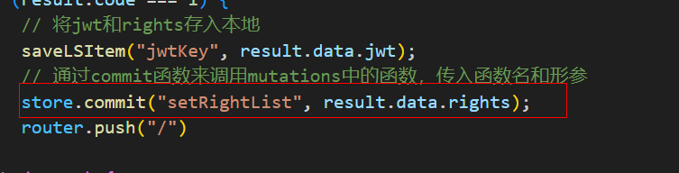

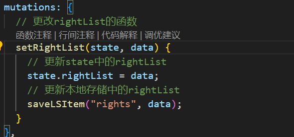

你肯定会有疑惑，为什么一定要将数据保存在vuex和localstorage中然后从vuex中获取数据，而不直接保存在本地，从本地获取数据？

先回答第一点，数据保存在vuex中，本质上是保存在内存中，而本地数据是保存在本地磁盘中，内存中数据读取速度是要优于本地磁盘的。至于第二点，等完成动态路由后再回答。

如法炮制，我们将jwt中的用户名也存入到vuex中，然后在header组件中显示出用户：

在state中定义属性userinfo：

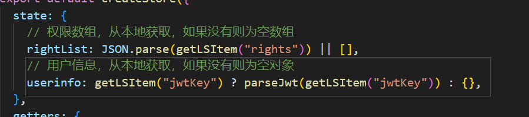

然后在mutations中定义设置userinfo的函数：

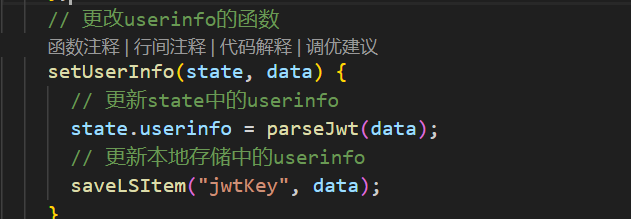

这样，在vuex中定义存储本地的逻辑，login中就不用定义了：

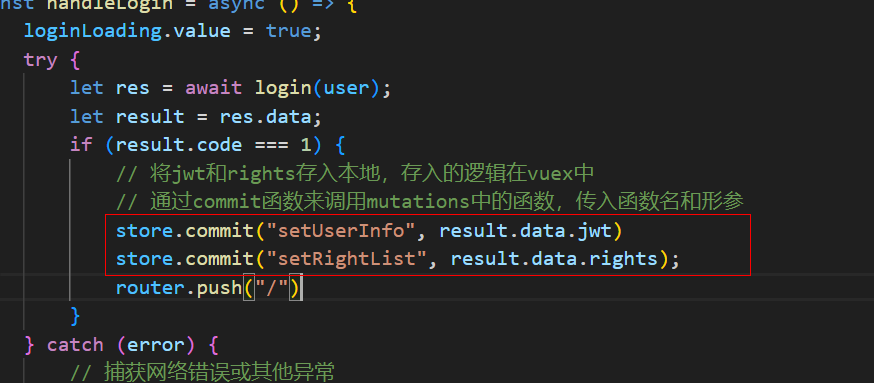

然后在header组件中调用state中的userinfo：

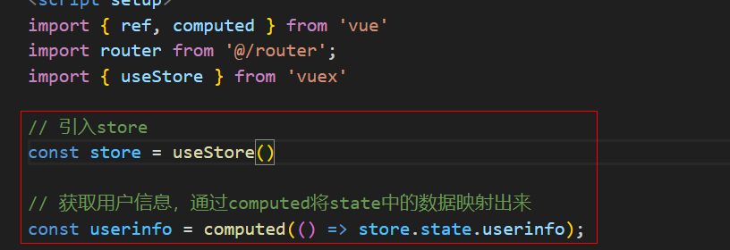

效果：

user登录：

root登录：

完善退出效果，一个基本的退出需要做这几件事：

- 删除本地信息
- 删除vuex的信息
- 重定向到登录页面

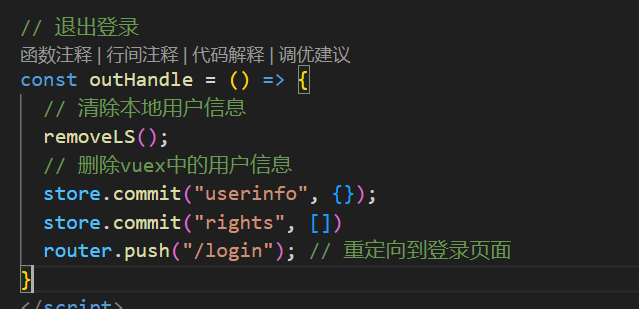


# 界面的控制

- 如果用户没有登录，手动在地址栏敲入管理界面的地址，则需要跳转到登录界面。
- 如果用户已经登录，可是手动敲入非权限内的地址，则需要跳转404界面。

当前用户没有登录，但是用户如果记得资源路径就能直接访问：

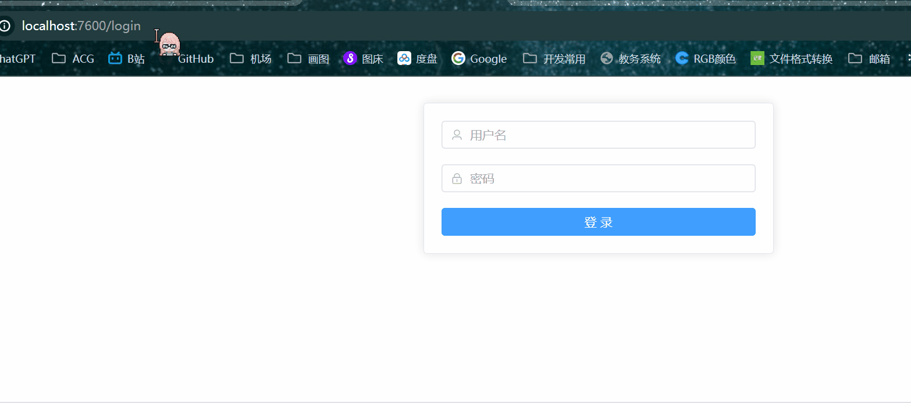

当前用户是user，他没有访问/users资源的权限，但是地址栏输入路径依旧能访问到资源：

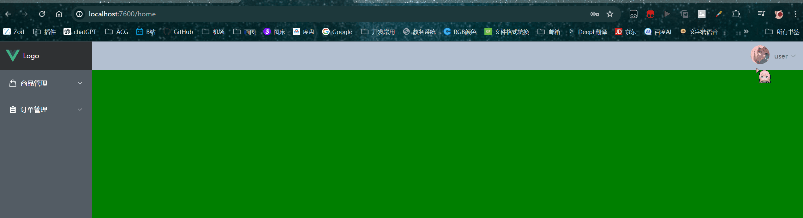

我们先说第一个，用户在未登录的情况下去访问需要登录才能访问的资源时，应该让页面重定向到登录页。我们可以用路由守卫来实现：

思路是在访问路由之前，检查本地的jwt是否存在，存在就放行路由，不存在就拦截路由并重定向到登录页。因为用户只要登录，那么本地一定有jwt，如果用没有登录那么本地一定没有jwt，假设用户已经登录了，但是本地的jwt应某些原因被删除，那么当他下次访问路由时就会进行jwt校验，依然会重定向到登录页。

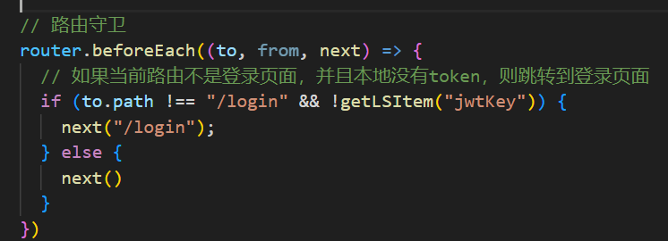

现在，在未登录的情况下，页面就会重定向到登录页：

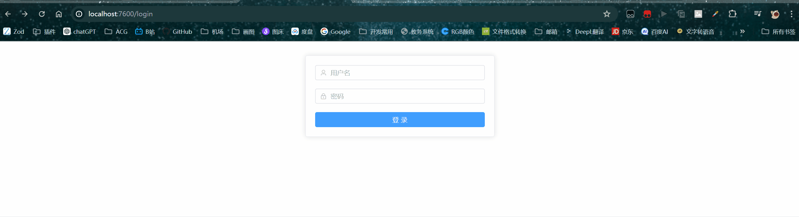

但是这样就可以了吗？并不是，我们的路由守卫中校验token的逻辑仅仅是判断token存不存在，如果用户伪造一个假token，那么他就不是登录状态，但他依然能访问资源：


访问到了路由，地址栏路由确实改变了，但是为什么页面没有显示呢？是因为解析jwt函数出现了错误：

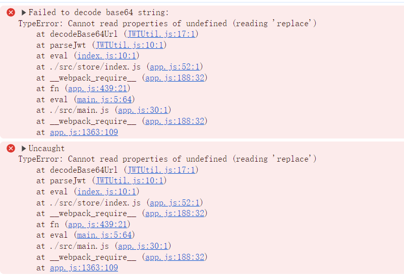

解析函数中对jwt按照.进行了分组形成数组，又对数组的第二个元素进行替换操作：

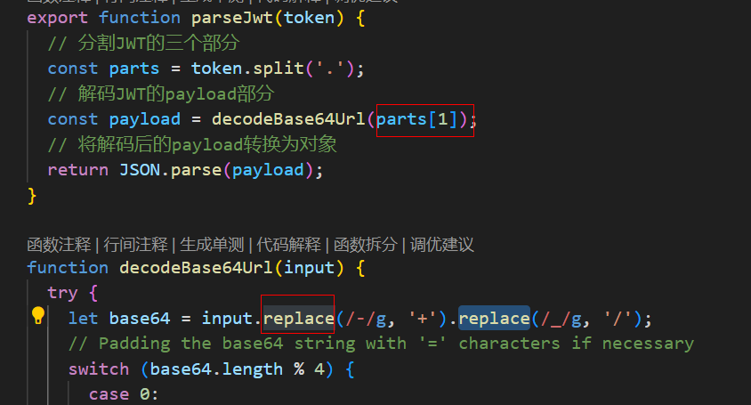

但是我将jwt改成了11111，数组中的第二个元素自然是null，对null进行替换自然要报错，而vuex中又使用了parseJwt函数，所以也跟着报错：

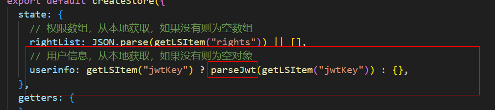

这导致state的userinfo没有初始化，因此vue没有完成渲染，页面就是空白的。

所以，我们可以改一下userinfo初始化的逻辑：

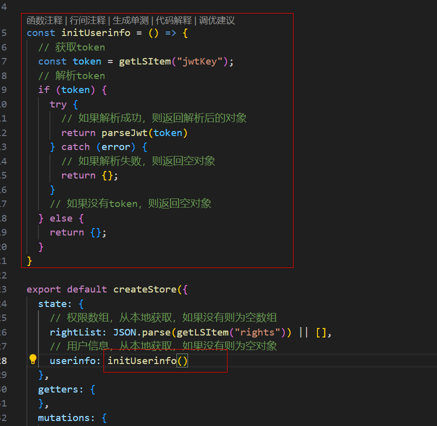

再次测试：


现在就是我所说的，伪造的token也能访问需要登录才能访问的页面的效果。

要解决这个问题就要对jwt进行校验，而校验在前端中很难实现(目前所知)，所以这需要结合后端。思路是这样的：

首先，前端的请求拦截器会让每次请求都携带jwt，然后发送到后端，后端获取jwt，如果没有获取到或者校验失败，那么就拦截请求，并返回一个这样格式的响应：

```json
{
    code: 0,
    msg: "NOT_LOGIN",
    data: null
}
```

前端接受到响应，通过code和msg判断出当前用户是未登录的状态，是就重定向到登录页面。

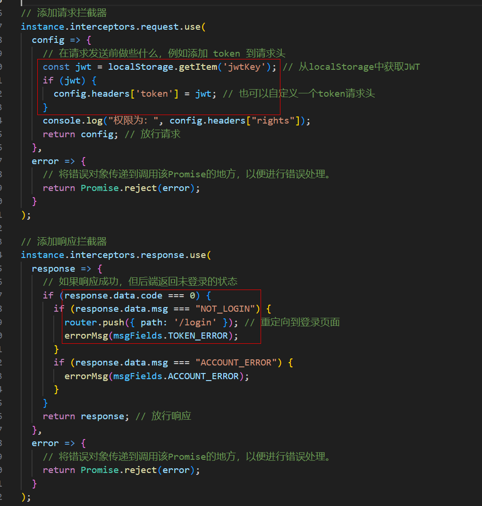

效果是这样的：

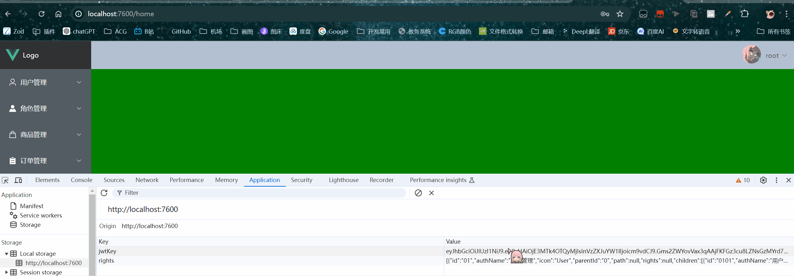

需要注意的是，我们访问的路由是/users那么是因为访问这个路由才让后端校验jwt的吗？并不是，是因为这个组件中刚好有页面挂载完成后执行的异步请求，去请求后端，才进行的jwt校验：

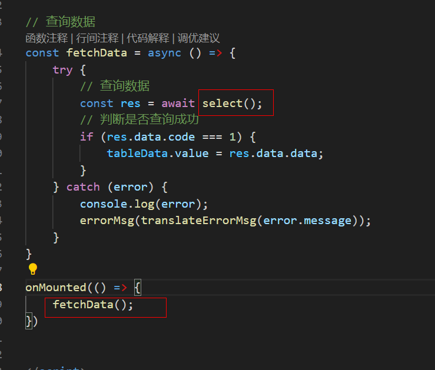

我们访问这个路由 >> 组件挂载完成 >> 然后异步请 >> 校验jwt失败 >> 后端返回未登录状态 >> 重定向到登录页面。看起来就好是我们访问路由然后重定向的，但其实是内部的请求，路由和请求不是一个东西！

但是，如果这个组件没有页面挂载完成后执行的异步，而是需要用户交互才能去异步，甚至于是一个纯静态页面，那么我们依然能访问它，因为它没有发送异步请求(至少在用户操作之前)：

比如，/roles就是一个静态页面：

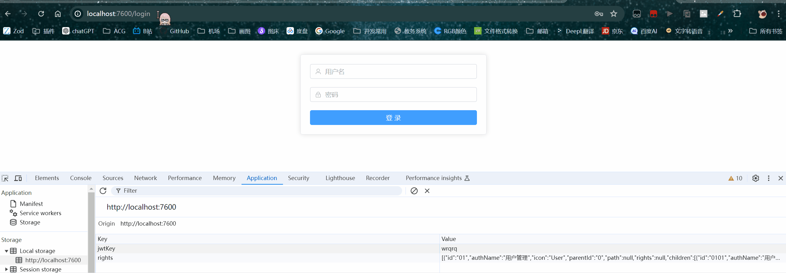

那要是roles是需要用户登录后才能访问的组件，用户岂不是就能访问到吗？因此，我们可以在这样的组件中在它挂载完成后，专门去发送一个请求，这个请求就是专门去校验jwt的，校验通过，后端直接返回成功的响应除此以外不做任何操作，如果校验失败，那么就会返回未登录状态，响应拦截器自然就重定向到登录请求了：

后端，只要请求能到达Controller，那么就说明jwt有效，直接返回成功的响应：

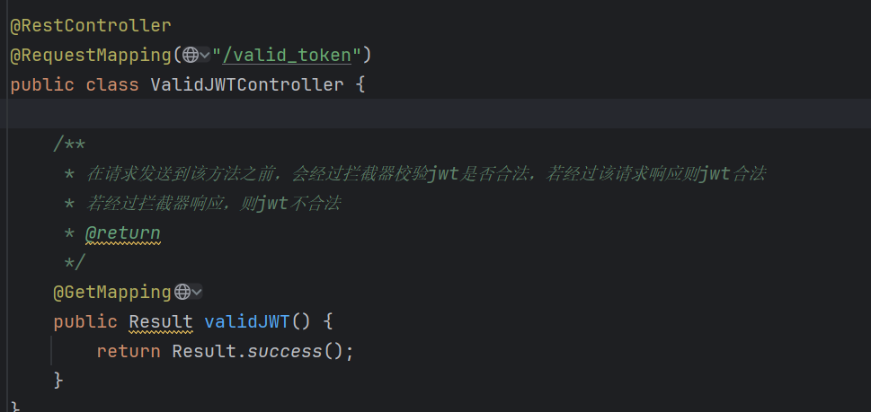

校验jwt的请求：

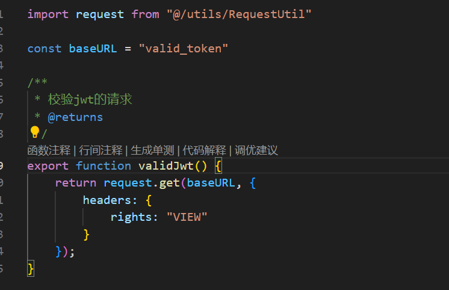

挂载完成后请求：

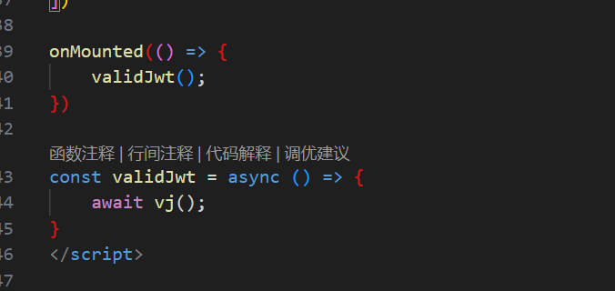

效果：


然后是第二个，当前用户是user，它没有访问/users的权限，但它依然能访问：

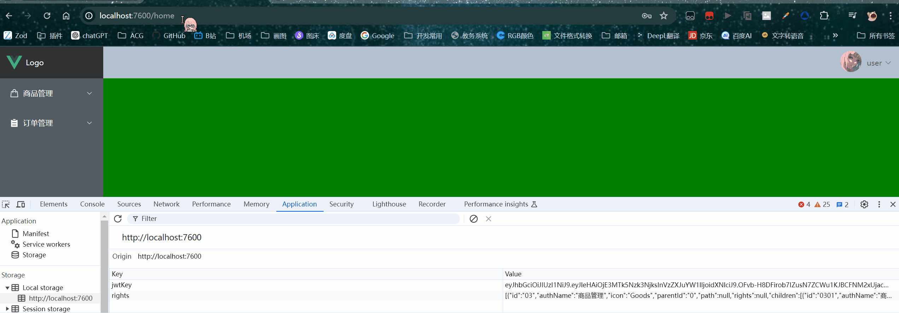

原因是我们将路由写死了：

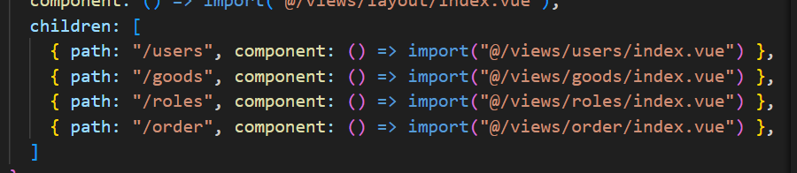

这就导致，不管是什么角色，他们都共用一套路由规则，换个角度思考，如果这个用户没有访问这个路由的权限，是不是这个路由压根就不应该存在于路由规则中？也就是说，每一个角色的路由应该根据角色动态生成对应的路由。

user和root返回的rights是不同的：

user：

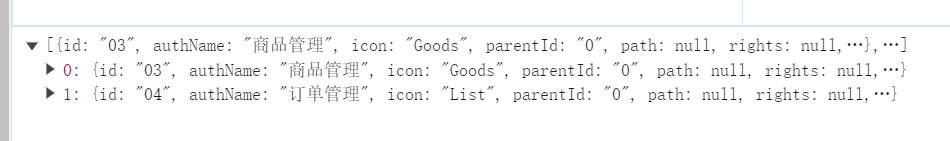

root：

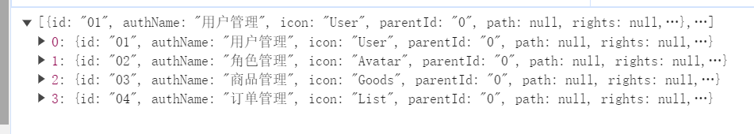

因此我们只需要拿到用户对应的rights，然后根据rights动态的生成路由规则即可。

什么时机去生成路由？在登录成功后去动态生成路由。因此，我们可以在router.js中暴露出一个动态生成路由的函数，然后在登录组件中调用这个函数：

路由对象router创建完成后，如何再次添加路由规则到router中？

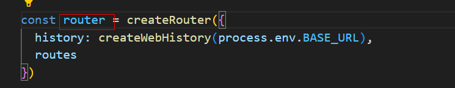

可以使用官方提供的addRoute函数，它可以在router创建完成后添加路由规则和嵌套路由规则：

添加路由规则：

```js
// 路由规则数组
const routes = [
  {
    path: '/',
    redirect: "/home"
  },
  ...
]
// 创建路由对象
const router = createRouter({
  history: createWebHistory(process.env.BASE_URL),
  routes
})
// 添加路由规则    
router.addRoute({
    path: "/hello",
    component: () => import("@/views/hello/index.vue")
})
```

等效于：

```js
// 路由规则数组
const routes = [
  {
    path: '/',
    redirect: "/home"
  },
  ...,
  {
    path: "/hello",
    component: () => import("@/views/hello/index.vue")
  }
]
```

添加嵌套路由，需要用到路由规则的name属性，即将添加的路由规则作为子路由添加到指定name的路由规则下面：

```js
// 路由规则数组
const routes = [
  {
    path: '/',
    redirect: "/home"
  },
  {
    path: '/home',
    name: "home"
    component: () => import("@/views/layout/index.vue"),
    children: []    
  },  
]
// 创建路由对象
const router = createRouter({
  history: createWebHistory(process.env.BASE_URL),
  routes
})
// 添加路由规则，指定添加到name=home的路由规则的children中    
router.addRoute("home", {
    path: "/hello",
    component: () => import("@/views/hello/index.vue")
})
```

等效于：

```js
const routes = [
  {
    path: '/',
    redirect: "/home"
  },
  {
    path: '/home',
    name: "home"
    component: () => import("@/views/layout/index.vue"),
    children: [
        {
            path: "/hello",
            component: () => import("@/views/hello/index.vue")
        }
    ]    
  },  
]
```

动态创建路由的函数，暴露出去：

将子路由添加到/home下：

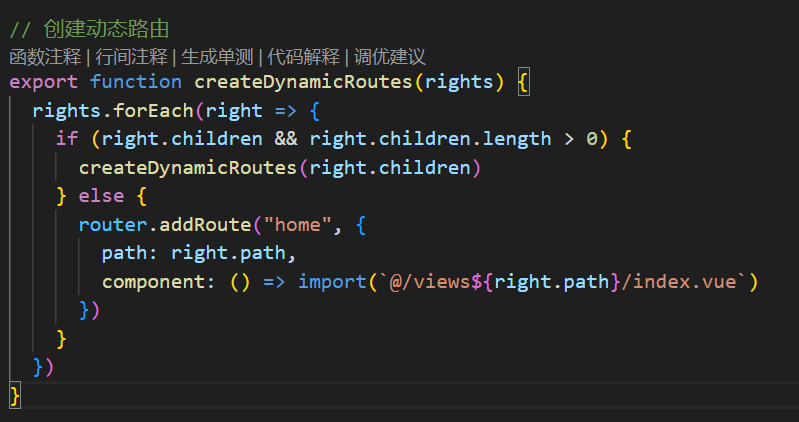

在登录时，调用该函数，动态创建路由：

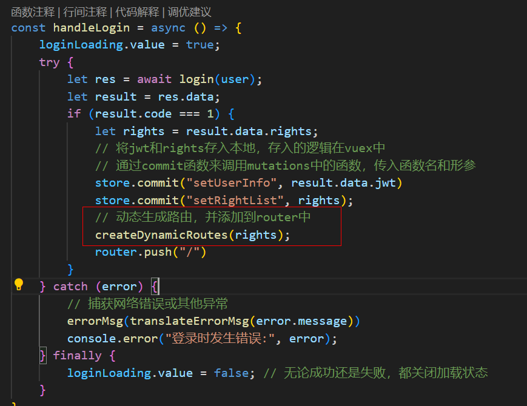

admin登录，它拥有所有菜单的权限，能访问所有的组件：

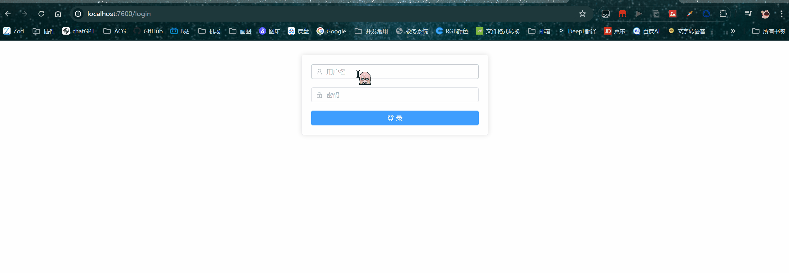

用户登录，他只有商品和订单的权限，当他去访问users或roles时，由于他的路由规则中没有这两项，因此会访问到404：

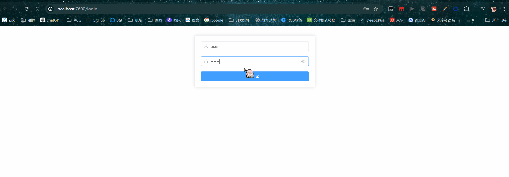

bug：当刷新页面时，路由规则失效：

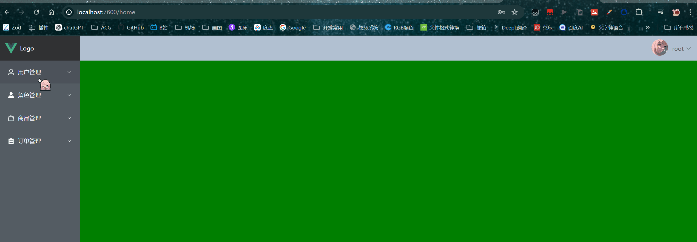

原因：我们生成路由的时机是在登录成功后，但是当页面刷新后，router.js重新加载，就会重新创建router对象，但是此时我们已经登录进来了，并没有执行登录操作，那么自然不会创建这些权限的路由规则。

因此，我们除了登录成功后后创建路由规则以外，还要在router.js中创建路由规则：

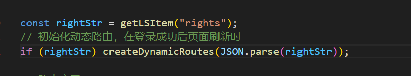

从本地中获取rights，然后初始化路由规则：

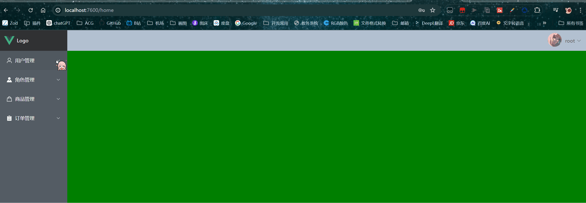

如果用户改动了rights，我们可以为createDynamicRoutes函数添加一个条件判断：

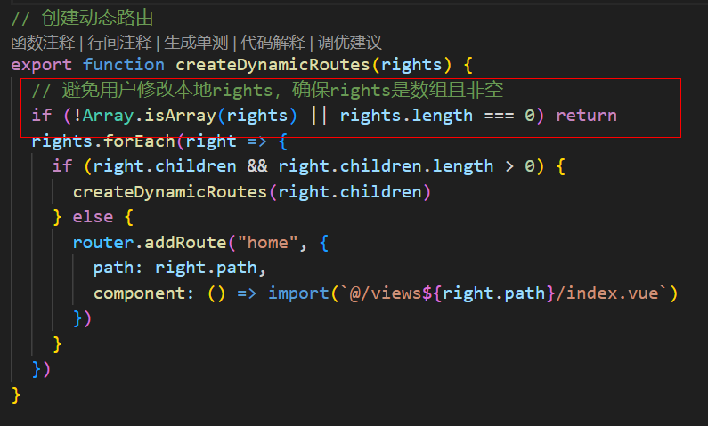

同样的，更改rights后，在JSON.parse(rights)容易报错的地方，也应该考虑解析错误的情况处理：

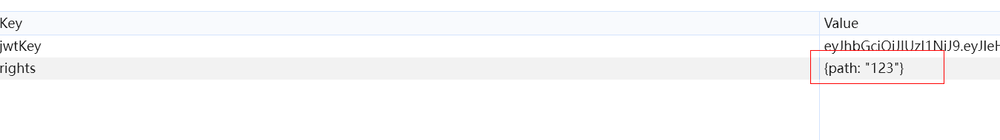

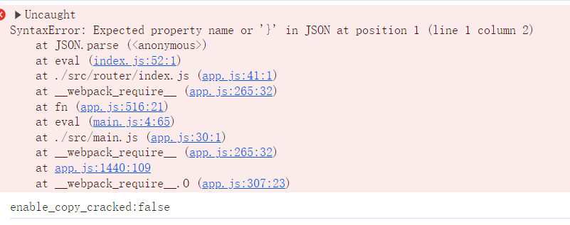

vuex中：

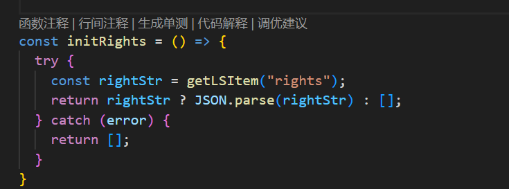

初始化路由这里：

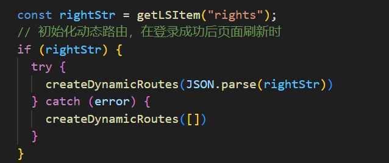

除了获取本地的rights外，我们还可以考虑从vuex中获取，但是我在router.js中尝试从vuex中获取rights失败了。

另一个思路是在根组件App.vue中来初始化动态路由：

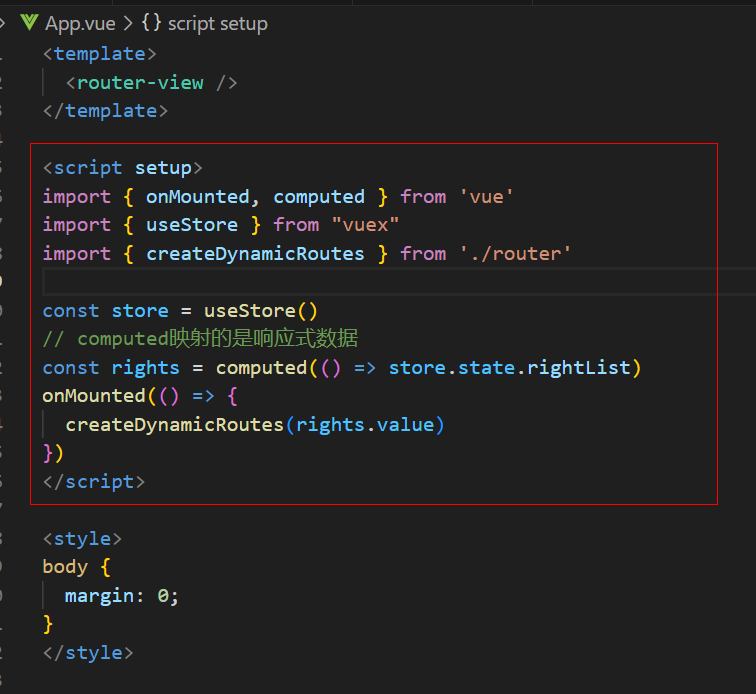

这里就可以使用vuex中的rights。但是这样虽然能使用vuex中的状态，动态路由规则也无法生成，原因未知。为什么执着于从vuex中获取rights，是因为vuex是存储在内存中的，读取速度更快。

router.js并不是组合式API，而是js文件，因此可以直接导入store.js，然后调用store中的状态，但是这需要保证store先于router加载，否则router无法获取store中的状态，只要保证main中vue实例先加载store即可：

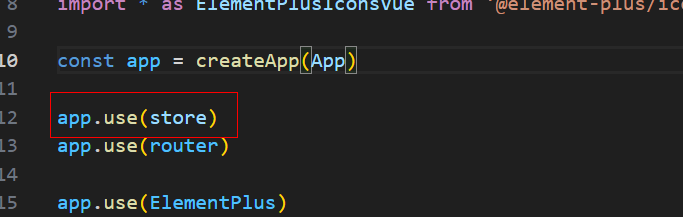

在router中使导入store然后直接调用内部的状态：

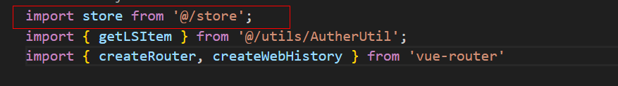

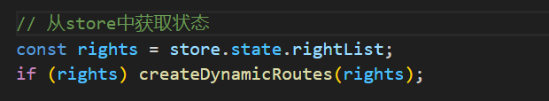

现在，怎么刷新也不会丢失路由规则了：

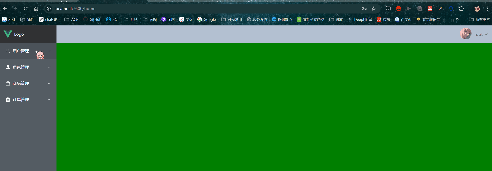

rights和jwtKey，都是存储在本地的，因此可能会被用户修改，一旦被修改，那么在vuex或router.js中去读取本地数据并解析时，就可能会抛出错误，导致vue初始化失败，页面空白，给用户造成困扰。所以，我才会在vuex和router.js中对读取文本的操作进行try...catch处理，确保即使抛出错误，vue也能完成初始化。推而广之，从本地获取的数据，如果需要解析，那么建议进行try...catch处理。

回答之前的问题：为什么一定要将数据保存在vuex和localstorage中然后从vuex中获取数据，而不直接保存在本地，从本地获取数据？

- 数据保存在vuex中，本质上是保存在内存中，读取速度比本地快


# 按钮的控制

在某个菜单的界面中，还得根据权限数据，展示出可进行操作的按钮，比如删除、修改、增加。

比如管理员拥有对商品表增删改的操作，那么他的页面就显示增加、删除、编辑的按钮，而user只要查询的权限，所以他没有加、删除、编辑的按钮，即便表格中有按钮，也是被禁用状态。

要实现这样的效果，我们可以使用自定义指令。


## 自定义指令

在vue3中自定义指令，需要通过vue的实例来创建，也就是这个：

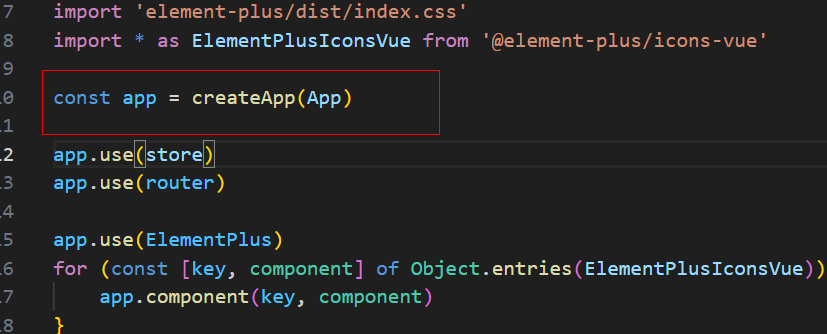

实例中有一个函数：directive，用于创建指令：

```js
app.directive()
```

这个函数接受两个参数：**指令名**，**对象**

先说**指令名**，也就是指令的名称，要使用指令就在标签中调用指令名，就像v-if、v-for、v-bind一样，使用时必须以v-开头，比如自定义的指令名为"myDirective"，那么使用时：

```vue
<span v-myDirective=""></span>
```

然后是第二个参数，是一个**对象**，用于定义指令的行为，他的属性是一系列钩子函数，在指令的生命周期中会执行对应的钩子，包括：

在vue3中：

| 钩子函数        | 执行时机                                                     |
| --------------- | ------------------------------------------------------------ |
| created()       | 在绑定元素的 attribute 或事件监听器被应用之前调用。在指令需要附加在普通的 v-on 事件监听器调用前的事件监听器中时，这很有用。 |
| beforeMount()   | 当指令第一次绑定到元素并且在挂载父组件之前调用。             |
| mounted()       | 在绑定元素的父组件被挂载后调用，**大部分自定义指令都写在这里**。 |
| beforeUpdate()  | 在更新包含组件的 VNode 之前调用。                            |
| beforeUnmount() | 在卸载绑定元素的父组件之前调用                               |
| unmounted()     | 当指令与元素解除绑定且父组件已卸载时，只调用一次。           |

每个钩子都有4个参数，如：

```js
created(el, binding, vnode, prevNode) {}
```

- **el**：指令绑定到的元素。这可以用于直接操作 DOM。简单来说，就是绑定了该指令的DOM
- **binding**：：一个对象，包含以下属性：
  - **value**：传递给指令的值。例如在 v-myDirective="1 + 1" 中，值是 2。
  - **oldValue**：之前的值，仅在 beforeUpdate 和 updated 中可用。无论值是否更改，它都可用。
  - **arg**：传递给指令的参数 (如果有的话)。例如在 v-my-directive:foo 中，参数是 "foo"。
  - **modifiers**：一个包含修饰符的对象 (如果有的话)。例如在 v-my-directive.foo.bar 中，修饰符对象是 { foo: true, bar: true }。
  -  **dir**：指令的定义对象。
  - **instance**：使用该指令的组件实例。
- **vnode**：代表绑定元素的底层 VNode。
- **prevNode**：之前的渲染中代表指令所绑定元素的 VNode。仅在 beforeUpdate 和 updated 钩子中可用。

指令创建又分为局部指令和全局指令，顾名思义，局部指令就是在单个组件中定义并使用，而全局指令是所有组件中都能使用，我们直接说全局注册。

创建指令需要用到vue的实例，也就是app对象，但是这个app是在main.js中，也就是说我们可以在main.js中来自定义指令，但是如果我们的自定义指令很多，那么就会导致main.js很臃肿，而且不好维护，因此我们可以将创建指令的逻辑封装成一个函数然后导出这个函数，在main.js调用这个函数，将app实例作为参数传入。

以permission，许可指令为例：

项目分层，创建一个directive包专门用于存放自定义指令：

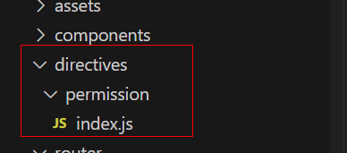

然后定义创建指令函数，并导出：

```js
// 导出函数，接收app参数，在main.js中调用，传入app实例，在全局注册指令
export default function permissionDirective(app) {
    app.directive("permission", {
        // mounted钩子，在绑定元素的父组件被挂载后调用
        // el，指令所绑定的元素，可以用来直接操作 DOM
        // binding，对象，包含指令相关的信息
        mounted(el, binding) {
            console.log(el),
            console.log(binding)
        }
    })
}
```

全局注册：

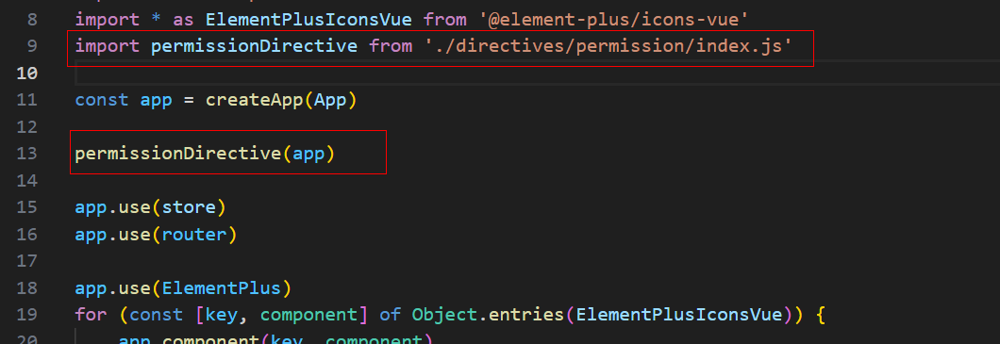

自定义指令的行为是mounted钩子，然后我们打印出el和binding，在组件中使用：

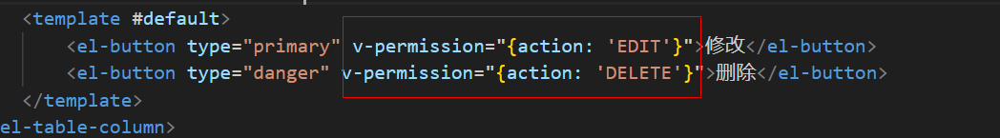

给指令传递的值是一个对象，当el-button的父组件被挂载后，就会打印出el和binding：

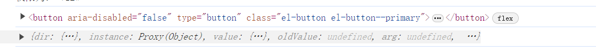

el是一个DOM，就是绑定该指令的button标签：

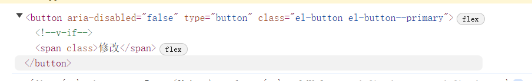

binding是一个对象，再来看binding的细节：

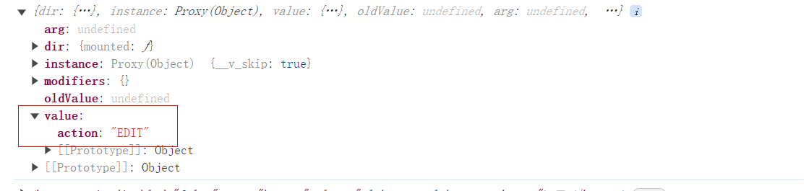

内部有一个属性value，它的值就是我们给属性传递的值。

那么自定义指令又是如果控制按钮的显示、隐藏或禁用？也就是控制按钮的样式？很简单，上面的演示中，我们可以通过指令很轻松的拿到当前绑定的DOM，既然DOM都已经拿到了，那么就能轻易的改变标签的样式。

而现在要做的就是如何根据用户的权限来动态的控制标签的样式，我们给指令传递的值：{action: 'EDIT'}，它代表的是标签的行为，绑定在按钮上也就是按钮的行为，而这个行为在我们的后端传递过来的权限数组中也是有的：

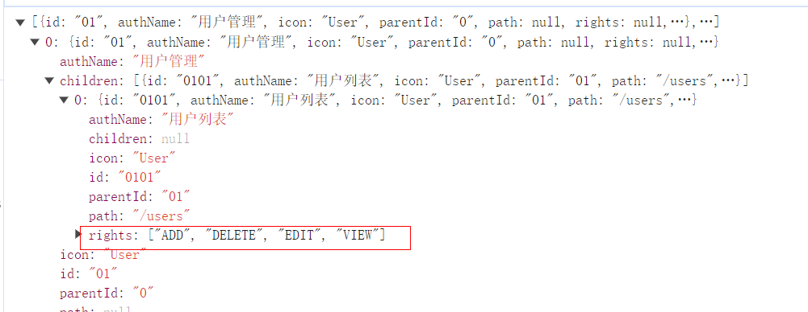

即每个权限对象的rights属性，姑且叫做按钮操作权限。既然如此，那么我们是不是可以拿着按钮的行为去匹配按钮操作权限，如果按钮的行为在按钮操作权限中，那就说明该用户的当前的这个权限是具备操作这个按钮的，那么就给用户显示或使用，反之，则用户当前的权限不具备操作该按钮，那么就让按钮消失或禁用。

那么我们如何在自定义指令中拿到当前用户的当前权限的按钮操作权限？我们可以和路由关联起来，因为动态路由中的每个路由规则都是rights来生成的，反过来我们是不是可以通过当前的路由拿到当前的权限呢？其实是可以的，可以通过router对象的currentRouter属性拿到当前的路由对象：

在自定义指令中：


currentRoute对象：

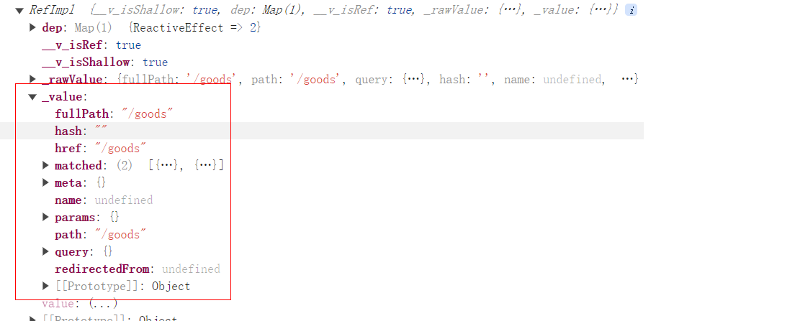

它有一个value属性，这个value属性就是当前的路由对象：

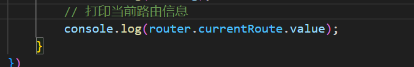

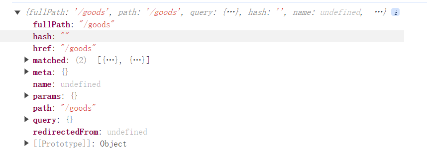

补充一个知识点，路由规则中用meta属性可以定义路由对象的元数据，比如：

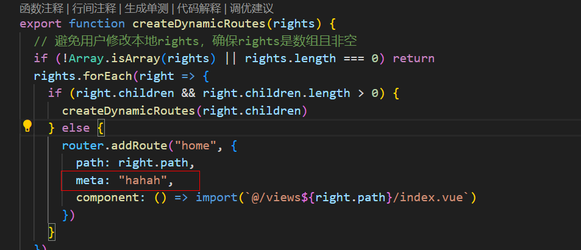

在创建动态路由时，定义一个元数据"hahah"字符串，这样每个动态路由都会携带这个元数据，那么在当前路由对象中就能看见这个数据：

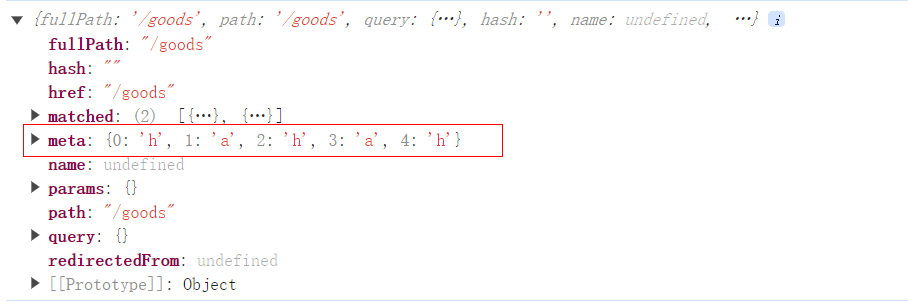

那么通过meta属性就能获取这个元数据：

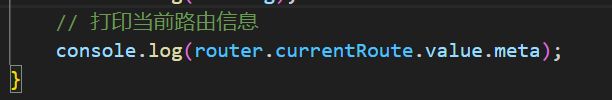

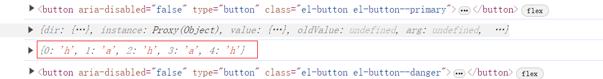

既然如此，我们何不在动态路由创建的时候将按钮操作权限存入到meta，自定义指令中也就能拿到按钮操作权限了：

注意：meta属性是一个对象：

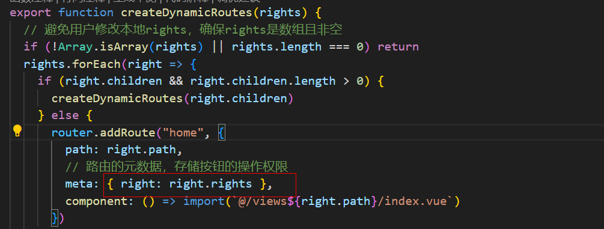

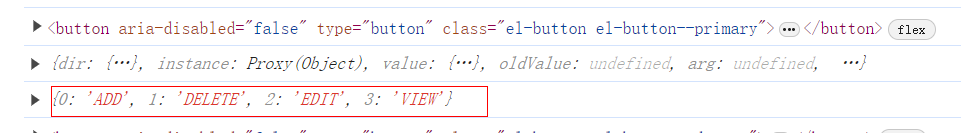

需要注意一点，自定义指令获取当前路由的meta属性时，必须在mounted函数中获取，不能在mounted之外获取，否则会出现meta属性为空的情况：

在mounted之外获取：

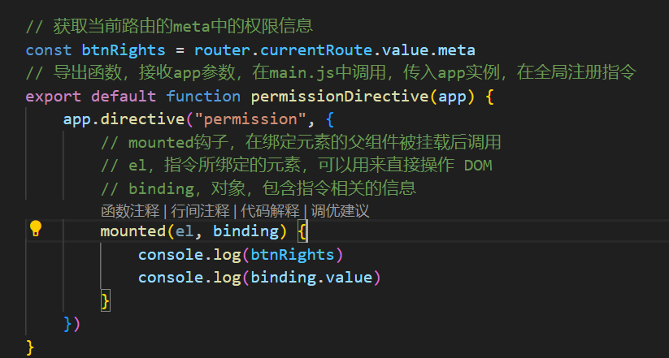

空对象：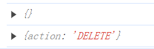

在mounted内获取：

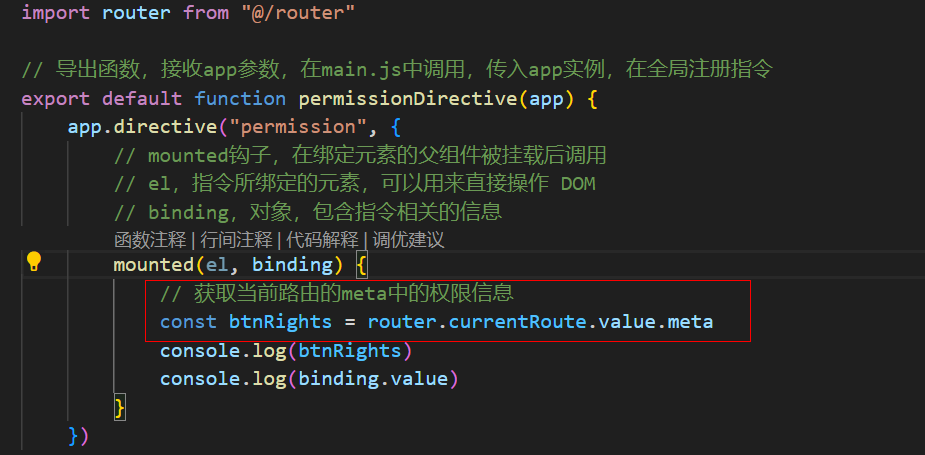

有值：


原因：因为mounted是在父组件挂载完成后执行的钩子，此时的路由已经加载完毕，自然动态路由也加载完毕了，那么meta属性就是有值的，如果在mounted之外获取，就是在路由加载之前获取meta值，此时的动态路由还未加载，自然meta中就不会有值。

判断当前用户的按钮行为是否在他所有拥有的按钮权限中，如果不是，则将按钮禁用。

这里说一下element的按钮禁用，需要在按钮中添加**disabled**属性和类样式：**is-disabled**，没有**is-disabled**是无法禁用按钮的：

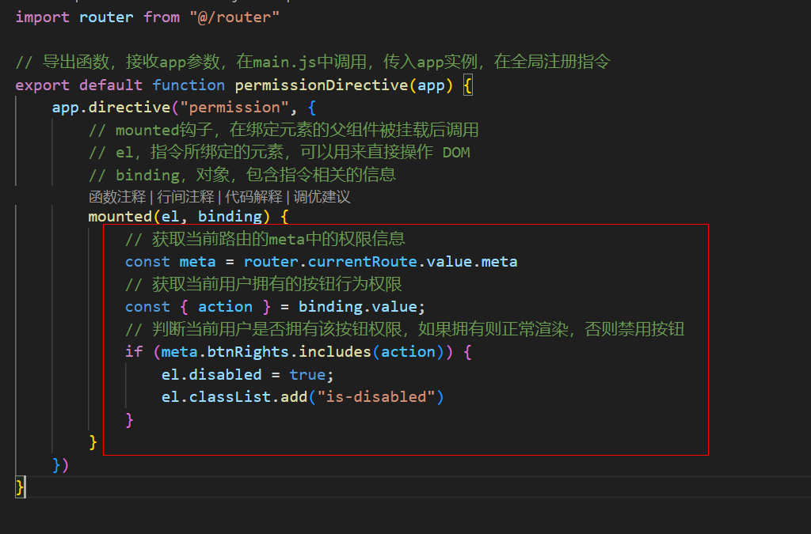

效果：

先登录user，因为user只有VIEW的按钮权限，所以他的按钮是禁用状态：

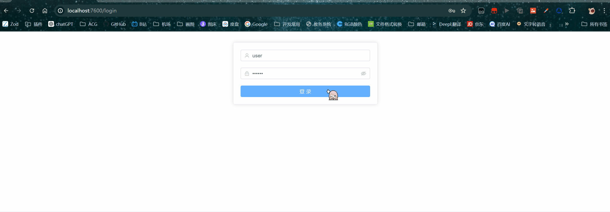

退出user，然后登录root：

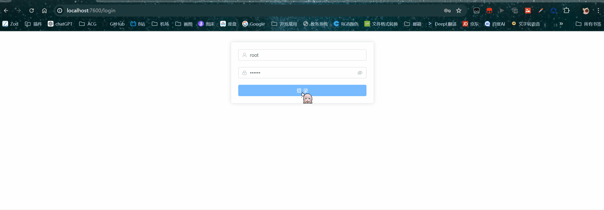

发现root的按钮也是禁用状态，得刷新页面才能变为启用状态：

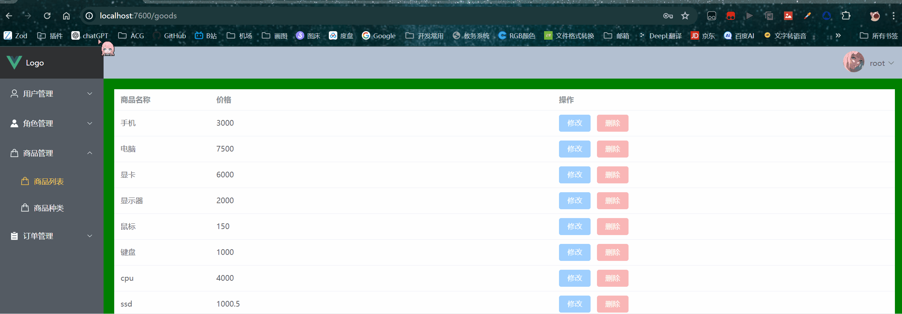

这其实是一个bug，再讲清楚bug之前，先来说一个细节，我们的动态路由是没有name属性的，这会导致后续如果添加相同的路由规则，不会覆盖掉之前添加的路由，而是会追加在路由规则数组后面。

为了验证这个情况，我在动态路由生成函数中打印最终的路由：
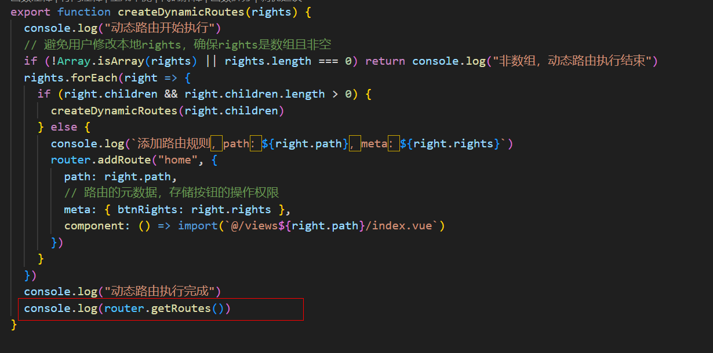

然后，我们重新以user第一次登录，最终的路由是这样的：

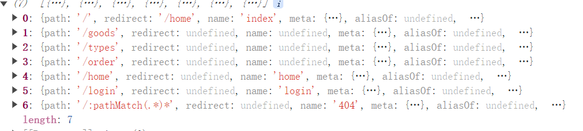

除基础的4条路由规则外，我们动态添加了/goods、/types、/order规则。然后我们退出登录，以root登录，root的最终的路由是这样的：

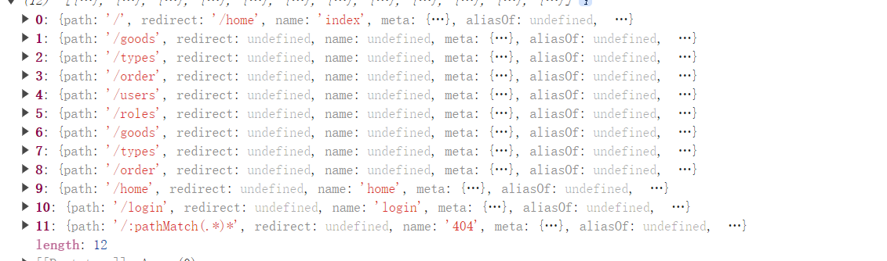

除基础的4条路由规则外，root还应该添加/users、/roles、/goods、/types、/order这5条规则，但是我们可以发现，root的/goods、/types、/order这3条规则，并没有覆盖掉user的相同的3条规则，user的规则仍然存在：

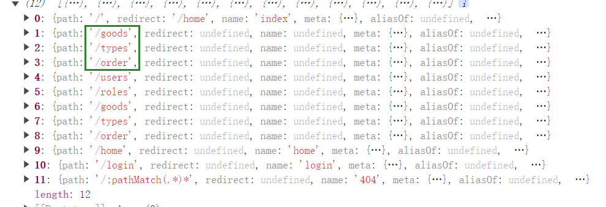

这就是我上面说的情况，我们退出然后再以root登录，按照这种情况，root的5条路由规则不会覆盖掉上次登录时创建的5条，也就如果root再次登录，那么路由规则因该是12+5=17条：

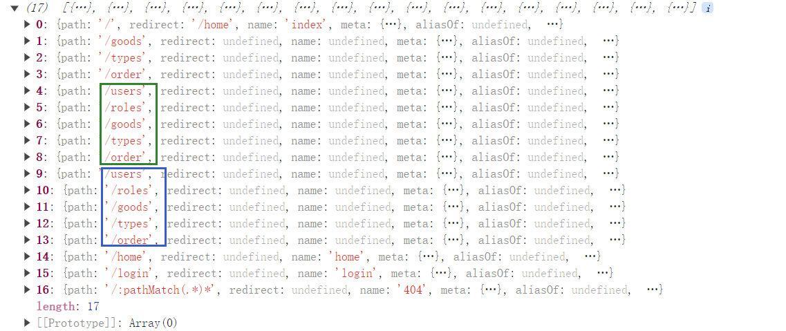

我们的猜想是正确的，绿色表示root第一次登录时产生的5条路由，而蓝色表示root第二次登录时产生的root。说到这里，这个bug其实已经很明了。bug产生的原因：因为动态路由创建好后是存储在内存中的，当我们退出登录后，没有对动态路由进行清空操作，导致第二次登录是在第一次登录产生的动态路由的基础上来创建的动态路由，而我们定义的路由规则又无法在相同路由规则的情况下覆盖掉原来的规则，而是追加在后面。这就导致当我以user登录登出后再以root登录，在指令中获取的当前路由/goods是user的(router获取当前路由，存在多个一样的路由时取第一个)而不是root的，所以才会造成root的按钮是禁用状态。而刷新页面后，路由重新加载，之前生成的动态路由消失，重新获取当前用户的路由规则，此时的路由规则就是用户自身的，所以按钮变为启用状态。

当我给动态路由添加name时，后续相同的路由就会覆盖掉原来的路由，而不是追加在后面：

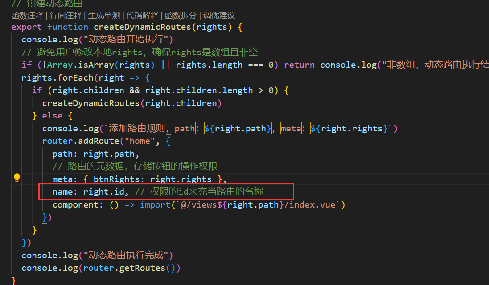

user的路由：

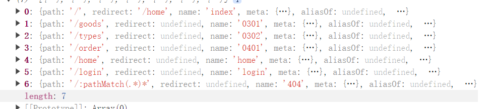

退出，root登录，路由：

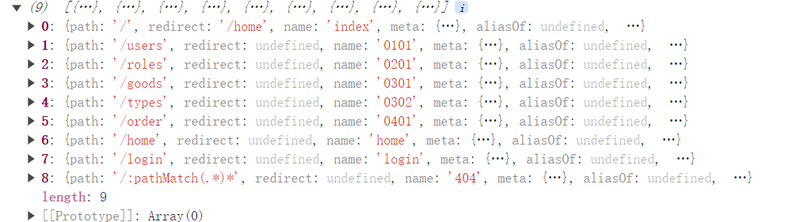

root的3条路由直接覆盖掉了user的，那么此时user和root的按钮权限就能正确的响应了：


除了为路由添加name属性外，我们还可以在登出时清空动态路由，使用

```js
// 根据name删除路由
router.removeRoute(name);
```

清空动态路由后，再次登录时，就一定是新增，而不是追加，从源头杜绝追加的情况：

在登出这里删除动态路由，保留基础路由：

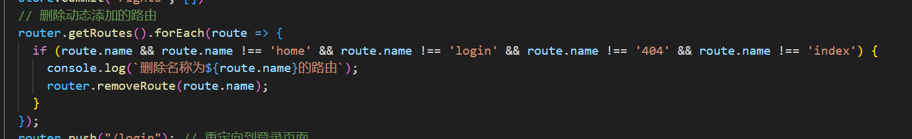

```js
// router.getRoutes获取路由列表，遍历，如果路由有name，且不是基础路由，则删除
router.getRoutes().forEach(route => {
    if (route.name && route.name !== 'home' && route.name !== 'login' && route.name !== '404' && route.name !== 'index') {
      console.log(`删除名称为${route.name}的路由`);
      router.removeRoute(route.name);
    }
  });
```

router.options.routes能获取基础路由数组，因此可以考虑封装一下清空动态路由的逻辑：

```js
// 删除动态添加的路由
const clearDynimicRoutes = (router) => {
  // 获取基础路由数组
  const baseRoutes = router.options.routes;
  // 映射出基础路由数组中的name，过滤掉假值
  const baseRoutesNames = baseRoutes.map(route => route.name).filter(Boolean);
  // 遍历路由，删除不在基础路由中的路由
  router.getRoutes().forEach(route => {
    const { name } = route; // 获取当前路由的name
    // 判断当前路由是否在基础路由中，如果在则不删除，否则删除
    if (name && !baseRoutesNames.includes(name)) {
      router.removeRoute(name); // 删除路由
    }
  })
}
```

路由添加name和清空动态路由，我建议一起使用。

除了按钮禁用外，我们还可以设计按钮移除，给指令传值时，多增加一个属性style：

```json
{
    active: "ADD",
    style: "DISABLE"
}
// 或
{
    active: "ADD",
    style: "REMOVE"
}
```

style为DISABLE时，表示对没有权限的按钮进行禁用，为REMOVE时，表示对没有权限的按钮进行移除，指令中可以维护一个操作对象，根据style的值来动态执行函数：

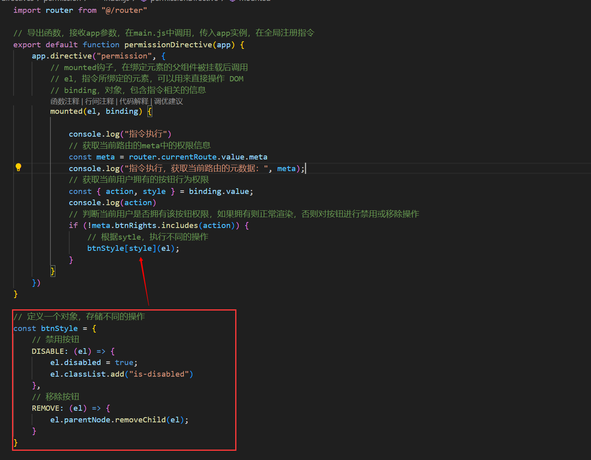

比如添加按钮，就进行移除的操作判断，编辑和修改就进行禁用的判断：

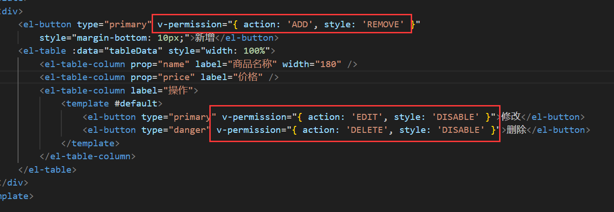

user，添加按钮没有，编辑和修改禁用：
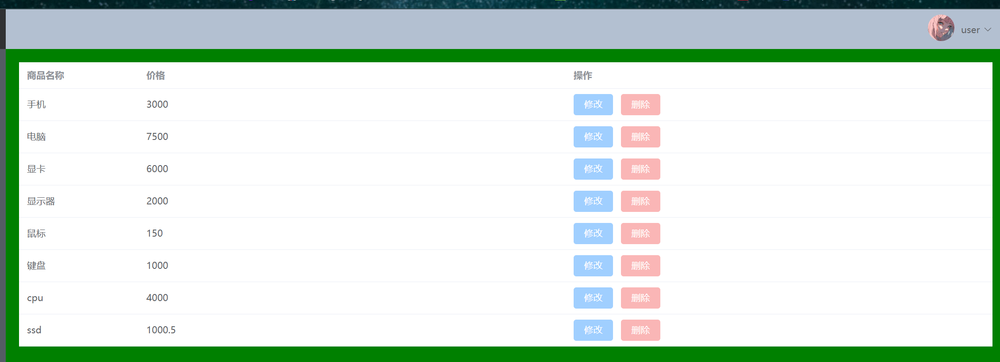

root，有添加按钮，编辑和修改启用：

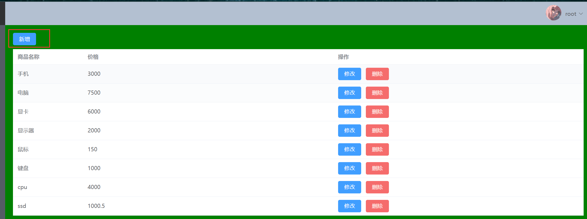


# 请求的控制

如果用户通过非常规操作，比如通过浏览器调试工具将某些禁用的按钮变成启用状态，此时发的请求，也应该被前端所拦截。

我们可以在axios请求拦截器中拦截请求，然后判断该用是否具有该请求的权限来判断要不要发请求。

如何在axios中获取权限？可以通过当前路由拿到meta中的权限数组。

如何知道这个请求是什么权限？可以通过restful风格的请求API来推导出权限：

restful的API中：

- 查询是GET请求
- 编辑是PUT请求
- 添加是POST请求
- 删除是DELETE请求

也就是不同的请求方式对应的权限为：

- GET => VIEW
- PUT=> DEIT
- POST=> ADD
- DELETE=> DELETE

我们可以通过请求拦截器获取请求的方式，进而判断出该请求的权限，与权限数组进行匹配，如果匹配上说明用户拥有这个请求的权限，否则用户没有这个请求的权限。

但是这种方式有局限性，因为除了增删改查操作外，还有其他操作的请求方式与之相同，比如上传操作，上传的方式是POST，假如用户有上传的权限没有添加的权限，如果因为添加的POST权限没有匹配上传，就把POST方式的请求排除，那不就也把上传的请求也给排除了吗？因此，我们可以为每个请求添加一个请求头，这个请求头标识该请求所需权限，然后在请求拦截器中获取请求头对应的权限进行匹配，这样就能完美解决这个问题。

以编辑操作为例，在编辑的请求中添加请求头：


这里有个细节，POST和PUT的请求函数的第三参数才是请求头，不是第二个参数，如果设置成第二个，则请求头设置失败。GET和DELETE的第二参数是请求头。

然后在请求拦截器中获取请求头：

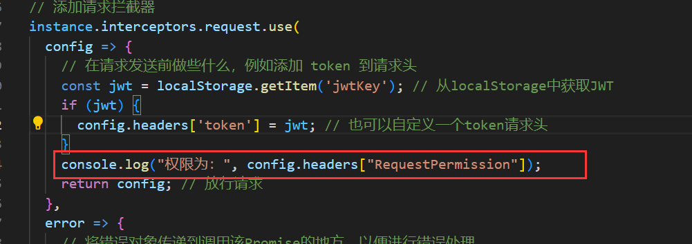

演示：

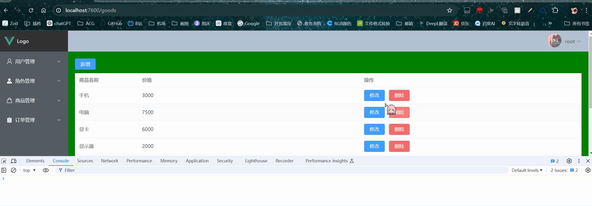

判断用户是否具有当前请求的权限：

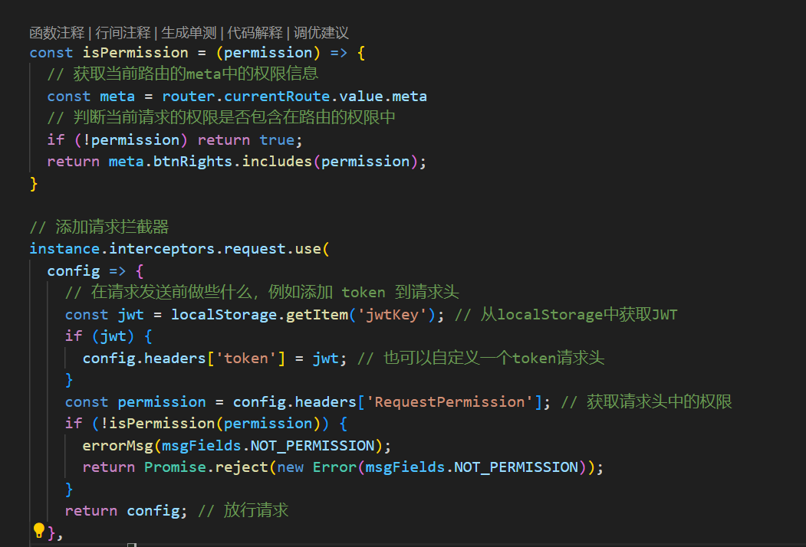

user去篡改样式，发起请求失败：

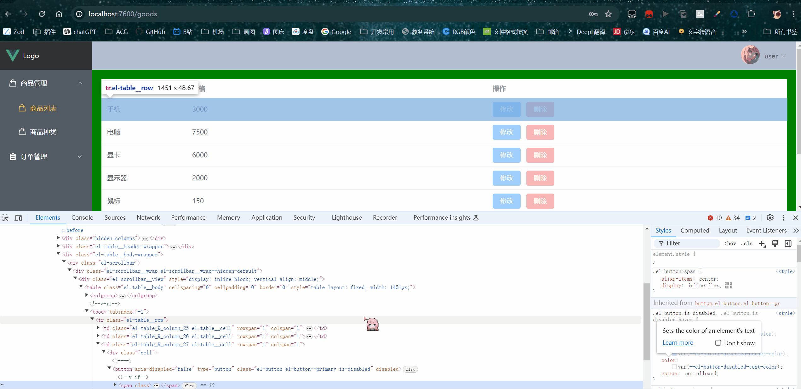
