# Git和Github的区别

- Git：运行在本地上的版本控制软件
- Github：基于Git打造的网站

版本控制软件，简单来说，就是控制项目的版本节点，可以提交某个节点的版本，也可以在项目发生错误时，回滚到之前的节点。

Git的三个概念：

- **提交(commit)**：Git会以你的提交为单位记录你这次提交，当某一天项目发生错误就可以回滚到某次提交。
- **仓库(repository)**：本质上就是文件夹， 在本地创建的目录可以作为仓库。 仓库中代码的每一次变更都会被Git记录下来，每一次提交也是针对仓库进行的。
- **分支(branch)**：根据不同的需求开辟不同的分支，由不同的开发人员来完成各种的分支，最终汇总成一个完成的项目。Git控制项目后会创建一个默认分支，也就是主分支main(以前叫master)，一般一个小型项目只有main分支。

Github是基于Git打造的网站，它能让你将本地的提交，仓库，分支上传到网站上。其他人可以通过网站访问你的项目(包括你自己)，经过你的允许还能编辑你的项目。 


# Github的简单使用

通过项目URL地址可以访问该项目：

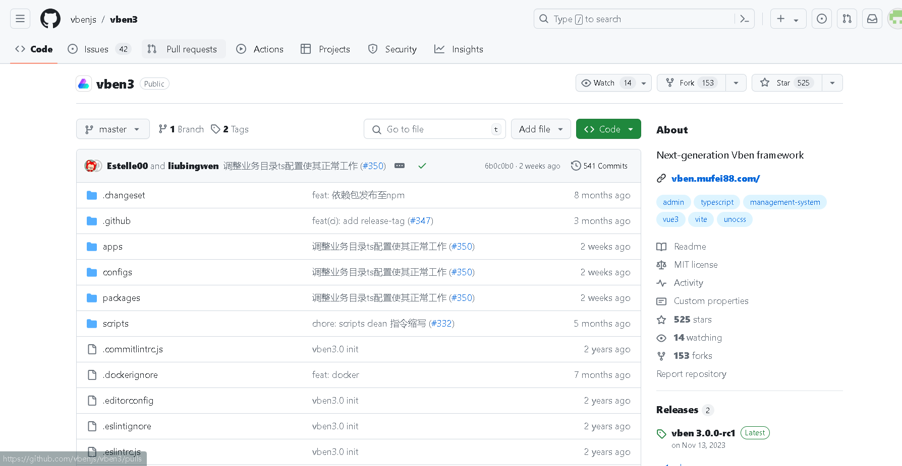

这是作者名和项目名：

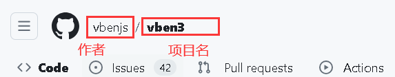

这是分支，这里显示1个分支，2两个标签，这个分支是主分支master：

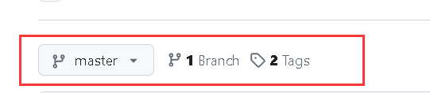

而这部分就是项目的源码：

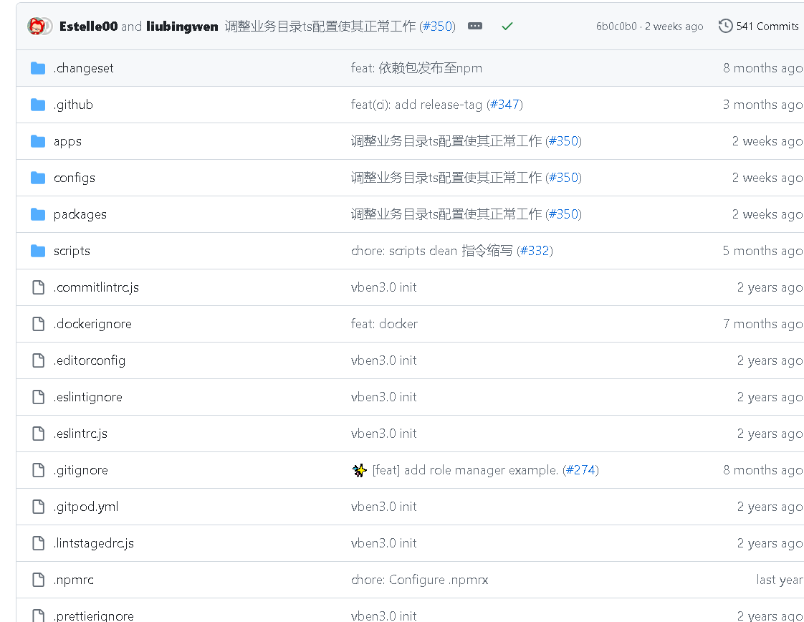

这是这个项目的流量数据：

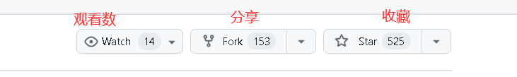

收藏数反应了一个项目的热门程度。

如果需要将项目拉取下来，那么你可以直接下载zip：

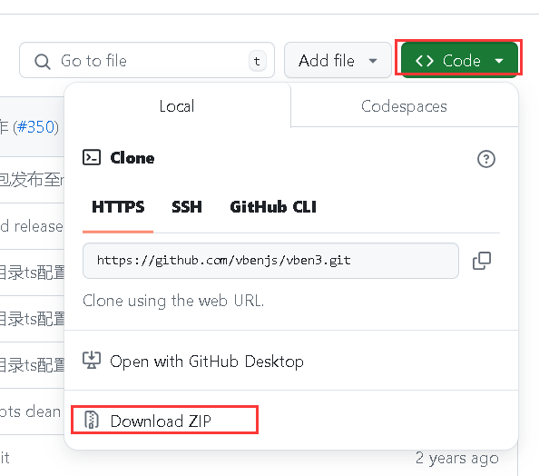

或使用Git命令将项目克隆到本地，以下是演示：

创建一个仓库：

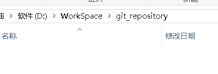

在该目录内右键，Git Bash Hear(需要提前下载Git)，在当前仓库打开Git的Bash：

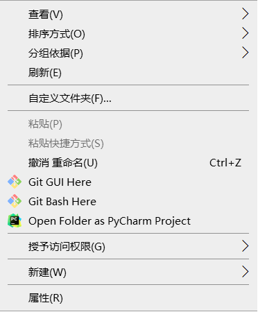

复制项目的URL：

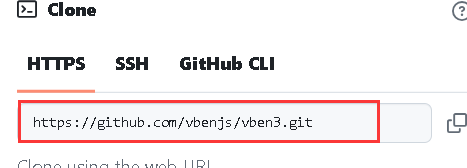

执行命令，将项目拉取到本地：

```bash
git clone https://github.com/vbenjs/vben3.git
```

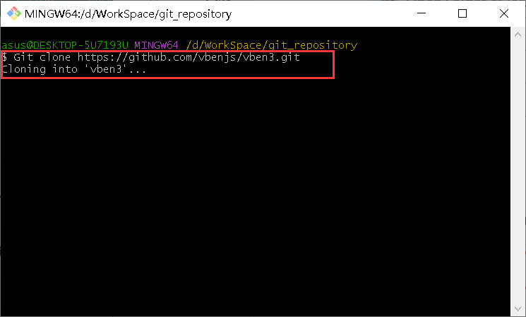

如果出现这个错误：

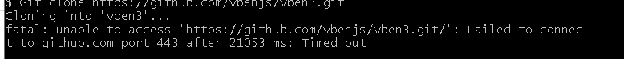

是因为Git的代理端口和本地不一致，找到本地端口：

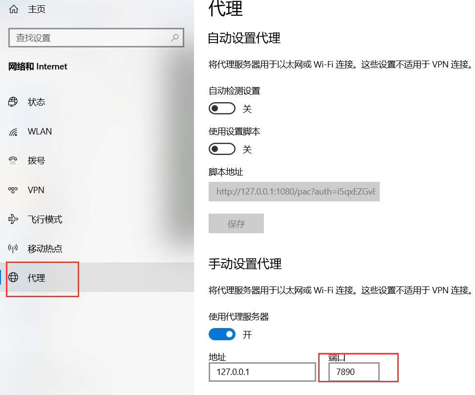

执行命令：

```bash
# 配置http和https协议的代理
git config --global http.proxy http://localhost:7890
git config --global https.proxy http://localhost:7890
```

拉取成功：

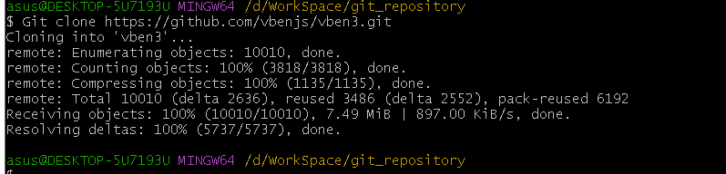

我们要使用别人的项目时，由这么几个文件是需要注意的，首先是readme.md这个文件包括整个项目的简介，以及一些快速开始和配置信息等，可以说如果你要使用这个项目，那么这个文档是必读的：

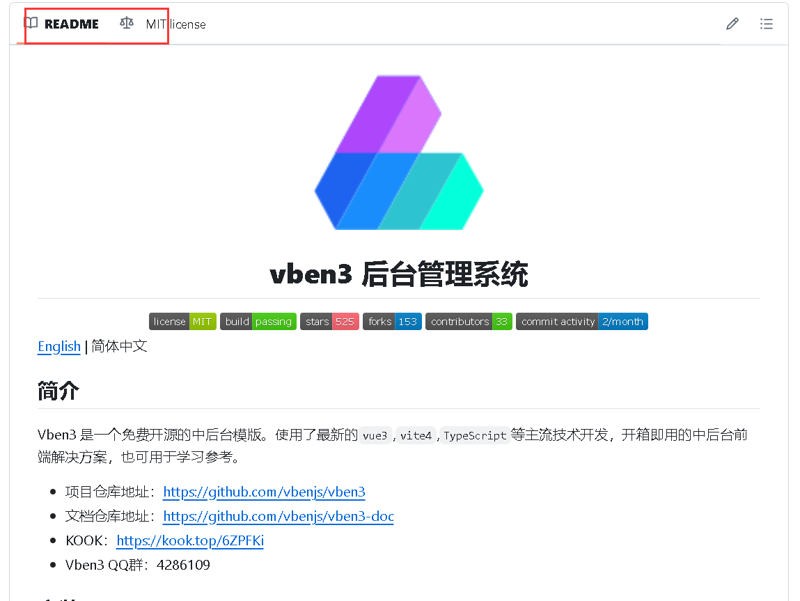

第二个是LICENSE，许可：


如果需要将项目应用在自己的项目上商业使用，那么就需要注意这个LICENSE：

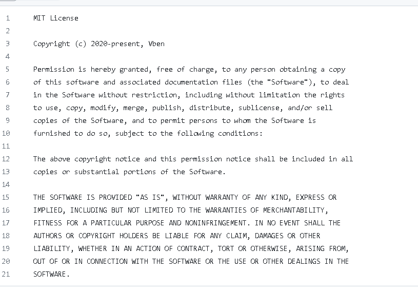

一般，MIT开头的LICENSE代表只要保存作者的版权信息在项目那么你就可以随意使用。如果是其他的LICENSE，那么就需要根公司的法务确认(个人开发者除外)。


# Git三要素在Github上的体现

整个项目页面就是一个仓库：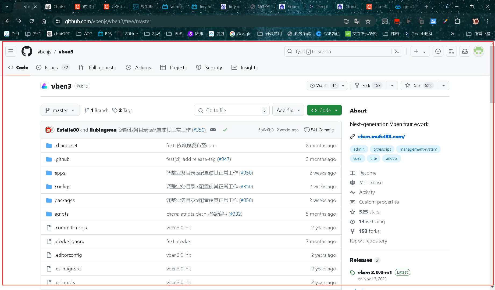

readme.md就是仓库下的文档，也是整个项目的介绍文件。

提交体现在这里：

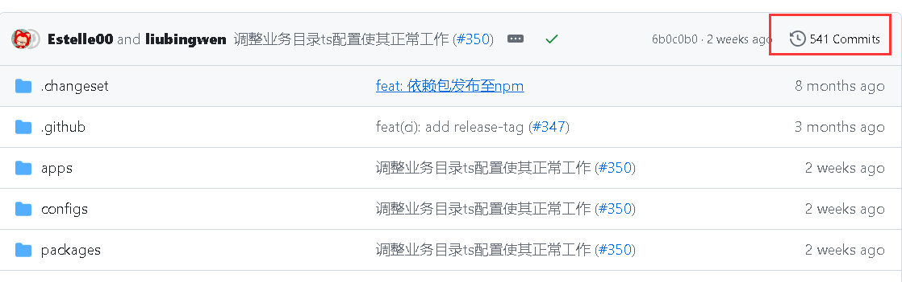

截止到目前一共提交了541次。点进行就可以看到谁提交的：

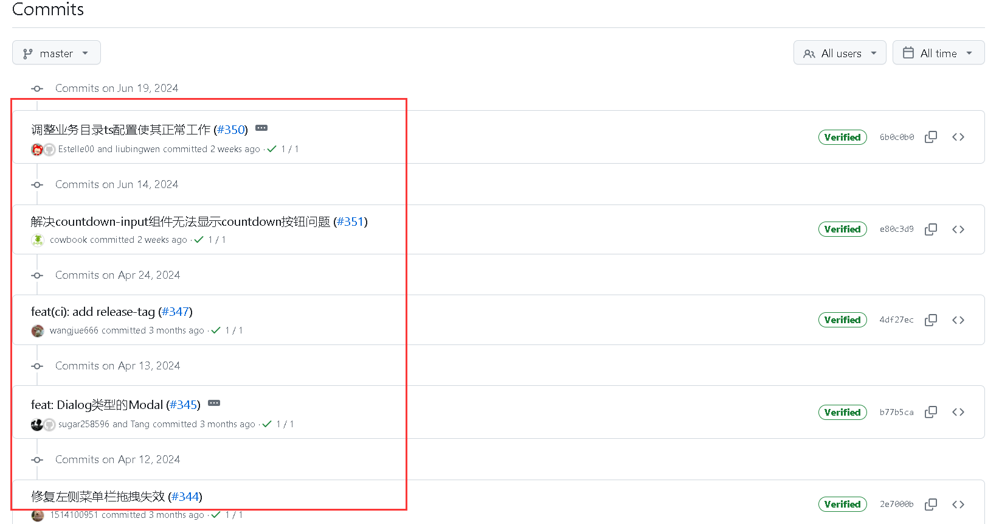

再点进行可以看到提交的hash值：

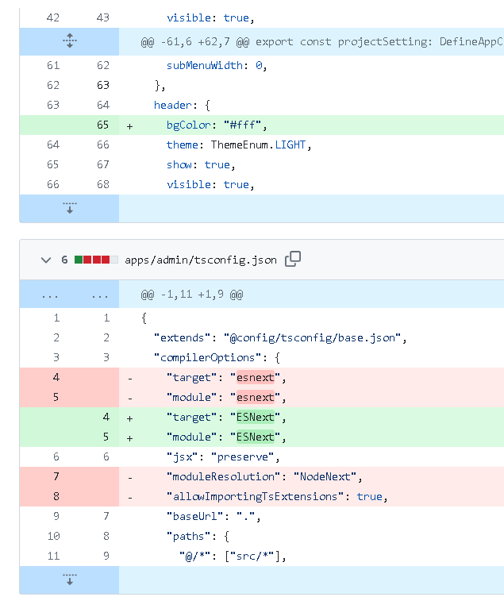

红色代表以前的，绿色代表修后的。  

分支体现在这里：

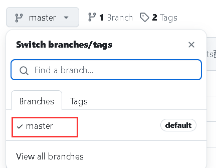

这个项目只有一个master分支，一些项目会有很多不同的分支，对应不同的功能，最后它们都会合并到master中。


# 开源项目查找

有这么几个地址：

- https://github.com/trending/，这个是推荐近期Github上比较热门的项目媒体。
- https://github.com/521xueweihan/HelloGitHub，这个是国内的媒体，按期发刊物介绍Github上有意思的项目。
- https://github.com/ruanyf/weekly，这个是ruanyf老师写的科技爱好者新刊，除了新科技推荐以外，还会介绍一些好用的工具。
- https://www.zhihu.com/column/mm-fe，这个是阿里巴巴社区的前端快报。


## 查找小技巧

- **找百科大全**，前缀加上awesome，如查找java百科大全，就搜索awesome java
- **找例子**，后缀加sample，如java sample
- **找空项目框架**，后缀加starter或boilerplate，比如找一个spring boot快速启动框架，搜索springboot starter或springboot boilerplate
- **找教程**，后缀加tutorial，如java tutorial