# 拉取和下载zip的区别

使用clone命令和下载zip的区别在于，clone拉取的项目会多一个.gti文件夹：

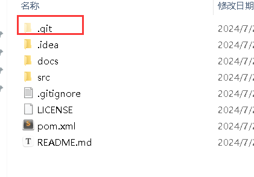

而下载的zip则没有.git目录：

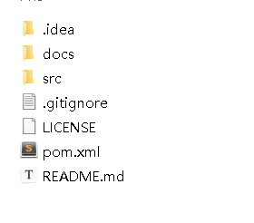

本质的区别就是，下载的zip是一个单纯的文件夹，而clone拉取的则是一个仓库。也会是说，你这个文件夹并不是一个仓库，那么如何让文件变成一个仓库？这就需要初始化文件夹。


# 初始化仓库

进入目录，右键Git Bash Hear：

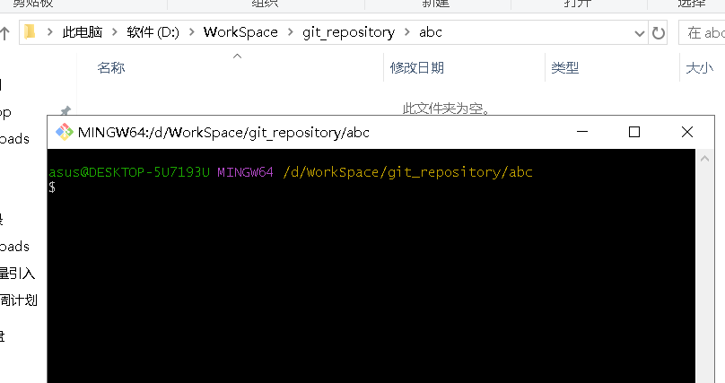

执行命令：

```bash
git init
```

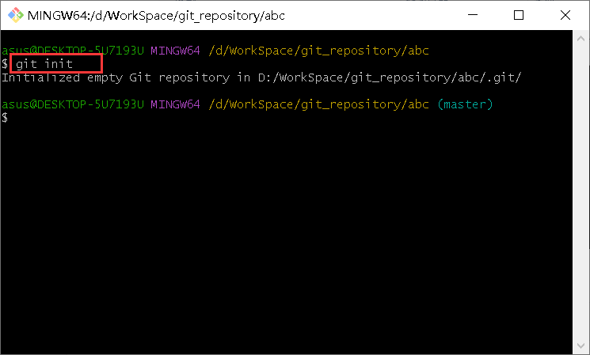

目录中就会创建一个.git文件夹，又叫做版本库。目录完成初始化，变成git仓库：

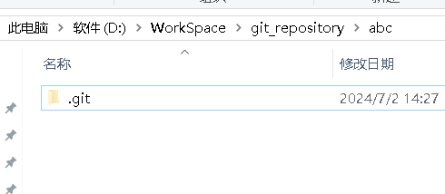

只有变成仓库，才能以提交来实现项目回滚到某一结点，否则一个普通的文件夹是不能提交，也不能回滚的。


# git操作

先了解一些git的分区：

- **版本库**：.git文件夹，它是 git 版本控制系统用于存储仓库元数据和对象的目录，更是 git 的核心。它包含了 git 仓库的全部信息，包括版本历史、分支、标签、配置等。
- **工作区**：包含.git文件夹的目录，主要用于存放开发的代码
- **暂存区**：git文件夹中有很多文件，其中有一个index文件就是暂存区，也可以叫做stage。暂存区是一个临时保存修改文件的地方(注意，一开始的时候是没有index的，因为还没有任何文件添加到暂存区)

git中提交的流程是这样的：

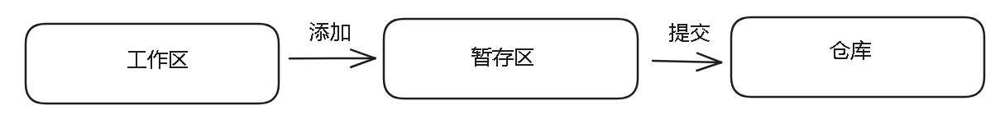

工作区中文件，首先呀添加到暂存区，然后再从暂存区提交到仓库中。为什么要这样设计，而不直接从工作区提交到仓库？一个最直观的好处就是，我们可以再工作区对文件进行大量的修改，然后一起添加到暂存区，最后再一次性提交，而不是每修改一次就提交一次。同时我们还可以选择把哪些文件添加到暂存区，来控制一次提交涉及到哪些文件，比如一些文件已经写好了，一些文件还没有写好，那么我就将写好的文件添加到暂存区，然后提交写好的文件到仓库中。

<font color=red>注意</font>：提交会将暂存区中的所有文件都提交到仓库，从这一点更能体现暂存区的重要性，我们不想工作区中的所有文件都提交到仓库就将要提交的添加到暂存区。


## 添加

```bash
# 将单个文件添加到暂存区
git add 文件名
# 将工作区的所有文件添加到暂存区
git add -A
```


## 提交

```bash
git commit -m "提交信息"
```


## 演示

下面是演示：

首先进行初始化：

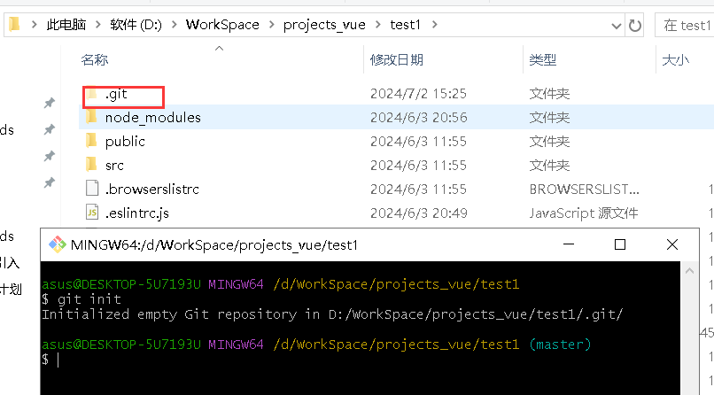

然后，我将所有文件夹都添加到暂存区：

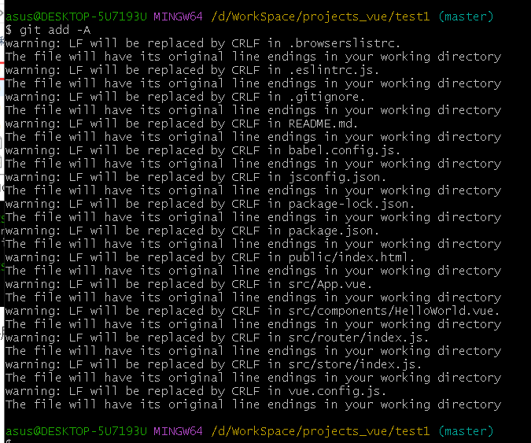

添加以后，.git目录中就会多出一个index文件，这就是暂存文件，暂存区中文件的信息保存在index中：

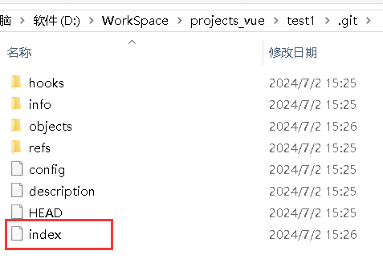

然后我提交，提交信息就写"first commit"：

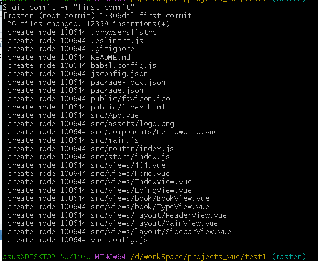

这样就将文件提交到仓库了。


## 查看提交历史

```bash
# 参数：--stat，显示每个提交中修改的文件及其行数变化统计
git log --stat
```


这个提交hash，每一次提交都对应唯一的hash值：

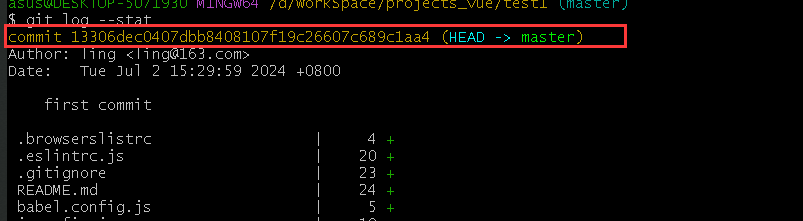

下面是提交人、提交的日期、提交的信息：

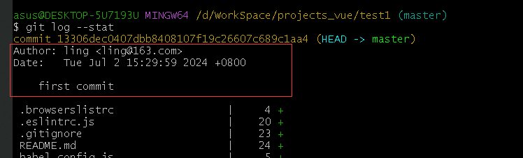

下面的部分就是--stat参数显示出来的：

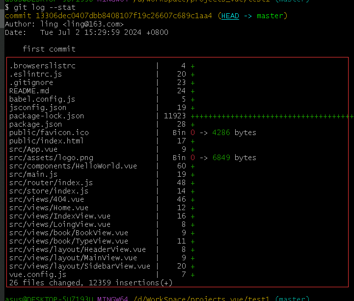


## 回滚

在工作区回滚，如果只是在工作区修改，想要回滚到修改之前那么执行命令：

```bash
git checkout 文件名
```

比如，我改了README.md，然后回滚：：

.gif)

如果已经提交了，那么我们可以采用回滚分支的方式回滚，因为每提交一次就创建新的提交对象，那么就可以从当前提交对象回滚到上一个提交对象：

```bash
# 将当前分支移动到特定的提交对象中
git reset
# HEAD代表当前提交对象
git reset HEAD
# 将当前分支的当前提交回退到上一个提交
git reset HEAD^1
```

先修改然后提交：

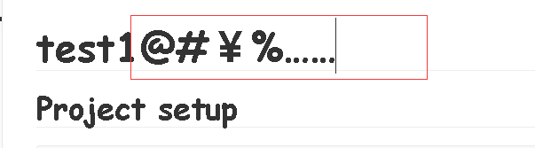

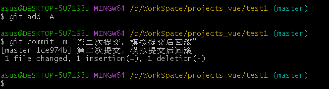

当前是两次提交：

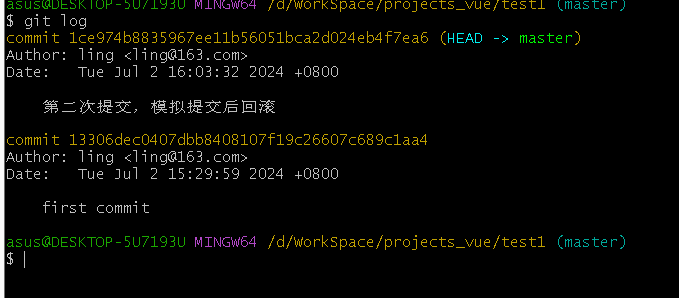

然后回滚到上一次提交：

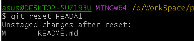

当前提交只有一个了：

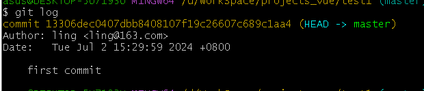

文件没有改回来：

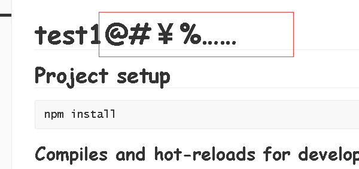

`git reset`主要是针对分支指针和暂存区的状态进行修改，而不直接影响工作区的文件内容。这意味着当你执行 `git reset` 回滚到之前的提交时，工作区的文件内容不会自动回滚到该提交对应的状态，所以想要工作区文件回滚，需要执行工作区回滚操作：

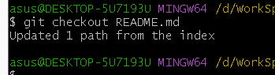

文件恢复：

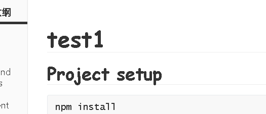


# github创建仓库

【头像】>>【repositories】

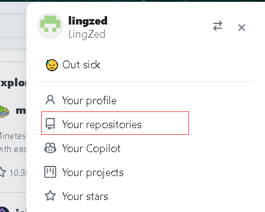

【new】

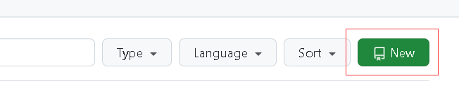

输入仓库名：

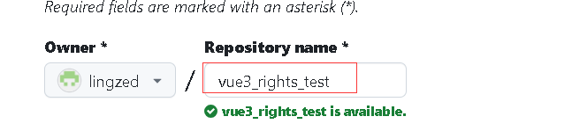

描述：

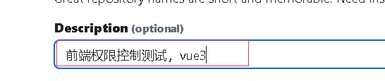

选择仓库公开还是私有：

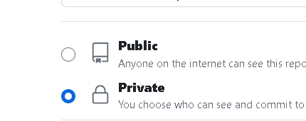

可选，添加README.md：

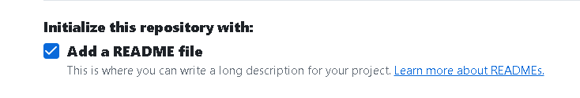

可选，.gitignore文件，用来告诉 Git 哪些文件或目录不应该被版本控制系统跟踪和管理。

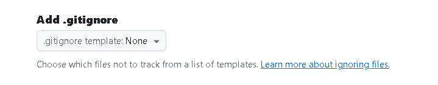

可选，添加license，我选择级别是MIT：

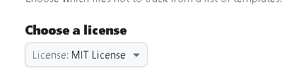

创建：

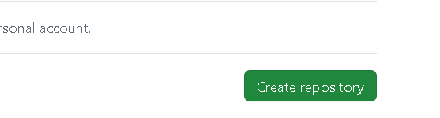

创建完成：


## 本地仓库推送

创建新仓库的并推送到远程方法：

```bash
git init
# 将内容写入README.md文件
echo "# My Project" >> README.md
git add README.md
git commit -m "first commit"
# 主分支改名成main
git branch -M main
# 将远端的仓库的地址加到本地仓库中
git remote add origin 远程仓库URL地址
# 将本地仓库推送到远程仓库
git push -u origin main
# 强制推送
git push -u origin main --force
```

将已有的仓库推送到远程的方法：

```bash
git remote add origin 远程仓库URL地址
git branch -M main
git push -u origin main
```

比如，我要将本地的"text1"推送到`study-text`仓库：

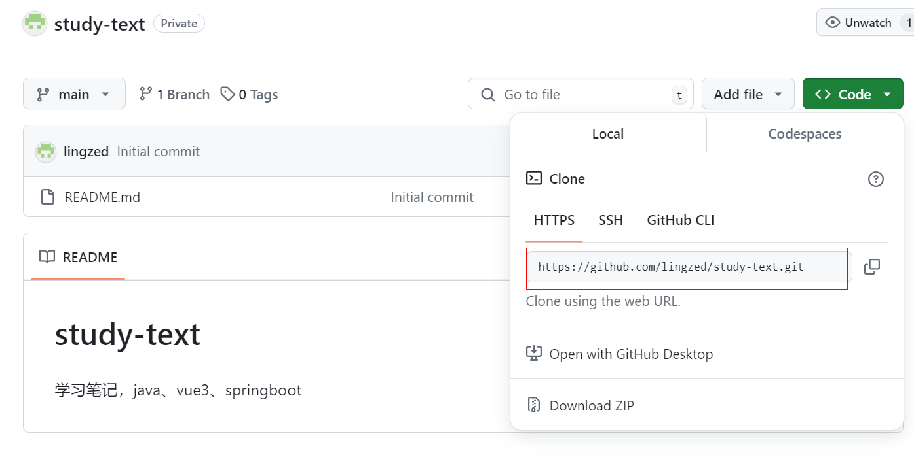

仓库的URL：https://github.com/lingzed/study-text.git

进入"text1"：

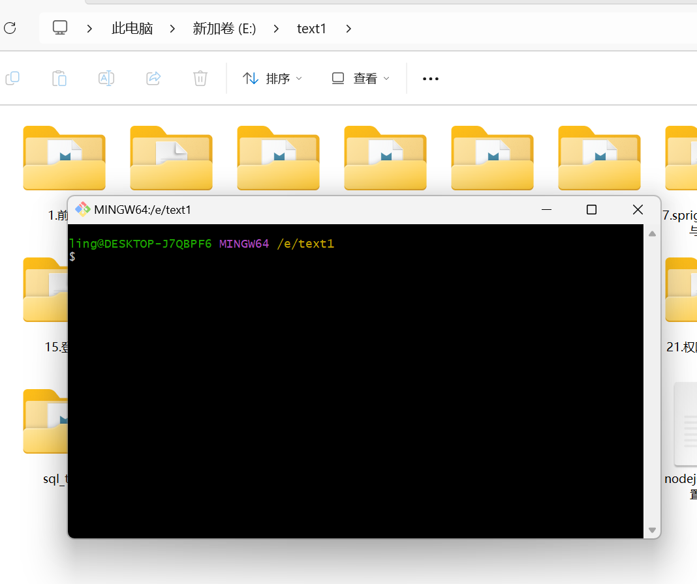

执行命令：

```bash
git init
echo "# My Project" >> README.md
git add README.md
git commit -m "first commit"
git branch -M main
git remote add origin https://github.com/lingzed/study-text.git
git push -u origin main
```

执行完后，会弹出一个对话框，让你登录github：


登录成功后就开始推送了，如果推送失败，那么可以执行强制推送。

推送完成：

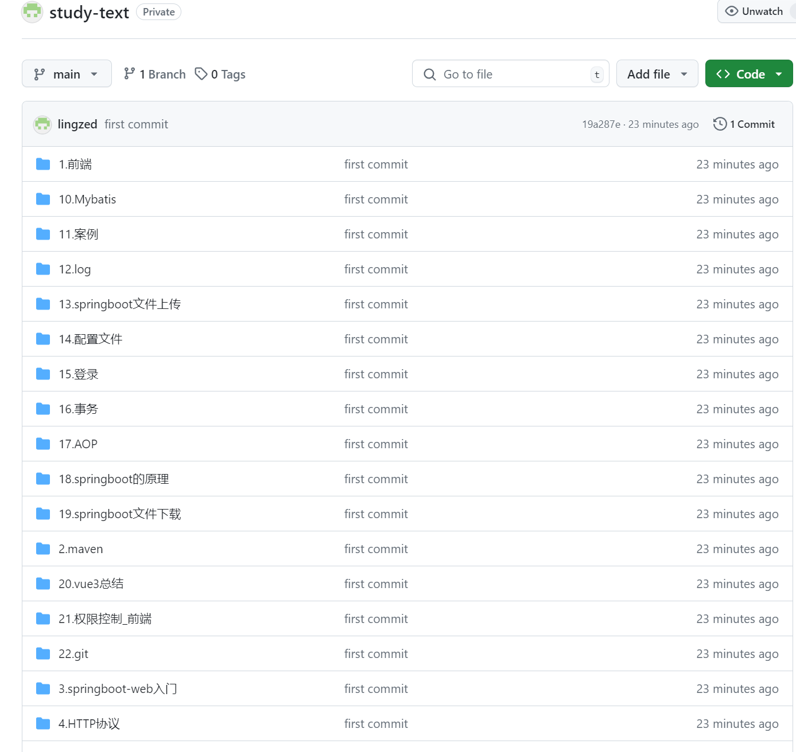


## 拉取

```bash
git pull origin main
```

拉取远程文件并不是简单的替换掉本地的文件，而是会进行合并，即相同的内容不变，远程中多出的内容，会添加到本地内容中，远程中减少的内容，本地的内容也会减少对应的内容。


# 总结

- 推送到远程，因为保证本地仓库和远程仓库同步，因此正确的做法是先拉取远程仓库，编辑后再推送。当然，你可以强制推送。

- 当你推送本地更改到远程仓库时，Git 会默认只上传本地分支上的**新提交**和**对现有提交的修改**。这意味着不需要将整个本地仓库的所有文件都重新上传，而是只上传你在本地进行了修改或新增的部分。

- github上的图片无法识别本地的D盘、E盘，因此本地md文档建议使用相对路径，如：assets/xxx.png。在本地md中不管是/还是\都能识别，但是github上只能识别/，这点需要注意
