后端在运行时，遇到异常，如果未捕获，那么springboot框架就会捕获这个异常，并响应给调用者。

响应的是一个统一格式的JSON数据，格式为：

```json
{
    error: "Internal Server Error",
	path: "/goods",
	status: 500,
    timestamp: "2024-07-08T06:22:30.093+00:00",
}
```

也被叫做**标准HTTP错误响应**

它有4个属性：

- error表示错误
- path表示这次的请求路径
- status表示状态码
- timestamp表示时间戳

比如，我故意制造一个数组下标越界的异常：

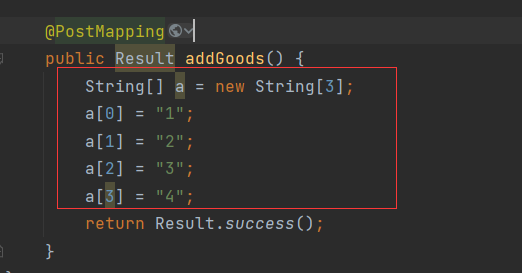

前端去请求这个接口，服务器报出异常，**数组下标越界**：

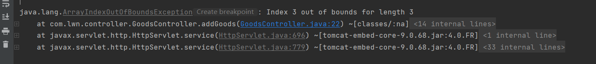

并响应给浏览器数据：

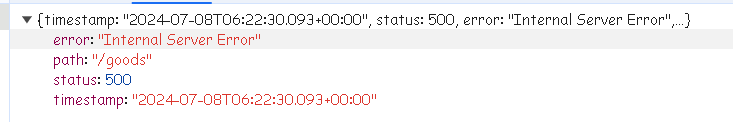

试试另一种异常，比如空指针异常：

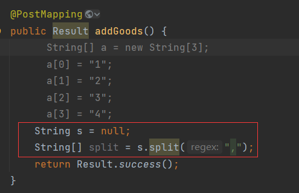

服务报出：

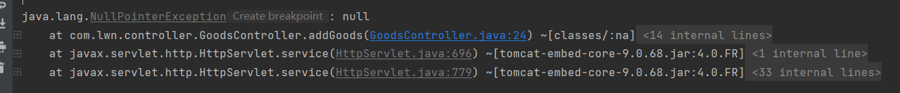

浏览器接收的响应：

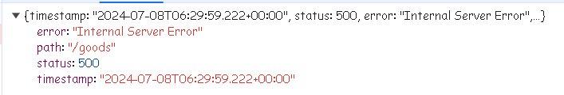

你会发现，两次响应的结果，只有时间戳是不同的(请求路径可能会不同)，明明两次异常都不一样，浏览器接收到的响应却是一样的，error的信息是"Internal Server Error"即**服务器异常**。也就是说不管你的服务器出于何种原因抛出了不同的异常，只要这个异常响应是springboot框架捕获并响应的，那么浏览器接收到的响应结果永远都是**服务器异常**，即状态500。这是springboot框架处理异常时的一个特点。

我一直在强调的一点，就是这种500异常，必须是由springboot框架捕获并响应它才会是统一的格式。也就是说不是springboot框架捕获并响的异常，它的格式未必是**标准HTTP错误响应**。

未被springboot框架捕获，那么会被谁捕获呢？是全局异常处理器。全局异常处理器会捕获一种类型的异常，如果这个种异常不是这个类型，那么全局异常处理器不会捕获这个异常，转而由springboot框架捕获。

但是这个异常一定会被全局异常处理器捕获吗？也不一定，只有这个异常传播到controller层，且未被捕获才会被全局异常处理器捕获。

说到这里，我们可以总结出以下特点：

1. 只有异常传播到controller层，且异常为被捕获，才会被全局异常处理器捕获
2. 全局异常处理器中声明捕获什么类型的异常，就只会捕获这种类型的异常
3. 为被全局异常处理器捕获的异常，会被springboot框架捕获，而凡是被springboot框架捕获的异常，都会响应**标准HTTP错误响应**
4. 未定义全局异常处理器，则一定是由springboot框架来捕获异
5. 全局异常处理捕获的异常，其响应什么完全看我们自己的实现，你可以模仿**标准HTTP错误响应**的格式返回一个相同格式的响应，也可以自定义一个统一的响应来返回。

对service层中，业务操作处理中产生的异常进行统一管控。这类异常一般是在程序运行时，由用户的错误操作而产生的异常。比如，用户输入用户名或密码错误、用户想要操作某个资源，但是该资源与其他资源事先绑定，需要先解绑，才能操作等。

定义一个ServiceException，是在程序运行时产生的异常，所以继承运行时异常：

```java
package com.lwn.exception;

/**
 * 业务操作异常
 */
public class ServiceException extends RuntimeException {

    public ServiceException(String massage) {
        super(massage);
    }
}
```

其余的子类异常继承ServiceException，如用户名和密码错误的异常：

```java
package com.lwn.exception;

/**
 * 账户错误异常
 */
public class AccountIncorrectException extends ServiceException {
    public AccountIncorrectException(String massage) {
        super(massage);
    }
}
```

或者，余额不足的异常：

```java
package com.lwn.exception;

/**
 * 余额不足异常
 */
public class InsufficientBalanceException extends ServiceException {

    public InsufficientBalanceException(String massage) {
        super(massage);
    }
}
```

其他异常，按需扩展。

在service层中，如果校验失败则抛出这些异常，模拟操作失败的情况：

```java
package com.lwn.service;

import com.lwn.exception.AccountIncorrectException;
import com.lwn.exception.InsufficientBalanceException;
import org.springframework.stereotype.Service;

@Service
public class TestService {

    public String validAccount() {
        // 模拟用户名和密码校验
        if (true) {
            // 模拟校验失败的情况，抛出账户错误的异常
            throw new AccountIncorrectException("用户名或密码错误");
        }
        return "success";
    }

    public void validBalance() {
        if (true) {
            // 模拟余额交易的情况，如果余额不足，抛出余额不足的异常
            throw new InsufficientBalanceException("余额不足");
        }
    }
}
```

控制器中调用业务层的接口，这些异常会传播到控制器中，最终由全局异常处理器捕获：

```java
package com.lwn.controller;

import com.lwn.service.TestService;
import com.lwn.utils.Result;
import lombok.extern.slf4j.Slf4j;
import org.springframework.web.bind.annotation.*;

import javax.annotation.Resource;

@RestController
@RequestMapping("/goods")
@CrossOrigin(origins = "http://localhost:2001", allowCredentials = "true")
@Slf4j
public class GoodsController {
    @Resource
    private TestService testService;

    @GetMapping("/validAccount")
    public Result validAccount() {
        String s = testService.validAccount();
        return Result.success(s);
    }

    @GetMapping("/validBalance")
    public Result validBalance() {
        testService.validBalance();
        return Result.success();
    }
}
```

由全局异常捕获，则控制器中不需要对业务操作错误进行处理，它只需要负责返回成功的想要即可。全局异常处理器中捕获SeerviceException：

```java
package com.lwn.exception;

import com.lwn.utils.Result;
import org.springframework.web.bind.annotation.ExceptionHandler;
import org.springframework.web.bind.annotation.RestControllerAdvice;

@RestControllerAdvice
public class GlobeExceptionHandle {

    @ExceptionHandler(ServiceException.class)
    public Result exceptionHandle(Exception e) {
        return Result.error(e.getMessage());
    }
}
```

当捕获到异常后，就返回错误的响应。我这里用的是统一响应实体Result，可以根据需要灵活改变响应格式。你甚至可以自己构建出**标准HTTP错误响应**格式的响应。因此，我才会说使用全局异常处理器返回的响应不一定是**标准HTTP错误响应**。

前端的响应拦截器中就拦截这一类的响应：

```js
instance.interceptors.response.use(
	// 响应成功后执行
    response => {
        if (response.data.code === 0) {

        }
        return response; // 放行响应
    },
    // 响应失败后执行
    error => {
        // 将错误对象传递到调用该Promise的地方，以便进行错误处理。
        return Promise.reject(error);
    }
);
```

注意，返回Result是响应成功的，即使它是错误的响应，但是这个响应的过程仍然是成功。

在这里我们判断Result的code，如果是1代表成功的响应，如果是0代表错误的响应。我们在code等于0时进行处理，比如提示响应的信息给用户：

```js
instance.interceptors.response.use(
	// 响应成功后执行
    response => {
        if (response.data.code === 0) {
			alert(response.data.msg);
        }
        return response; // 放行响应
    },
    // 响应失败后执行
    error => {
        // 将错误对象传递到调用该Promise的地方，以便进行错误处理。
        return Promise.reject(error);
    }
);
```

当我们访问登录的时，模拟登录失败的情况，后端返回的数据：

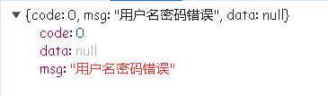

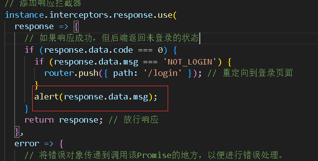

效果：

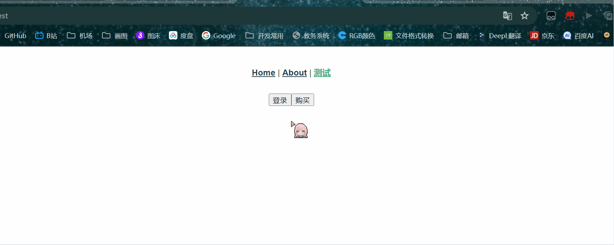

我们的全局异常处理器只能处理ServiceException的情况，如果抛出的异常不是ServiceException异常，那么就会被springboot框架捕获，然后响应**标准HTTP错误响应**，对于这种响应，axios响应拦截器中error回调就会执行：

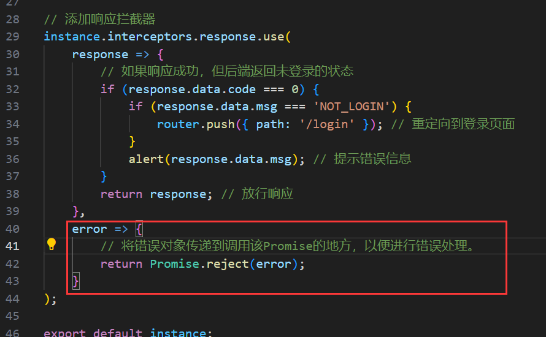

所以，我们还需要在error回调处，处理服务器异常，也就是500错误：

当500发生时，打印error：

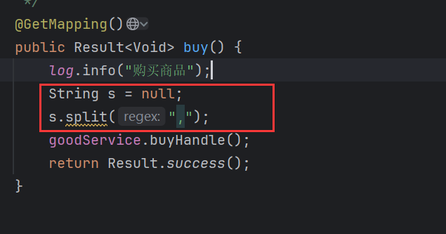

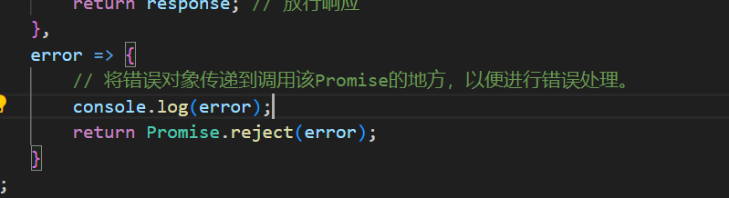

是一个AxiosError对象：

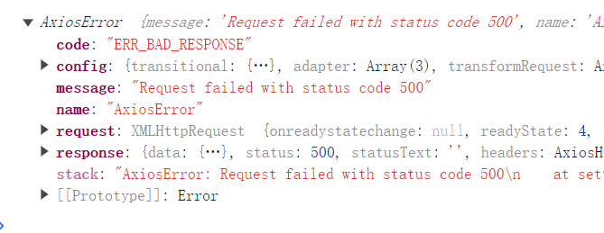

其中有一个response属性，它内部还有一个data属性，这个data就是**标准HTTP错误响应**：

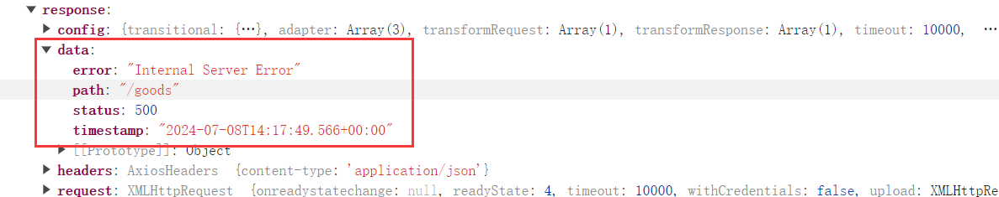

对于500，统一提示"服务器错误"：

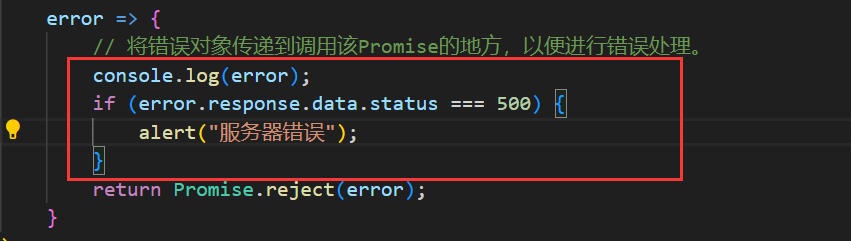

效果：

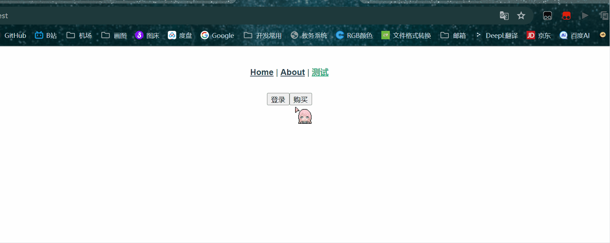

如果在接口调用处，也提醒了错误信息：

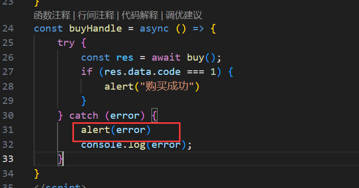

那么就会出现重复提醒的情况：

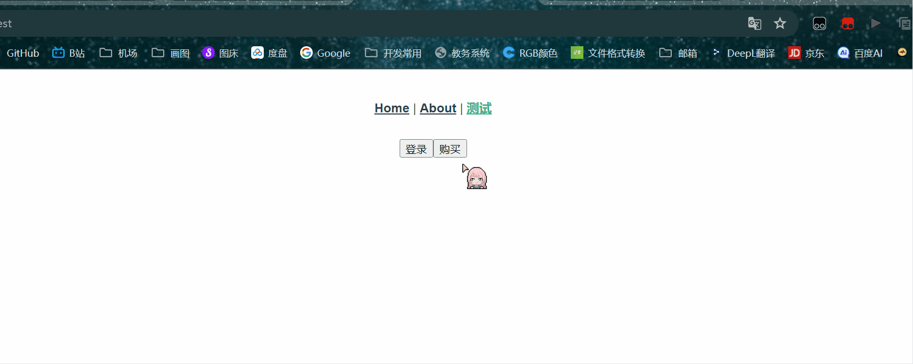

原因是因为我们在响应拦截器中提示信息后，又继续将Promise返回给了调用者，等于是先经过响应拦截器，拦截器提示信息，然后响应继续回到调用者，调用也提示信息。

那么我们可以将响应在响应拦截器提示信息后中断吗？

不行。因为中断了响应就是中断了Promise返回错误信息，就会中断Promise链。

因此在接口调用处，建议只打印出error，而不用提示信息，因为响应拦截器中已经提示了。

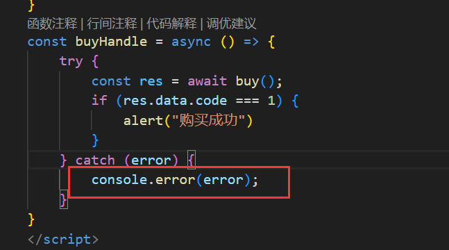

除了500异常外，还有401、403等异常，Spring Security等安全框架在特定条件下自动生成的响应。如果项目中没有使用Spring Security那么大概率不会抛出这类异常，但是为了以防万一，还是建议将其判断进去：

401表示请求未通过身份验证。通常在以下情况下抛出：

- 用户未登录或未提供有效的身份验证凭据（如JWT、OAuth token等）。
- 提供的凭据无效或已过期。

403表示用户已经通过身份验证，但没有权限访问请求的资源。通常在以下情况下抛出：

- 用户没有足够的权限或角色访问特定资源或操作。
- 用户尝试访问未授权的资源或执行未授权的操作。

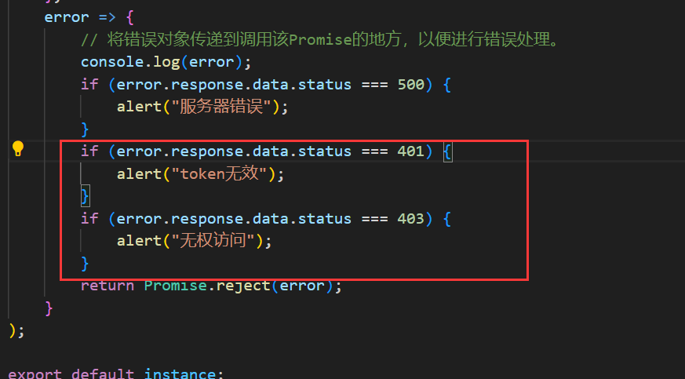

注意，403是无权访问，它是服务器响应回来的，而在前端权限控制中也会对请求权限进行控制，比如在请求拦截器中：

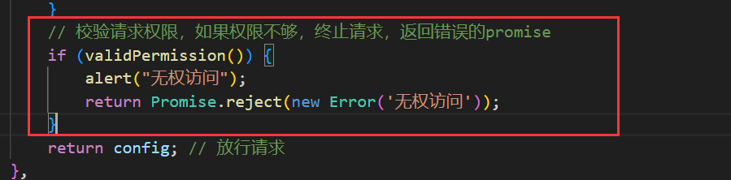

一个是在请求发出去之前对请求进行校验，另是请求已经发送到服务器了，服务器校验请求无权然后抛出的错误。两个的时机是不同的，并不是重复提示。而且双端校验，更安全。

再说401，它是token无效，在响应拦截器中，也会对token无效进行控制：

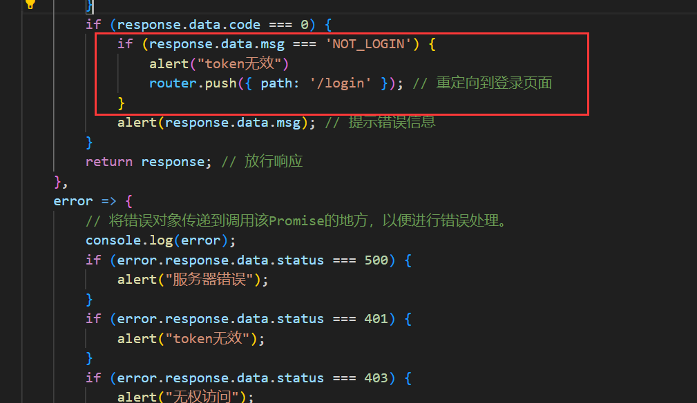

那么这两个算重复吗？也不算是，因为401是需要后端使用类似Spring Security的框架校验后抛出的异常，而

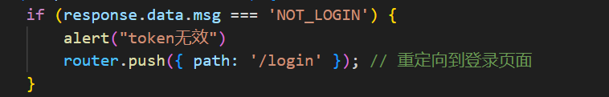

是后端校验jwt后响应的，是程序正常的响应，注意是没有抛出异常的，即便这个响应携带的是失败状态。

我想表达式的是，如果后端中不存在能抛出403或401异常的情况，那么这两段就是多余的：

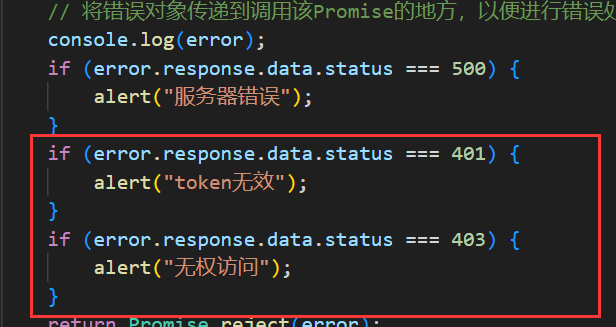

但是如果后端存在这种情况，那么就需要加上，我建议不管能不能抛出403或401异常都加上。

除了500、401、403外，还有一种就是无响应的情况，就是请求发出去了，但是没有响应，这种情况按请求超时处理：

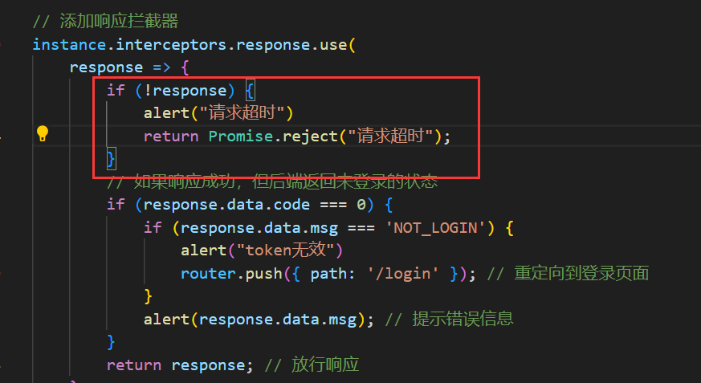

在请求拦截器的config中：

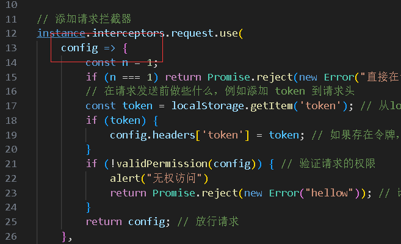

如果抛出失败的Promise，那么这个Promise会传递到响应拦截器中error回调处：

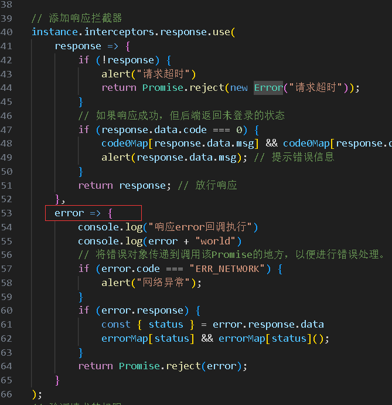

比如，我在config中手动抛出一个失败的Promise：

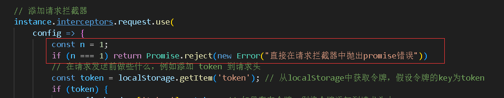

在响应拦截器的error回调中打印一下error：


可以看到error回调执行了，并且打印的error对象也是我们传递过来的：

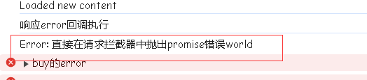

试试传递其他值：

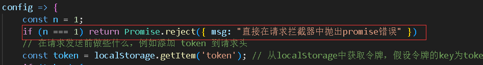

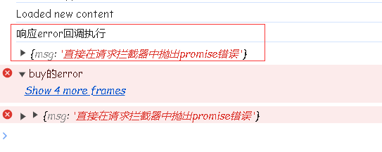

其他值也是能传递的。

如果在响应拦截器的response回调中抛出了失败Promise，会传递给响应拦截器的error吗？

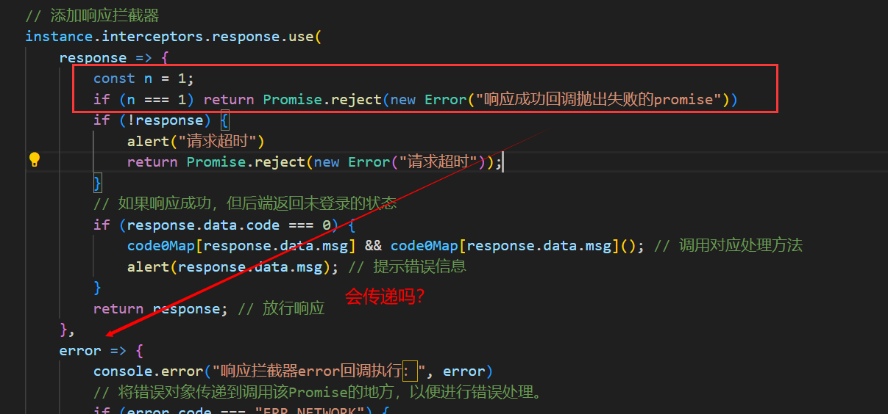

答案是不会，看结果：

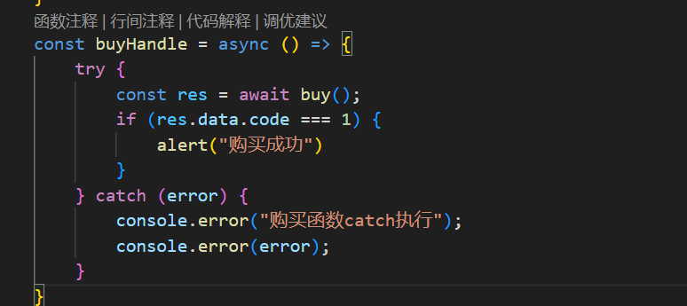

购买函数这里打印一个标识，执行结果：

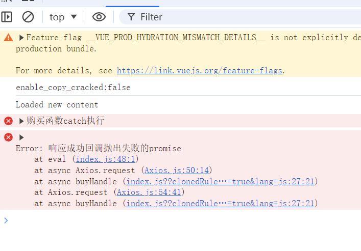

从结果可以看出，响应成功的回调中抛出失败的promise不会传递给失败的回调，失败的回调并没有触发，而是直接返回给调用者。

如果是在请求拦截器失败的回调中抛出失败的promise，它会传递到响应的失败回调处吗？答案依旧是不会，它也会直接转递给调用者。

**总结**：

- 在请求拦截器config回调中抛出失败的promise，会传递到响应拦截器error回调中，也就是error回调会执行，再由error回调传递给调用者。
- 在请求拦截器error回调中抛出失败的promise，不会触发响应拦截器error回调，会直接传递给调用者。
- 在响应拦截器response回调中抛出失败的promise，不会触发响应拦截器error回调，会直接传递给调用者。

为什么请求拦截器error回调中抛出失败的promise，不会触发响应拦截器error回调？

因为，请求拦截器error回调触发时机是这样的：

- **请求配置错误：** 如果在创建请求时，配置对象存在问题（例如，无效的 URL 或请求参数），则会触发 `error` 回调。
- **请求发送错误：** 如果请求本身无法发送到服务器（例如，网络问题或服务器无法访问），也会触发 `error` 回调。

它的触发时机暗含一个细节，就是error是用来处理请求发送前的错误情况的。也就是说请求发送之后出现的错误是无法触发error回调的。而响应拦截器的error回调是在响应发生错误的时候执行的，这里暗含的细节是请求已经发出去了，所以应拦截器的error回调是在请求发送之后执行的，那么一个是在请求之前执行，一个是在请求之后执行，如何能传递呢？因此不能传递。

为什么请求拦截器config回调中抛出失败的promise，会传递到响应拦截器error回调中？

因为请求和响应是一个完整的链，在config回调中出现的错误时机是在请求发出去之后，此时出现错误，就应该将错误响应给调用者。那么怎么传递呢？用请求拦截器的error吗？肯定不行，它是在请求之前遇到错误执行的。请求之后遇到的错误只能传递到响应拦截器的error中。由响应拦截器的error返回给调用者。

为什么在响应拦截器response回调中抛出失败的promise，不会触发响应拦截器error回调?

废话，一个是成功的响应执行，一个是失败的响应执行，两个都是对响应的执行，即他们都能将响应传递给调用者，我自己都能传递干嘛还要传递给你，由你来传递给调用者？所以response回调没必要传递。

根据config中抛出失败Promise会传递的特性，我们可以将之前在config中抛出失败的执行逻辑统一到响应拦截器的error中：

之前校验权限不通过的时候要执行对应的逻辑，然后抛出失败promise：


现在可以直接抛出失败失败的promise：

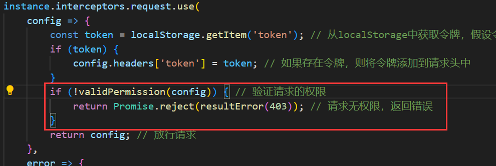

响应拦截器的error中接受，并进行相应的处理：

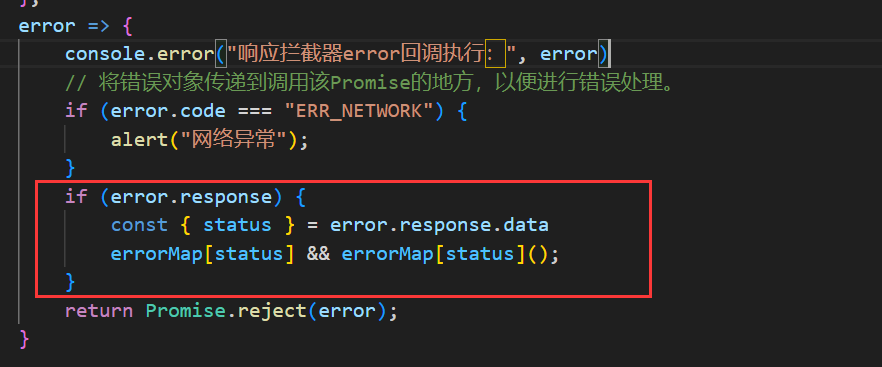

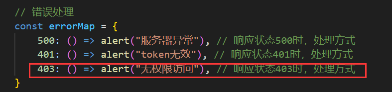

为了使用统一服务器的异常的状态操作映射，返回的失败promise中封装一个类AxiosError对象：

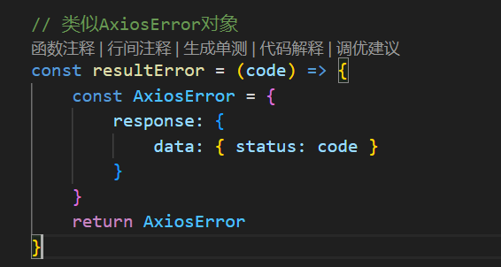

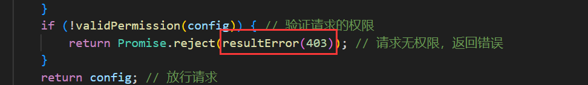
