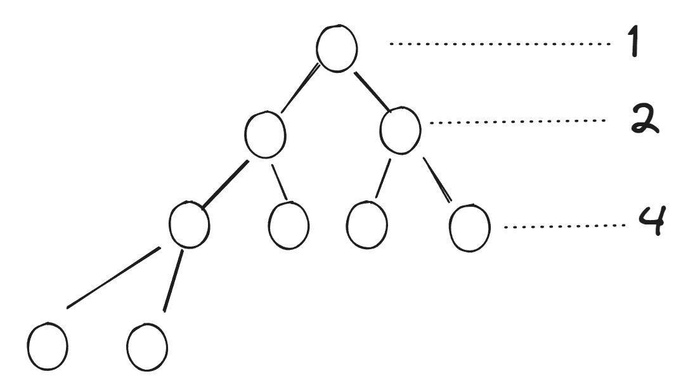
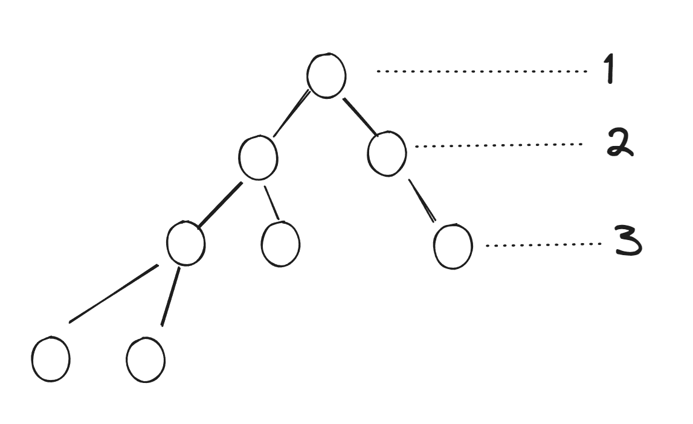
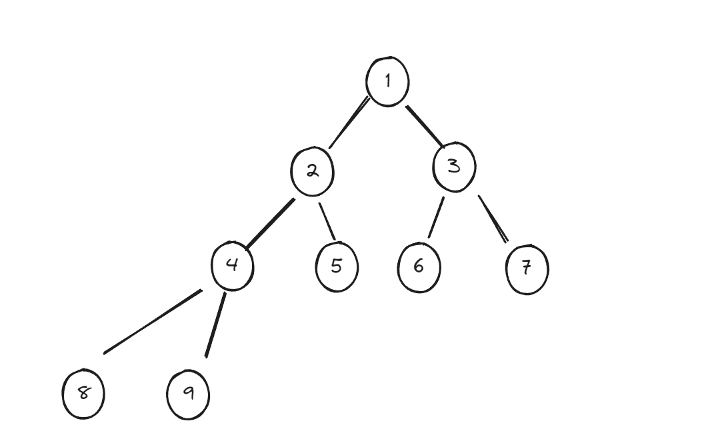
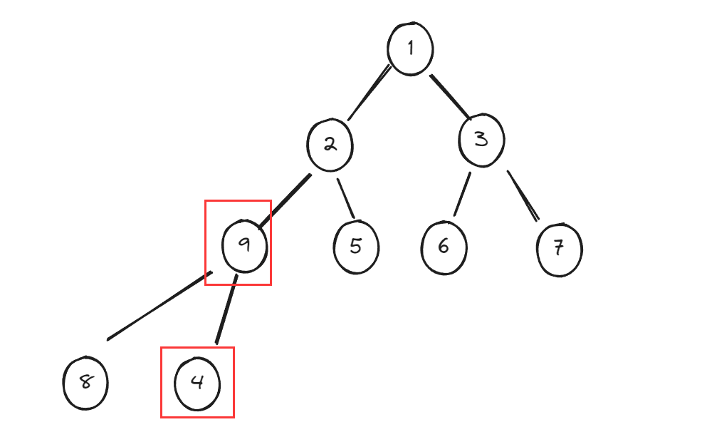
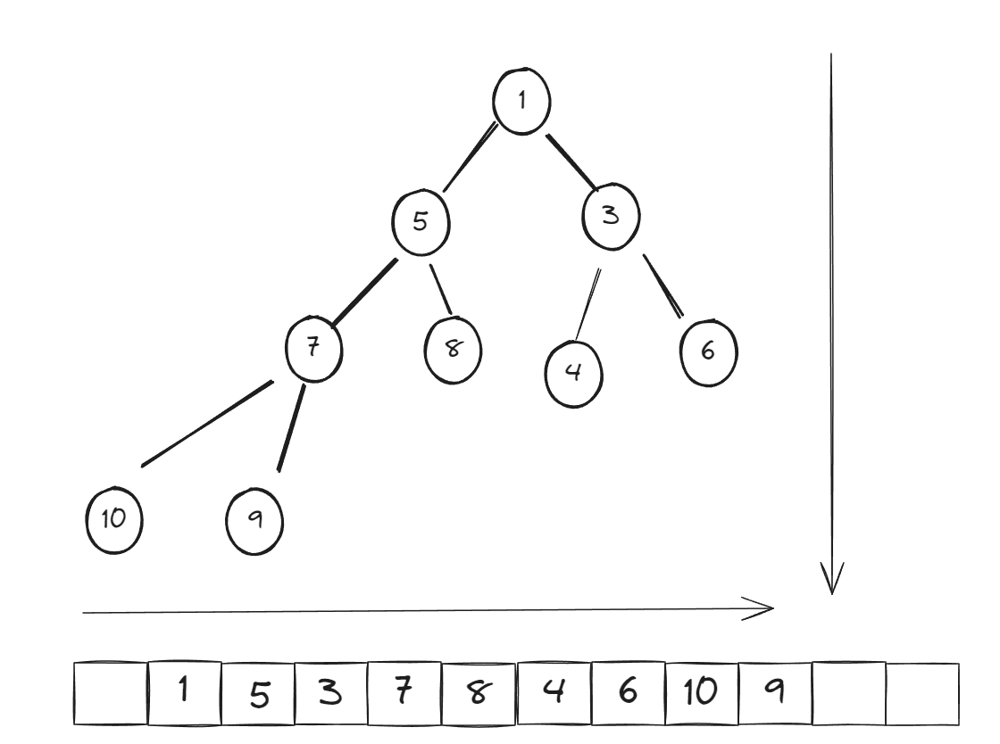
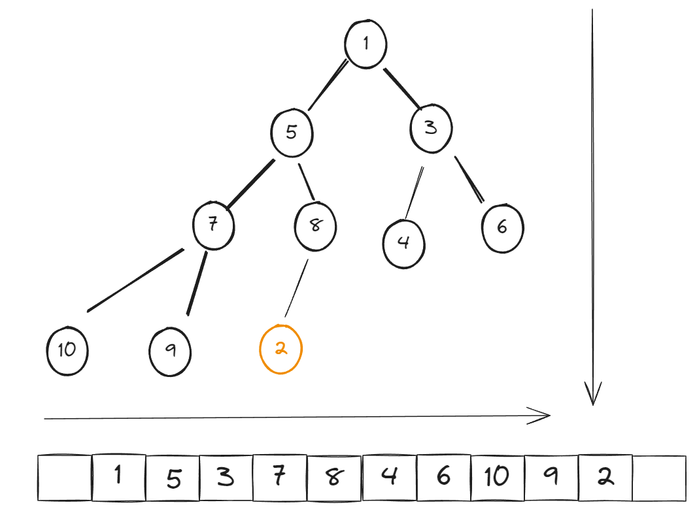
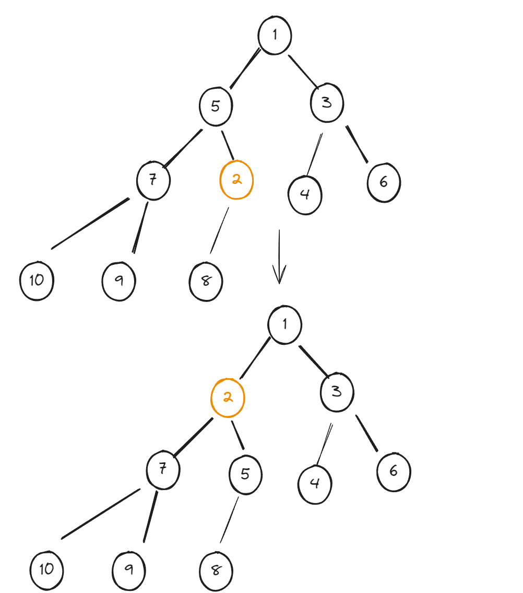

# java的定时任务

Java自己又一个定义任务的API叫`timer`，它可以简单的实现一个定时任务。但是这个API存在一些问题。

再了解定时任务之前，需要了解一些基础理论：

- 小顶堆
- 时间轮算法

为什么要了解这两个理论？因为`timer`和定时任务线程池是基于小顶堆实现的，而第三方任务调度框架`	Quartz`则是基于时间轮算法实现的。

# 小顶堆

说小顶堆之前，先说一下堆

## 堆

堆是一种数据结构，是一种特殊的树，只要满足以下两点，它就是一个堆：

- 堆是一颗完全二叉树
- 堆中某个节点的值总是不大于(或不小于)其父节点的值

二叉树好理解，那么完全二叉树是什么？

完全二叉树就是这个二叉树除最后一层外的所有层都达到最大的节点数量，且最后一层靠左排列。

我们知道，一个二叉树它的每一层可以存放的最大节点数量为2^(n-1)，n为层数。而完全二叉树要求除最后一层外，其他所有层的节点数量必须达到最大节点，比如：

这就是一颗完全二叉树，它一共4层，除第4层外，前3层的节点数都达到了该层的最大节点数。而只要前3层中有一层没有达到该层的最大节点数，那么它就不是完全二叉树，只是一个普通二叉树：

堆除了是完全二叉树以外，还要满足它的节点总是不大于(或不小于)它的父节点。什么意思呢？比如当前的节点是5，那么它的父节点要么比他大，为6、7、8......要比它小，为1、2、3、4。而这只是一个节点的情况，这棵树的所有节点都必须满足这个要求，比如这样一棵树：

它的每个节点(除根节点)都比父节点大，而这样的树就不满足这样的要求：

通过这种特性，如果当前节点总比它的父节点大，那么根节点一定是最小节点，反之，根节点为最大节点。而我们又将根节点为最小节点的堆称为小顶堆，反之则为大顶堆。或称最小堆、最大堆。

定时任务与堆的关系，可以简单的理解为，一个任务就是堆中的一个节点。定时任务用到的是小顶堆，这正是基于小顶堆的特点，越靠近根节点，节点值越小，可以将节点值类比成离任务开始执行还有多少时间，想像一下，是不是值越小，就越接近任务的执行时间。当到达任务的执行时间时，此时的任务节点一定是最小的节点，也就是顶节点，我们只需从根节点取出任务来执行即可。

## 数组模拟二叉树

java中没有现成数据结构来模拟二叉树，二叉树仅仅是一个逻辑结构。但是我们可以采用数组或链表来模拟二叉树。这其中数组的效果是最好的。

为什么数组的效果最好？将节点的数据存入数组中，需要满足从数组下标为1开始存储，即第一位留空，还要满足，存储顺序按照小顶堆从上往下，从左往右存储。比如：

只要满足这样的条件，那么我们可以通过一个节点快速的找到它的根节点比如节点8，它的根节点是5，在数组中如何快速查找？很简单，找到8的下标，是5，然后mod(5 / 2)取模得2，即为下标2所对应的值也就是5。为什么这样算能算出来？仔细观察每一层的最大节点数量，它有一个规律，当前层的最大节点数量总是比上一层大2倍，也就是说，当前层除以2就能跳到上一层，而当前层节点的父节点又刚好在上一层，所以只要拿当前层节点的下标除以2取模就能找到它的父节点。如果使用链表，就不能像数组这样快速查找父节点，所以数组的效果是最好的。

## 插入元素

往这个数组中插入元素，也就是往二叉树中添加节点。插入数组满足尾部插入，上浮元素。尾部插入好理解，上浮元素是什么意思？比如，插入的节点是2：

根据小顶堆的特性，2比父节点8小，所以2要与父节点进行交互，交互后，还有继续判断是否比父节点大，直到2比父节点大为止，停止交互，这个过程就是上浮元素：

上面说过，将节点类别为一个任务，节点的值类别为离任务开始执行还有多少时间，那么我们存入一个2，表示2分钟后开始执行，一开始是插入到数组的尾部，如果我们不进行元素上浮，想象一下，取出任务是从根节点中取，取出来后后续的节点补上，2是排在最后面的，这意味着它是最后执行的，但是它是2分钟之后就开始执行，这显然不满足我们的需求，所以它必须上浮，而且如果它不上浮就不满足小顶堆，从这里也可以看出为什么数据结构要采用小顶堆了。
