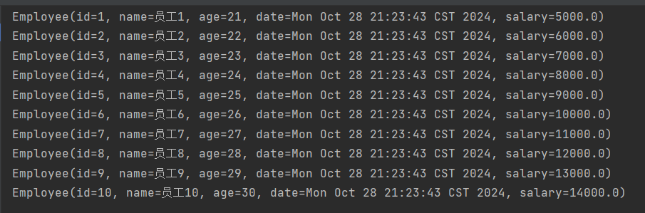
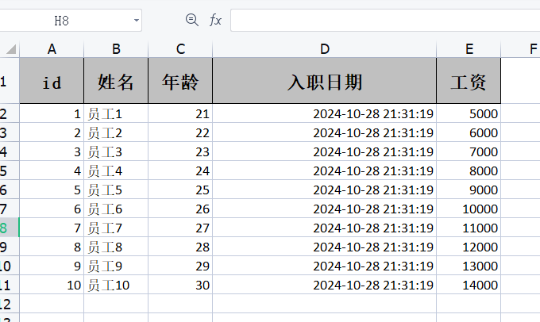
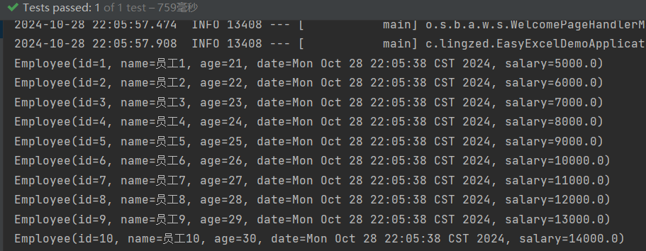
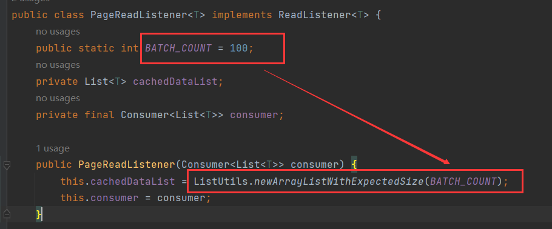

# 1 EasyExcel介绍

EasyExcel是一个基于Java的简单、 省内存的读写Excel的阿里开源项目。在尽可能节约内存的情况下支持读写百M的Excel。

## 1.1 使用场景

项目中涉及到Excel文件、CVS文件大多数的读写操作，均可以使用！

## 1.2 官网地址

https://easyexcel.opensource.alibaba.com


# 2 快速入门

## 2.1 引入依赖

```xml
<dependency>
    <groupId>com.alibaba</groupId>
    <artifactId>easyexcel</artifactId>
    <version>3.1.2</version>
</dependency>
```

## 2.2 简单写操作

步骤：

1. 实体类与excel数据对应，用注解标识。
2. 编写方式获取excel数据。
3. 通过官方API完成写功能。

以员工为例，首先定义一个员工实体：

```java
@Data
@AllArgsConstructor
public class Employee {
    private int id;
    private String name;
    private int age;
    private Date date;
    double salary;
}
```

然后通过【@ExcelProperty】来指定excel中的列名，类似数据库表中的字段名：

```java
@Data
@AllArgsConstructor
public class Employee {
    @ExcelProperty("id")
    private int id;
    @ExcelProperty("姓名")
    private String name;
    @ExcelProperty("年龄")
    private int age;
    @ExcelProperty("入职日期")
    private Date date;
    @ExcelProperty("工资")
    double salary;
}
```

创建一个员工集合：

```java
public List<Employee> getEmployees() {
    List<Employee> employees = new ArrayList<>();
    for (int i = 0; i < 10; ) {
        Employee employee = new Employee();
        employee.setId(++i);
        employee.setName("员工" + i);
        employee.setAge(20 + i);
        employee.setDate(new Date());
        employee.setSalary(4000 + 1000 * i);
        employees.add(employee);
    }
    return employees;
}
```

数据：



调用API，简单写的模板如下：

```java
EasyExcel.write(文件名, 实体类.class)
    	 .sheet(工作表名称)
         .doWrite(数据集);
```

```java
@Test
void writer() {
    EasyExcel.write("abcd.xlsx", Employee.class)
        .sheet("工作表1")
        .doWrite(getEmployees());
}
```

写入的数据：



## 2.3 简单读操作

步骤：

1. 实体类与excel数据对应，用注解标识。
2. 定义一个监听器，每读取一行触发以此事件。
3. 调用API读取数据。

监听器可以自己定义，也可以使用EasyExcel提供的【PageReadListener】。

简单读模板如下：

```java
EasyExcel.read(文件名, 实体类.class, 监听器(
	缓冲集 -> {
        // 业务逻辑
    }
	)).sheet().doRead();
```

监听器中允许读取多行数据到缓冲集合中，再一次性返回。

```java
@Test
void read() {
        EasyExcel.read("abcd.xlsx",
                Employee.class,
                new PageReadListener<Employee>(buffer -> buffer.forEach(System.out::println)))
                .sheet()
                .doRead();
    }
```



默认的监听器，内置缓冲集合，最大缓存为100条数据：

