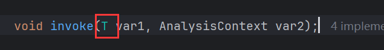

# AnalysisEventListener

【AnalysisEventListener】是一个接口，为分析事件监听器，用于监听 Excel 读取过程的核心接口。通过实现该接口，我们可以自定义对 Excel 数据的逐行解析、批量处理、异常处理等逻辑。

## 作用

在 EasyExcel 中，`AnalysisEventListener` 负责处理 Excel 读取过程中的事件，例如：

1. **读取表头**：获取 Excel 的标题行信息。
2. **逐行读取数据**：将每行数据转换为 Java 对象。
3. **异常处理**：捕获并处理解析过程中的错误。
4. **资源释放**：在读取完成后关闭资源。

## **接口方法详解**

实现 `AnalysisEventListener` 需覆盖以下两个核心方法：

1. `invoke(T data, AnalysisContext context)`

- **作用**：每解析一行数据触发一次。

- 参数：

  | 参数名    | 说明                                              |
  | --------- | ------------------------------------------------- |
  | `data`    | 当前行转换后的 Java 对象（类型由泛型 `T` 指定）。 |
  | `context` | 读取上下文，包含当前行号、工作表信息等。          |

```java
@Override
public void invoke(AccountItem item, AnalysisContext context) {
    // 处理单行数据，例如保存到数据库
    accountService.save(item);
}
```

2. `doAfterAllAnalysed(AnalysisContext context)`

- **作用**：所有数据解析完成后触发。
- **用途**：执行批量提交、资源释放等收尾操作。

```java
@Override
public void doAfterAllAnalysed(AnalysisContext context) {
    // 批量提交数据库事务
    accountService.batchCommit();
}
```

## 监听覆盖

【AnalysisEventListener】内部会接收泛型，这个泛型决定【invoke()】中第一个形参的类型：



> 这个泛型的类型决定数据解析的方式。

不使用监听器时，我们可以直接通过指定实体类型，将数据读取并映射到实体类中，而在使用监听器的情况下默认**不会覆盖原本的读取逻辑**，而是根据泛型来决定解析方式。

以下是不同场景的详细说明：

**1. 默认读取逻辑（无监听器）**

当直接通过实体类读取 Excel 时，EasyExcel 会自动将每行数据映射到对象的字段：

```java
List<AccountItem> items = EasyExcel.read(fileName)
    .head(AccountItem.class)
    .sheet()
    .doReadSync();  // 自动映射到 AccountItem
```

**2. 使用监听器的两种场景**

**(1) 监听器泛型为实体类（不覆盖默认读取）**

如果监听器的泛型是 实体类型，如：`AccountItem`，EasyExcel 仍会执行默认的对象映射逻辑，监听器仅用于 **增强处理**（如数据校验、批量插入）：

```java
public class AccountItemListener extends AnalysisEventListener<AccountItem> {
    @Override
    public void invoke(AccountItem item, AnalysisContext context) {
        // item 已被自动映射完成，可以直接使用
        System.out.println(item.getName() + ": " + item.getOriginalCurrency());
    }
}

// 执行读取（仍保留自动映射）
EasyExcel.read(fileName, AccountItem.class, new AccountItemListener())
    .sheet()
    .doRead();
```

此时，【invoke()】中第一个形参实际已被映射为实体，可直接操作。

**(2) 监听器泛型为 `Map` 或自定义类型（覆盖默认读取）**

如果监听器泛型为 `Map<Integer, String>` 或非实体类，EasyExcel **不会自动映射到实体类**，需要手动解析数据：

```java
public class RawDataListener extends AnalysisEventListener<Map<Integer, String>> {
    @Override
    public void invoke(Map<Integer, String> rowData, AnalysisContext context) {
        // 需要手动解析 rowData 到 AccountItem
        AccountItem item = new AccountItem();
        item.setName(rowData.get(0));  // 假设第0列是名称
        // ...
    }
}

// 执行读取（无自动映射）
EasyExcel.read(fileName, new RawDataListener())
    .sheet()
    .doRead();
```

此时，【invoke()】中第一个形参为【Map】，实际是将一行数据封装到【Map】中，【Map】中的【key】为数据索引，也就是 Excel 中的列(**从0开始**)，【Map】中的【value】为实际数据(【String】类型，按需转换)。

### 泛型细节

在 EasyExcel 中，**监听器的泛型类型确实决定了 `invoke` 方法的参数类型**，而框架会根据该类型自动将 Excel 行数据转换为对应对象。以下是详细说明：

#### **1. 框架的自动映射机制**

EasyExcel 通过以下步骤完成数据到对象的转换：

1. **表头解析**：读取 Excel 表头，生成列名与索引的映射。
2. **字段匹配**：根据泛型类型的字段注解（如 `@ExcelProperty`）或默认规则（字段名匹配列名），将单元格数据映射到对象属性。
3. **类型转换**：自动处理基本类型（如 `String` → `Integer`）和常用类型（如日期格式转换）。

#### **2. 支持的泛型类型**

**(1) 实体类（POJO）**

- **要求**：字段需标注 `@ExcelProperty` 指定列名或索引。

- 示例

  ```java
  public class User {
      @ExcelProperty("姓名") 
      private String name;
      
      @ExcelProperty(index = 1) // 第2列（索引从0开始）
      private Integer age;
  }
  ```

- **结果**：`invoke(User user, ...)` 中 `user` 对象会被自动填充数据。

**(2) `Map<Integer, String>`**

- **说明**：Key 为列索引，Value 为单元格原始值。

- 示例

  ```java
  public class MapListener extends AnalysisEventListener<Map<Integer, String>> {
      @Override
      public void invoke(Map<Integer, String> rowData, AnalysisContext context) {
          // rowData: {0="张三", 1="25"}
      }
  }
  ```

**(3) `List<String>`**

- **说明**：按列顺序存储单元格值（需确保列顺序固定）。

- 示例

  ```java
  public class ListListener extends AnalysisEventListener<List<String>> {
      @Override
      public void invoke(List<String> rowData, AnalysisContext context) {
          // rowData: ["张三", "25"]
      }
  }
  ```

#### **3. “随便给一个类型” 会发生什么？**

**(1) 无规则的自定义类型**

若泛型类型是一个 **未标注注解** 且 **字段名与列名不匹配** 的类，框架会尝试按字段声明顺序映射，但结果不可控：

```java
public class Chaos {
    private String a; // 无注解，默认匹配第0列
    private Integer b; // 无注解，默认匹配第1列
}

// 监听器：AnalysisEventListener<Chaos>
// 若 Excel 列顺序为 [姓名, 年龄]，则 a="姓名", b=null（年龄列是String，无法转Integer）
```

**(2) 字段类型不兼容**

若单元格数据无法转换为目标字段类型，会抛出 `ExcelDataConvertException`：

```java
public class User {
    @ExcelProperty("年龄")
    private Integer age; // Excel 中某行的年龄列值为 "未知"
}

// 抛出异常：Cannot convert '未知' to Integer
```

**(3) 无默认构造方法**

若泛型类型没有无参构造方法，框架无法实例化对象，直接报错：

```java
public class User {
    public User(String name) { ... } // 仅存在有参构造
}

// 报错：No default constructor found in class User
```

#### **4. 如何让框架支持 “任意类型”？**

若需要高度自定义的映射逻辑，可通过以下方式实现：

**(1) 使用 `Map` 接收原始数据，手动转换**

```java
public class CustomListener extends AnalysisEventListener<Map<Integer, String>> {
    @Override
    public void invoke(Map<Integer, String> rowData, AnalysisContext context) {
        MyCustomObject obj = new MyCustomObject();
        obj.setField1(rowData.get(0));
        obj.setField2(Integer.parseInt(rowData.get(1)));
    }
}
```

**(2) 自定义 `Converter` 实现复杂类型转换**

```java
public class MyCustomConverter implements Converter<MyCustomType> {
    @Override
    public MyCustomType convertToJavaData(ReadCellData<?> cellData, ...) {
        return parseMyCustomType(cellData.getStringValue());
    }
}

// 注册转换器
EasyExcel.read(fileName, MyCustomType.class, listener)
    .registerConverter(new MyCustomConverter())
    .sheet().doRead();
```

#### **5. 最佳实践**

1. **优先使用实体类 + `@ExcelProperty`**：确保字段与列名或索引明确对应。
2. **避免随意定义泛型类型**：不可预测的类型会导致数据错乱或异常。
3. **复杂场景用 `Map` 或自定义 `Converter`**：灵活处理非标数据。